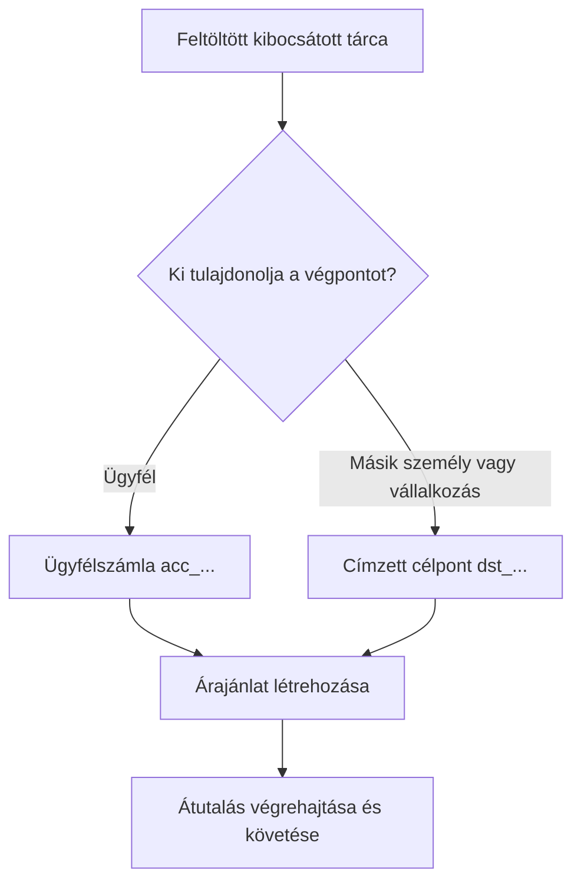

Minden kifizetés egy kész, feltöltött kibocsátott tárcából indul. A célpontmodell attól függ, ki tulajdonolja a végpontot.


```mermaid
flowchart TD
  A["Feltöltött kibocsátott tárca"] --> B{"Ki tulajdonolja a végpontot?"}
  B -->|"Ügyfél"| C["Ügyfélszámla acc_..."]
  B -->|"Másik személy vagy vállalkozás"| D["Címzett célpont dst_..."]
  C --> E["Árajánlat létrehozása"]
  D --> E
  E --> F["Átutalás végrehajtása és követése"]
```

## Mielőtt kezdi

Frissítse le a forrás tárcát. Erősítse meg, hogy az aktuális státusza engedi a kifizetést és a rendelkezésre álló egyenlege fedezi a szándékolt forrásösszeget. Tárolja a válaszból származó azonosítót `SOURCE_WALLET_ID`-ként.

Szüksége van egy kész kifizetési képességre is az aktuális ügyfélhez és kiválasztott célponthoz.

A meglévő Tron tárcák egy `stablecoin_transfers` árajánlattal küldhetnek USDT-t egy másik Tron tárcába. A bemenetnek és a kimenetnek ugyanazt a hálózatot és stablecoint kell használnia. Tronon nem hozhat létre új kibocsátott tárcákat.

## 1. A célpont előkészítése

<Tabs>
  <Tab title="Saját tulajdonú">

Használjon egy ügyfél tulajdonában lévő külső bankszámlát, amikor az ügyfél tulajdonolja a végpontot. Hozza létre a [`POST /v3/customers/{customerId}/accounts`](/api-reference/accounts/post-v3-customers-by-customer-id-accounts) művelettel és ezekkel a fejlécekkel:

```http
X-API-Key: ${SWIPELUX_API_KEY}
Idempotency-Key: payout-account-001
Content-Type: application/json
```

```json
{
  "origin": "external",
  "type": "bank",
  "methods": ["ach", "wire"],
  "country": "US",
  "currency": "USD",
  "details": {
    "routingNumber": "021000021",
    "accountNumber": "123456789",
    "accountType": "checking",
    "bankName": "Example Bank",
    "accountHolderName": "Acme Payments SAS"
  },
  "label": "Customer operating account"
}
```

Olvassa be a [`GET /v3/customers/{customerId}/accounts/{accountId}`](/api-reference/accounts/get-v3-customers-by-customer-id-accounts-by-account-id) művelettel. Csak akkor folytassa, ha az aktuális státusza engedi a kifizetést. Tárolja a `acc_` azonosítót `PAYOUT_DESTINATION_ID`-ként.

  </Tab>
  <Tab title="Harmadik fél">

Hozza létre a személyt vagy vállalkozást és a bank- vagy tárca-végpontját a [Címzettek és célpontok](/hu/integration/recipients) alapján. Csak akkor folytassa, ha a célpont kész.

Tárolja a visszakapott `dst_` azonosítót `PAYOUT_DESTINATION_ID`-ként. Ne használja a címzett `rcp_` azonosítóját árajánlat célpontként.

  </Tab>
</Tabs>

## 2. A kifizetési árajánlat létrehozása

Használja a [`POST /v3/quotes`](/api-reference/money-movement/post-v3-quotes) műveletet ezekkel a fejlécekkel:

```http
X-API-Key: ${SWIPELUX_API_KEY}
Idempotency-Key: payout-quote-001
Content-Type: application/json
```

```json
{
  "customerId": "${CUSTOMER_ID}",
  "capabilityId": "${CAPABILITY_ID}",
  "in": {
    "amount": "150.00",
    "currency": "USDC",
    "accountId": "${SOURCE_WALLET_ID}"
  },
  "destinationId": "${PAYOUT_DESTINATION_ID}",
  "out": {
    "currency": "USD"
  }
}
```

Tárolja a `data.id` értéket `QUOTE_ID`-ként, és jelenítse meg a visszaadott árat és díjakat.

### Banki útvonal kiválasztása {#choose-a-bank-route}

Kripto–fiat kifizetésnél megadhatja az opcionális `institutionId` mezőt, hogy az ügyfél számára jóváhagyott banki útvonalat követeljen meg. Hagyja el az automatikus útvonalválasztás használatához.

```json
{
  "customerId": "${CUSTOMER_ID}",
  "capabilityId": "${CAPABILITY_ID}",
  "institutionId": "${INSTITUTION_ID}",
  "in": {
    "amount": "150.00",
    "currency": "USDC",
    "accountId": "${SOURCE_WALLET_ID}"
  },
  "destinationId": "${PAYOUT_DESTINATION_ID}",
  "out": {
    "currency": "USD"
  }
}
```

- A kifejezetten megadott `institutionId` soha nem vált át másik bankra. Ha a kiválasztott banknak nincs kész útvonala ehhez az ügyfélhez, képességhez és célponthoz, a `POST /v3/quotes` `422` [`bank_not_supported_for_customer`](/integration/errors#bank-not-supported-for-customer) hibát ad vissza a `/institutionId` mutatóval.
- Az `institutionId` csak kripto–fiat kifizetési árajánlatokon érvényes. Ha pénzbefizetési, kártyás vagy stablecoin-átutalási árajánlaton küldi, `400` [`validation_error`](/integration/errors#validation-error) hibát kap.
- Az árajánlatok és átutalások olvasása visszaadja a kiválasztott útvonal `institutionId` értékét, az automatikusan kiválasztottét is, ha a bank azonosítható.

### SWIFT-kifizetések {#swift-payouts}

Éles környezetben az USD SWIFT-kifizetésekhez olyan kész SWIFT-képesség szükséges, amely támogatja a kifizetéseket (`swift_pooled` vagy `swift_named`), a fedezetük pedig USDC Ethereumon, Base-en vagy Polygonon, illetve USDT Ethereumon vagy Polygonon. A címzett díjak utáni összegének legalább 100.00 USD-nek kell lennie.

Egy SWIFT-célponthoz meg kell adni a bank utcai címét a `bankAddress`, `bankCity`, `bankState` és `bankPostalCode` mezőkben. A BIC országának egyeznie kell a bank országával. A Swipelux a kedvezményezett címét az ügyfél- vagy címzettprofilból veszi át.

## 3. A kifizetés végrehajtása

Hozza létre az átutalást a [`POST /v3/transfers`](/api-reference/money-movement/post-v3-transfers) művelettel. Használjon egy új kulcsot ehhez a szándékolt végrehajtáshoz:

```http
X-API-Key: ${SWIPELUX_API_KEY}
Idempotency-Key: payout-transfer-001
Content-Type: application/json
```

```json
{
  "quoteId": "${QUOTE_ID}"
}
```

Tárolja az átutalás `data.id` értékét `TRANSFER_ID`-ként. Egy sikeres létrehozás elindítja a kifizetést; nem bizonyítja a kézbesítést.

## 4. A kézbesítés követése

Olvassa be a [`GET /v3/transfers/{transferId}`](/api-reference/money-movement/get-v3-transfers-by-transfer-id) műveletet a létrehozás után és minden esemény után. A legfrissebb `data.state`, `data.stateDetail` és `data.openTaskIds` alapján döntse el, hogy vár, cselekszik, vagy végleges kimenetet jelenít meg.

Ezután nézze át az [Árajánlatok és átutalások](/hu/integration/quotes-and-transfers) oldalt a pontos összegekért, a biztonságos végrehajtási helyreállításért és az átutalási feladatokért.
