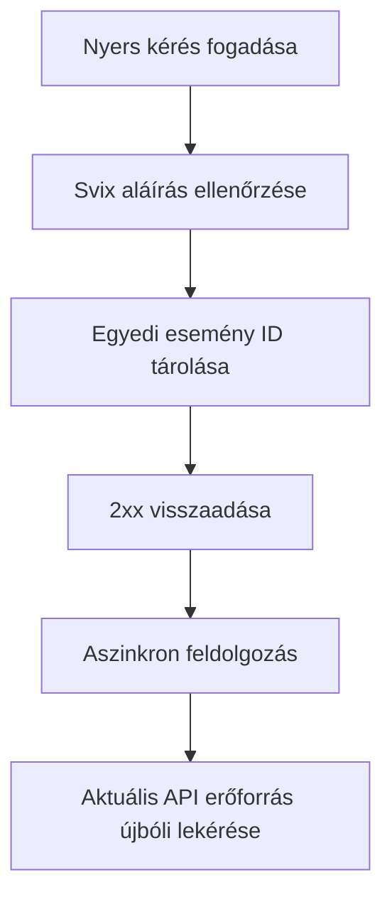

Használjon webhookokat az aszinkron változásokra való reagáláshoz. A kézbesítés legalább egyszer történik, ezért a duplikált, késleltetett és nem sorrendben érkező események normálisak.



## Csak a szükséges eseményekre iratkozzon fel

Hozzon létre egy végpontot a [`POST /v3/webhooks`](/api-reference/webhooks/post-v3-webhooks) művelettel. Csak olyan dokumentált eseményekre iratkozzon fel, amelyek meghajtják az integrációját. Ez a példa a [`transfer.state_changed`](/api-reference/webhooks/transfer-state-changed) eseményt használja.

```bash
export API_BASE='https://platform.swipelux.com'
export SWIPELUX_API_KEY='replace-with-your-api-key'

curl --request POST \
  "${API_BASE}/v3/webhooks" \
  --header "X-API-Key: ${SWIPELUX_API_KEY}" \
  --header "Idempotency-Key: webhook-endpoint-001" \
  --header "Content-Type: application/json" \
  --data @- <<'JSON'
{
  "url": "https://example.com/webhooks/swipelux",
  "events": ["transfer.state_changed"]
}
JSON
```

Tárolja a válasz `data.id` értékét `WEBHOOK_ID`-ként. Nyissa meg a [`GET /v3/webhooks/portal`](/api-reference/webhooks/get-v3-webhooks-portal) által visszaadott portált, kérje le ennek a végpontnak az aláíró titkát, és tárolja külön az API-kulcstól egy titkos kulcskezelőben.

## Ellenőrzés az elemzés előtt

A Swipelux az új webhook integrációkat Svix-en keresztül szállítja. Ellenőrizze a nyers kéréstörzset a végpont aláíró titkával és ezekkel a fejlécekkel:

- `svix-id`
- `svix-timestamp`
- `svix-signature`

Az ellenőrzés sikeres befejezése előtt ne elemezzen JSON-t és ne okozzon mellékhatásokat.

```javascript
import { Webhook } from "svix";

const verifier = new Webhook(process.env.SWIPELUX_WEBHOOK_SECRET);

export async function handleSwipeluxWebhook(request) {
  const rawBody = await request.text();
  const event = verifier.verify(rawBody, {
    "svix-id": request.headers.get("svix-id"),
    "svix-timestamp": request.headers.get("svix-timestamp"),
    "svix-signature": request.headers.get("svix-signature"),
  });

  await webhookInbox.insertIfAbsent({
    id: event.id,
    payload: event,
    status: "pending",
  });

  return new Response(null, { status: 204 });
}
```

Utasítsa el a hiányzó vagy érvénytelen aláírásokkal érkező kéréseket. Tartsa elérhetőnek a nyers törzset, amíg az ellenőrzés be nem fejeződik.

## Tárolás, nyugtázás, majd feldolgozás

Tegyen egyediségi kényszert a boríték `id` mezőjére. Tárolja az ellenőrzött borítékot, gyorsan adjon vissza `2xx`-et, majd dolgozza fel aszinkron módon.

Ha az esemény ID már létezik, nyugtázza a kézbesítést anélkül, hogy megismételné a befejezett mellékhatásokat. A függőben lévő vagy sikertelen helyi munkát a saját újrapróbáló során keresztül folytassa. Ne használja a boríték `attempt` mezőjét deduplikációs kulcsként vagy szállítási újrapróbálási számlálóként.

## Aktuális állapot újbóli lekérése

A webhook-sorrend nem hiteles erőforrás-előzmény. Használja a `resource.type` és `resource.id` értékeket az objektum megtalálásához, majd kérje le az aktuális állapotát, mielőtt frissíti a rendszerét.

Átutalás eseményhez hívja a [`GET /v3/transfers/{transferId}`](/api-reference/money-movement/get-v3-transfers-by-transfer-id) műveletet:

```bash
curl --request GET \
  "${API_BASE}/v3/transfers/${TRANSFER_ID}" \
  --header "X-API-Key: ${SWIPELUX_API_KEY}"
```

Az ügyfélnek látható státuszt és a downstream műveleteket az aktuális API válaszból vezérelje. A mellékhatásokat úgy tervezze, hogy biztonságosak maradjanak, ha két worker eltérő sorrendben dolgozza fel a kapcsolódó eseményeket.

## Kézbesítések helyreállítása

Használja a [`GET /v3/webhooks/portal`](/api-reference/webhooks/get-v3-webhooks-portal) műveletet a kézbesítési naplók megnyitásához, sikertelen kézbesítések újrapróbálásához vagy manuális újrajátszás indításához.

Minden újrajátszásnak ugyanazon az aláírás-ellenőrzésen és tartós inboxon kell átmennie. Leállás utáni helyreállításhoz játssza le az érintett időablakot és kérje le újra minden hivatkozott erőforrást. A befejezett esemény ID-k no-op-ok maradnak; a befejezetlen rekordok aszinkron folytatódnak.

Ezután ellenőrizze a duplikált és nem sorrendben érkező kézbesítéseket sandboxban, majd fejezze be az [Éles indulás](/hu/integration/go-live) ellenőrzőlistát.
