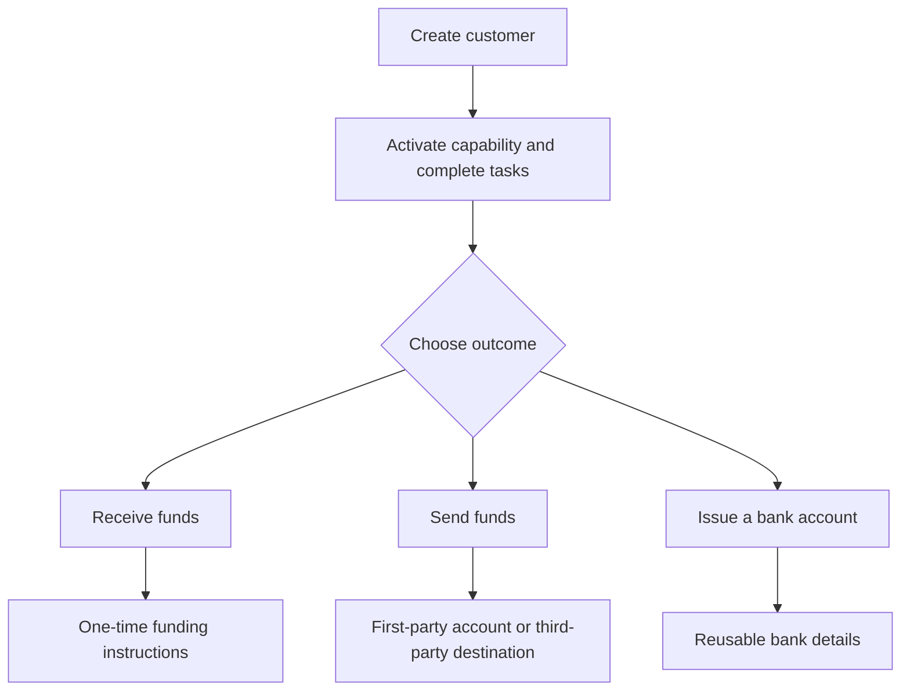

Start from the customer outcome. Each flow uses the same onboarding model, then branches into different accounts and money movement.

## Compare the flows

| Outcome | Prepare first | What you receive |
| --- | --- | --- |
| Pay-in | Ready pay-in capability and issued destination wallet | Transfer-specific instructions and stablecoin settlement |
| Payout | Ready payout capability, funded issued wallet, and ready account or destination | A transfer to the selected recipient endpoint |
| Issued bank account | Ready bank capability and issued settlement wallet | Reusable bank details after provisioning |

A quoted pay-in creates instructions for one transfer. An issued bank account creates reusable details for later deposits. A payout starts from funds already available in an issued wallet.

## Choose your flow

<CardGroup cols={3}>
  <Card title="Receive funds" icon="arrow-down-to-line" href="/integration/receive-funds">
    Create and track a fiat-to-stablecoin pay-in.
  </Card>
  <Card title="Send funds" icon="arrow-up-from-line" href="/integration/send-funds">
    Build a first-party or third-party payout.
  </Card>
  <Card title="Issue a bank account" icon="building-columns" href="/integration/issue-bank-account">
    Provision reusable bank details linked to a wallet.
  </Card>
</CardGroup>
