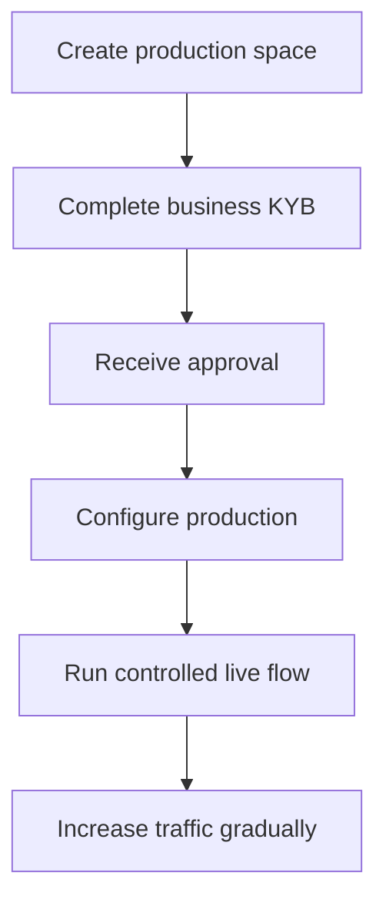

Production activation verifies your integrating business. It is separate from the API customers you create for your product.

## Activate your production space

1. Sign in to the Swipelux Dashboard and select **Create a production space**.
2. Open the KYB tab or go to [Business verification](https://www.swipelux.app/kyb).
3. Complete every requested field and upload the required documents.
4. Submit your integrating business for verification and wait for approval.

Only after your integrating business and production space are approved can you create production API customers and transactions.

## Keep production independent

Create production resources explicitly. Changing an API key does not migrate sandbox state.

- Store production credentials in a separate secret-manager entry.
- Use production-only deployment configuration and resource IDs.
- Register a separate production webhook endpoint and signing secret.
- Recreate the required customers, capabilities, accounts, recipients, and destinations in production.
- Restrict production access to the services and operators that need it.

Sandbox and production use `https://platform.swipelux.com`; the API key selects the environment.

## Complete the launch checklist

- [ ] Test the happy path and expected failure paths in sandbox.
- [ ] Send an `Idempotency-Key` with every write that requires one and retain it for safe retries.
- [ ] Verify webhook signatures before parsing, persist event IDs durably, and test replay.
- [ ] Handle unavailable capabilities, open tasks, and changed task revisions.
- [ ] Handle documented [API errors and retries](/integration/errors), including idempotent retries with the original key.
- [ ] Surface transfer failures and actionable instructions to your operators.
- [ ] Confirm logs retain `X-Request-Id` or `correlationId` without exposing secrets or sensitive financial data.

## Run one controlled live flow

Start with a known customer and one low-value transaction. Record:

| Control | Define before the test |
| --- | --- |
| Scope | Customer, capability, account or destination, amount, and method. |
| Expected result | API state, balance or instructions, and webhook event you expect to observe. |
| Owner | Person responsible for watching the complete flow. |
| Stop condition | Any unexpected state, missing webhook, incorrect amount, or unresolved task. |

Verify both the current API resource and the authenticated webhook delivery. If either differs from the expected result, stop and investigate before sending more traffic.

After the complete flow succeeds, increase volume gradually while monitoring capability, account, destination, and transfer states.

Return to [Common flows](/integration/common-flows) for the product journey, review [Errors and retries](/integration/errors) for failure handling, or use the [API Reference](/api-reference/introduction) for exact contracts.
