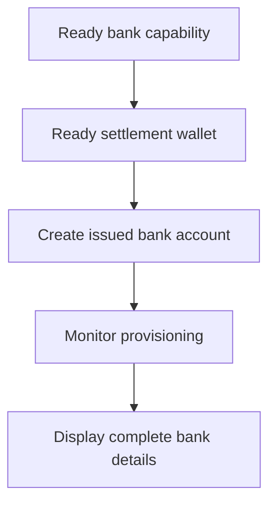

Use an issued bank account when the customer needs reusable bank details. For one-time funding instructions tied to a specific amount, use [Receive funds](/integration/receive-funds) instead.



## Before you start

You need a customer ID, a ready bank capability for the intended method and currency, and a ready issued wallet owned by the same customer. Complete open work through [Capabilities and tasks](/integration/onboarding/capabilities-and-requirements).

## 1. Create or select the settlement wallet

Create an issued wallet through [Accounts and wallets](/integration/accounts#create-the-account), then read it again. Continue only when its current status permits settlement.

Store its response-derived `data.id` as `SETTLEMENT_WALLET_ID`. Do not use an external wallet for `settlement.accountId`.

## 2. Create the issued bank account

Use [`POST /v3/customers/{customerId}/accounts`](/api-reference/accounts/post-v3-customers-by-customer-id-accounts) with a unique `Idempotency-Key`:

```json
{
  "origin": "issued",
  "type": "bank",
  "method": "ach",
  "country": "US",
  "currency": "USD",
  "settlement": {
    "accountId": "${SETTLEMENT_WALLET_ID}"
  },
  "label": "USD account"
}
```

Store the returned `data.id` as `BANK_ACCOUNT_ID`. Also retain `data.status`, `data.openTaskIds`, `data.details`, and the settlement relationship.

The bank account ID and wallet ID have different roles. Read provisioning and bank details through the bank account ID. Use the settlement wallet ID to identify where deposits are credited.

## 3. Monitor provisioning

Read [`GET /v3/customers/{customerId}/accounts/{accountId}`](/api-reference/accounts/get-v3-customers-by-customer-id-accounts-by-account-id) after creation and after each relevant webhook.

Keep the customer interface pending while `details` is absent. If `openTaskIds` is not empty, complete the latest tasks and refetch the account. Do not infer readiness from elapsed time.

If the latest `statusReason.code` is `awaiting_assignment`, create the first pay-in for the same customer, capability, and settlement wallet through [Receive funds](/integration/receive-funds), then read the bank account again. Follow this branch only when the current account requests it.

## 4. Present bank details safely

Display only the complete details returned by the latest account read. When `details.referenceRequired` is true, show the exact `details.reference` and make it copyable. When it is false, do not invent a reference.

These bank details are reusable. Do not replace them with funding coordinates from a quoted pay-in, which belong only to that transfer.

Next, add [Webhooks](/integration/webhooks) so provisioning updates reach your application without keeping the customer on a polling screen.
