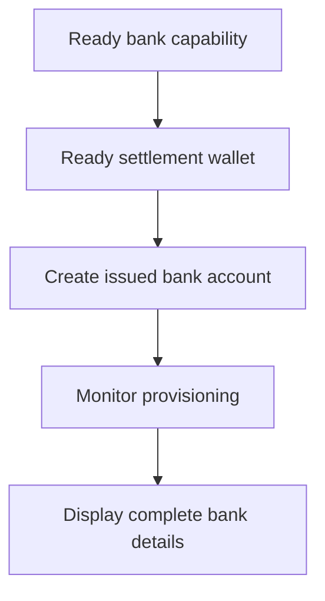

Use an issued bank account when the customer needs reusable bank details. For one-time funding instructions tied to a specific amount, use [Receive funds](/integration/receive-funds) instead.


```mermaid
flowchart TD
  A["Ready bank capability"] --> B["Ready settlement wallet"]
  B --> C["Create issued bank account"]
  C --> D["Monitor provisioning"]
  D --> E["Display complete bank details"]
```

## Before you start

You need a customer ID, a ready bank capability for the intended method and currency, and a ready issued wallet owned by the same customer. With `allowPending`, you can save the request while the selected bank still reviews the customer. Complete open work through [Capabilities and tasks](/integration/onboarding/capabilities-and-requirements).

## 1. Create or select the settlement wallet

Create an issued wallet through [Accounts and wallets](/integration/accounts#create-the-account), then read it again. Continue only when its current status permits settlement.

Store its response-derived `data.id` as `SETTLEMENT_WALLET_ID`. Do not use an external wallet for `settlement.accountId`.

## 2. Create the issued bank account

Use [`POST /v3/customers/{customerId}/accounts`](/api-reference/accounts/post-v3-customers-by-customer-id-accounts) with these headers:

```http
X-API-Key: ${SWIPELUX_API_KEY}
Idempotency-Key: issued-bank-account-001
Content-Type: application/json
```

Send this request body:

```json
{
  "origin": "issued",
  "type": "bank",
  "method": "ach",
  "country": "US",
  "currency": "USD",
  "settlement": {
    "accountId": "${SETTLEMENT_WALLET_ID}"
  },
  "label": "USD account"
}
```

Store the returned `data.id` as `BANK_ACCOUNT_ID`. Also retain `data.status`, `data.openTaskIds`, `data.details`, and the settlement relationship.

Optional request fields:

| Field | Applies to | Behavior |
| --- | --- | --- |
| `institution` | Issued `ach`, `wire`, and `swift` | Selects exactly this bank. Swipelux does not fall back to another bank. Use an institution ID returned by the supported-capability response. |
| `allowPending` | Issued `ach`, `wire`, and `swift` | Set to `true` to save the request while the selected bank's application waits for approval. Requires `institution`. |
| `settlement.currency` | Issued bank accounts | `USDC` or `USDT`. Sets the stablecoin delivered to the settlement wallet. |

### Choose the bank

Send `institution` when the customer needs bank details from a specific bank. Swipelux reserves one issued account per customer, method, currency, and institution. A request without `institution` returns `409 conflict` if the customer already has an issued account for that method and currency at any bank. A request with `institution` returns `409 conflict` only if an account for that bank already exists.

Account reads return the selected bank as `institution` with `id`, `name`, and `bic`. `bic` can be `null`.

Idempotency applies to the selected bank. Replaying the same request returns the original account. Changing `institution` under the same `Idempotency-Key` returns `409 idempotency_conflict`.

### Save the request before bank approval

By default, Swipelux accepts an issued bank account request only after the bank capability is ready. To collect the customer's account setup earlier, send `allowPending: true` with `institution`:

```json
{
  "origin": "issued",
  "type": "bank",
  "method": "wire",
  "country": "US",
  "currency": "USD",
  "institution": "${INSTITUTION_ID}",
  "allowPending": true,
  "settlement": {
    "accountId": "${SETTLEMENT_WALLET_ID}"
  },
  "label": "USD wire account"
}
```

While the bank's application is under review, the account returns `status: "in_review"` with `statusReason.code` set to `waiting_for_approval`. The response also includes `applicationId` and the application's `openTaskIds`. Complete those tasks through [Capabilities and tasks](/integration/onboarding/capabilities-and-requirements).

The saved request keeps its account ID, settlement wallet, and account slot. After the application and capability are ready, Swipelux provisions bank details under the same `BANK_ACCOUNT_ID`. Keep reading that ID. Do not create another request.

If the application is rejected, canceled, or archived first, the account becomes `rejected`. It no longer holds the account slot.

### Choose the settlement currency

By default, deposits settle in the settlement wallet's currency. Set `settlement.currency` to `USDC` or `USDT` to choose the delivered asset independently of the wallet's currency:

```json
{
  "settlement": {
    "accountId": "${SETTLEMENT_WALLET_ID}",
    "currency": "USDT"
  }
}
```

`USDT` requires a `USD` account and a settlement wallet on a network that supports USDT delivery. Otherwise the request returns `400 invalid_settlement_target`. Account reads return the saved choice, including while the account is provisioning.

The bank account ID and wallet ID have different roles. Read provisioning and bank details through the bank account ID. Use the settlement wallet ID to identify where deposits are credited.

## 3. Monitor provisioning

Read [`GET /v3/customers/{customerId}/accounts/{accountId}`](/api-reference/accounts/get-v3-customers-by-customer-id-accounts-by-account-id) after creation and after each relevant webhook.

Keep the customer interface pending while `details` is absent. If `openTaskIds` is not empty, complete the latest tasks and refetch the account. Do not infer readiness from elapsed time.

If the account was saved with `allowPending: true`, it stays `in_review` with `statusReason.code` set to `waiting_for_approval` until the bank approves the application.

If the latest `statusReason.code` is `awaiting_assignment`, create the first pay-in for the same customer, capability, and settlement wallet through [Receive funds](/integration/receive-funds), then read the bank account again. Follow this branch only when the current account requests it.

## 4. Present bank details safely

Display only the complete details returned by the latest account read. When `details.referenceRequired` is true, show the exact `details.reference` and make it copyable. When it is false, do not invent a reference.

For issued `swift` accounts, display `details.bankName`, `details.swiftCode` (the receiving bank's BIC), `details.accountNumber`, `details.accountHolderName`, and `details.accountHolderAddress` when returned. Senders must copy the beneficiary address exactly into the international wire. Also show `details.bankAddress` and any intermediary bank fields that the account returns.

These bank details are reusable. Do not replace them with funding coordinates from a quoted pay-in, which belong only to that transfer.

Next, add [Webhooks](/integration/webhooks) so provisioning updates reach your application without keeping the customer on a polling screen.
