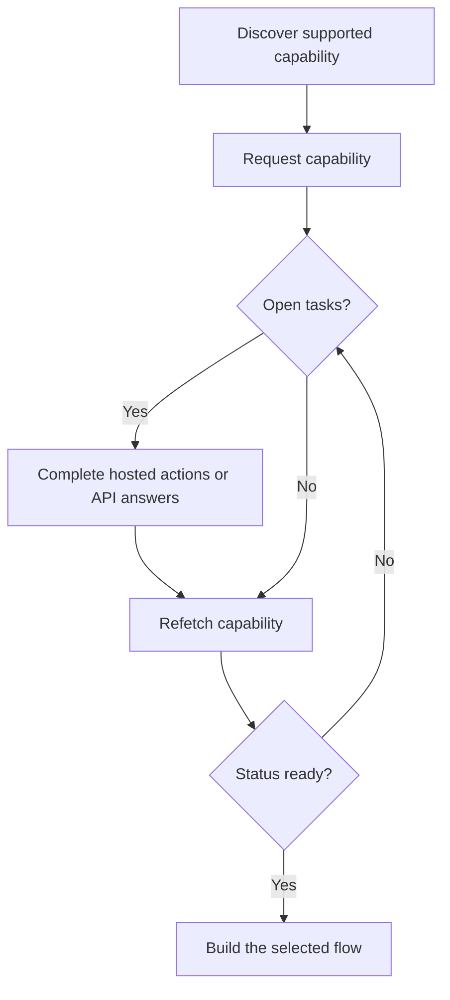

A capability tells you whether a customer can use a specific outcome, payment method, and direction. Open tasks tell you what must happen before that capability or a related resource can move forward.



```bash
export API_BASE='https://platform.swipelux.com'
export SWIPELUX_API_KEY='replace-with-your-api-key'
```

## Discover supported capabilities

Read the customer's current options with [`GET /v3/customers/{customerId}/capabilities/supported`](/api-reference/capabilities/get-v3-customers-by-customer-id-capabilities-supported):

```bash
curl --request GET \
  "${API_BASE}/v3/customers/${CUSTOMER_ID}/capabilities/supported" \
  --header "X-API-Key: ${SWIPELUX_API_KEY}"
```

Choose a response entry that matches the intended `directions`, `method`, and `accountType`. Continue only when `availability` is `available` or `beta` and `eligibility.eligible` is `true`. If `institutions` are returned, select only an ID from that response.

Store the selected `data[].id` as `CAPABILITY_ID`. Never copy a capability ID from another customer or environment.

### Pooled vs named account types

Bank capabilities come in two variants, encoded as the `accountType` field and the capability ID suffix (for example `ach_pooled`, `wire_named`):

- **`pooled`**: shared Swipelux bank account. Each pay-in uses a unique reference to route funds. Pick this for one-time transfers.
- **`named`**: dedicated bank details for the customer (virtual IBAN, dedicated ACH account). Reusable and shareable with any payer. Required for [issued bank accounts](/integration/issue-bank-account).

Default to `pooled`. Use `named` only when the customer needs reusable bank details. Check the `supported` response for which variants are available.

## Request the capability

Request the selected option with [`POST /v3/customers/{customerId}/capabilities/{capabilityId}`](/api-reference/capabilities/post-v3-customers-by-customer-id-capabilities-by-capability-id):

```bash
curl --request POST \
  "${API_BASE}/v3/customers/${CUSTOMER_ID}/capabilities/${CAPABILITY_ID}" \
  --header "X-API-Key: ${SWIPELUX_API_KEY}" \
  --header "Idempotency-Key: capability-request-001" \
  --header "Content-Type: application/json" \
  --data '{}'
```

Use an explicit `institutions` array only when you need to select from IDs returned by the supported-capability response.

Store `data.status` as `CAPABILITY_STATUS`, `data.accountProvisioning` as `ACCOUNT_PROVISIONING_STATUS`, `data.openTaskIds` as `OPEN_TASK_IDS`, and each `data.applications[].id` in `APPLICATION_IDS`.

## Complete current tasks

List tasks with [`GET /v3/customers/{customerId}/tasks`](/api-reference/tasks/list-customer-tasks), select IDs from `OPEN_TASK_IDS`, then read each current task with [`GET /v3/customers/{customerId}/tasks/{taskId}`](/api-reference/tasks/get-customer-task):

```bash
curl --request GET \
  "${API_BASE}/v3/customers/${CUSTOMER_ID}/tasks/${TASK_ID}" \
  --header "X-API-Key: ${SWIPELUX_API_KEY}"
```

Use the latest `data.revision` and `data.requirements`. Refetch the task immediately before submitting if either may have changed.

### Hosted actions

In the task-detail response, each entry in `verificationSessions` and `tosSessions` includes an `action` object. Task-list responses do not include these action links. Store each session `id`, then read `action.kind` before dispatching the customer; do not infer link availability from session `status`.

- `action.kind: "available"` includes `action.url` and `action.expiresAt` (currently always `null`). Store `action.url`, send the customer to it, then read the task again. The session-level `url` and `expiresAt` fields contain the same values.
- `action.kind: "unavailable"` means no link should be presented. The session-level `url` and `expiresAt` fields are absent. A session's `status` alone does not determine which action kind you receive.

```json
{
  "data": {
    "verificationSessions": [
      {
        "id": "vfy_000000000000000003",
        "key": "identity_verification",
        "type": "identity_verification",
        "status": "action_required",
        "action": {
          "kind": "available",
          "url": "https://platform.swipelux.com/kyc/redirect/cus_000000000000000001/tsk_000000000000000002/vfy_000000000000000003",
          "expiresAt": null
        },
        "url": "https://platform.swipelux.com/kyc/redirect/cus_000000000000000001/tsk_000000000000000002/vfy_000000000000000003",
        "expiresAt": null
      }
    ],
    "tosSessions": [
      {
        "id": "vfy_000000000000000004",
        "key": "terms_of_service",
        "type": "terms_of_service",
        "status": "completed",
        "action": { "kind": "unavailable" }
      }
    ]
  }
}
```

These are task-scoped actions, not a separate customer-verification lifecycle.

### Upload documents

When a requirement requests a document, upload it with [`POST /v3/customers/{customerId}/documents`](/api-reference/documents/post-v3-customers-by-customer-id-documents):

```bash
export DOCUMENT_PATH='/absolute/path/to/requested-document.pdf'

curl --request POST \
  "${API_BASE}/v3/customers/${CUSTOMER_ID}/documents" \
  --header "X-API-Key: ${SWIPELUX_API_KEY}" \
  --header "Idempotency-Key: customer-document-001" \
  --form "file=@${DOCUMENT_PATH}"
```

Store the returned `data.id` as `DOCUMENT_ID` before submitting the answer that references it.

To retrieve a stored file later, call [`GET /v3/customers/{customerId}/documents/{documentId}/download`](/api-reference/documents/get-v3-customers-by-customer-id-documents-by-document-id-download). Swipelux returns a `url` that downloads the file as an attachment and expires after one hour. Archived documents return `404`.

### API answers

Submit one complete answer set for the current revision with [`POST /v3/customers/{customerId}/tasks/{taskId}/submissions`](/api-reference/task-submissions/create-customer-task-submission):

```bash
curl --request POST \
  "${API_BASE}/v3/customers/${CUSTOMER_ID}/tasks/${TASK_ID}/submissions" \
  --header "X-API-Key: ${SWIPELUX_API_KEY}" \
  --header "Idempotency-Key: task-submission-001" \
  --header "Content-Type: application/json" \
  --data @- <<'JSON'
{
  "taskRevision": 3,
  "answers": [
    {
      "requirementId": "req_from_current_task",
      "answer": {
        "type": "text",
        "value": "Current answer"
      }
    }
  ]
}
JSON
```

Take every requirement ID and answer type from the latest task. If the API reports that the task changed, refetch it and rebuild the submission from the new revision.

## Continue when the capability is ready

Read the capability again with [`GET /v3/customers/{customerId}/capabilities/{capabilityId}`](/api-reference/capabilities/get-v3-customers-by-customer-id-capabilities-by-capability-id):

```bash
curl --request GET \
  "${API_BASE}/v3/customers/${CUSTOMER_ID}/capabilities/${CAPABILITY_ID}" \
  --header "X-API-Key: ${SWIPELUX_API_KEY}"
```

Replace the stored status, account-provisioning status, and task IDs with the latest response. Capability `status` reports whether the entitlement is approved. For a capability that issues an account, `accountProvisioning` separately reports whether that account is `not_started`, `in_progress`, `issued`, or `failed`; a capability that does not issue an account returns `not_applicable`.

Continue only when the current capability status permits the account, quote, or transfer you intend to create. When the flow needs an issued account, also wait for `accountProvisioning` to become `issued`.

Next, choose the matching journey in [Common flows](/integration/common-flows).
