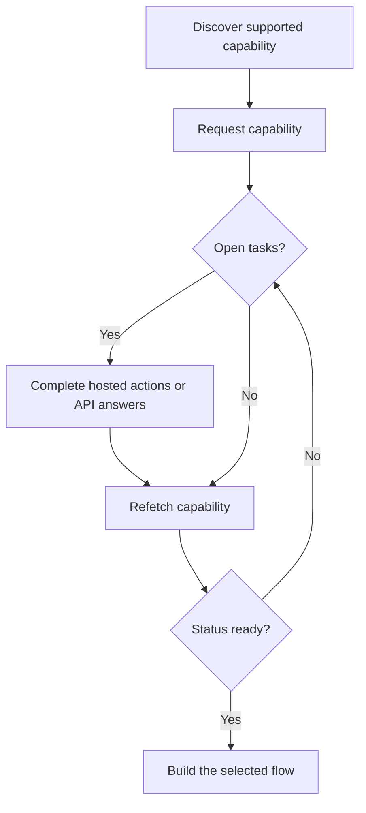

A capability tells you whether a customer can use a specific outcome, payment method, and direction. Open tasks tell you what must happen before that capability or a related resource can move forward.


```mermaid
flowchart TD
  A["Discover supported capability"] --> B["Request capability"]
  B --> C{"Open tasks?"}
  C -->|"Yes"| D["Complete hosted actions or API answers"]
  D --> E["Refetch capability"]
  C -->|"No"| E
  E --> F{"Status ready?"}
  F -->|"No"| C
  F -->|"Yes"| G["Build the selected flow"]
```

```bash
export API_BASE='https://platform.swipelux.com'
export SWIPELUX_API_KEY='replace-with-your-api-key'
```

## Discover supported capabilities

Read the customer's current options with [`GET /v3/customers/{customerId}/capabilities/supported`](/api-reference/capabilities/get-v3-customers-by-customer-id-capabilities-supported):

```bash
curl --request GET \
  "${API_BASE}/v3/customers/${CUSTOMER_ID}/capabilities/supported" \
  --header "X-API-Key: ${SWIPELUX_API_KEY}"
```

Choose a response entry that matches the intended `directions`, `method`, and `accountType`. Continue only when `availability` is `available` or `beta` and `eligibility.eligible` is `true`. If `institutions` are returned, select only an ID from that response.

Each institution entry includes a `logoUrl` and an `isDefault` flag. Use `logoUrl` to show the bank's logo in a bank selection UI. When `logoUrl` is `null`, render your own generic bank icon. `isDefault` applies to this customer and capability only, not to the institution globally. [`GET /v3/institutions`](/api-reference/institutions/get-v3-institutions) returns the same nullable `logoUrl`. Institution IDs are opaque, so handle new IDs without code changes.

```json
{
  "institutions": [
    {
      "id": "lead_bank",
      "name": "Lead Bank",
      "logoUrl": "https://wallet.swipelux.com/bank-logos/lead_bank.png",
      "isDefault": true
    }
  ]
}
```

Store the selected `data[].id` as `CAPABILITY_ID`. Never copy a capability ID from another customer or environment.

### Pooled vs named account types

Bank capabilities come in two variants, encoded as the `accountType` field and the capability ID suffix (for example `ach_pooled`, `wire_named`):

- **`pooled`**: shared Swipelux bank account. Each pay-in uses a unique reference to route funds. Pick this for one-time transfers.
- **`named`**: dedicated bank details for the customer (virtual IBAN, dedicated ACH account). Reusable and shareable with any payer. Required for [issued bank accounts](/integration/issue-bank-account).

Default to `pooled`. Use `named` only when the customer needs reusable bank details. Check the `supported` response for which variants are available.

SWIFT is available only as `swift_named`. Swipelux no longer offers pooled SWIFT, so do not fall back to `swift_pooled` while named access is pending. A named SWIFT account returns reusable receiving details, including the bank's BIC, the beneficiary address, and a reference when one is required.

For named ACH, Wire, and SWIFT accounts, you can pick an exact bank with `institution` and save the account request before the bank approves the customer. See [Issue a bank account](/integration/issue-bank-account#choose-the-bank).

## Request the capability

Request the selected option with [`POST /v3/customers/{customerId}/capabilities/{capabilityId}`](/api-reference/capabilities/post-v3-customers-by-customer-id-capabilities-by-capability-id):

```bash
curl --request POST \
  "${API_BASE}/v3/customers/${CUSTOMER_ID}/capabilities/${CAPABILITY_ID}" \
  --header "X-API-Key: ${SWIPELUX_API_KEY}" \
  --header "Idempotency-Key: capability-request-001" \
  --header "Content-Type: application/json" \
  --data '{}'
```

Use an explicit `institutions` array only when you need to select from IDs returned by the supported-capability response.

Store `data.status` as `CAPABILITY_STATUS`, `data.accountProvisioning` as `ACCOUNT_PROVISIONING_STATUS`, `data.openTaskIds` as `OPEN_TASK_IDS`, and each `data.applications[].id` in `APPLICATION_IDS`.

### Shared applications per bank

Each customer has one application case per bank. Swipelux shares that case across every compatible capability you request at the same bank:

- One approval can cover several capabilities. For example, an approved case at one bank can make both an ACH and a wire capability `ready`.
- A later request that matches an existing case reuses it. Swipelux opens no second application and adds no duplicate tasks.
- Cases at different banks are independent. A rejection at one bank does not affect a case at another bank.

The request response tells you which case Swipelux used:

- `201` means the request opened a new application case.
- `200` means the request matched an existing case, including a repeated request for a capability the customer already holds.
- `selectedApplicationId` is a top-level field next to `data`. It contains the ID of the case the request selected. Swipelux omits it when the request did not select a case. An idempotent replay returns the same value.

```json
{
  "data": {
    "id": "ach_named",
    "status": "pending",
    "openTaskIds": ["tsk_000000000000000002"],
    "applications": [{ "id": "app_000000000000000005", "status": "in_review" }]
  },
  "selectedApplicationId": "app_000000000000000005"
}
```

When you omit `institutions`, Swipelux prefers a bank where the customer already has a case, then the default bank. Send the same list again to select the same case. Send one institution ID to target that bank. A bank that terminally rejected the customer is skipped. When you name only that bank, or every eligible bank has rejected the customer, the request returns [`409 capability_terminally_rejected`](/integration/errors#capability-terminally-rejected). To try another bank after a rejection, request the capability again with that bank's institution ID.

A capability's status reflects all of the customer's related cases. One `ready` case whose approval covers the capability is enough to make it `ready`, whatever other banks report.

#### List the customer's applications

List every application case for the customer with `GET /v3/customers/{customerId}/applications`. Results are paginated with `nextCursor` and `hasMore`, and accept `updatedAfter`:

```http
GET /v3/customers/{customerId}/applications
X-API-Key: {apiKey}
```

Each entry includes the application fields returned in a capability's `applications[]`, plus:

- `scope`: `named` for a case at one bank, or `provider_pooled` or `platform` for cases without a bank. `institution` is present only for `named` cases.
- `requestedScope[]`: the capability keys requested against the case, each with its first `requestedAt`. Entries are never removed.
- `coverage[]`: the capability keys the case's approval covers, each with `grantedAt` and `source`. Coverage records scope, not authorization. Read the capability for its current status.
- `generation`, `predecessorApplicationId`, and `supersededByApplicationId`: succession links. When `supersededByApplicationId` is set, the case was replaced. Follow that ID to the current case.

```json
{
  "data": [
    {
      "id": "app_000000000000000005",
      "status": "ready",
      "scope": "named",
      "institution": { "id": "lead_bank", "name": "Lead Bank" },
      "requestedScope": [
        { "capabilityKey": "ach_named", "requestedAt": "2026-09-20T10:00:00.000Z" }
      ],
      "coverage": [
        { "capabilityKey": "ach_named", "grantedAt": "2026-09-22T12:00:00.000Z", "source": "approval" },
        { "capabilityKey": "wire_named", "grantedAt": "2026-09-22T12:00:00.000Z", "source": "approval" }
      ],
      "generation": 1,
      "predecessorApplicationId": null,
      "supersededByApplicationId": null
    }
  ],
  "nextCursor": null,
  "hasMore": false
}
```

## Complete current tasks

List tasks with [`GET /v3/customers/{customerId}/tasks`](/api-reference/tasks/list-customer-tasks), select IDs from `OPEN_TASK_IDS`, then read each current task with [`GET /v3/customers/{customerId}/tasks/{taskId}`](/api-reference/tasks/get-customer-task):

```bash
curl --request GET \
  "${API_BASE}/v3/customers/${CUSTOMER_ID}/tasks/${TASK_ID}" \
  --header "X-API-Key: ${SWIPELUX_API_KEY}"
```

Use the latest `data.revision` and `data.requirements`. Refetch the task immediately before submitting if either may have changed.

### Reused profile evidence

Swipelux reuses information the customer already provided. When a task is created or reconciled, Swipelux checks the customer profile and the customer's uploaded documents. Requirements already backed by a usable profile value or document move to `in_review` instead of staying actionable. Profile updates and new document uploads trigger the same check for existing tasks.

Only missing or incompatible values stay actionable. Reuse does not approve the evidence. Swipelux still reviews it. Explicit correction requests and previously answered requirements stay actionable.

### Render requirements

Build forms from the metadata each requirement returns rather than from requirement keys. Every requirement can include:

- `title`: an optional short heading.
- `prompt` on `request`: the instruction to show beneath the heading.
- `whyNeeded`: an optional customer-visible reason for the request. Show it next to the requirement when present. It is not a review decision. Swipelux omits the field when no reason is set, and can edit it without changing the requirement ID or task revision.

Requirements with `request.type: "profile"` identify the profile field with `profilePointer` and add input metadata:

- `allowedValues`: the permitted values for a scalar field, or for each item of an array field. Submit these values, not translated display labels.
- `valueSchema`: a self-contained JSON Schema Draft 7 document that describes the input shape, nested properties, required fields, and structural constraints. Enums on objects appear on the relevant property, for example `valueSchema.items.properties.type.enum` for tax identifiers. Swipelux still applies cross-field and review validation after submission, so a value that passes the schema can still be rejected.
- `valueType: "country"`, or `itemValueType: "country"` for arrays: the field takes uppercase ISO 3166-1 alpha-2 codes. Nested country properties in `valueSchema` use `format: "iso-3166-1-alpha-2"`. Use a standard country list for localized labels.

```json
{
  "id": "req_000000000000000010",
  "title": "Account purpose",
  "whyNeeded": "The bank needs to know how the account will be used.",
  "status": "action_required",
  "request": {
    "type": "profile",
    "prompt": "Select every purpose that applies.",
    "profilePointer": "/financialProfile/accountPurposes",
    "valueType": "array",
    "itemValueType": "string",
    "allowedValues": ["business_expenses", "..."],
    "valueSchema": {
      "type": "array",
      "items": { "type": "string", "enum": ["business_expenses", "..."] }
    }
  }
}
```

Unknown future profile pointers and request types still appear without a schema. Render them from `prompt` and handle them without failing.

Every open task includes a `dueAt` timestamp. When Swipelux authors a task without an explicit due date, `dueAt` defaults to exactly 31 days after the task's `createdAt`. Treat `dueAt` as informational: you cannot set it through the API, and it does not trigger an automatic lifecycle transition. Only the separate `deadline` field, when present, causes an automatic transition.

### Hosted actions

In the task-detail response, each entry in `verificationSessions` and `tosSessions` includes an `action` object. Task-list responses do not include these action links. Store each session `id`, then read `action.kind` before dispatching the customer; do not infer link availability from session `status`.

- `action.kind: "available"` includes `action.url` and `action.expiresAt` (currently always `null`). Store `action.url`, send the customer to it, then read the task again. The session-level `url` and `expiresAt` fields contain the same values.
- `action.kind: "unavailable"` means no link should be presented. The session-level `url` and `expiresAt` fields are absent. A session's `status` alone does not determine which action kind you receive.

```json
{
  "data": {
    "verificationSessions": [
      {
        "id": "vfy_000000000000000003",
        "key": "identity_verification",
        "type": "identity_verification",
        "status": "action_required",
        "action": {
          "kind": "available",
          "url": "https://platform.swipelux.com/kyc/redirect/cus_000000000000000001/tsk_000000000000000002/vfy_000000000000000003",
          "expiresAt": null
        },
        "url": "https://platform.swipelux.com/kyc/redirect/cus_000000000000000001/tsk_000000000000000002/vfy_000000000000000003",
        "expiresAt": null
      }
    ],
    "tosSessions": [
      {
        "id": "vfy_000000000000000004",
        "key": "terms_of_service",
        "type": "terms_of_service",
        "status": "completed",
        "action": { "kind": "unavailable" }
      }
    ]
  }
}
```

These are task-scoped actions, not a separate customer-verification lifecycle.

### Upload documents

When a requirement requests a document, upload it with [`POST /v3/customers/{customerId}/documents`](/api-reference/documents/post-v3-customers-by-customer-id-documents):

```bash
export DOCUMENT_PATH='/absolute/path/to/requested-document.pdf'

curl --request POST \
  "${API_BASE}/v3/customers/${CUSTOMER_ID}/documents" \
  --header "X-API-Key: ${SWIPELUX_API_KEY}" \
  --header "Idempotency-Key: customer-document-001" \
  --form "file=@${DOCUMENT_PATH}"
```

Store the returned `data.id` as `DOCUMENT_ID` before submitting the answer that references it.

To retrieve a stored file later, call [`GET /v3/customers/{customerId}/documents/{documentId}/download`](/api-reference/documents/get-v3-customers-by-customer-id-documents-by-document-id-download). Swipelux returns a `url` that downloads the file as an attachment and expires after one hour. Archived documents return `404`.

### API answers

Submit one complete answer set for the current revision with [`POST /v3/customers/{customerId}/tasks/{taskId}/submissions`](/api-reference/task-submissions/create-customer-task-submission):

```bash
curl --request POST \
  "${API_BASE}/v3/customers/${CUSTOMER_ID}/tasks/${TASK_ID}/submissions" \
  --header "X-API-Key: ${SWIPELUX_API_KEY}" \
  --header "Idempotency-Key: task-submission-001" \
  --header "Content-Type: application/json" \
  --data @- <<'JSON'
{
  "taskRevision": 3,
  "answers": [
    {
      "requirementId": "req_from_current_task",
      "answer": {
        "type": "text",
        "value": "Current answer"
      }
    }
  ]
}
JSON
```

Take every requirement ID and answer type from the latest task. If the API reports that the task changed, refetch it and rebuild the submission from the new revision.

### Beneficial-owner prerequisite for businesses

Requesting a business capability that needs beneficial-owner evidence succeeds even when the customer has no qualifying owner yet. The capability is created as `restricted` with `statusReason.code: tasks_due`, and the business intake task requests the missing ownership facts, including the ownership structure.

The same task carries a `resource_reference` requirement whose request includes `qualification: "beneficial_owner"`:

```json
{
  "type": "resource_reference",
  "prompt": "Add or select a qualifying beneficial owner.",
  "required": true,
  "resourceType": "related_party",
  "qualification": "beneficial_owner"
}
```

A related party qualifies when it is an active `person` party of the same customer with `ownership.declared: true` or a supplied ownership percentage of at least 25.

The requirement is derived from the current related-party roster, so you usually do not answer it directly:

- Creating or updating a qualifying related party meets the requirement in the same reevaluation and opens that owner's own profile and document work. See [Add business related parties](/integration/onboarding/customers#add-business-related-parties).
- You can also reference a qualifying party explicitly with a `resource_reference` answer that carries its `relatedPartyId`.
- The requirement stays listed in the current task after it is met. When no other obligation remains open, the task becomes `satisfied`.
- Archiving the last qualifying party, or removing the facts that qualified it, reopens the requirement, even after the task was `satisfied`.

## Continue when the capability is ready

Read the capability again with [`GET /v3/customers/{customerId}/capabilities/{capabilityId}`](/api-reference/capabilities/get-v3-customers-by-customer-id-capabilities-by-capability-id):

```bash
curl --request GET \
  "${API_BASE}/v3/customers/${CUSTOMER_ID}/capabilities/${CAPABILITY_ID}" \
  --header "X-API-Key: ${SWIPELUX_API_KEY}"
```

Replace the stored status, account-provisioning status, and task IDs with the latest response. Capability `status` reports whether the entitlement is approved. For a capability that issues an account, `accountProvisioning` separately reports whether that account is `not_started`, `in_progress`, `issued`, or `failed`; a capability that does not issue an account returns `not_applicable`.

Continue only when the current capability status permits the account, quote, or transfer you intend to create. When the flow needs an issued account, also wait for `accountProvisioning` to become `issued`.

Next, choose the matching journey in [Common flows](/integration/common-flows).
