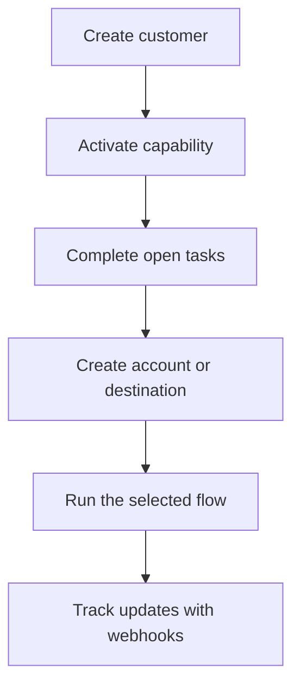

Swipelux gives your backend the building blocks to onboard customers and move money without exposing payment infrastructure in your product.

## What you can build

<CardGroup cols={3}>
  <Card title="Receive funds" icon="arrow-down-to-line" href="/integration/receive-funds">
    Create one-time fiat funding instructions and settle stablecoin into a wallet.
  </Card>
  <Card title="Send funds" icon="arrow-up-from-line" href="/integration/send-funds">
    Send from a customer wallet to a first-party account or third-party destination.
  </Card>
  <Card title="Issue a bank account" icon="building-2" href="/integration/issue-bank-account">
    Provision reusable bank details linked to a settlement wallet.
  </Card>
</CardGroup>

## How an integration works

A customer is the individual or business that owns the flow. Capabilities describe which outcomes that customer can use. Open tasks tell you what must be completed before the capability or resource can move forward.

## See it in action

Explore [demo.swipelux.com](https://demo.swipelux.com) to try a simulated neobank experience. You can also [clone the starter](https://github.com/swipelux/neobank-starter) and customize its product interface.

The demo and starter are product and UI references. They do not replace these guides or the current API contract.

## Start building

<CardGroup cols={3}>
  <Card title="Quickstart" icon="rocket" href="/integration/quickstart">
    Create a customer and run one sandbox flow.
  </Card>
  <Card title="Common flows" icon="route" href="/integration/common-flows">
    Compare the setup required for each outcome.
  </Card>
  <Card title="API Reference" icon="code" href="/api-reference/introduction">
    Read request conventions and inspect every API operation.
  </Card>
</CardGroup>
