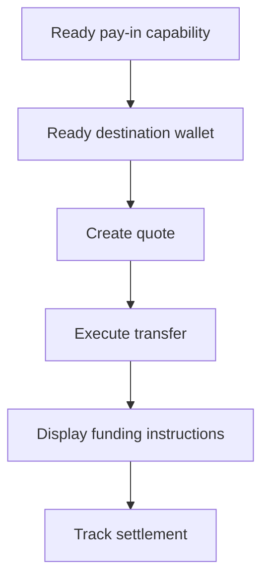

Use a quoted pay-in when the customer needs to fund a specific amount. The transfer settles stablecoin into an issued wallet.



## Before you start

You need a ready pay-in capability and ready issued destination wallet for the same customer. Complete any open work through [Capabilities and tasks](/integration/onboarding/capabilities-and-requirements), then refetch both resources.

## 1. Create a quote

Create the price with [`POST /v3/quotes`](/api-reference/money-movement/post-v3-quotes). Send these headers:

```http
X-API-Key: ${SWIPELUX_API_KEY}
Idempotency-Key: payin-quote-001
Content-Type: application/json
```

```json
{
  "customerId": "${CUSTOMER_ID}",
  "capabilityId": "${CAPABILITY_ID}",
  "externalId": "payin-order-123",
  "in": {
    "amount": "150.00",
    "currency": "USD"
  },
  "destinationId": "${SETTLEMENT_WALLET_ID}",
  "out": {
    "currency": "USDC"
  }
}
```

Store `data.id` as `QUOTE_ID`. Present the returned amounts and fees rather than rebuilding them from the rate.

## 2. Execute the quote

Execute the current quote before expiry with [`POST /v3/transfers`](/api-reference/money-movement/post-v3-transfers). Use a new key for this intended transfer:

```http
X-API-Key: ${SWIPELUX_API_KEY}
Idempotency-Key: payin-transfer-001
Content-Type: application/json
```

```json
{
  "quoteId": "${QUOTE_ID}"
}
```

Store transfer `data.id` as `TRANSFER_ID` and retain its current state.

## 3. Retrieve funding instructions

Read [`GET /v3/transfers/{transferId}/instructions`](/api-reference/money-movement/get-v3-transfers-by-transfer-id-instructions). Render the returned `data.instructions` variant without assuming its type.

These details are transfer-specific. Never reuse one transfer's bank coordinates, code, hosted URL, amount, reference, or expiry for another pay-in.

For bank instructions, when `reference.required` is true, display the exact `reference.value` next to the bank coordinates and make it copyable. Show the returned amount and currency from the same instruction set.

An issued bank account is different: it provides reusable details for later deposits. See [Issue a bank account](/integration/issue-bank-account) when that is the intended experience.

## 4. Track settlement

Read [`GET /v3/transfers/{transferId}`](/api-reference/money-movement/get-v3-transfers-by-transfer-id) after execution and after each event. Drive the customer-facing status from the latest `data.state`.

Use `data.stateDetail` and `data.openTaskIds` when the transfer needs another action. Do not mark it complete from an expected schedule.

Next, add [Webhooks](/integration/webhooks) and keep the transfer status synchronized until it reaches an outcome your product handles.
