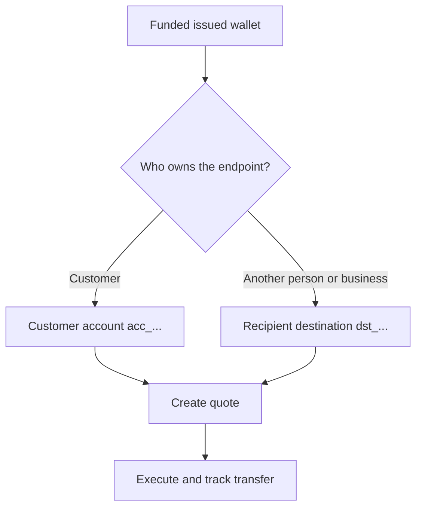

Every payout starts from a ready, funded issued wallet. The destination model depends on who owns the endpoint.



## Before you start

Refetch the source wallet. Confirm its current status permits the payout and its available balance covers the intended source amount. Store its response-derived ID as `SOURCE_WALLET_ID`.

You also need a ready payout capability for the current customer and selected destination.

## 1. Prepare the destination

<Tabs>
  <Tab title="First-party">

Use a customer-owned external bank account when the customer owns the endpoint. Create it with [`POST /v3/customers/{customerId}/accounts`](/api-reference/accounts/post-v3-customers-by-customer-id-accounts) and these headers:

```http
X-API-Key: ${SWIPELUX_API_KEY}
Idempotency-Key: payout-account-001
Content-Type: application/json
```

```json
{
  "origin": "external",
  "type": "bank",
  "methods": ["ach", "wire"],
  "country": "US",
  "currency": "USD",
  "details": {
    "routingNumber": "021000021",
    "accountNumber": "123456789",
    "accountType": "checking",
    "bankName": "Example Bank",
    "accountHolderName": "Acme Payments SAS"
  },
  "label": "Customer operating account"
}
```

Read it with [`GET /v3/customers/{customerId}/accounts/{accountId}`](/api-reference/accounts/get-v3-customers-by-customer-id-accounts-by-account-id). Continue only when its current status permits the payout. Store its `acc_` ID as `PAYOUT_DESTINATION_ID`.

  </Tab>
  <Tab title="Third-party">

Create the person or business and their bank or wallet endpoint through [Recipients and destinations](/integration/recipients). Continue only when the destination is ready.

Store the returned `dst_` ID as `PAYOUT_DESTINATION_ID`. Do not use the recipient's `rcp_` ID as the quote destination.

  </Tab>
</Tabs>

## 2. Create the payout quote

Use [`POST /v3/quotes`](/api-reference/money-movement/post-v3-quotes) with these headers:

```http
X-API-Key: ${SWIPELUX_API_KEY}
Idempotency-Key: payout-quote-001
Content-Type: application/json
```

```json
{
  "customerId": "${CUSTOMER_ID}",
  "capabilityId": "${CAPABILITY_ID}",
  "in": {
    "amount": "150.00",
    "currency": "USDC",
    "accountId": "${SOURCE_WALLET_ID}"
  },
  "destinationId": "${PAYOUT_DESTINATION_ID}",
  "out": {
    "currency": "USD"
  }
}
```

Store `data.id` as `QUOTE_ID` and present the returned price and fees.

## 3. Execute the payout

Create the transfer with [`POST /v3/transfers`](/api-reference/money-movement/post-v3-transfers). Use one new key for this intended execution:

```http
X-API-Key: ${SWIPELUX_API_KEY}
Idempotency-Key: payout-transfer-001
Content-Type: application/json
```

```json
{
  "quoteId": "${QUOTE_ID}"
}
```

Store transfer `data.id` as `TRANSFER_ID`. A successful create starts the payout; it does not prove delivery.

## 4. Track delivery

Read [`GET /v3/transfers/{transferId}`](/api-reference/money-movement/get-v3-transfers-by-transfer-id) after creation and after each event. Use the latest `data.state`, `data.stateDetail`, and `data.openTaskIds` to decide whether to wait, act, or show a terminal outcome.

Next, review [Quotes and transfers](/integration/quotes-and-transfers) for exact amounts, safe execution recovery, and transfer tasks.
