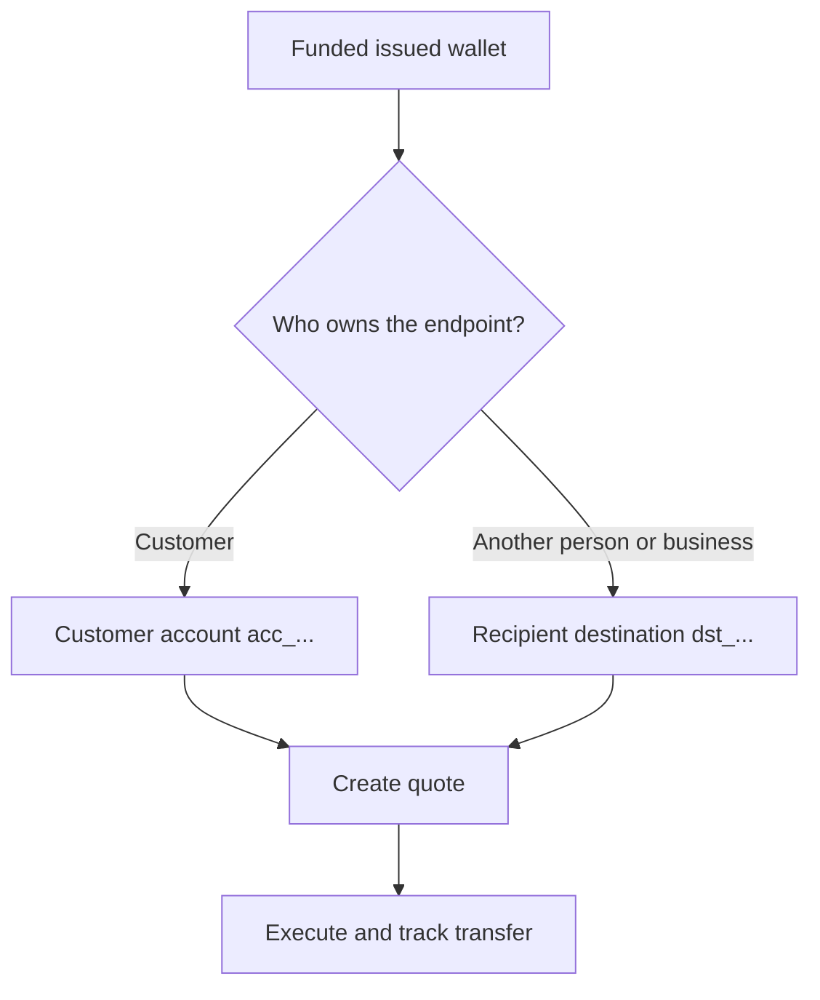

Every payout starts from a ready, funded issued wallet. The destination model depends on who owns the endpoint.


```mermaid
flowchart TD
  A["Funded issued wallet"] --> B{"Who owns the endpoint?"}
  B -->|"Customer"| C["Customer account acc_..."]
  B -->|"Another person or business"| D["Recipient destination dst_..."]
  C --> E["Create quote"]
  D --> E
  E --> F["Execute and track transfer"]
```

## Before you start

Refetch the source wallet. Confirm its current status permits the payout and its available balance covers the intended source amount. Store its response-derived ID as `SOURCE_WALLET_ID`.

You also need a ready payout capability for the current customer and selected destination.

USDT payouts from existing Tron wallets are supported. The source wallet, quote currency, and destination must use the same network and stablecoin. New issued wallets cannot be created on Tron.

## 1. Prepare the destination

<Tabs>
  <Tab title="First-party">

Use a customer-owned external bank account when the customer owns the endpoint. Create it with [`POST /v3/customers/{customerId}/accounts`](/api-reference/accounts/post-v3-customers-by-customer-id-accounts) and these headers:

```http
X-API-Key: ${SWIPELUX_API_KEY}
Idempotency-Key: payout-account-001
Content-Type: application/json
```

```json
{
  "origin": "external",
  "type": "bank",
  "methods": ["ach", "wire"],
  "country": "US",
  "currency": "USD",
  "details": {
    "routingNumber": "021000021",
    "accountNumber": "123456789",
    "accountType": "checking",
    "bankName": "Example Bank",
    "accountHolderName": "Acme Payments SAS"
  },
  "label": "Customer operating account"
}
```

Swipelux validates bank identifiers when you create the account. See [Bank identifier validation](/integration/recipients#bank-identifier-validation).

Read it with [`GET /v3/customers/{customerId}/accounts/{accountId}`](/api-reference/accounts/get-v3-customers-by-customer-id-accounts-by-account-id). Continue only when its current status permits the payout. Store its `acc_` ID as `PAYOUT_DESTINATION_ID`.

  </Tab>
  <Tab title="Third-party">

Create the person or business and their bank or wallet endpoint through [Recipients and destinations](/integration/recipients). Continue only when the destination is ready.

Store the returned `dst_` ID as `PAYOUT_DESTINATION_ID`. Do not use the recipient's `rcp_` ID as the quote destination.

  </Tab>
</Tabs>

## 2. Create the payout quote

Use [`POST /v3/quotes`](/api-reference/money-movement/post-v3-quotes) with these headers:

```http
X-API-Key: ${SWIPELUX_API_KEY}
Idempotency-Key: payout-quote-001
Content-Type: application/json
```

```json
{
  "customerId": "${CUSTOMER_ID}",
  "capabilityId": "${CAPABILITY_ID}",
  "in": {
    "amount": "150.00",
    "currency": "USDC",
    "accountId": "${SOURCE_WALLET_ID}"
  },
  "destinationId": "${PAYOUT_DESTINATION_ID}",
  "out": {
    "currency": "USD"
  }
}
```

Store `data.id` as `QUOTE_ID` and present the returned price and fees.

### Choose a bank route

For a crypto-to-fiat payout, you can set the optional `institutionId` to require an approved bank route for the customer. Omit it to let Swipelux select the highest-priority ready route automatically.

```json
{
  "customerId": "${CUSTOMER_ID}",
  "capabilityId": "${CAPABILITY_ID}",
  "institutionId": "lead_bank",
  "in": {
    "amount": "150.00",
    "currency": "USDC",
    "accountId": "${SOURCE_WALLET_ID}"
  },
  "destinationId": "${PAYOUT_DESTINATION_ID}",
  "out": {
    "currency": "USD"
  }
}
```

- An explicit `institutionId` never falls back to another bank. When the selected bank has no ready route for this customer, capability, and destination, `POST /v3/quotes` returns `422` [`bank_not_supported_for_customer`](/integration/errors#bank-not-supported-for-customer) with the pointer `/institutionId`.
- `institutionId` is only valid on crypto-to-fiat payout quotes. Sending it on a pay-in, card, or stablecoin transfer quote returns `400` [`validation_error`](/integration/errors#validation-error).
- Quote and transfer reads echo the `institutionId` of the selected route, even when Swipelux selected it automatically.

### SWIFT payouts

USD SWIFT payouts are available on a ready `swift_named` capability, funded by USDC on Ethereum, Base, or Polygon. The recipient amount after fees must be at least 100.00 USD.

A SWIFT destination needs the bank's street address in `bankAddress`, `bankCity`, `bankState`, and `bankPostalCode`. The BIC country must match the bank country. Swipelux takes the beneficiary address from the customer or recipient profile.

## 3. Execute the payout

Create the transfer with [`POST /v3/transfers`](/api-reference/money-movement/post-v3-transfers). Use one new key for this intended execution:

```http
X-API-Key: ${SWIPELUX_API_KEY}
Idempotency-Key: payout-transfer-001
Content-Type: application/json
```

```json
{
  "quoteId": "${QUOTE_ID}"
}
```

Store transfer `data.id` as `TRANSFER_ID`. A successful create starts the payout; it does not prove delivery.

## 4. Track delivery

Read [`GET /v3/transfers/{transferId}`](/api-reference/money-movement/get-v3-transfers-by-transfer-id) after creation and after each event. Use the latest `data.state`, `data.stateDetail`, and `data.openTaskIds` to decide whether to wait, act, or show a terminal outcome.

Next, review [Quotes and transfers](/integration/quotes-and-transfers) for exact amounts, safe execution recovery, and transfer tasks.
