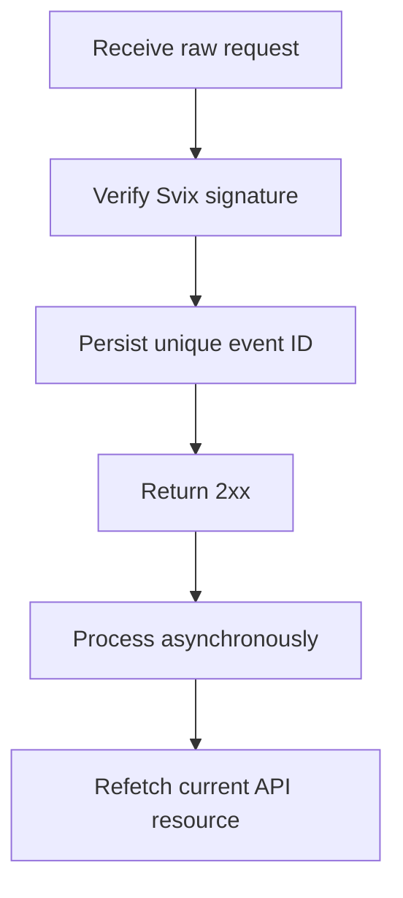

Use webhooks to react to asynchronous changes. Delivery is at least once, so duplicate, delayed, and out of order events are normal.



## Register only the events you need

Create an endpoint with [`POST /v3/webhooks`](/api-reference/webhooks/post-v3-webhooks). Subscribe only to documented events that drive your integration. This example uses [`transfer.state_changed`](/api-reference/webhooks/transfer-state-changed).

```bash
export API_BASE='https://platform.swipelux.com'
export SWIPELUX_API_KEY='replace-with-your-api-key'

curl --request POST \
  "${API_BASE}/v3/webhooks" \
  --header "X-API-Key: ${SWIPELUX_API_KEY}" \
  --header "Idempotency-Key: webhook-endpoint-001" \
  --header "Content-Type: application/json" \
  --data @- <<'JSON'
{
  "url": "https://example.com/webhooks/swipelux",
  "events": ["transfer.state_changed"]
}
JSON
```

Store response `data.id` as `WEBHOOK_ID`. Open the portal returned by [`GET /v3/webhooks/portal`](/api-reference/webhooks/get-v3-webhooks-portal), retrieve this endpoint's signing secret, and store it separately from your API key in a secret manager.

## Verify before parsing

Swipelux delivers new webhook integrations through Svix. Verify the raw request body with your endpoint signing secret and these headers:

- `svix-id`
- `svix-timestamp`
- `svix-signature`

Do not parse JSON or cause side effects before verification succeeds.

```javascript
import { Webhook } from "svix";

const verifier = new Webhook(process.env.SWIPELUX_WEBHOOK_SECRET);

export async function handleSwipeluxWebhook(request) {
  const rawBody = await request.text();
  const event = verifier.verify(rawBody, {
    "svix-id": request.headers.get("svix-id"),
    "svix-timestamp": request.headers.get("svix-timestamp"),
    "svix-signature": request.headers.get("svix-signature"),
  });

  await webhookInbox.insertIfAbsent({
    id: event.id,
    payload: event,
    status: "pending",
  });

  return new Response(null, { status: 204 });
}
```

Reject requests with missing or invalid signatures. Keep the raw body available until verification completes.

## Persist, acknowledge, then process

Put a uniqueness constraint on the envelope `id`. Persist the verified envelope, return `2xx` promptly, then process it asynchronously.

If the event ID already exists, acknowledge the delivery without repeating completed side effects. Resume pending or failed local work through your own retry queue. Do not use the envelope `attempt` field as a deduplication key or transport retry counter.

## Refetch current state

Webhook order is not an authoritative resource history. Use `resource.type` and `resource.id` to locate the object, then fetch its current state before updating your system.

For a transfer event, call [`GET /v3/transfers/{transferId}`](/api-reference/money-movement/get-v3-transfers-by-transfer-id):

```bash
curl --request GET \
  "${API_BASE}/v3/transfers/${TRANSFER_ID}" \
  --header "X-API-Key: ${SWIPELUX_API_KEY}"
```

Drive customer-visible status and downstream actions from the current API response. Design side effects to remain safe if two workers process related events in a different order.

## Recover deliveries

Use [`GET /v3/webhooks/portal`](/api-reference/webhooks/get-v3-webhooks-portal) to open delivery logs, retry failed deliveries, or start a manual replay.

Every replay must pass through the same signature verification and durable inbox. To recover after downtime, replay the affected window and refetch each referenced resource. Completed event IDs remain no-ops; incomplete records resume asynchronously.

Next, verify duplicate and out-of-order deliveries in sandbox, then complete the [Go live](/integration/go-live) checklist.
