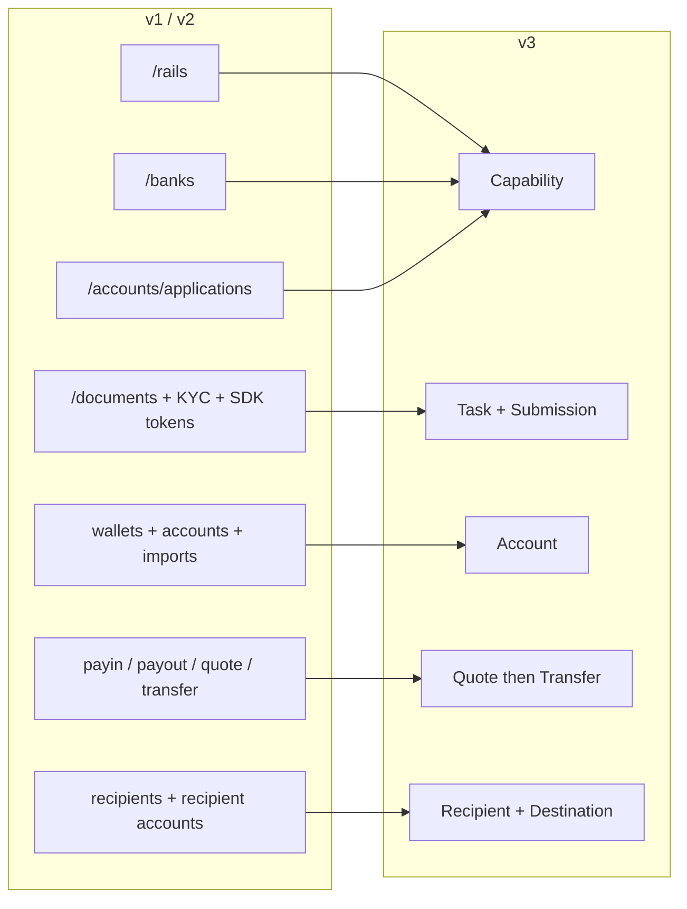
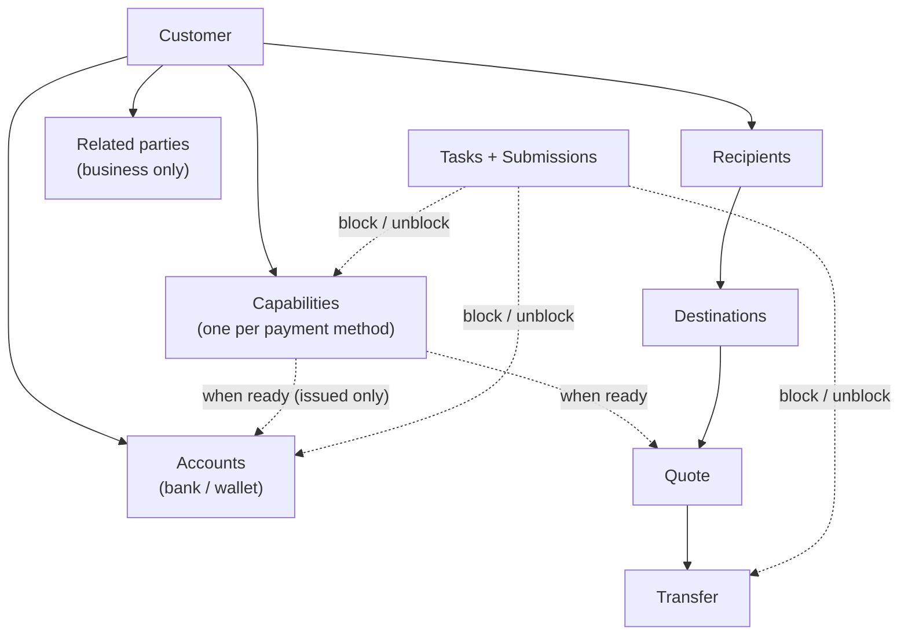
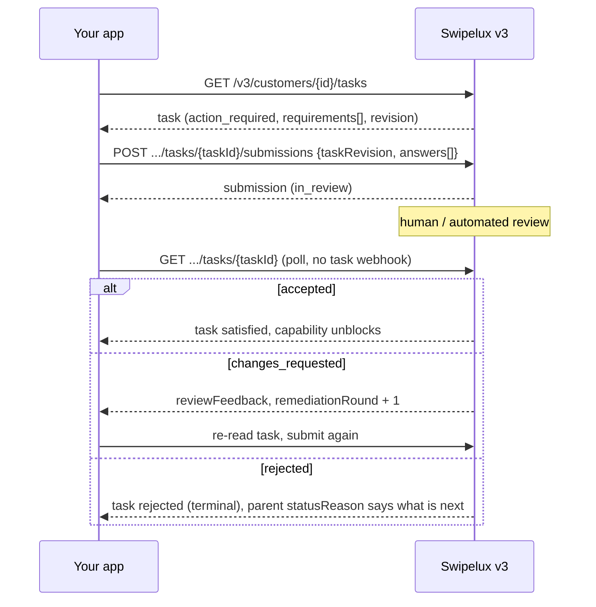
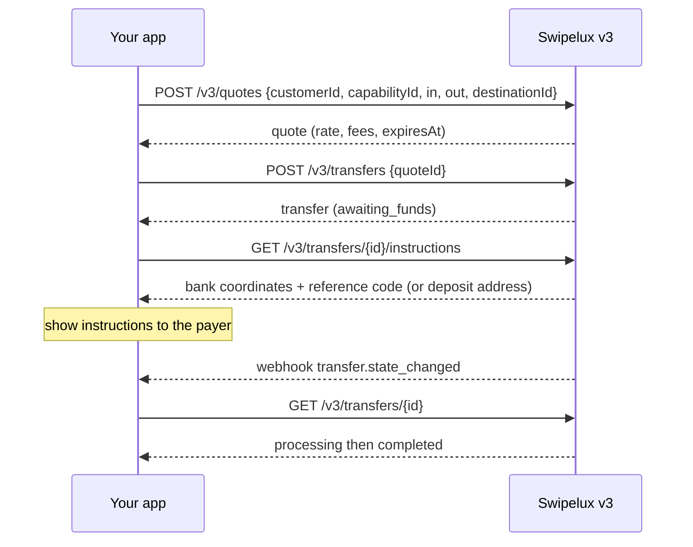
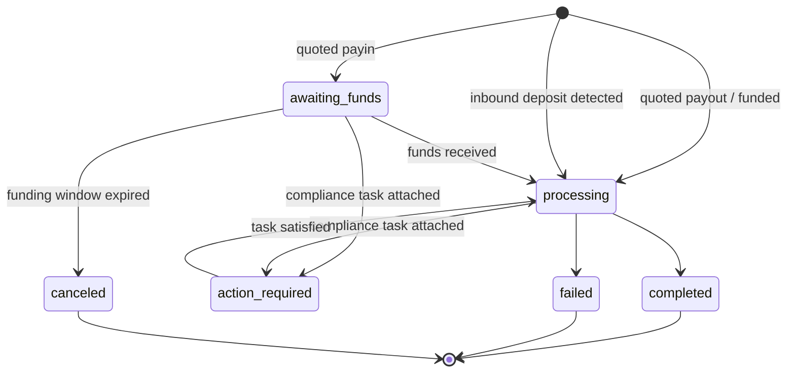
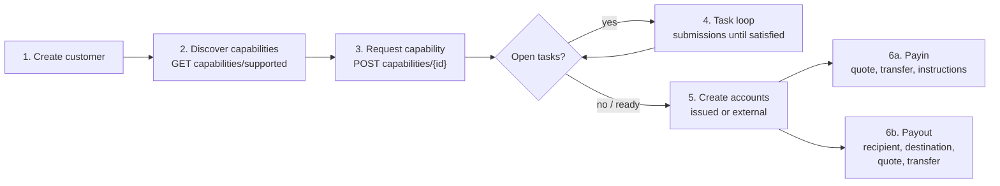

Migra la tua integrazione dall'API v1 e v2 a v3 in due passaggi:

- **Parte 1, il concetto.** Leggi prima questa. v3 è un rimodellamento, non una rinominazione: se mappi i vecchi endpoint uno a uno, combatterai contro l'API. Dieci minuti qui ti fanno risparmiare giorni dopo.
- **Parte 2, l'API.** Mappatura endpoint per endpoint, esempi di richieste, macchine a stati e una check-list di migrazione.

Basato sulla specifica OpenAPI di produzione ([platform.swipelux.com/openapi.json](https://platform.swipelux.com/openapi.json)). v1 e v2 restano attive e non sono ancora deprecate; tutte le nuove funzionalità capability, recipient, task e quoting escono solo su v3. Iscriviti all'evento webhook `api.deprecation` per gli avvisi di dismissione.

<Info>
  **Contenuti.** Parte 1: 1.1 perché esiste v3, 1.2 modello di oggetti, 1.3 prontezza per capability, 1.4 loop delle task, 1.5 movimentazione di denaro, 1.6 macchine a stati, 1.7 convenzioni, 1.8 percorso d'oro. Parte 2: 2.1 customers, 2.2 capabilities, 2.3 tasks e submissions, 2.4 accounts, 2.5 recipients e destinations, 2.6 quotes e transfers, 2.7 webhooks, 2.8 sandbox, 2.9 endpoint legacy, 2.10 ordine di migrazione, 2.11 check-list dei tranelli.
</Info>

---

## Parte 1, il concetto

### 1.1 Perché esiste v3

v1 e v2 hanno fatto crescere quattro modi sovrapposti per rendere un customer pronto ai pagamenti: `/rails`, `/banks`, `/accounts/applications` e la superficie aziendale `rail-applications`, ciascuna con il proprio vocabolario di stati. La raccolta di documenti (`/documents`, importazioni KYC, token SDK di verifica) era scollegata da ciò che effettivamente sbloccava. v3 condensa tutto in sei risorse: il customer più cinque cose che possiede:



| Risorsa | Definizione in una riga |
| --- | --- |
| **Customer** | La persona o l'azienda. **Nessun campo di stato pubblico**, la prontezza risiede nelle capabilities. |
| **Capability** | Un metodo di pagamento utilizzabile dal customer (`sepa`, `ach`, `swift`, `stablecoin_transfers`, e così via), con il proprio stato. Sostituisce `/rails`, `/banks` e i punti di ingresso account-application. |
| **Task** | Un'unità di lavoro che Swipelux richiede (dati, documenti, verifica), a cui si risponde con una **Submission**. Sostituisce la superficie documenti e KYC. |
| **Account** | Un endpoint di funding posseduto dal customer: `bank` o `wallet`, `issued` da Swipelux o `external`. |
| **Recipient / Destination** | Beneficiario del pagamento (chi) e il suo endpoint bancario o wallet (dove). |
| **Quote / Transfer** | Tutta la movimentazione di denaro. Un transfer esegue una quote persistita; i transfer senza quote spariscono. |

### 1.2 Il modello di oggetti



Due regole strutturali da interiorizzare:

1. **Le capabilities regolano tutto.** Gli account sono provisioned sotto una capability `ready`; le quote sono valutate contro una capability. L'onboarding equivale a portare a `ready` le capabilities che ti servono.
2. **Le task si attaccano ovunque.** Una capability, un account o un transfer in corso possono portare `openTaskIds`. Ovunque le vedi, il loop è lo stesso: leggere la task, inviare le risposte, attendere la revisione, rileggere il genitore.

### 1.3 La prontezza è per capability, non per customer

v1 intrecciava la prontezza di `/rails` con una barriera KYC a livello di customer. In v3 non c'è uno stato di customer: un customer può essere pienamente utilizzabile su `stablecoin_transfers` mentre la sua capability `sepa` ha ancora task aperte. Le capabilities a conto pooled di solito passano a `ready` più rapidamente di quelle nominative, quindi inizia a operare su ciò che è `ready` invece di aspettare tutto.

Se il tuo codice v1 o v2 pilota i badge dell'interfaccia dallo stato di verifica del customer, riscrivilo:

- "Può operare su X?" diventa capability X `status == "ready"`.
- "Deve fare qualcosa?" diventa qualsiasi task con stato `action_required` (la capability tipicamente mostra `restricted` con `statusReason.resolution: "complete_tasks"`).
- "Stiamo aspettando Swipelux?" diventa tasks `in_review`, capability `pending`.

### 1.4 Il loop delle task

Tutto ciò che faceva la vecchia superficie documenti e KYC ora è questo unico loop:



Proprietà chiave:

- Una task porta `requirements[]`, le singole richieste. Ognuna ha un `requirementId` per task, una `key` stabile che nomina la richiesta (per esempio prova di indirizzo, deduplica la tua UI su di essa) e una `request` tipizzata che descrive esattamente quale input è desiderato (testo, data, selezione, documento, attestazione, e così via).
- L'invio è **soggetto a revisione**: non muta mai direttamente lo stato della capability o dell'account, l'accettazione sì. Un'eccezione: le risposte `profile` si propagano al profilo del customer all'invio (2.3). Dopo l'invio, interroga la task o la risorsa genitore.
- `taskRevision` (eco della `revision` della task) è una protezione di concorrenza: se la task è cambiata dopo la lettura, rileggila e ricostruisci le tue risposte.
- `absence` è una risposta di prima classe ("non ho questo perché..."), usala invece di lasciare i requirements in sospeso.

### 1.5 Movimentazione di denaro

Un unico flusso per payin, payout e movimenti di stablecoin. **Nessun input di direzione**, non dichiari mai payin contro payout. Le forme di valuta di ingresso e uscita derivano una `direction` in sola lettura sulla quote e sul transfer: `fiat_to_stablecoin` (payin), `stablecoin_to_fiat` (payout) o `stablecoin_move`.



### 1.6 Una macchina a stati per risorsa

Ogni risorsa con stato ha il proprio enum, e ogni stato non felice porta un motivo strutturato. Account, application e transfer condividono la forma `{ code, message, actor, retryable }`: account e application la espongono come `statusReason`, i transfer come `stateDetail`. `actor` indica chi deve agire (`customer`, `developer`, `provider`, `network`, `swipelux`), `retryable` indica se riprovare può aiutare. Le capabilities usano `{ code, resolution, message }`, dove `resolution` (`complete_tasks`, `wait`, `contact_support`, `none`) indica cosa fa avanzare la capability. I valori di `code` formano un catalogo aperto e solo additivo: fai branching su `resolution` (o `actor` più `retryable`) e tollera codici mai visti.

| Risorsa | Stati |
| --- | --- |
| Capability | `pending`, `restricted`, `ready`, `rejected`, `canceled` |
| Application (tentativo per richiesta sotto una capability, 2.2) | `requested`, `in_review`, `action_required`, `ready`, `rejected`, `disabled`, `canceled` |
| Task | `action_required`, `in_review`, `satisfied`, `rejected`, `canceled` |
| Submission | `in_review`, `accepted`, `changes_requested`, `rejected` |
| Account | `provisioning`, `in_review`, `ready`, `action_required`, `suspended`, `rejected`, `archived` |
| Quote | `active`, `executed`, `expired`, `failed` |
| Transfer | `awaiting_funds`, `processing`, `action_required`, `completed`, `failed`, `canceled` |
| Recipient | `active`, `rejected`, `archived` |
| Destination | `in_review`, `ready`, `action_required`, `archived` |

Gli stati che questa guida non attraversa (`rejected`, `suspended`, `disabled`, `failed`, `canceled`) sono terminali o guidati dal supporto; le definizioni per risorsa si trovano nella specifica.

Transfer, in dettaglio:



### 1.7 Convenzioni

| Area | v1 / v2 | v3 |
| --- | --- | --- |
| Auth | Header `X-API-Key` | Uguale. L'ambiente (produzione o sandbox) è selezionato dalla chiave; una sola URL base. |
| Idempotenza | Non applicata | Header `Idempotency-Key` **obbligatorio su ogni richiesta con effetti** (POST, PATCH, PUT, DELETE), gli endpoint sandbox esclusi. Stessa chiave con stesso corpo riproduce la risposta originale. |
| Denaro | Numeri e stringhe mescolati | Solo stringhe (`"amount": "150.00"`). Mai float. |
| Paginazione | Varianti offset/limit | Cursor: le liste restituiscono `{ data, nextCursor, hasMore }`. |
| Aggiornamenti | Fortemente incentrati su PUT | Aggiornamenti parziali con `PATCH`. |
| Webhook | Configurazione con endpoint singolo | Più endpoint, sottoscrizione per evento. Gli eventi sono **indizi**, la lettura è la verità (2.7). |

Regole di idempotenza da interiorizzare prima di scrivere codice:

- Riutilizzare una chiave con un corpo **diverso** produce `409 idempotency_conflict` finché la chiave è mantenuta (almeno 7 giorni), quindi non pianificare mai il riutilizzo di una chiave. Genera un UUID nuovo per operazione logica e persistilo con il tuo job.
- Il replay copre anche gli errori: se la richiesta originale si è conclusa con un 4xx terminale, la stessa chiave più il corpo restituiscono la stessa risposta di problema.
- Due richieste concorrenti con la stessa chiave: una vince, l'altra riceve `409`. Riprova quella perdente dopo la stabilizzazione della vincente; il replay restituisce la risposta originale.

### 1.8 Il percorso d'oro



---

## Parte 2, l'API

### 2.1 Customers

| v1 / v2 | v3 |
| --- | --- |
| `POST /v1/customers`, `POST /v1/customers/business`, `POST /v2/customers` | `POST /v3/customers` (un solo endpoint, `type: individual \| business`) |
| `GET/PUT/DELETE /v1/customers/{id}`, `/v1/customers/business/{id}`, `/v2/customers/{customerId}` | `GET/PATCH/DELETE /v3/customers/{customerId}` |
| `GET /v1/customers` (lista) | `GET /v3/customers` (paginazione a cursore, include riepiloghi di capabilities) |
| `GET /v1/customers/balances` (batch), `GET /v1/customers/{id}/balances` | Nessun endpoint di balances, i balances risiedono negli account: leggi `balances` su `GET /v3/customers/{customerId}/accounts` |
| `POST/GET .../shareholders` (v1 business) | `POST/GET /v3/customers/{customerId}/related-parties` (più `GET/PATCH/DELETE .../related-parties/{relatedPartyId}`) |
| `POST /v1/customers/business/{id}/kyb` (invio), `GET .../kyb` (stato) | Nessuna chiamata di invio KYB, richiedi una capability (2.2) e rispondi alle sue task (2.3); il verdetto emerge come stato di capability e di task |
| `POST /v1/customers/{id}/kyc`, `.../kyc/import`, endpoint di token SDK | Sistema di task (2.3); la verifica ospitata appare come `verificationSessions` all'interno delle task |

Creazione, discriminata su `type` (valori illustrativi, nomi di campo secondo la specifica):

```jsonc
// POST /v3/customers        Idempotency-Key: <fresh uuid>
{
  "type": "individual",
  "externalId": "user-1042",
  "individual": {
    "firstName": "Maria",
    "lastName": "Silva",
    "birthDate": "1990-04-12",
    "nationalities": ["BR"],
    "residenceCountry": "BR",
    "email": "maria@example.com",
    "residentialAddress": {
      "streetLine1": "Av. Paulista 1000",
      "city": "Sao Paulo",
      "postalCode": "01310-100",
      "country": "BR"
    }
  },
  "financialProfile": {
    "accountPurposes": ["cross_border_remittance"],
    "sourcesOfFunds": ["salary"]
  }
}
```

- **La creazione è progressiva**: `{ "type": "individual" }` da solo è una creazione valida. I dati mancanti non invalidano mai il customer, emergono in seguito come task di intake sulle capabilities che li richiedono.
- Le aziende portano `business` più i dati di registrazione. Il CRUD degli azionisti di v1 si mappa sulle **related parties**, ampliato per coprire amministratori, dirigenti e proprietari: creale in linea alla creazione del customer (ognuna ottiene un id stabile `rp_`) o gestiscile tramite gli endpoint dedicati related-parties.
- **Nessun campo `status` del customer**, vedi 1.3.
- **I customer esistenti vengono conservati**: i customer creati su v1 o v2 sono indirizzabili con lo stesso id sugli endpoint v3. La lettura v3 è una _vista sanificata_, i valori legacy che falliscono la validazione v3 tornano assenti. Dopo la tua **prima scrittura v3 quella vista diventa permanente**: i valori assenti non tornano da soli. Arricchisci presto, pianifica un passaggio unico che `PATCH` il profilo completo dai tuoi record prima di affidarti alle letture v3. Il `metadata` di v1 è un namespace separato e **non** viene riportato, reimpostalo in v3.
- `externalId` è di prima classe e **unico tra i tuoi customer** su v3, per ambiente (`409 duplicate_external_id`). Archiviare un customer non rilascia il suo `externalId`, cancellalo con PATCH prima di DELETE se intendi riutilizzarlo.
- `DELETE` è un **archivio a cascata** (nessun ripristino; gli id non vengono mai riutilizzati). È bloccato con `409 customer_has_active_resources` più `blockingResources[]` finché esiste un account non archiviato o un transfer in corso.
- Regole di merge PATCH: `null` esplicito cancella un campo nullable, gli array sostituiscono per intero (tranne le related parties in linea, che fanno upsert per id), le chiavi di `metadata` si fondono. Gli schemi completi e i filtri di lista sono nella specifica OpenAPI.

### 2.2 `/rails`, `/banks`, applications diventano Capabilities

| v1 / v2 | v3 |
| --- | --- |
| `GET /v1/.../rails/capabilities` | `GET /v3/customers/{customerId}/capabilities/supported` |
| `GET /v2/.../banks` (più `/banks/{bank}`), `GET /v2/meta/banks` | `GET /v3/customers/{customerId}/capabilities/supported` |
| `GET /v1/customers/{customerId}/rails` (lista) | `GET /v3/customers/{customerId}/capabilities` |
| `GET /v2/customers/{customerId}/rails` (panoramica) | `GET /v3/customers/{customerId}/capabilities` |
| `POST /v1/.../rails`, `POST /v2/.../banks` | `POST /v3/customers/{customerId}/capabilities/{capabilityId}` |
| `POST /v2/.../accounts/applications` | `POST /v3/customers/{customerId}/capabilities/{capabilityId}` |
| `GET /v1/.../rails/{rail}` | `GET /v3/.../capabilities/{capabilityId}` |
| `GET /v2/.../accounts/applications` (più `/{applicationId}`, `/{applicationId}/history`) | `GET /v3/.../capabilities/{capabilityId}` (più `/applications`, `/applications/{id}/history`) |
| Superficie business-rail: `GET/POST /v2/customers/business/{customerId}/rail-applications` (più `/{rail}`) | Gli stessi endpoint capability di v3, nessuna superficie business separata |
| Superficie business-rail: `GET .../business/{customerId}/rails` (più `/{rail}`) | Gli stessi endpoint capability di v3, nessuna superficie business separata |
| `GET /v1/meta/rails` (catalogo statico) | `GET /v3/customers/{customerId}/capabilities/supported`, la disponibilità è per customer; non c'è catalogo statico |
| `GET /v1/meta/accounts/banks` | `GET /v3/institutions` (directory bancaria: id, nome, BIC, paesi) |
| Non disponibile | `GET /v3/capabilities`, lista a livello di merchant delle capabilities concesse tra i customer (filtrabile per `status`, `method`, `customerId`) |
| Non disponibile | `GET /v3/.../capabilities/{capabilityId}/tasks-preview` (vedi le richieste prima di richiedere) |
| Non disponibile | `POST /v3/.../capabilities/{capabilityId}/cancel` |

- Una capability equivale a `method` (`ach`, `wire`, `rtp`, `pix`, `sepa`, `swift`, `spei`, `pse`, `transfers_3_0`, `faster_payments`, `sepa_instant`, `uaefts`, `card`, `stablecoin_transfers`, e così via) più `accountType` (`pooled` o `named`, `null` per metodi non bancari) più `directions` (`payin` o `payout`). Il `capabilityId` pubblico è la coppia qualificata (`sepa_pooled`, `ach_named`) o il metodo semplice per `card` e `stablecoin_transfers`.
- Ogni richiesta di capability genera un'**application**, il record per tentativo sotto `.../capabilities/{capabilityId}/applications` (più `/{applicationId}/history`), con i propri stati (1.6) e `statusReason`. È la traccia di audit di una richiesta; nel quotidiano, interroga la capability stessa.
- `capabilities/supported` restituisce disponibilità (`available`, `beta` o `disabled`), idoneità e istituzioni offerte. La selezione della banca avviene al momento della richiesta tramite l'array opzionale `institutions`, non c'è una risorsa `/banks` separata. Ometterlo (o inviare `[]`) seleziona tutte le istituzioni di default; `isDefault: true` è un flag specifico di customer e capability, non globale. Una lista non vuota sovrascrive i default e una capability bancaria senza un default applicabile restituisce `422 capability_institutions_required`. Gli id di istituzione sono opachi, tollera quelli nuovi.
- `stablecoin_transfers` è **auto-concessa alla creazione del customer** e nasce `ready` (quindi non viene mai richiesta né annullata). `card` è solo per individuals.
- `openTaskIds` sulla capability è il tuo puntatore "cosa fare dopo". Aperto equivale a `action_required` **o** `in_review`, e il rollup include task condivise a livello di customer raggiunte tramite dipendenze attive.
- `cancel` funziona solo da `pending` o `restricted` **e** senza risorse bloccanti, altrimenti `409 capability_not_cancelable`, il cui corpo di problema elenca `blockingResources`. Ri-richiedere dopo un'annullamento è una creazione nuova con una nuova chiave di idempotenza.
- **Interroga il GET.** Lo stato della capability si aggiorna quando lo leggi; interroga `GET .../capabilities/{capabilityId}` o iscriviti a `capability.status_changed`, non fare caching.
- Richiedere un metodo può rendere disponibili contemporaneamente metodi correlati, tratta le capabilities come un insieme da rileggere, non come una singola riga da tracciare.
- Usa `tasks-preview` per mostrare le richieste di onboarding **prima** di impegnarti in una richiesta.
- La verifica non è una tantum: nuove task possono comparire su una capability già `ready` (riverifica periodica o guidata da eventi). Mantieni il loop delle task attivo per tutto il ciclo di vita del customer, non solo durante l'onboarding.

### 2.3 Documenti e KYC diventano Tasks e Submissions

<Note>
  **Nota sui nomi.** Questi endpoint sono stati brevemente rilasciati come `requirements` e `fulfillments`. Dal 2026-08-02 i nomi pubblici sono **tasks** e **submissions**. La rinominazione ha coperto solo le risorse e i percorsi degli endpoint, l'array `requirements[]` all'interno di una task e il suo `requirementId` mantengono quei nomi.
</Note>

Ogni superficie documenti legacy si mappa alla stessa sostituzione: leggi `GET /v3/customers/{customerId}/tasks`, rispondi con `POST .../tasks/{taskId}/submissions`.

| v1 / v2 | v3 |
| --- | --- |
| `POST/GET/DELETE /v1/documents` | `GET /v3/.../tasks` più `POST .../tasks/{taskId}/submissions` |
| `POST /v1/customers/{id}/documents` | `GET /v3/.../tasks` più `POST .../tasks/{taskId}/submissions` |
| `GET/POST /v1/customers/business/{id}/documents` (più `PUT/DELETE .../{docId}`) | `GET /v3/.../tasks` più `POST .../tasks/{taskId}/submissions` |
| `GET/POST .../shareholders/{shareholderId}/documents` (più `GET/PUT/DELETE .../{docId}`) | `GET /v3/.../tasks` più `POST .../tasks/{taskId}/submissions` |
| `GET/POST/DELETE /v2/.../documents` (più `/{documentId}`) | `GET /v3/.../tasks` più `POST .../tasks/{taskId}/submissions` |
| `POST /v2/.../documents/upload-token` più `POST /v2/documents/direct-upload` | Carica direttamente con la tua chiave API (sotto), oppure invia uno `storageKey` di direct-upload recente come JSON a `POST /v3/.../documents` entro cinque minuti |
| `POST /v1/customers/documents/upload`, `POST /v1/document` (intake legacy) | Rimosso, carica direttamente con la tua chiave API (sotto) |
| `POST /v1/customers/{id}/kyc` più token SDK | Task `verificationSessions` (verifica ospitata); nessuna chiamata diretta "start KYC" |

Attorno a quel loop:

- **Archiviazione file grezzi**: `POST/GET/DELETE /v3/customers/{customerId}/documents` (più `/{documentId}` e `GET .../{documentId}/download`), carica una volta con la tua chiave API, quindi referenzia gli id documento nelle risposte di submission. Questo sostituisce ogni intake upload-token e direct-upload. `POST .../documents` accetta anche un corpo JSON (`storageKey`, `fileName`, `type`) che consuma un riferimento con ambito customer ancora recente da `POST /v2/documents/direct-upload`, così i caricamenti parcheggiati migrano senza reinviare i byte.
- **Letture completamente nuove**: `GET /v3/tasks` (inbox a livello di merchant), `GET /v3/transfers/{transferId}/tasks`, `GET .../tasks/{taskId}/history`, `GET .../tasks/{taskId}/submissions` (più `/{submissionId}`).

Submission (illustrativa):

```jsonc
// POST /v3/customers/{cus}/tasks/{task}/submissions   Idempotency-Key: <fresh uuid>
{
  "taskRevision": 3,
  "answers": [
    { "requirementId": "req_a1", "answer": { "type": "document", "documentIds": ["doc_passport1"] } },
    { "requirementId": "req_b2", "answer": { "type": "text", "value": "Import/export business" } },
    { "requirementId": "req_c3", "answer": { "type": "absence", "reason": "not_applicable" } }
  ]
}
```

- Tipi di risposta: `profile`, `text`, `date`, `single_select`, `multi_select`, `boolean`, `attestation`, `document`, `resource_reference`, `absence`. L'oggetto `request` di ogni requirement ti dice quale tipo si aspetta.
- Una submission deve rispondere a **ogni requirement azionabile del round corrente**, con il `taskRevision` esatto che hai letto. Le submission parziali vengono rifiutate.
- Le risposte `profile` **si propagano**: aggiornano il profilo del customer tramite il normale percorso di validazione e rivalutano immediatamente ogni capability che riferisce lo stesso lavoro di intake. Le task di intake sorelle i cui requirements sono tutti soddisfatti si chiudono automaticamente.
- I requirements possono formare gruppi alternativi (`alternativeKey`): invia esattamente uno del gruppo.
- `changes_requested` incrementa `remediationRound` e porta `reviewFeedback`. Rileggi la task, invia di nuovo **con una nuova chiave di idempotenza**.
- Gli URL di verifica ospitata compaiono **solo** nel dettaglio della task per customer (`GET /v3/customers/{customerId}/tasks/{taskId}`) e solo mentre la sessione è azionabile; le liste e `GET /v3/tasks/{taskId}` sono deliberatamente senza URL.
- I termini di servizio sono anch'essi una task: `openTaskIds` può includere una task con `category: "terms_of_service"` la cui pagina di accettazione ospitata è collegata allo stesso modo (solo dettaglio per customer). Le submission generiche non possono accettare i termini, e l'approvazione KYC non implica mai l'accettazione dei termini.
- Le task hanno ambito per capability, quindi la "stessa" richiesta (per esempio prova di indirizzo) può comparire una volta per capability. Deduplica nella tua UI per la `key` del requirement.
- **Nessun livello di traduzione**: postare su `/v1/documents` non sbloccherà le capabilities v3. Una volta che un customer è su v3, canalizza ogni richiesta tramite le task.

### 2.4 Account e wallet

| v1 / v2 | v3 |
| --- | --- |
| `POST/GET /v1/.../accounts` (più `/import`), `/v2/.../accounts` (più `/import`) | `POST/GET /v3/customers/{customerId}/accounts` |
| `POST/GET /v1/.../wallets` (più `/import`) | Stesso endpoint, `type: wallet` |
| `GET/DELETE /v1/customers/{customerId}/accounts/{accountId}` (e la variante wallets), `GET /v2/.../accounts/{accountId}` | `GET/PATCH/DELETE /v3/.../accounts/{accountId}` |
| `PATCH /v2/.../accounts/{accountId}/fees` | `GET/PUT /v3/.../accounts/{accountId}/fees` |

Creazione, discriminata su `origin` più `type`. I conti bancari issued prendono un singolo `method`; i conti bancari esterni prendono invece un array `methods` (inviare `method` lì viene rifiutato):

```jsonc
// issued bank account (capability must be ready)
{ "origin": "issued", "type": "bank", "method": "sepa",
  "currency": "EUR", "settlement": { "accountId": "acc_wallet1" } }

// external wallet the customer already owns (replaces /import)
{ "origin": "external", "type": "wallet", "currency": "USDC",
  "network": "polygon", "details": { "address": "0x71C7656EC7ab88b098defB751B7401B5f6d8976F" } }
```

- `country` sui conti bancari issued è opzionale (di default per metodo); sui conti bancari **esterni** fornirlo esplicitamente. I conti wallet non portano paese affatto.
- `settlement.accountId` è richiesto sui conti bancari issued: identifica il conto wallet issued che riceve i fondi liquidati dai depositi sul conto bancario.
- I conti issued espongono `details` (IBAN o routing più account o address), `routing` versionato (le coordinate di deposito possono ruotare, mostra sempre l'ultima lettura), `fees`, `balances`.
- Reti: `polygon`, `ethereum`, `base`, `arbitrum`, `optimism`, `bsc`, `avalanche`.
- La barriera della capability si applica solo agli account **issued**: crearne uno contro una capability non pronta fallisce con un errore codificato per capability, richiedi prima la capability (2.2). Gli account esterni non necessitano di capability (né di approvazione del customer); ricevono solo la validazione dello schema della richiesta e delle coordinate bancarie.
- I conti bancari issued nascono `provisioning` con `details: null`. Interroga il conto o ascolta `account.status_changed` fino a `ready`.
- `DELETE` archivia, non elimina mai in modo definitivo. Gli account referenziati da transfer in corso restituiscono `409 account_has_active_transfers`. Riprova dopo che quei transfer raggiungono uno stato terminale.
- Nuovo in v3: **Rules**, istruzioni permanenti su un conto wallet issued (`POST/GET /v3/customers/{customerId}/rules`, `GET/PATCH/DELETE .../rules/{ruleId}`) che spazzano automaticamente i fondi in ingresso verso un altro account o una destination wallet. Nessun equivalente in v1 o v2.

### 2.5 Recipient e destination

| v1 | v3 |
| --- | --- |
| `POST/GET /v1/.../recipients` | `POST/GET /v3/customers/{customerId}/recipients` |
| Non disponibile (i recipient v1 erano solo create e list) | `GET/PATCH/DELETE /v3/.../recipients/{recipientId}`, dettaglio, aggiornamento, archiviazione totalmente nuovi |
| `POST/GET .../recipients/{recipientId}/accounts` | `POST/GET /v3/.../recipients/{recipientId}/destinations` |
| `GET/DELETE .../recipients/{recipientId}/accounts/{recipientAccountId}` | `GET/DELETE /v3/.../recipients/{recipientId}/destinations/{destinationId}` (nessun PATCH di destination, archivia e ricrea) |

v2 non aveva il concetto di recipient. Se sei su v2 e paghi terzi, questa è superficie nuova, non una rinominazione.

- **Recipient** equivale a chi: `individual` (nome e cognome) o `business` (nome dell'azienda), con `relationship` obbligatorio (`employee`, `contractor`, `vendor`, `subsidiary`, `merchant`, `customer`, `landlord`, `family`, `other`). Recipient e destination sono solo per terze parti. Un payout a se stessi non usa affatto un recipient: mira a uno dei propri account `acc_` del customer come `destinationId` della quote (2.6).
- **Destination** equivale a dove: tipizzato per metodo, `sepa` (iban, bic opzionale), `ach` o `wire` (routing più account), `swift` (coordinate complete più intermediario opzionale), `spei` (clabe), `pse`, `transfers_3_0` (cbu), e così via, più destination wallet. Ogni destination ha il proprio stato. Ascolta `destination.status_changed`.
- Le destination fiat richiedono l'`address` completo del recipient (via, città, codice postale, paese) **prima** della creazione. I pezzi mancanti falliscono con `422 recipient_address_required`. Le destination wallet saltano l'indirizzo ma richiedono `ownership` di primo livello (`self_custodied`, o `custodial` con un nome di custode).
- L'accuratezza del nome del beneficiario è importante: le banche riceventi verificano il nome **legale** del conto. Invia nome e cognome legali esatti o il nome dell'azienda, non un soprannome di visualizzazione.
- Gli schemi dei campi di destination per metodo sono nella specifica OpenAPI.

### 2.6 Quote e transfer

| v1 / v2 | v3 |
| --- | --- |
| `POST /v1/payin/quote`, `/v1/payout/quote`, `/v2/quote` | `POST /v3/quotes` |
| `POST /v1/payin`, `/v1/payout`, `POST /v1/transfers`, `/v2/transfer` | `POST /v3/transfers` (esegue una quote, le creazioni senza quote spariscono) |
| `GET /v1/transfers` (lista), `GET /v1/transfers/{id}` | `GET /v3/transfers`, `/v3/transfers/{transferId}` |
| Non disponibile (le quote v1 e v2 non avevano lettura) | `GET /v3/quotes/{quoteId}` |
| `GET /v1/rate/{base}/{quote}` | `GET /v3/rates` |
| (implicito nella risposta payin) | `GET /v3/transfers/{transferId}/instructions` |
| Non disponibile | `POST /v3/transfers/{transferId}/cancel`, `GET /v3/transfers/{transferId}/tasks` |

```jsonc
// 1. Quote: amount on exactly one side picks mode (exact_in / exact_out).
// POST /v3/quotes            Idempotency-Key: <fresh uuid>
{
  "customerId": "cus_123",
  "capabilityId": "sepa_named",
  "in":  { "currency": "EUR", "amount": "150.00" },
  "out": { "currency": "USDC" },
  "destinationId": "acc_wallet1",   // fiat-funded: must be a customer-owned acc_ account
  "fees": { "breakdown": { "developer": { "fixed": "1.00", "bips": 50 } } }
}
// -> { mode: "exact_in", direction: "fiat_to_stablecoin", rate, fees[], expiresAt, ... }

// 2. Execute before expiresAt.
// POST /v3/transfers         Idempotency-Key: <fresh uuid>
{ "quoteId": "quo_789", "externalId": "order-991", "memo": "invoice 44" }
```

- `destinationId` accetta un id `acc_` (account del customer) o `dst_` (destination di recipient). **Le quote finanziate in fiat (payin) devono puntare a un account `acc_`**, un target `dst_` significa sempre un payout (`422 quote_direction_invalid` altrimenti).
- `externalId` su quote e transfer è un riferimento di correlazione non univoco (restituito nelle letture, filtrabile nelle liste). La regola di unicità per ambiente (2.1) si applica solo all'`externalId` del customer.
- Esegui una quote esattamente una volta, prima di `expiresAt`. Una quote scaduta fallisce con `409 quote_expired`, una seconda esecuzione con `409 quote_already_executed` (il problema porta il `transferId` esistente).
- L'annullamento del transfer non è ancora supportato: `POST .../cancel` restituisce `409 transfer_not_cancelable` in ogni stato. I transfer `canceled` di oggi derivano dalla scadenza della finestra di funding su un payin non finanziato, non da questo endpoint.
- I payin iniziano `awaiting_funds`: mostra `GET .../instructions` al pagatore, coordinate bancarie più **codice di riferimento o memo** per fiat, indirizzo di deposito per crypto. Il codice di riferimento è il modo in cui il deposito viene abbinato. Mostralo sempre.
- `state` più `stateDetail` per sottostati leggibili dalla macchina; `action_required` significa che una task di conformità è allegata (`openTaskIds`, `GET .../tasks`), rispondi tramite submission.
- I depositi in ingresso rilevati sugli account issued compaiono come transfer con `origin: "inbound_deposit"` (contro `"quoted"`).
- I riferimenti della rete di pagamento sono consolidati sotto `references`: `transactionHash`, `traceNumber`, `imad`, `uetr`, `explorerUrl`, `returnedTransferId`.

Traduzione dello stato v1:

| Concetto v1 | v3 |
| --- | --- |
| oggetti payin e payout separati | un unico transfer con `direction` |
| ritorni o annullamenti lato provider (assorbiti in `failed`) | rimane `failed`, ora con `stateDetail` leggibile dalla macchina e `references.returnedTransferId` quando un ritorno ha generato un transfer inverso |

Due avvertimenti di migrazione:

- **I transfer non attraversano le versioni.** I transfer creati su v1 o v2 non sono leggibili da v3. La lista li omette e `GET /v3/transfers/{transferId}` risponde 404. Passa prima la _creazione_, mantieni il percorso di lettura v1 finché quei transfer raggiungono stati terminali, poi eliminalo.
- **Nessuno swap di token.** `stablecoin_move` richiede la stessa valuta in ingresso e in uscita: USDC verso USDT fallisce con `422 recipient_destination_invalid` con un errore di campo `currency_mismatch`. Stessa rete su entrambi i lati, senza bridging, e i movimenti wallet-to-wallet attualmente supportano solo la consegna a zero commissioni: una quote la cui commissione di piattaforma o developer non sia zero fallisce con `422 amount_not_deliverable`.

### 2.7 Webhook

| v1 | v3 |
| --- | --- |
| `GET/PATCH /v1/webhooks` (configurazione con endpoint singolo) | `POST/GET /v3/webhooks`, `PATCH/DELETE /v3/webhooks/{webhookId}`, `GET /v3/webhooks/portal` |

Catalogo degli eventi: `customer.created`, `customer.updated`, `customer.archived`, `capability.created`, `capability.status_changed`, `application.status_changed`, `recipient.status_changed`, `destination.status_changed`, `account.created`, `account.status_changed`, `account.details_changed`, `transfer.created`, `transfer.state_changed`, `api.deprecation`.

- `GET /v3/webhooks/portal` restituisce un URL di portale di gestione ospitato per log di consegna, retry e replay manuale.
- `transfer.created` viene attualmente consegnato con la forma di payload legacy v1 (la busta v3 si attiva quando i webhook v1 saranno dismessi). Trattalo puramente come un indizio e fai GET del transfer; non costruire contro il suo corpo.
- Gli eventi sono indizi: alla ricezione, fai GET della risorsa e agisci sulla lettura. Non costruire mai lo stato dai payload o dall'ordine degli eventi. La consegna è almeno una volta e può essere ritardata o riordinata. Deduplica per id di evento e recupera gli eventi persi con il filtro inclusivo `updatedAfter` di ogni lista.
- Iscriviti a `api.deprecation`, il canale automatico per le dismissioni di versione.
- Nessun evento `task.*` oggi: dopo l'invio, interroga la task o il suo genitore.

### 2.8 Sandbox

Stessa URL base; la chiave API sandbox seleziona l'ambiente.

| v1 | v3 |
| --- | --- |
| `POST /v1/sandbox/topup` | `POST /v3/sandbox/accounts/{accountId}/topup` |
| `POST /v1/sandbox/payins/simulate`, `.../payouts/simulate`, `POST /v1/customers/{id}/simulate-transactions` | `POST /v3/sandbox/transfers/{transferId}/state` (guida un transfer reale attraverso gli stati) |
| Non disponibile | `POST /v3/sandbox/customers/{customerId}/verification` (completa la verifica) |
| Non disponibile | `POST /v3/sandbox/customers/{customerId}/capabilities/{capabilityId}/status` (forza lo stato della capability) |
| Non disponibile | `POST /v3/sandbox/tasks`, `POST /v3/sandbox/tasks/{taskId}/review` (crea una task, poi simula il verdetto) |

Il sandbox v3 simula il loop di revisione end-to-end: crea una task, invia contro di essa, `review` verso `accepted` o `rejected`, guarda la capability sbloccarsi. Prova la tua UX di rimedio prima della produzione. Sia le task create in sandbox sia le regolari task di intake che compaiono sulle capabilities richieste sono revisionabili in questo modo; come in produzione, non si attivano webhook di task, interroga (2.7).

### 2.9 Endpoint legacy senza sostituzione in v3

Questi non hanno sostituzione in v3. La maggior parte rimane invariata su v1 (mantieni le tue chiamate esistenti); due sono ritirati direttamente (vedi Disposizione):

| Endpoint | Disposizione |
| --- | --- |
| `GET /v1/merchant-kyb/creation-gate`, `POST /v1/merchant-kyb/{customerId}/submit`, `POST /v1/merchant-kyb/parked-url`, `POST /v1/merchant-kyb/upload-token` | Il tuo onboarding KYB del merchant (non il KYB customer), invariato su v1 |
| `POST /v1/merchant-wallets/get-or-create` | Helper del wallet di tesoreria del merchant, invariato su v1 |
| `GET /v1/meta/accounts/relationships` | Ritirato, l'enum `relationship` del recipient è fisso e documentato in linea (2.5) |
| `GET /v1/meta/kyb/documents` | Ritirato, le task v3 dichiarano i documenti richiesti per caso tramite `requirements[]` (2.3); non c'è catalogo statico |
| `GET /statecharts` (più `/{machineId}`, `/{machineId}/svg`, `/explorer`, `/validate`) | Pagine pubbliche di riferimento delle macchine a stati, neutrali rispetto alla versione, invariate |

Ogni altro endpoint pubblico v1 o v2 compare in una tabella di mappatura sopra.

### 2.10 Ordine di migrazione suggerito

Ogni passo può essere rilasciato indipendentemente; v1 o v2 e v3 girano fianco a fianco sulla stessa base di customer. Prova ogni passo contro la tua chiave sandbox (2.8) prima di ripeterlo in produzione.

<Steps>
  <Step title="Idraulica">
    `Idempotency-Key` su tutte le richieste con effetti (POST, PATCH, PUT, DELETE; endpoint sandbox esenti); denaro come stringhe; helper di paginazione a cursore.
  </Step>
  <Step title="Webhook">
    Registra gli endpoint v3 per evento, incluso `api.deprecation`. La configurazione con endpoint singolo di v1 è una superficie separata, lasciala al suo posto; le due girano fianco a fianco fino al drenaggio del passo 9.
  </Step>
  <Step title="Arricchimento del profilo">
    `PATCH /v3/customers/{id}` con il profilo completo che possiedi (v1 raccoglieva meno di quanto v3 espone) e reimposta `metadata`. Rendi questa deliberatamente la **prima scrittura v3** per customer: riempie la vista sanificata prima che quella vista diventi permanente (2.1).
  </Step>
  <Step title="Letture">
    Punta le letture di customer, capability e account su v3; riscrivi la logica di stato del customer secondo 1.3. Solo dopo il passo 3, le letture non arricchite tornano con i campi legacy-invalidi assenti.
  </Step>
  <Step title="Scritture di onboarding">
    Crea tramite `POST /v3/customers`; richiedi capabilities invece di `/rails`, `/banks` o applications; costruisci il loop delle task (il maggior lavoro di UI totalmente nuovo, `tasks-preview` aiuta a mostrare le richieste in anticipo). Da questo punto, smetti di postare `/v1/documents` per i customer guidati da v3, non sbloccano le capabilities (2.3).
  </Step>
  <Step title="Account">
    Emetti tramite v3; sposta gli import a `origin: external`.
  </Step>
  <Step title="Payout">
    Recipient più destination, poi quote e transfer.
  </Step>
  <Step title="Payin">
    Quote, transfer, istruzioni; continua a mostrare il codice di riferimento.
  </Step>
  <Step title="Drenaggio">
    I transfer non attraversano le versioni (2.6). Mantieni il percorso di lettura v1 o v2 e l'endpoint webhook v1 per i transfer creati lì, fai doppia lettura finché non raggiungono stati terminali, poi elimina il vecchio client e la configurazione webhook v1.
  </Step>
</Steps>

### 2.11 Check-list dei tranelli

- [ ] UUID nuovo per **operazione logica**, persistito con il tuo job e riutilizzato in retry; non riutilizzare mai una chiave con un corpo modificato (`409 idempotency_conflict`). Gli endpoint sandbox sono esenti dall'header.
- [ ] Arricchisci i customer esistenti (`PATCH` il profilo completo, reimposta `metadata`, non viene riportato) **prima di qualsiasi altra scrittura v3**, la prima scrittura v3 rende permanente la vista sanificata.
- [ ] `externalId` è unico per ambiente e **non viene rilasciato dall'archiviazione**, cancellalo con `PATCH` prima di `DELETE` se intendi riutilizzarlo.
- [ ] Non esiste un campo `status` del customer, deriva la prontezza per capability.
- [ ] `action_required` **e** `in_review` significano entrambi una task aperta.
- [ ] Le submission sono soggette a revisione (inviare non equivale a sbloccato) e devono rispondere a **ogni** requirement azionabile con il `taskRevision` esatto. In caso di disallineamento, rileggi e ricostruisci.
- [ ] Non esiste webhook `task.*`, interroga la task (o il suo genitore) dopo ogni invio.
- [ ] Retry di `changes_requested` equivale a rileggere la task, nuove risposte, **nuova chiave di idempotenza**.
- [ ] Postare su `/v1/documents` non sblocca mai una capability v3, una volta che un customer è sulle task, canalizza ogni richiesta tramite le task.
- [ ] Nuove task possono comparire su una capability già `ready`, mantieni il loop delle task attivo dopo l'onboarding, non solo durante.
- [ ] `cancel` della capability funziona solo da `pending` o `restricted` senza risorse bloccanti (`409 capability_not_cancelable`); ri-richiedere dopo l'annullamento è una creazione nuova con una nuova chiave di idempotenza.
- [ ] La capability deve essere `ready` prima di emettere account sotto di essa o quotare contro di essa.
- [ ] La quote ha l'importo esattamente su un lato; nessun campo di direzione; esegui esattamente una volta prima di `expiresAt` (`409 quote_expired` o `409 quote_already_executed`).
- [ ] I movimenti di stablecoin sono solo stessa valuta e stessa rete (USDC verso USDT fallisce `422`); wallet-to-wallet supporta solo la consegna a zero commissioni.
- [ ] `DELETE` archivia, non elimina mai in modo definitivo. La delete dell'account è bloccata dai transfer in corso (`409 account_has_active_transfers`); la delete del customer inoltre da qualsiasi account non archiviato (`409 customer_has_active_resources`, `blockingResources[]` li nomina).
- [ ] I transfer v1 o v2 sono invisibili alle letture v3 (la lista li omette, GET 404s), fai doppia lettura fino al drenaggio, poi elimina i vecchi percorsi.
- [ ] Il `routing` di deposito e le istruzioni possono ruotare, mostra sempre l'ultimo GET e mostra sempre il codice di riferimento.
- [ ] I webhook sono indizi; il GET è la verità, deduplica per id di evento, recupera gli eventi persi con `updatedAfter`.

## Passo successivo

Inizia dal passo 1 dell'ordine di migrazione (2.10), chiavi di idempotenza, denaro come stringhe, paginazione a cursore, e prova ogni passo contro la tua chiave sandbox (2.8) prima di ripeterlo in produzione.
