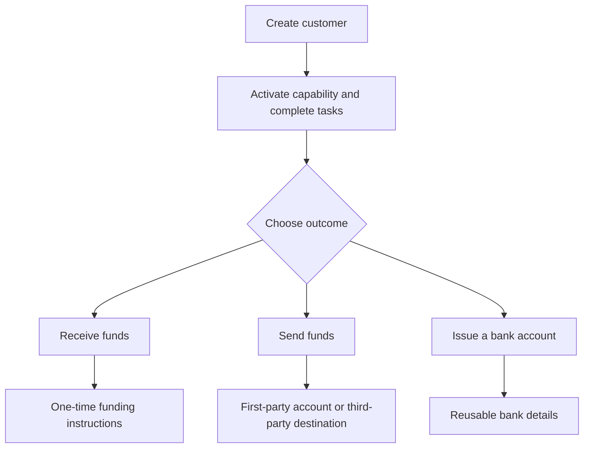

Parti dal risultato per il cliente. Ogni flusso usa lo stesso modello di onboarding, poi si ramifica in conti e movimenti di denaro diversi.

## Confronta i flussi

| Risultato | Prepara prima | Cosa ricevi |
| --- | --- | --- |
| Pay-in | Capability di pay-in ready e wallet emesso di destinazione | Istruzioni specifiche del transfer e regolamento in stablecoin |
| Payout | Capability di payout ready, wallet emesso finanziato e conto o destinazione ready | Un transfer verso l'endpoint del beneficiario selezionato |
| Conto bancario emesso | Capability bancaria ready e wallet emesso di regolamento | Coordinate bancarie riutilizzabili dopo il provisioning |

Un pay-in con quote crea istruzioni per un singolo transfer. Un conto bancario emesso crea coordinate riutilizzabili per depositi futuri. Un payout parte da fondi gia' disponibili in un wallet emesso.

## Scegli il tuo flusso

<CardGroup cols={3}>
  <Card title="Ricevi fondi" icon="arrow-down-to-line" href="/it/integration/receive-funds">
    Crea e traccia un pay-in fiat-a-stablecoin.
  </Card>
  <Card title="Invia fondi" icon="arrow-up-from-line" href="/it/integration/send-funds">
    Costruisci un payout di prima parte o di terze parti.
  </Card>
  <Card title="Emetti un conto bancario" icon="building-columns" href="/it/integration/issue-bank-account">
    Fornisci coordinate bancarie riutilizzabili collegate a un wallet.
  </Card>
</CardGroup>
