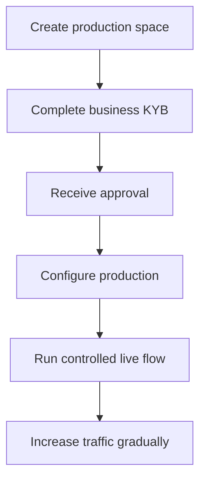

L'attivazione della produzione verifica il tuo business integratore. E' separata dai customer API che crei per il tuo prodotto.

## Attiva il tuo spazio di produzione

1. Accedi alla Swipelux Dashboard e seleziona **Create a production space**.
2. Apri la tab KYB o vai a [Business verification](https://www.swipelux.app/kyb).
3. Completa ogni campo richiesto e carica i documenti richiesti.
4. Invia il tuo business integratore per la verifica e attendi l'approvazione.

Solo dopo l'approvazione del tuo business integratore e dello spazio di produzione potrai creare customer e transazioni API in produzione.

## Mantieni la produzione indipendente

Crea le risorse di produzione in modo esplicito. Cambiare una chiave API non migra lo stato del sandbox.

- Conserva le credenziali di produzione in una voce separata del secret manager.
- Usa configurazione di deployment e ID di risorsa specifici per produzione.
- Registra un endpoint webhook e signing secret di produzione separati.
- Ricrea in produzione i customer, le capability, i conti, i recipient e le destination necessari.
- Limita l'accesso di produzione ai servizi e agli operatori che ne hanno bisogno.

Sandbox e produzione usano `https://platform.swipelux.com`; la chiave API seleziona l'ambiente.

## Completa la checklist di lancio

- [ ] Testa il percorso happy e i percorsi di errore previsti in sandbox.
- [ ] Invia un `Idempotency-Key` con ogni scrittura che lo richiede e conservalo per retry sicuri.
- [ ] Verifica le firme dei webhook prima di parsare, persisti gli ID evento in modo durevole e testa il replay.
- [ ] Gestisci capability non disponibili, task aperti e revisioni dei task modificate.
- [ ] Gestisci gli [errori API e i retry](/it/integration/errors) documentati, inclusi i retry idempotenti con la chiave originale.
- [ ] Espone ai tuoi operatori i fallimenti dei transfer e le istruzioni azionabili.
- [ ] Conferma che i log conservino `X-Request-Id` o `correlationId` senza esporre segreti o dati finanziari sensibili.

## Esegui un flusso live controllato

Inizia con un cliente noto e una singola transazione di basso valore. Registra:

| Controllo | Definisci prima del test |
| --- | --- |
| Scope | Cliente, capability, conto o destination, importo e metodo. |
| Risultato atteso | Stato dell'API, saldo o istruzioni ed evento webhook che ti aspetti di osservare. |
| Owner | Persona responsabile del monitoraggio del flusso completo. |
| Condizione di stop | Qualsiasi stato inatteso, webhook mancante, importo errato o task irrisolto. |

Verifica sia la risorsa API corrente sia la consegna webhook autenticata. Se una delle due differisce dal risultato atteso, fermati e indaga prima di inviare altro traffico.

Dopo che il flusso completo ha successo, aumenta il volume gradualmente monitorando gli stati di capability, conto, destination e transfer.

Torna a [Flussi comuni](/it/integration/common-flows) per il percorso di prodotto, rivedi [Errori e nuovi tentativi](/it/integration/errors) per la gestione dei fallimenti, o usa la [API Reference](/it/api-reference/introduction) per i contratti esatti.
