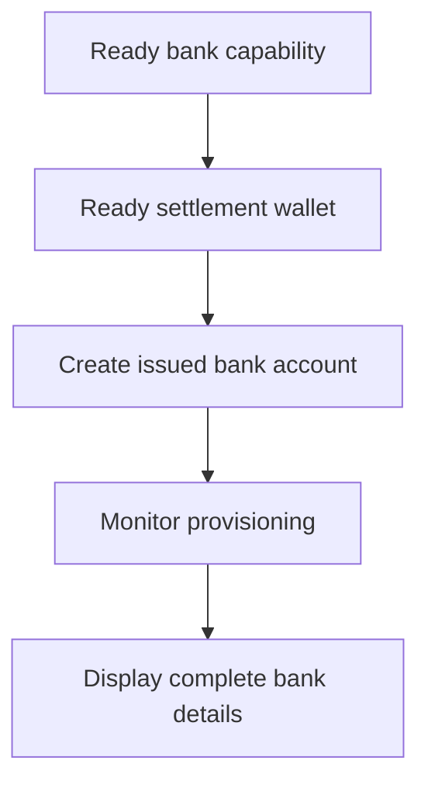

Usa un conto bancario emesso quando il cliente ha bisogno di coordinate bancarie riutilizzabili. Per istruzioni di finanziamento una tantum legate a un importo specifico, usa invece [Ricevi fondi](/it/integration/receive-funds).



## Prima di iniziare

Hai bisogno di un ID cliente, una capability bancaria ready per il metodo e la valuta desiderati e un wallet emesso ready di proprieta' dello stesso cliente. Completa il lavoro aperto tramite [Capability e task](/it/integration/onboarding/capabilities-and-requirements).

## 1. Crea o seleziona il wallet di regolamento

Crea un wallet emesso tramite [Conti e wallet](/it/integration/accounts#create-the-account), poi rileggilo. Prosegui solo quando il suo stato corrente consente il regolamento.

Salva il suo `data.id` derivato dalla risposta come `SETTLEMENT_WALLET_ID`. Non usare un wallet esterno per `settlement.accountId`.

## 2. Crea il conto bancario emesso

Usa [`POST /v3/customers/{customerId}/accounts`](/api-reference/accounts/post-v3-customers-by-customer-id-accounts) con questi header:

```http
X-API-Key: ${SWIPELUX_API_KEY}
Idempotency-Key: issued-bank-account-001
Content-Type: application/json
```

Invia questo body di richiesta:

```json
{
  "origin": "issued",
  "type": "bank",
  "method": "ach",
  "country": "US",
  "currency": "USD",
  "settlement": {
    "accountId": "${SETTLEMENT_WALLET_ID}"
  },
  "label": "USD account"
}
```

Salva il `data.id` restituito come `BANK_ACCOUNT_ID`. Conserva anche `data.status`, `data.openTaskIds`, `data.details` e la relazione di settlement.

L'ID del conto bancario e l'ID del wallet hanno ruoli diversi. Leggi il provisioning e i dettagli bancari tramite l'ID del conto bancario. Usa l'ID del wallet di settlement per identificare dove vengono accreditati i depositi.

## 3. Monitora il provisioning

Leggi [`GET /v3/customers/{customerId}/accounts/{accountId}`](/api-reference/accounts/get-v3-customers-by-customer-id-accounts-by-account-id) dopo la creazione e dopo ogni webhook rilevante.

Mantieni l'interfaccia cliente in stato pending finche' `details` e' assente. Se `openTaskIds` non e' vuoto, completa gli ultimi task e rileggi il conto. Non dedurre la readiness dal tempo trascorso.

Se l'ultimo `statusReason.code` e' `awaiting_assignment`, crea il primo pay-in per lo stesso cliente, capability e wallet di settlement tramite [Ricevi fondi](/it/integration/receive-funds), poi rileggi il conto bancario. Segui questo ramo solo quando il conto corrente lo richiede.

## 4. Presenta i dettagli bancari in sicurezza

Mostra solo i dettagli completi restituiti dall'ultima lettura del conto. Quando `details.referenceRequired` e' true, mostra l'esatto `details.reference` e rendilo copiabile. Quando e' false, non inventare un reference.

Questi dettagli bancari sono riutilizzabili. Non sostituirli con coordinate di finanziamento di un pay-in con quote, che appartengono solo a quel transfer.

Successivamente, aggiungi i [Webhook](/it/integration/webhooks) in modo che gli aggiornamenti di provisioning raggiungano la tua applicazione senza tenere il cliente su una schermata di polling.
