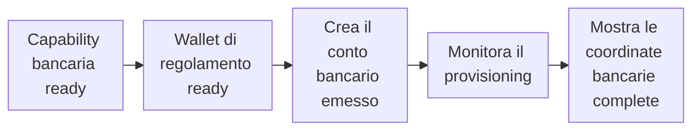

Usa un conto bancario emesso quando il cliente ha bisogno di coordinate bancarie riutilizzabili. Per istruzioni di finanziamento una tantum legate a un importo specifico, usa invece [Ricevi fondi](/it/integration/receive-funds).


```mermaid
%%{init: {"flowchart": {"rankSpacing": 20, "nodeSpacing": 16, "wrappingWidth": 80, "padding": 8}}}%%
flowchart LR
  A["Capability bancaria ready"] --> B["Wallet di regolamento ready"]
  B --> C["Crea il conto bancario emesso"]
  C --> D["Monitora il provisioning"]
  D --> E["Mostra le coordinate bancarie complete"]
```

## Prima di iniziare

Hai bisogno di un ID cliente, una capability bancaria ready per il metodo e la valuta desiderati e un wallet emesso ready di proprietà dello stesso cliente. Con `allowPending`, puoi salvare la richiesta mentre la banca selezionata sta ancora esaminando il cliente. Completa il lavoro aperto tramite [Capability e task](/it/integration/onboarding/capabilities-and-requirements).

## 1. Crea o seleziona il wallet di regolamento

Crea un wallet emesso tramite [Conti e wallet](/it/integration/accounts#create-the-account), poi rileggilo. Prosegui solo quando il suo stato corrente consente il regolamento.

Salva il suo `data.id` derivato dalla risposta come `SETTLEMENT_WALLET_ID`. Non usare un wallet esterno per `settlement.accountId`.

## 2. Crea il conto bancario emesso

Usa [`POST /v3/customers/{customerId}/accounts`](/api-reference/accounts/post-v3-customers-by-customer-id-accounts) con questi header:

```http Request headers
X-API-Key: ${SWIPELUX_API_KEY}
Idempotency-Key: issued-bank-account-001
Content-Type: application/json
```

Invia questo body di richiesta:

```json Request body
{
  "origin": "issued",
  "type": "bank",
  "method": "ach",
  "country": "US",
  "currency": "USD",
  "settlement": {
    "accountId": "${SETTLEMENT_WALLET_ID}"
  },
  "label": "USD account"
}
```

Salva il `data.id` restituito come `BANK_ACCOUNT_ID`. Conserva anche `data.status`, `data.openTaskIds`, `data.details` e la relazione di settlement.

Campi di richiesta opzionali:

| Campo | Si applica a | Comportamento |
| --- | --- | --- |
| `institution` | `ach`, `wire` e `swift` emessi | Seleziona esattamente questa banca. Swipelux non ripiega su un'altra banca. Usa un ID institution restituito dalla risposta delle capability supportate. |
| `allowPending` | `ach`, `wire` e `swift` emessi | Imposta su `true` per salvare la richiesta mentre la domanda presso la banca selezionata è in attesa di approvazione. Richiede `institution`. |
| `settlement.currency` | Conti bancari emessi | `USDC` o `USDT`. Imposta la stablecoin accreditata sul wallet di settlement. |

### Scegli la banca {#choose-the-bank}

Invia `institution` quando il cliente ha bisogno di coordinate bancarie di una banca specifica. Swipelux riserva un conto emesso per ogni combinazione di cliente, metodo, valuta e institution. Una richiesta senza `institution` restituisce `409 conflict` se il cliente ha già un conto emesso per quel metodo e quella valuta presso qualsiasi banca. Una richiesta con `institution` restituisce `409 conflict` solo se esiste già un conto per quella banca.

Le letture del conto restituiscono la banca selezionata come `institution` con `id`, `name` e `bic`. `bic` può essere `null`.

L'idempotenza si applica alla banca selezionata. Ripetere la stessa richiesta restituisce il conto originale. Cambiare `institution` con lo stesso `Idempotency-Key` restituisce `409 idempotency_conflict`.

### Salva la richiesta prima dell'approvazione della banca {#save-the-request-before-bank-approval}

Per impostazione predefinita, Swipelux accetta una richiesta di conto bancario emesso solo dopo che la capability bancaria è ready. Per raccogliere prima la configurazione del conto del cliente, invia `allowPending: true` insieme a `institution`:

```json Request body with allowPending
{
  "origin": "issued",
  "type": "bank",
  "method": "wire",
  "country": "US",
  "currency": "USD",
  "institution": "${INSTITUTION_ID}",
  "allowPending": true,
  "settlement": {
    "accountId": "${SETTLEMENT_WALLET_ID}"
  },
  "label": "USD wire account"
}
```

Mentre la domanda presso la banca è in revisione, il conto restituisce `status: "in_review"` con `statusReason.code` impostato su `waiting_for_approval`. La risposta include anche `applicationId` e gli `openTaskIds` della domanda. Completa questi task tramite [Capability e task](/it/integration/onboarding/capabilities-and-requirements).

La richiesta salvata mantiene l'ID del conto, il wallet di settlement e lo slot del conto. Quando la domanda e la capability sono ready, Swipelux esegue il provisioning delle coordinate bancarie sotto lo stesso `BANK_ACCOUNT_ID`. Continua a leggere quell'ID. Non creare un'altra richiesta.

Se la domanda viene prima rifiutata, annullata o archiviata, il conto diventa `rejected`. Non occupa più lo slot del conto.

### Scegli la valuta di settlement {#choose-the-settlement-currency}

Per impostazione predefinita, i depositi vengono regolati nella valuta del wallet di settlement. Imposta `settlement.currency` su `USDC` o `USDT` per scegliere l'asset accreditato indipendentemente dalla valuta del wallet:

```json Request body with settlement currency
{
  "settlement": {
    "accountId": "${SETTLEMENT_WALLET_ID}",
    "currency": "USDT"
  }
}
```

`USDT` richiede un conto `USD` e un wallet di settlement su un network che supporta l'accredito di USDT. In caso contrario, la richiesta restituisce `400 invalid_settlement_target`. Le letture del conto restituiscono la scelta salvata, anche mentre il conto è in provisioning.

L'ID del conto bancario e l'ID del wallet hanno ruoli diversi. Leggi il provisioning e i dettagli bancari tramite l'ID del conto bancario. Usa l'ID del wallet di settlement per identificare dove vengono accreditati i depositi.

## 3. Monitora il provisioning

Leggi [`GET /v3/customers/{customerId}/accounts/{accountId}`](/api-reference/accounts/get-v3-customers-by-customer-id-accounts-by-account-id) dopo la creazione e dopo ogni webhook rilevante.

Mantieni l'interfaccia cliente in stato pending finché `details` è assente. Se `openTaskIds` non è vuoto, completa gli ultimi task e rileggi il conto. Non dedurre la readiness dal tempo trascorso.

Se il conto è stato salvato con `allowPending: true`, resta `in_review` con `statusReason.code` impostato su `waiting_for_approval` finché la banca non approva la domanda.

Se l'ultimo `statusReason.code` è `awaiting_assignment`, crea il primo pay-in per lo stesso cliente, capability e wallet di settlement tramite [Ricevi fondi](/it/integration/receive-funds), poi rileggi il conto bancario. Segui questo ramo solo quando il conto corrente lo richiede.

## 4. Presenta i dettagli bancari in sicurezza

Mostra solo i dettagli completi restituiti dall'ultima lettura del conto. Quando `details.referenceRequired` è true, mostra l'esatto `details.reference` e rendilo copiabile. Quando è false, non inventare un reference.

Per i conti `swift` emessi, mostra `details.bankName`, `details.swiftCode` (il BIC della banca ricevente), `details.accountNumber`, `details.accountHolderName` e `details.accountHolderAddress` quando vengono restituiti. Chi invia i fondi deve copiare esattamente l'indirizzo del beneficiario nel bonifico internazionale. Mostra anche `details.bankAddress` e gli eventuali campi della banca intermediaria restituiti dal conto.

Questi dettagli bancari sono riutilizzabili. Non sostituirli con coordinate di finanziamento di un pay-in con quote, che appartengono solo a quel transfer.

Successivamente, aggiungi i [Webhook](/it/integration/webhooks) in modo che gli aggiornamenti di provisioning raggiungano la tua applicazione senza tenere il cliente su una schermata di polling.
