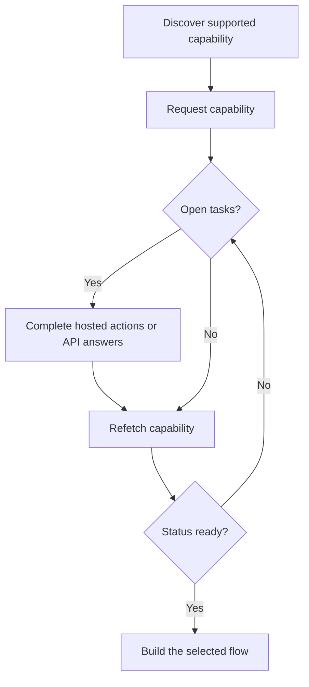

Una capability ti indica se un cliente puo' usare uno specifico risultato, metodo di pagamento e direzione. I task aperti indicano cosa deve accadere prima che quella capability o una risorsa correlata possa procedere.



```bash
export API_BASE='https://platform.swipelux.com'
export SWIPELUX_API_KEY='replace-with-your-api-key'
```

## Scopri le capability supportate

Leggi le opzioni correnti del cliente con [`GET /v3/customers/{customerId}/capabilities/supported`](/api-reference/capabilities/get-v3-customers-by-customer-id-capabilities-supported):

```bash
curl --request GET \
  "${API_BASE}/v3/customers/${CUSTOMER_ID}/capabilities/supported" \
  --header "X-API-Key: ${SWIPELUX_API_KEY}"
```

Scegli una voce della risposta che corrisponda a `directions`, `method` e `accountType` desiderati. Prosegui solo quando `availability` e' `available` o `beta` e `eligibility.eligible` e' `true`. Se vengono restituite `institutions`, seleziona solo un ID da quella risposta.

Salva il `data[].id` selezionato come `CAPABILITY_ID`. Non copiare mai un ID di capability da un altro cliente o ambiente.

### Tipi di conto pooled vs named

Le capability bancarie sono disponibili in due varianti, codificate nel campo `accountType` e nel suffisso dell'ID capability (ad esempio `ach_pooled`, `wire_named`):

- **`pooled`**: conto bancario Swipelux condiviso. Ogni pay-in usa un riferimento univoco per instradare i fondi. Scegli questa opzione per trasferimenti una tantum.
- **`named`**: coordinate bancarie dedicate al cliente (IBAN virtuale, conto ACH dedicato). Riutilizzabili e condivisibili con qualsiasi pagante. Richieste per i [conti bancari emessi](/it/integration/issue-bank-account).

Predefinito su `pooled`. Usa `named` solo quando il cliente ha bisogno di coordinate bancarie riutilizzabili. Controlla la risposta `supported` per vedere quali varianti sono disponibili.

## Richiedi la capability

Richiedi l'opzione selezionata con [`POST /v3/customers/{customerId}/capabilities/{capabilityId}`](/api-reference/capabilities/post-v3-customers-by-customer-id-capabilities-by-capability-id):

```bash
curl --request POST \
  "${API_BASE}/v3/customers/${CUSTOMER_ID}/capabilities/${CAPABILITY_ID}" \
  --header "X-API-Key: ${SWIPELUX_API_KEY}" \
  --header "Idempotency-Key: capability-request-001" \
  --header "Content-Type: application/json" \
  --data '{}'
```

Usa un array `institutions` esplicito solo quando devi scegliere tra gli ID restituiti dalla risposta supported-capability.

Salva `data.status` come `CAPABILITY_STATUS`, `data.openTaskIds` come `OPEN_TASK_IDS` e ogni `data.applications[].id` in `APPLICATION_IDS`.

## Completa i task correnti {#complete-current-tasks}

Elenca i task con [`GET /v3/customers/{customerId}/tasks`](/api-reference/tasks/list-customer-tasks), seleziona gli ID da `OPEN_TASK_IDS`, quindi leggi ciascun task corrente con [`GET /v3/customers/{customerId}/tasks/{taskId}`](/api-reference/tasks/get-customer-task):

```bash
curl --request GET \
  "${API_BASE}/v3/customers/${CUSTOMER_ID}/tasks/${TASK_ID}" \
  --header "X-API-Key: ${SWIPELUX_API_KEY}"
```

Usa gli ultimi `data.revision` e `data.requirements`. Rileggi il task immediatamente prima di inviare se uno dei due potrebbe essere cambiato.

### Azioni hosted

Quando il task restituisce `verificationSessions` o `tosSessions`, salva ogni `id` di sessione e l'`url` corrente. Invia il cliente all'URL restituito, poi rileggi il task. Queste sono azioni con scope di task, non un ciclo di vita separato di verifica cliente.

### Carica documenti {#upload-documents}

Quando un requisito richiede un documento, caricalo con [`POST /v3/customers/{customerId}/documents`](/api-reference/documents/post-v3-customers-by-customer-id-documents):

```bash
export DOCUMENT_PATH='/absolute/path/to/requested-document.pdf'

curl --request POST \
  "${API_BASE}/v3/customers/${CUSTOMER_ID}/documents" \
  --header "X-API-Key: ${SWIPELUX_API_KEY}" \
  --header "Idempotency-Key: customer-document-001" \
  --form "file=@${DOCUMENT_PATH}"
```

Salva il `data.id` restituito come `DOCUMENT_ID` prima di inviare la risposta che lo referenzia.

### Risposte via API

Invia un set completo di risposte per la revisione corrente con [`POST /v3/customers/{customerId}/tasks/{taskId}/submissions`](/api-reference/task-submissions/create-customer-task-submission):

```bash
curl --request POST \
  "${API_BASE}/v3/customers/${CUSTOMER_ID}/tasks/${TASK_ID}/submissions" \
  --header "X-API-Key: ${SWIPELUX_API_KEY}" \
  --header "Idempotency-Key: task-submission-001" \
  --header "Content-Type: application/json" \
  --data @- <<'JSON'
{
  "taskRevision": 3,
  "answers": [
    {
      "requirementId": "req_from_current_task",
      "answer": {
        "type": "text",
        "value": "Current answer"
      }
    }
  ]
}
JSON
```

Prendi ogni ID requisito e tipo di risposta dall'ultimo task. Se l'API segnala che il task e' cambiato, rileggilo e ricostruisci la submission dalla nuova revisione.

## Prosegui quando la capability e' ready

Rileggi la capability con [`GET /v3/customers/{customerId}/capabilities/{capabilityId}`](/api-reference/capabilities/get-v3-customers-by-customer-id-capabilities-by-capability-id):

```bash
curl --request GET \
  "${API_BASE}/v3/customers/${CUSTOMER_ID}/capabilities/${CAPABILITY_ID}" \
  --header "X-API-Key: ${SWIPELUX_API_KEY}"
```

Sostituisci lo status e gli ID task memorizzati con l'ultima risposta. Prosegui solo quando lo status corrente della capability consente il conto, quote o transfer che intendi creare.

Successivamente, scegli il percorso corrispondente in [Flussi comuni](/it/integration/common-flows).
