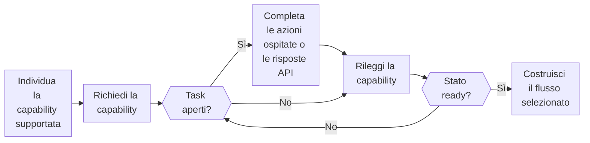

Una capability ti indica se un cliente può usare uno specifico risultato, metodo di pagamento e direzione. I task aperti indicano cosa deve accadere prima che quella capability o una risorsa correlata possa procedere.


```mermaid
%%{init: {"flowchart": {"rankSpacing": 20, "nodeSpacing": 16, "wrappingWidth": 80, "padding": 8}}}%%
flowchart LR
  A["Individua la capability supportata"] --> B["Richiedi la capability"]
  B --> C{{"Task aperti?"}}
  C -->|"Sì"| D["Completa le azioni ospitate o le risposte API"]
  D --> E["Rileggi la capability"]
  C -->|"No"| E
  E --> F{{"Stato ready?"}}
  F -->|"No"| C
  F -->|"Sì"| G["Costruisci il flusso selezionato"]
```

```bash Environment variables
export API_BASE='https://platform.swipelux.com'
export SWIPELUX_API_KEY='replace-with-your-api-key'
```

## Scopri le capability supportate

Leggi le opzioni correnti del cliente con [`GET /v3/customers/{customerId}/capabilities/supported`](/api-reference/capabilities/get-v3-customers-by-customer-id-capabilities-supported):

```bash List supported capabilities
curl --request GET \
  "${API_BASE}/v3/customers/${CUSTOMER_ID}/capabilities/supported" \
  --header "X-API-Key: ${SWIPELUX_API_KEY}"
```

Scegli una voce della risposta che corrisponda a `directions`, `method` e `accountType` desiderati. Prosegui solo quando `availability` è `available` o `beta` e `eligibility.eligible` è `true`. Se vengono restituite `institutions`, seleziona solo un ID da quella risposta.

Ogni voce di istituto include un `logoUrl` e un flag `isDefault`. Usa `logoUrl` per mostrare il logo della banca in un'interfaccia di selezione della banca, e mostra una tua icona bancaria generica quando è `null`. `isDefault` si applica solo a questo cliente e a questa capability, non all'istituto in generale. [`GET /v3/institutions`](/api-reference/institutions/get-v3-institutions) restituisce lo stesso `logoUrl` nullable. Gli ID degli istituti sono opachi, quindi gestisci i nuovi ID senza modifiche al codice.

```json Institution entry
{
  "institutions": [
    {
      "id": "jpmorgan",
      "name": "JPMorgan Chase",
      "bic": "CHASUS33",
      "logoUrl": "https://wallet.swipelux.com/bank-logos/jpmorgan.png",
      "countries": ["US"],
      "isDefault": true
    }
  ]
}
```

Salva il `data[].id` selezionato come `CAPABILITY_ID`. Non copiare mai un ID di capability da un altro cliente o ambiente.

### Tipi di conto pooled vs named

Le capability bancarie sono disponibili in due varianti, codificate nel campo `accountType` e nel suffisso dell'ID capability (ad esempio `ach_pooled`, `wire_named`):

- **`pooled`**: conto bancario Swipelux condiviso. Ogni pay-in usa un riferimento univoco per instradare i fondi. Scegli questa opzione per trasferimenti una tantum.
- **`named`**: coordinate bancarie dedicate al cliente (IBAN virtuale, conto ACH dedicato). Riutilizzabili e condivisibili con qualsiasi pagante. Richieste per i [conti bancari emessi](/it/integration/issue-bank-account).

Predefinito su `pooled`. Usa `named` solo quando il cliente ha bisogno di coordinate bancarie riutilizzabili. Controlla la risposta `supported` per vedere quali varianti sono disponibili.

Per ricevere depositi SWIFT o emettere coordinate bancarie SWIFT, usa `swift_named`. `swift_pooled` supporta solo i payout, quindi controlla le `directions` di ciascuna opzione nella risposta delle capability supportate. Un conto SWIFT named restituisce coordinate di ricezione riutilizzabili, inclusi il BIC della banca, un riferimento quando è richiesto e l'indirizzo del beneficiario quando la banca lo fornisce.

Per i conti ACH, Wire e SWIFT emessi, puoi scegliere una banca precisa con `institution` e salvare la richiesta di conto prima che la banca approvi il cliente. Consulta [Emetti un conto bancario](/it/integration/issue-bank-account#choose-the-bank).

## Richiedi la capability

Richiedi l'opzione selezionata con [`POST /v3/customers/{customerId}/capabilities/{capabilityId}`](/api-reference/capabilities/post-v3-customers-by-customer-id-capabilities-by-capability-id):

```bash Request capability
curl --request POST \
  "${API_BASE}/v3/customers/${CUSTOMER_ID}/capabilities/${CAPABILITY_ID}" \
  --header "X-API-Key: ${SWIPELUX_API_KEY}" \
  --header "Idempotency-Key: capability-request-001" \
  --header "Content-Type: application/json" \
  --data '{}'
```

Usa un array `institutions` esplicito solo quando devi scegliere tra gli ID restituiti dalla risposta supported-capability.

Salva `data.status` come `CAPABILITY_STATUS`, `data.accountProvisioning` come `ACCOUNT_PROVISIONING_STATUS`, `data.openTaskIds` come `OPEN_TASK_IDS` e ogni `data.applications[].id` in `APPLICATION_IDS`.

### Application condivise per banca {#shared-applications-per-bank}

Per le capability bancarie named, ogni cliente ha un solo caso di application per banca. Le capability pooled e di piattaforma usano casi senza banca. Swipelux condivide un caso tra tutte le capability compatibili che richiedi:

- Un'unica approvazione può coprire più capability. Ad esempio, un caso approvato presso una banca può rendere `ready` sia una capability ACH sia una wire.
- Una richiesta successiva che corrisponde a un caso esistente lo riutilizza. Swipelux non apre una seconda application e non aggiunge task duplicati.
- I casi presso banche diverse sono indipendenti. Un rifiuto presso una banca non influisce su un caso presso un'altra banca.

La risposta alla richiesta indica quale caso ha usato Swipelux:

- `201` significa che la richiesta ha aperto un nuovo caso di application.
- `200` significa che la richiesta si è risolta in un caso di application che il cliente aveva già, ad esempio una richiesta ripetuta per una capability bancaria che il cliente possiede già, o una richiesta per una capability annullata. Una richiesta ripetuta per `card` o `stablecoin_transfers` restituisce comunque [`409 capability_already_exists`](/integration/errors#capability-already-exists).
- `selectedApplicationId` è un campo di primo livello accanto a `data` con l'ID del caso che la richiesta ha selezionato o aperto. Swipelux lo omette quando la richiesta non ha selezionato alcun caso. Un replay idempotente restituisce lo stesso valore.

Risposta abbreviata:

```json Response (abbreviated)
{
  "data": {
    "id": "ach_named",
    "status": "pending",
    "openTaskIds": ["tsk_000000000000000002"],
    "applications": [{ "id": "apl_000000000000000005", "status": "in_review" }]
  },
  "selectedApplicationId": "apl_000000000000000005"
}
```

Per le capability named, invia di nuovo la stessa lista `institutions` per selezionare lo stesso caso, oppure invia un solo ID di istituto per puntare a quella banca. Una banca che ha rifiutato definitivamente il cliente viene saltata. Quando indichi solo quella banca, o tutte le banche idonee hanno rifiutato il cliente, la richiesta restituisce [`409 capability_terminally_rejected`](/integration/errors#capability-terminally-rejected). Per provare un'altra banca dopo un rifiuto, richiedi di nuovo la capability con l'ID di istituto di quella banca.

Lo status di una capability riflette tutti i casi correlati del cliente. Per una capability named, basta un caso `ready` la cui approvazione la copre per renderla `ready`, qualunque cosa riportino le altre banche. Una capability pooled attende anche il proprio controllo del metodo, riportato in `probes` nell'elenco delle application del cliente.

#### Elenca le application del cliente {#list-the-customers-applications}

Elenca tutti i casi di application del cliente con [`GET /v3/customers/{customerId}/applications`](/api-reference/capabilities/get-v3-customers-by-customer-id-applications). I risultati sono paginati con `nextCursor` e `hasMore`, e accettano `updatedAfter`:

```bash List applications
curl --request GET \
  "${API_BASE}/v3/customers/${CUSTOMER_ID}/applications" \
  --header "X-API-Key: ${SWIPELUX_API_KEY}"
```

Ogni voce include i campi dell'application restituiti in `applications[]` di una capability, più:

- `scope`: `named` per un caso presso una banca, `provider_pooled` o `platform` per casi senza banca, oppure `null` per un caso storico non classificato. `institution` è assente per i casi `provider_pooled` e `platform`.
- `requestedScope[]`: le chiavi di capability richieste sul caso, ciascuna con il suo primo `requestedAt`. Le voci non vengono mai rimosse.
- `coverage[]`: le chiavi di capability coperte dall'approvazione del caso, ciascuna con `grantedAt` e `source`. La copertura registra l'ambito, non l'autorizzazione. Leggi la capability per il suo status corrente.
- `probes[]`: controlli del metodo per le chiavi di capability pooled coperte dal caso, ciascuno con `capabilityKey`, `status` e `reason`. Le chiavi named non richiedono mai un probe.
- `generation`, `predecessorApplicationId` e `supersededByApplicationId`: collegamenti di successione. Quando `supersededByApplicationId` è impostato, il caso è stato sostituito. Segui quell'ID fino al caso corrente.

Risposta abbreviata:

```json Response (abbreviated)
{
  "data": [
    {
      "id": "apl_000000000000000005",
      "status": "ready",
      "scope": "named",
      "institution": { "id": "jpmorgan", "name": "JPMorgan Chase", "bic": "CHASUS33" },
      "requestedScope": [
        { "capabilityKey": "ach_named", "requestedAt": "2026-09-20T10:00:00.000Z" }
      ],
      "coverage": [
        { "capabilityKey": "ach_named", "grantedAt": "2026-09-22T12:00:00.000Z", "source": "approval" },
        { "capabilityKey": "wire_named", "grantedAt": "2026-09-22T12:00:00.000Z", "source": "approval" }
      ],
      "probes": [],
      "generation": 1,
      "predecessorApplicationId": null,
      "supersededByApplicationId": null
    }
  ],
  "nextCursor": null,
  "hasMore": false
}
```

## Completa i task correnti {#complete-current-tasks}

Elenca i task con [`GET /v3/customers/{customerId}/tasks`](/api-reference/tasks/list-customer-tasks), seleziona gli ID da `OPEN_TASK_IDS`, quindi leggi ciascun task corrente con [`GET /v3/customers/{customerId}/tasks/{taskId}`](/api-reference/tasks/get-customer-task):

```bash List open tasks
curl --request GET \
  "${API_BASE}/v3/customers/${CUSTOMER_ID}/tasks/${TASK_ID}" \
  --header "X-API-Key: ${SWIPELUX_API_KEY}"
```

Usa gli ultimi `data.revision` e `data.requirements`. Rileggi il task immediatamente prima di inviare se uno dei due potrebbe essere cambiato.

### Evidenze del profilo riutilizzate {#reused-profile-evidence}

Per i task di intake dell'application che accettano l'invio diretto via API, Swipelux riutilizza le informazioni che il cliente ha già fornito. Quando un task di questo tipo viene creato o riconciliato, Swipelux controlla il profilo del cliente e i documenti caricati dal cliente stesso. I requisiti idonei già supportati da un valore del profilo o da un documento utilizzabile passano a `in_review` invece di restare azionabili. Gli aggiornamenti del profilo e i nuovi caricamenti di documenti attivano lo stesso controllo per i task esistenti.

Restano azionabili solo i valori mancanti o incompatibili. Il riutilizzo non approva le evidenze. Swipelux le esamina comunque. Le richieste di correzione esplicite e i requisiti a cui si è già risposto restano azionabili. I documenti dei proprietari e dei related party non vengono riutilizzati, e i requisiti raccolti solo tramite una sessione hosted seguono il loro flusso normale.

### Visualizza i requisiti {#render-requirements}

Costruisci i form a partire dai metadati restituiti da ciascun requisito anziché dalle chiavi dei requisiti. Un requisito può includere un breve `title` opzionale, e ogni `request` include un `prompt` da mostrare sotto l'intestazione.

I requisiti con `request.type: "profile"` identificano il campo del profilo con `profilePointer` e aggiungono metadati di input:

- `allowedValues`: i valori consentiti per un campo scalare, o per ciascun elemento di un campo array. Invia questi valori, non le etichette di visualizzazione tradotte.
- `valueSchema`: un documento JSON Schema Draft 7 autonomo che descrive la forma dell'input, le proprietà annidate, i campi obbligatori e i vincoli strutturali. Gli enum sugli oggetti compaiono sulla proprietà pertinente, ad esempio `valueSchema.items.properties.type.enum` per gli identificativi fiscali. Swipelux applica comunque la validazione tra campi e di revisione dopo l'invio, quindi un valore che supera lo schema può comunque essere rifiutato.
- `valueType: "country"`, oppure `itemValueType: "country"` per gli array: il campo accetta codici ISO 3166-1 alpha-2 in maiuscolo. Le proprietà paese annidate in `valueSchema` usano `format: "iso-3166-1-alpha-2"`. Usa un elenco standard di paesi per le etichette localizzate.

```json Requirement
{
  "id": "req_000000000000000010",
  "key": "account_purposes",
  "title": "Account purpose",
  "status": "action_required",
  "request": {
    "type": "profile",
    "prompt": "Select every purpose that applies.",
    "required": true,
    "profilePointer": "/financialProfile/accountPurposes",
    "valueType": "array",
    "itemValueType": "string",
    "allowedValues": ["business_expenses", "ecommerce", "payroll"],
    "valueSchema": {
      "$schema": "http://json-schema.org/draft-07/schema#",
      "type": "array",
      "items": { "enum": ["business_expenses", "ecommerce", "payroll"] }
    }
  }
}
```

Questo esempio abbrevia il catalogo dei valori; l'API restituisce ogni valore consentito. Alcuni requisiti del profilo non hanno uno schema pubblicato e omettono `valueSchema` e `allowedValues`. Visualizzali a partire da `prompt` e `valueType`.

Ogni task aperto include un timestamp `dueAt`. Quando Swipelux crea un task senza una data di scadenza esplicita, `dueAt` è impostato per impostazione predefinita esattamente a 31 giorni dopo il `createdAt` del task. Considera `dueAt` come informativo: non puoi impostarlo tramite l'API e non attiva alcuna transizione automatica del ciclo di vita. Solo il campo separato `deadline`, quando presente, causa una transizione automatica.

### Azioni hosted

Nella risposta di dettaglio del task, ogni voce di `verificationSessions` e `tosSessions` include un oggetto `action`. Le risposte dell'elenco dei task non includono questi link di azione. Memorizza l'`id` di ogni sessione, quindi leggi `action.kind` prima di inoltrare il cliente; non dedurre la disponibilità del link dallo `status` della sessione.

- `action.kind: "available"` include `action.url` e `action.expiresAt` (attualmente sempre `null`). Memorizza `action.url`, invia lì il cliente e poi rileggi il task. I campi `url` e `expiresAt` a livello di sessione contengono gli stessi valori.
- `action.kind: "unavailable"` significa che non deve essere presentato alcun link. I campi `url` e `expiresAt` a livello di sessione sono assenti. Lo `status` di una sessione da solo non determina quale tipo di azione riceverai.

```json Verification session
{
  "data": {
    "verificationSessions": [
      {
        "id": "vfy_000000000000000003",
        "key": "identity_verification",
        "type": "identity_verification",
        "status": "action_required",
        "action": {
          "kind": "available",
          "url": "https://platform.swipelux.com/kyc/redirect/cus_000000000000000001/tsk_000000000000000002/vfy_000000000000000003",
          "expiresAt": null
        },
        "url": "https://platform.swipelux.com/kyc/redirect/cus_000000000000000001/tsk_000000000000000002/vfy_000000000000000003",
        "expiresAt": null
      }
    ],
    "tosSessions": [
      {
        "id": "vfy_000000000000000004",
        "key": "terms_of_service",
        "type": "terms_of_service",
        "status": "completed",
        "action": { "kind": "unavailable" }
      }
    ]
  }
}
```

Queste sono azioni con scope di task, non un ciclo di vita separato di verifica cliente.

### Carica documenti {#upload-documents}

Quando un requisito richiede un documento, caricalo con [`POST /v3/customers/{customerId}/documents`](/api-reference/documents/post-v3-customers-by-customer-id-documents):

```bash Upload document
export DOCUMENT_PATH='/absolute/path/to/requested-document.pdf'

curl --request POST \
  "${API_BASE}/v3/customers/${CUSTOMER_ID}/documents" \
  --header "X-API-Key: ${SWIPELUX_API_KEY}" \
  --header "Idempotency-Key: customer-document-001" \
  --form "file=@${DOCUMENT_PATH}"
```

Salva il `data.id` restituito come `DOCUMENT_ID` prima di inviare la risposta che lo referenzia.

Per recuperare in seguito un file memorizzato, chiama [`GET /v3/customers/{customerId}/documents/{documentId}/download`](/api-reference/documents/get-v3-customers-by-customer-id-documents-by-document-id-download). Swipelux restituisce un `url` che scarica il file come allegato e scade dopo un'ora. I documenti archiviati restituiscono `404`.

### Risposte via API

Invia un set completo di risposte per la revisione corrente con [`POST /v3/customers/{customerId}/tasks/{taskId}/submissions`](/api-reference/task-submissions/create-customer-task-submission):

```bash Submit task answers
curl --request POST \
  "${API_BASE}/v3/customers/${CUSTOMER_ID}/tasks/${TASK_ID}/submissions" \
  --header "X-API-Key: ${SWIPELUX_API_KEY}" \
  --header "Idempotency-Key: task-submission-001" \
  --header "Content-Type: application/json" \
  --data @- <<'JSON'
{
  "taskRevision": 3,
  "answers": [
    {
      "requirementId": "req_from_current_task",
      "answer": {
        "type": "text",
        "value": "Current answer"
      }
    }
  ]
}
JSON
```

Prendi ogni ID requisito e tipo di risposta dall'ultimo task. Se l'API segnala che il task è cambiato, rileggilo e ricostruisci la submission dalla nuova revisione.

### Prerequisito del beneficial owner per i business {#beneficial-owner-prerequisite-for-businesses}

Richiedere una capability business che necessita di evidenze di beneficial owner riesce anche quando il cliente non ha ancora un proprietario qualificante. La capability viene creata come `restricted` con `statusReason.code: tasks_due`, e il task di intake business richiede i fatti di ownership mancanti, inclusa la struttura di ownership.

Lo stesso task contiene un requisito `resource_reference` la cui richiesta include `qualification: "beneficial_owner"`:

```json Beneficial owner requirement
{
  "type": "resource_reference",
  "prompt": "Add or select a qualifying beneficial owner.",
  "required": true,
  "resourceType": "related_party",
  "qualification": "beneficial_owner"
}
```

Un related party si qualifica quando è un party `person` attivo dello stesso cliente con una percentuale di ownership fornita di almeno 25, oppure con `ownership.declared: true` e nessuna percentuale.

Il requisito è derivato dall'elenco corrente dei related party, quindi di solito non gli rispondi direttamente:

- Creare o aggiornare un related party qualificante soddisfa il requisito nella stessa rivalutazione e apre il lavoro su profilo e documenti di quel proprietario. Consulta [Aggiungi related party del business](/it/integration/onboarding/customers#add-business-related-parties).
- Puoi anche referenziare esplicitamente un party qualificante con una risposta `resource_reference` che contiene il suo `relatedPartyId`.
- Il requisito resta elencato nel task corrente dopo essere stato soddisfatto. Quando non resta aperto nessun altro obbligo, il task diventa `satisfied`.
- Archiviare l'ultimo party qualificante, o rimuovere i fatti che lo qualificavano, riapre il requisito, anche dopo che il task era `satisfied`.

## Prosegui quando la capability è ready

Rileggi la capability con [`GET /v3/customers/{customerId}/capabilities/{capabilityId}`](/api-reference/capabilities/get-v3-customers-by-customer-id-capabilities-by-capability-id):

```bash Refetch capability
curl --request GET \
  "${API_BASE}/v3/customers/${CUSTOMER_ID}/capabilities/${CAPABILITY_ID}" \
  --header "X-API-Key: ${SWIPELUX_API_KEY}"
```

Sostituisci lo status, lo status di account provisioning e gli ID task memorizzati con l'ultima risposta. Lo `status` della capability indica se l'abilitazione è approvata. Per una capability che emette un conto, `accountProvisioning` indica separatamente se quel conto è `not_started`, `in_progress`, `issued` o `failed`; una capability che non emette un conto restituisce `not_applicable`.

Prosegui solo quando lo status corrente della capability consente il conto, la quote o il transfer che intendi creare. Quando il flusso richiede un conto emesso, attendi anche che `accountProvisioning` diventi `issued`.

Successivamente, scegli il percorso corrispondente in [Flussi comuni](/it/integration/common-flows).
