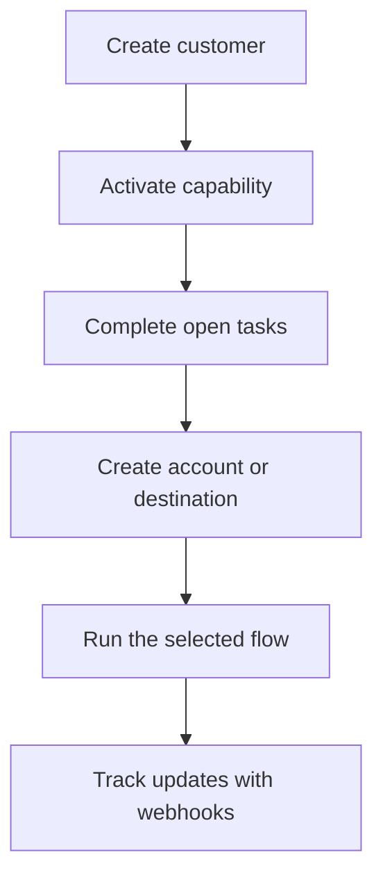

Swipelux fornisce al tuo backend i mattoni per effettuare l'onboarding dei clienti e movimentare denaro senza esporre l'infrastruttura di pagamento nel tuo prodotto.

## Cosa puoi costruire

<CardGroup cols={3}>
  <Card title="Ricevi fondi" icon="arrow-down-to-line" href="/it/integration/receive-funds">
    Crea istruzioni di finanziamento fiat una tantum e regola in stablecoin all'interno di un wallet.
  </Card>
  <Card title="Invia fondi" icon="arrow-up-from-line" href="/it/integration/send-funds">
    Invia da un wallet cliente verso un conto di prima parte o una destinazione di terze parti.
  </Card>
  <Card title="Emetti un conto bancario" icon="building-columns" href="/it/integration/issue-bank-account">
    Fornisci coordinate bancarie riutilizzabili collegate a un wallet di regolamento.
  </Card>
</CardGroup>

## Come funziona un'integrazione

Un cliente e' l'individuo o l'azienda che possiede il flusso. Le capability descrivono quali risultati quel cliente puo' utilizzare. I task aperti indicano cosa deve essere completato prima che la capability o la risorsa possa procedere.

## Guardalo in azione

Esplora [demo.swipelux.com](https://demo.swipelux.com) per provare un'esperienza neobank simulata. Puoi anche [clonare lo starter](https://github.com/swipelux/neobank-starter) e personalizzare la sua interfaccia di prodotto.

La demo e lo starter sono riferimenti di prodotto e UI. Non sostituiscono queste guide o il contratto API attuale.

## Inizia a costruire

<CardGroup cols={3}>
  <Card title="Quickstart" icon="rocket" href="/it/integration/quickstart">
    Crea un cliente ed esegui un flusso in sandbox.
  </Card>
  <Card title="Flussi comuni" icon="route" href="/it/integration/common-flows">
    Confronta la configurazione richiesta per ogni risultato.
  </Card>
  <Card title="API Reference" icon="code" href="/it/api-reference/introduction">
    Leggi le convenzioni delle richieste e ispeziona ogni operazione dell'API.
  </Card>
</CardGroup>
