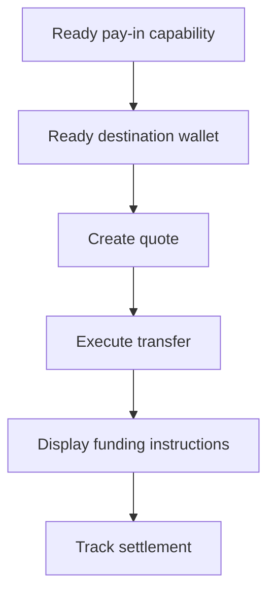

Usa un pay-in con quote quando il cliente deve finanziare un importo specifico. Il transfer regola in stablecoin su un wallet emesso.



## Prima di iniziare

Hai bisogno di una capability di pay-in ready e di un wallet emesso di destinazione ready per lo stesso cliente. Completa qualsiasi lavoro aperto tramite [Capability e task](/it/integration/onboarding/capabilities-and-requirements), quindi rileggi entrambe le risorse.

## 1. Crea un quote

Crea il prezzo con [`POST /v3/quotes`](/api-reference/money-movement/post-v3-quotes). Invia questi header:

```http
X-API-Key: ${SWIPELUX_API_KEY}
Idempotency-Key: payin-quote-001
Content-Type: application/json
```

```json
{
  "customerId": "${CUSTOMER_ID}",
  "capabilityId": "${CAPABILITY_ID}",
  "externalId": "payin-order-123",
  "in": {
    "amount": "150.00",
    "currency": "USD"
  },
  "destinationId": "${SETTLEMENT_WALLET_ID}",
  "out": {
    "currency": "USDC"
  }
}
```

Salva `data.id` come `QUOTE_ID`. Presenta gli importi e le fee restituiti invece di ricalcolarli dal tasso.

## 2. Esegui il quote

Esegui il quote corrente prima della scadenza con [`POST /v3/transfers`](/api-reference/money-movement/post-v3-transfers). Usa una nuova chiave per questo transfer previsto:

```http
X-API-Key: ${SWIPELUX_API_KEY}
Idempotency-Key: payin-transfer-001
Content-Type: application/json
```

```json
{
  "quoteId": "${QUOTE_ID}"
}
```

Salva il `data.id` del transfer come `TRANSFER_ID` e conserva il suo stato corrente.

## 3. Recupera le istruzioni di finanziamento

Leggi [`GET /v3/transfers/{transferId}/instructions`](/api-reference/money-movement/get-v3-transfers-by-transfer-id-instructions). Renderizza la variante di `data.instructions` restituita senza assumerne il tipo.

Questi dettagli sono specifici del transfer. Non riutilizzare mai le coordinate bancarie, il codice, l'URL hosted, l'importo, il reference o la scadenza di un transfer per un altro pay-in.

Per le istruzioni bancarie, quando `reference.required` e' true, mostra l'esatto `reference.value` accanto alle coordinate bancarie e rendilo copiabile. Mostra l'importo e la valuta restituiti dallo stesso set di istruzioni.

Un conto bancario emesso e' diverso: fornisce dettagli riutilizzabili per depositi futuri. Consulta [Emetti un conto bancario](/it/integration/issue-bank-account) quando quella e' l'esperienza desiderata.

## 4. Traccia il regolamento

Leggi [`GET /v3/transfers/{transferId}`](/api-reference/money-movement/get-v3-transfers-by-transfer-id) dopo l'esecuzione e dopo ogni evento. Guida lo stato visibile al cliente dal `data.state` piu' recente.

Usa `data.stateDetail` e `data.openTaskIds` quando il transfer necessita di un'altra azione. Non marcarlo come completo da una tempistica prevista.

Successivamente, aggiungi i [Webhook](/it/integration/webhooks) e mantieni sincronizzato lo stato del transfer finche' non raggiunge un risultato che il tuo prodotto gestisce.
