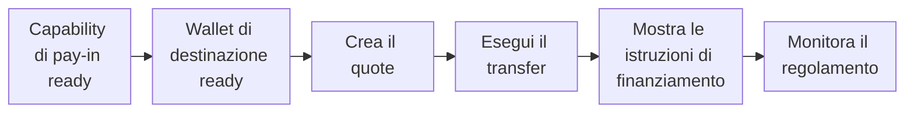

Usa un pay-in con quote quando il cliente deve finanziare un importo specifico. Il transfer regola in stablecoin su un wallet emesso.


```mermaid
%%{init: {"flowchart": {"rankSpacing": 20, "nodeSpacing": 16, "wrappingWidth": 80, "padding": 8}}}%%
flowchart LR
  A["Capability di pay-in ready"] --> B["Wallet di destinazione ready"]
  B --> C["Crea il quote"]
  C --> D["Esegui il transfer"]
  D --> E["Mostra le istruzioni di finanziamento"]
  E --> F["Monitora il regolamento"]
```

## Prima di iniziare

Hai bisogno di una capability di pay-in ready e di un wallet emesso di destinazione ready per lo stesso cliente. Completa qualsiasi lavoro aperto tramite [Capability e task](/it/integration/onboarding/capabilities-and-requirements), quindi rileggi entrambe le risorse.

Lo SWIFT pooled non supporta i pay-in. Per ricevere depositi SWIFT, emetti un conto SWIFT nominativo. Consulta [Emetti un conto bancario](/it/integration/issue-bank-account).

## 1. Crea un quote

Crea il prezzo con [`POST /v3/quotes`](/api-reference/money-movement/post-v3-quotes). Invia questi header:

```http Request headers
X-API-Key: ${SWIPELUX_API_KEY}
Idempotency-Key: payin-quote-001
Content-Type: application/json
```

```json Request body
{
  "customerId": "${CUSTOMER_ID}",
  "capabilityId": "${CAPABILITY_ID}",
  "externalId": "payin-order-123",
  "in": {
    "amount": "150.00",
    "currency": "USD"
  },
  "destinationId": "${SETTLEMENT_WALLET_ID}",
  "out": {
    "currency": "USDC"
  }
}
```

Salva `data.id` come `QUOTE_ID`. Presenta gli importi e le fee restituiti invece di ricalcolarli dal tasso.

### Importi minimi {#minimum-amounts}

I quote di pay-in bancario possono imporre un importo minimo, ad esempio 20.00 USD per il Wire pooled. `POST /v3/quotes` restituisce `422` [`amount_not_deliverable`](/integration/errors#amount-not-deliverable) quando l'importo è inferiore al minimo o troppo basso per coprire le fee di trasferimento.

## 2. Esegui il quote

Esegui il quote corrente prima della scadenza con [`POST /v3/transfers`](/api-reference/money-movement/post-v3-transfers). Usa una nuova chiave per questo transfer previsto:

```http Request headers
X-API-Key: ${SWIPELUX_API_KEY}
Idempotency-Key: payin-transfer-001
Content-Type: application/json
```

```json Request body
{
  "quoteId": "${QUOTE_ID}"
}
```

Salva il `data.id` del transfer come `TRANSFER_ID` e conserva il suo stato corrente.

### Aggiungi un URL di ritorno per carta e Apple Pay

Per un quote con carta o Apple Pay, puoi includere un `redirectUrl` opzionale nella stessa richiesta. Dopo che il cliente ha completato il checkout hosted, la pagina di checkout apre questo URL per riportare il cliente nella tua app.

```json Request body with redirectUrl
{
  "quoteId": "${QUOTE_ID}",
  "redirectUrl": "https://your-app.example/payments/complete"
}
```

`redirectUrl` deve essere un URL HTTPS assoluto di al massimo 2048 caratteri e non deve contenere credenziali incorporate. Inviare `redirectUrl` per un quote che non supporta la navigazione di ritorno fallisce la validazione invece di essere ignorato.

L'arrivo su `redirectUrl` è solo navigazione del browser. Non conferma che il pagamento o il transfer sia stato completato. Determina il completamento dallo stato del transfer nel passo 4 e dagli eventi webhook.

### Preseleziona il metodo di checkout per un quote con carta

Per un quote con carta, puoi includere un `checkoutMethod` opzionale nella stessa richiesta per scegliere con quale opzione di pagamento si apre il checkout hosted. I valori attuali sono `card`, `apple_pay`, `google_pay`, `cash_app`, `sepa` e `blik`. L'elenco è aperto e può crescere, quindi tollera i valori che non riconosci nelle letture del transfer. Il checkout si apre sul metodo richiesto quando è disponibile per il cliente e il suo dispositivo, e il cliente può comunque scegliere qualsiasi altro metodo offerto dal checkout. Omettilo per mantenere la preselezione predefinita.

```json Request body with checkoutMethod
{
  "quoteId": "${QUOTE_ID}",
  "checkoutMethod": "apple_pay"
}
```

`checkoutMethod` è una preferenza, non una garanzia. La disponibilità dipende dal cliente, dal suo dispositivo e dal checkout, quindi richiedere un metodo non lo rende disponibile. Qui `sepa` e `blik` sono opzioni di pagamento all'interno del checkout con carta, non capability, rail o conti Swipelux. La preselezione non modifica la capability, gli importi o le commissioni del quote, e il checkout conferma le commissioni finali. Le letture del transfer restituiscono il valore richiesto; non confermano quale metodo ha usato il cliente. Inviare `checkoutMethod` per un quote che non è un quote con carta fallisce la validazione invece di essere ignorato, e una ripetizione con la stessa chiave di idempotenza deve inviare lo stesso `checkoutMethod`.

## 3. Recupera le istruzioni di finanziamento

Leggi [`GET /v3/transfers/{transferId}/instructions`](/api-reference/money-movement/get-v3-transfers-by-transfer-id-instructions). Renderizza la variante di `data.instructions` restituita senza assumerne il tipo.

Questi dettagli sono specifici del transfer. Non riutilizzare mai le coordinate bancarie, il codice, l'URL hosted, l'importo, il reference o la scadenza di un transfer per un altro pay-in.

Per le istruzioni bancarie, quando `reference.required` è true, mostra l'esatto `reference.value` accanto alle coordinate bancarie e rendilo copiabile. Mostra l'importo e la valuta restituiti dallo stesso set di istruzioni.

Le istruzioni bancarie possono includere anche i campi opzionali `bankName`, `bankAddress`, `accountHolderName` e `accountHolderAddress`. Mostra ogni campo restituito accanto alle altre coordinate bancarie. Le banche mittenti spesso richiedono l'indirizzo della banca ricevente per `swift` e altri bonifici internazionali, quindi mostra `bankAddress` ogni volta che viene restituito.

```json Bank instructions
{
  "type": "bank",
  "method": "swift",
  "amount": { "amount": "150.00", "currency": "USD" },
  "accountHolderName": "Swipelux FBO Customer",
  "accountHolderAddress": "8 The Green, Dover, DE",
  "bankName": "JPMorgan Chase",
  "bankAddress": "383 Madison Avenue, New York, NY",
  "details": {
    "swiftCode": "CHASUS33",
    "accountNumber": "123456789"
  },
  "reference": { "value": "SWIFTMEMO1", "required": true }
}
```

Un conto bancario emesso è diverso: fornisce dettagli riutilizzabili per depositi futuri. Consulta [Emetti un conto bancario](/it/integration/issue-bank-account) quando quella è l'esperienza desiderata.

## 4. Traccia il regolamento

Leggi [`GET /v3/transfers/{transferId}`](/api-reference/money-movement/get-v3-transfers-by-transfer-id) dopo l'esecuzione e dopo ogni evento. Guida lo stato visibile al cliente dal `data.state` più recente.

Usa `data.stateDetail` e `data.openTaskIds` quando il transfer necessita di un'altra azione. Non marcarlo come completo da una tempistica prevista.

Successivamente, aggiungi i [Webhook](/it/integration/webhooks) e mantieni sincronizzato lo stato del transfer finché non raggiunge un risultato che il tuo prodotto gestisce.
