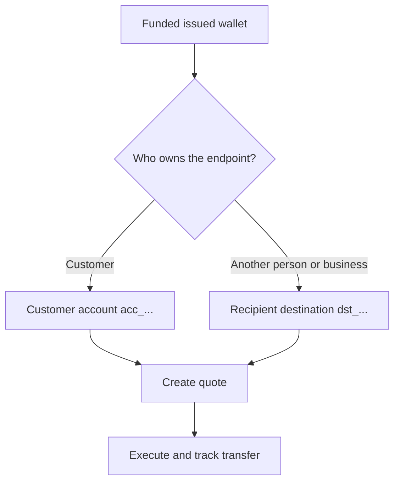

Ogni payout parte da un wallet emesso ready e finanziato. Il modello di destination dipende da chi possiede l'endpoint.



## Prima di iniziare

Rileggi il wallet sorgente. Conferma che il suo stato corrente consenta il payout e che il saldo disponibile copra l'importo sorgente previsto. Salva il suo ID derivato dalla risposta come `SOURCE_WALLET_ID`.

Hai bisogno anche di una capability di payout ready per il cliente corrente e la destination selezionata.

## 1. Prepara la destination

<Tabs>
  <Tab title="Prima parte">

Usa un conto bancario esterno di proprieta' del cliente quando il cliente possiede l'endpoint. Crealo con [`POST /v3/customers/{customerId}/accounts`](/api-reference/accounts/post-v3-customers-by-customer-id-accounts) e questi header:

```http
X-API-Key: ${SWIPELUX_API_KEY}
Idempotency-Key: payout-account-001
Content-Type: application/json
```

```json
{
  "origin": "external",
  "type": "bank",
  "methods": ["ach", "wire"],
  "country": "US",
  "currency": "USD",
  "details": {
    "routingNumber": "021000021",
    "accountNumber": "123456789",
    "accountType": "checking",
    "bankName": "Example Bank",
    "accountHolderName": "Acme Payments SAS"
  },
  "label": "Customer operating account"
}
```

Leggilo con [`GET /v3/customers/{customerId}/accounts/{accountId}`](/api-reference/accounts/get-v3-customers-by-customer-id-accounts-by-account-id). Prosegui solo quando il suo stato corrente consente il payout. Salva il suo ID `acc_` come `PAYOUT_DESTINATION_ID`.

  </Tab>
  <Tab title="Terze parti">

Crea la persona o il business e il loro endpoint bancario o wallet tramite [Recipient e destination](/it/integration/recipients). Prosegui solo quando la destination e' ready.

Salva l'ID `dst_` restituito come `PAYOUT_DESTINATION_ID`. Non usare l'ID `rcp_` del recipient come destination del quote.

  </Tab>
</Tabs>

## 2. Crea il quote di payout

Usa [`POST /v3/quotes`](/api-reference/money-movement/post-v3-quotes) con questi header:

```http
X-API-Key: ${SWIPELUX_API_KEY}
Idempotency-Key: payout-quote-001
Content-Type: application/json
```

```json
{
  "customerId": "${CUSTOMER_ID}",
  "capabilityId": "${CAPABILITY_ID}",
  "in": {
    "amount": "150.00",
    "currency": "USDC",
    "accountId": "${SOURCE_WALLET_ID}"
  },
  "destinationId": "${PAYOUT_DESTINATION_ID}",
  "out": {
    "currency": "USD"
  }
}
```

Salva `data.id` come `QUOTE_ID` e presenta prezzo e fee restituiti.

## 3. Esegui il payout

Crea il transfer con [`POST /v3/transfers`](/api-reference/money-movement/post-v3-transfers). Usa una nuova chiave per questa esecuzione prevista:

```http
X-API-Key: ${SWIPELUX_API_KEY}
Idempotency-Key: payout-transfer-001
Content-Type: application/json
```

```json
{
  "quoteId": "${QUOTE_ID}"
}
```

Salva il `data.id` del transfer come `TRANSFER_ID`. Una creazione riuscita avvia il payout; non prova la consegna.

## 4. Traccia la consegna

Leggi [`GET /v3/transfers/{transferId}`](/api-reference/money-movement/get-v3-transfers-by-transfer-id) dopo la creazione e dopo ogni evento. Usa gli ultimi `data.state`, `data.stateDetail` e `data.openTaskIds` per decidere se attendere, agire o mostrare un risultato terminale.

Successivamente, consulta [Quote e transfer](/it/integration/quotes-and-transfers) per gli importi esatti, il recovery sicuro dell'esecuzione e i task del transfer.
