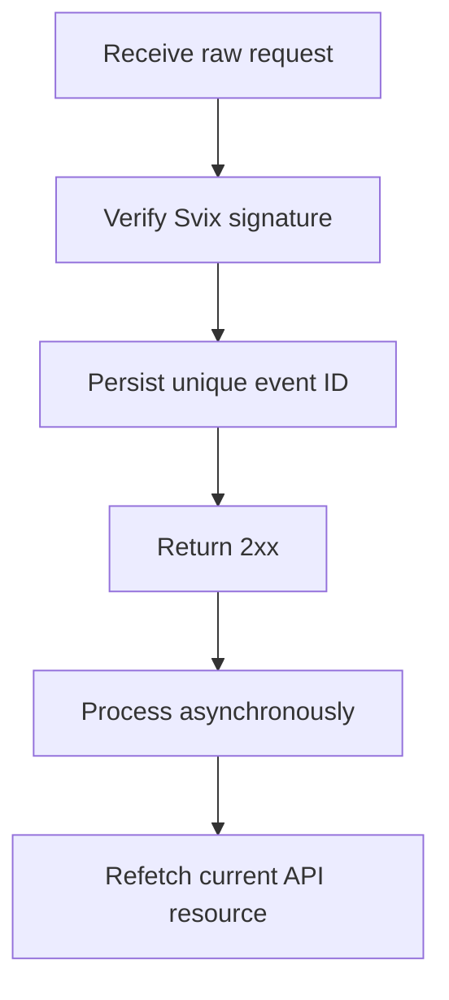

Usa i webhook per reagire ai cambiamenti asincroni. La consegna e' at-least-once, quindi eventi duplicati, in ritardo e fuori ordine sono normali.



## Registra solo gli eventi di cui hai bisogno

Crea un endpoint con [`POST /v3/webhooks`](/api-reference/webhooks/post-v3-webhooks). Iscriviti solo agli eventi documentati che guidano la tua integrazione. Questo esempio usa [`transfer.state_changed`](/api-reference/webhooks/transfer-state-changed).

```bash
export API_BASE='https://platform.swipelux.com'
export SWIPELUX_API_KEY='replace-with-your-api-key'

curl --request POST \
  "${API_BASE}/v3/webhooks" \
  --header "X-API-Key: ${SWIPELUX_API_KEY}" \
  --header "Idempotency-Key: webhook-endpoint-001" \
  --header "Content-Type: application/json" \
  --data @- <<'JSON'
{
  "url": "https://example.com/webhooks/swipelux",
  "events": ["transfer.state_changed"]
}
JSON
```

Salva il `data.id` della risposta come `WEBHOOK_ID`. Apri il portale restituito da [`GET /v3/webhooks/portal`](/api-reference/webhooks/get-v3-webhooks-portal), recupera il signing secret di questo endpoint e conservalo separatamente dalla chiave API in un secret manager.

## Verifica prima di parsare

Swipelux consegna le nuove integrazioni webhook tramite Svix. Verifica il body grezzo della richiesta con il signing secret dell'endpoint e questi header:

- `svix-id`
- `svix-timestamp`
- `svix-signature`

Non parsare JSON o causare side effect prima che la verifica abbia successo.

```javascript
import { Webhook } from "svix";

const verifier = new Webhook(process.env.SWIPELUX_WEBHOOK_SECRET);

export async function handleSwipeluxWebhook(request) {
  const rawBody = await request.text();
  const event = verifier.verify(rawBody, {
    "svix-id": request.headers.get("svix-id"),
    "svix-timestamp": request.headers.get("svix-timestamp"),
    "svix-signature": request.headers.get("svix-signature"),
  });

  await webhookInbox.insertIfAbsent({
    id: event.id,
    payload: event,
    status: "pending",
  });

  return new Response(null, { status: 204 });
}
```

Rifiuta le richieste con firme mancanti o non valide. Mantieni disponibile il body grezzo finche' la verifica non e' completa.

## Persisti, conferma e poi processa

Imposta un vincolo di univocita' sull'`id` dell'envelope. Persisti l'envelope verificato, restituisci `2xx` prontamente, poi processalo in modo asincrono.

Se l'ID evento esiste gia', conferma la consegna senza ripetere side effect gia' completati. Riprendi il lavoro locale pending o fallito tramite la tua coda di retry. Non usare il campo `attempt` dell'envelope come chiave di deduplicazione o come contatore di retry di trasporto.

## Rileggi lo stato corrente

L'ordine dei webhook non e' una cronologia autorevole della risorsa. Usa `resource.type` e `resource.id` per localizzare l'oggetto, poi recupera il suo stato corrente prima di aggiornare il tuo sistema.

Per un evento di transfer, chiama [`GET /v3/transfers/{transferId}`](/api-reference/money-movement/get-v3-transfers-by-transfer-id):

```bash
curl --request GET \
  "${API_BASE}/v3/transfers/${TRANSFER_ID}" \
  --header "X-API-Key: ${SWIPELUX_API_KEY}"
```

Guida lo stato visibile al cliente e le azioni downstream dalla risposta API corrente. Progetta i side effect in modo che restino sicuri se due worker processano eventi correlati in ordine diverso.

## Recupera le consegne

Usa [`GET /v3/webhooks/portal`](/api-reference/webhooks/get-v3-webhooks-portal) per aprire i log di consegna, ritentare consegne fallite o avviare un replay manuale.

Ogni replay deve passare per la stessa verifica di firma e per la stessa inbox durevole. Per recuperare dopo un downtime, ripeti la finestra interessata e rileggi ogni risorsa referenziata. Gli ID evento completati restano no-op; i record incompleti riprendono in modo asincrono.

Successivamente, verifica in sandbox le consegne duplicate e fuori ordine, poi completa la checklist [Go live](/it/integration/go-live).
