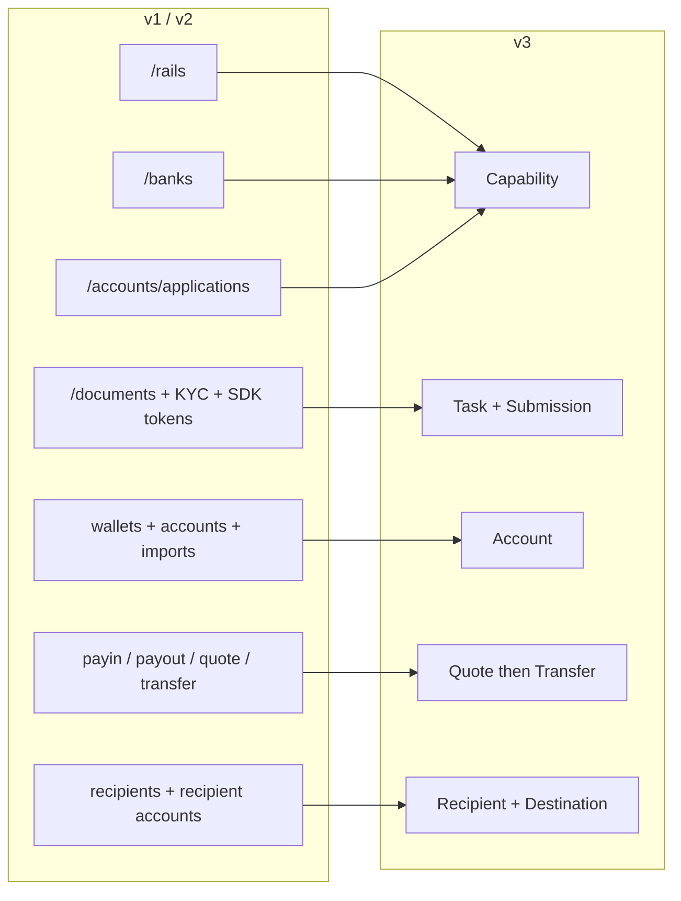
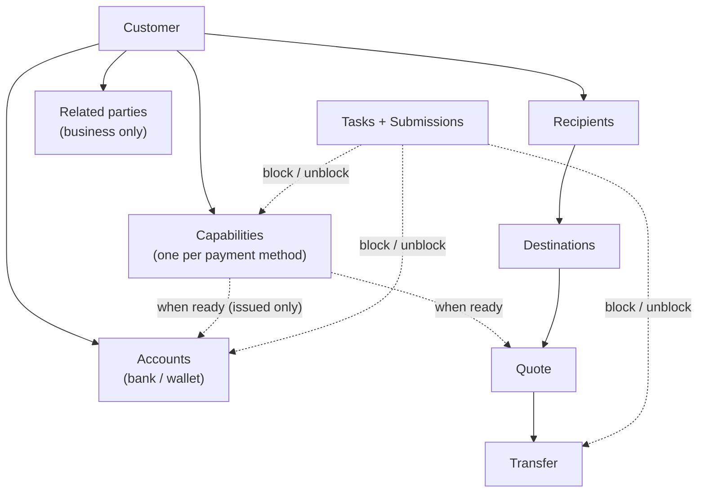
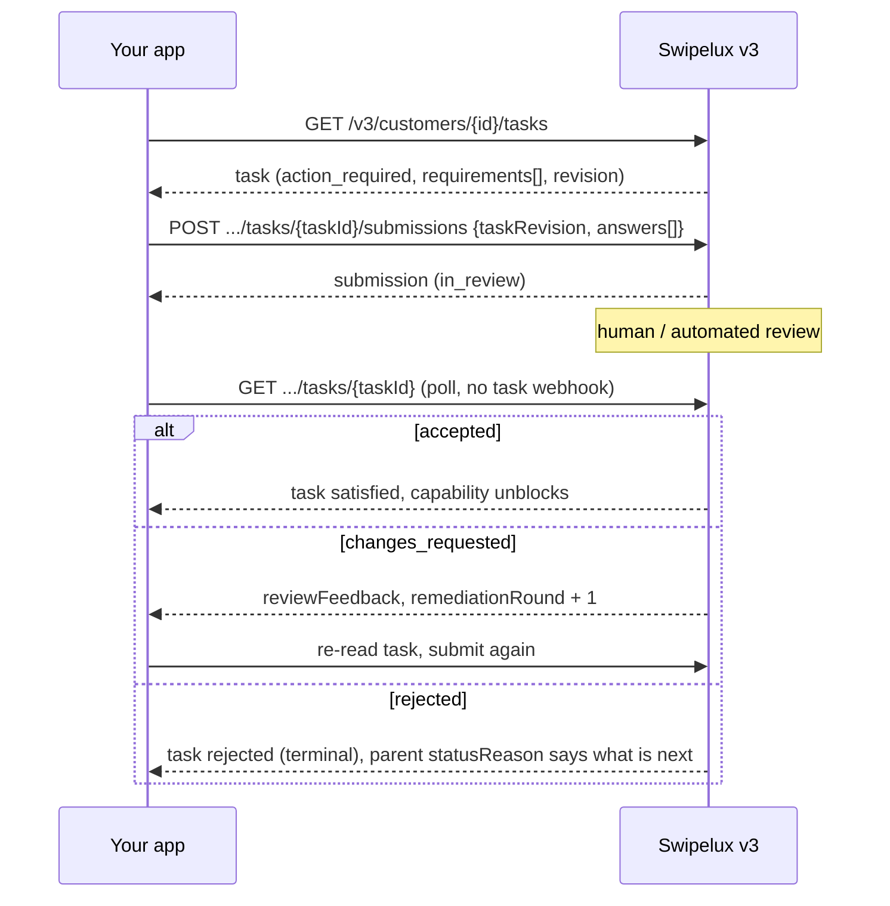
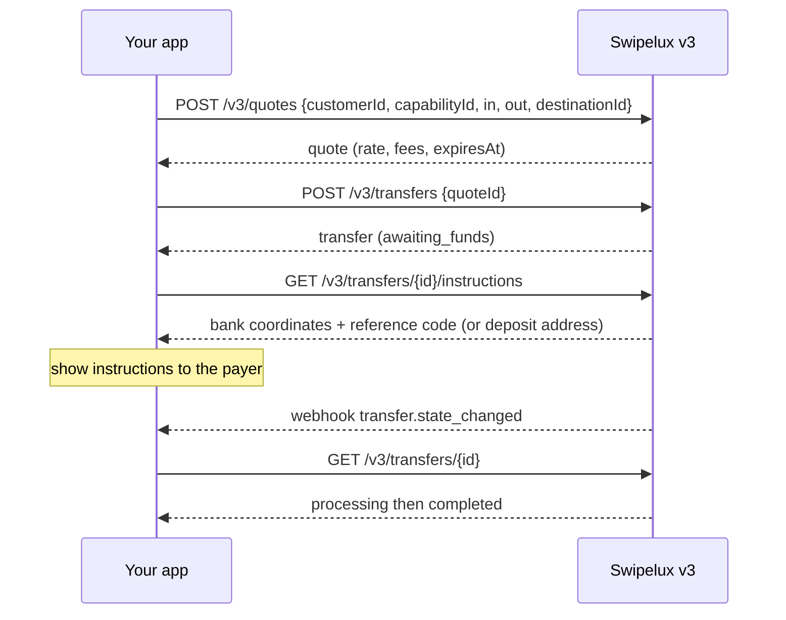
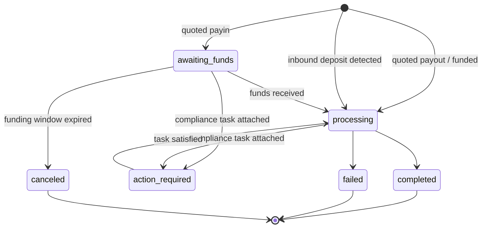
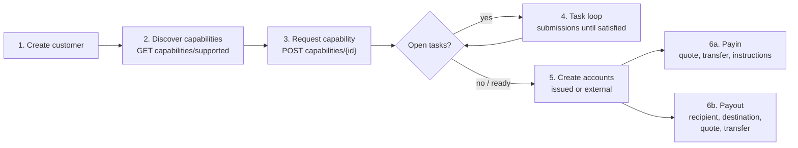

インテグレーションを API v1 および v2 から v3 へ移行するには、次の 2 つのパスで進めます。

- **パート 1、コンセプト。** まずこちらをお読みください。v3 はリネームではなくリモデルです。古いエンドポイントを 1 対 1 でマッピングしようとすると API と衝突します。ここで 10 分費やせば、後日数日を節約できます。
- **パート 2、API。** エンドポイントごとのマッピング、リクエスト例、状態機械、そして移行チェックリスト。

本番の OpenAPI 仕様 ([platform.swipelux.com/openapi.json](https://platform.swipelux.com/openapi.json)) に基づいています。v1 と v2 は引き続き稼働中で、まだ非推奨にはなっていません。ただし、capability、recipient、task、および見積もりに関する新機能はすべて v3 でのみ提供されます。廃止のお知らせを受け取るには、`api.deprecation` webhook イベントを購読してください。

<Info>
  **目次。** パート 1: 1.1 v3 が存在する理由、1.2 オブジェクトモデル、1.3 capability ごとの準備状態、1.4 task ループ、1.5 資金移動、1.6 状態機械、1.7 規約、1.8 ゴールデンパス。パート 2: 2.1 customer、2.2 capability、2.3 task と submission、2.4 account、2.5 recipient と destination、2.6 quote と transfer、2.7 webhook、2.8 サンドボックス、2.9 レガシーエンドポイント、2.10 移行順序、2.11 落とし穴チェックリスト。
</Info>

---

## パート 1、コンセプト

### 1.1 v3 が存在する理由

v1 と v2 では、顧客を支払い可能な状態にするための重複した手段が 4 通り育ってしまいました。`/rails`、`/banks`、`/accounts/applications`、そしてビジネス向けの `rail-applications` サーフェスで、それぞれ独自のステータス語彙を持っていました。書類収集 (`/documents`、KYC インポート、検証 SDK トークン) は、実際にブロックを解除する対象と切り離されていました。v3 では、これらすべてを 6 つのリソースに集約します。顧客と、顧客が所有する 5 つのものです。



| リソース | 1 行の定義 |
| --- | --- |
| **Customer** | 個人または法人。**公開のステータスフィールドを持たず**、準備状態は capability に存在します。 |
| **Capability** | 顧客が利用できる 1 つの支払い方法 (`sepa`、`ach`、`swift`、`stablecoin_transfers` など) で、独自のステータスを持ちます。`/rails`、`/banks`、およびアカウント申請のエントリポイントを置き換えます。 |
| **Task** | Swipelux が必要とする作業単位 (データ、書類、検証) で、**Submission** で回答します。書類および KYC サーフェスを置き換えます。 |
| **Account** | 顧客が所有する資金移動のエンドポイント。`bank` または `wallet`、Swipelux による `issued` または `external` です。 |
| **Recipient / Destination** | 支払い受取人 (誰) と、そのバンクまたはウォレットのエンドポイント (どこ) です。 |
| **Quote / Transfer** | すべての資金移動。transfer は永続化された quote を実行します。quote なしの transfer は廃止されました。 |

### 1.2 オブジェクトモデル



内在化すべき構造上のルールが 2 つあります。

1. **Capability がすべてを制御します。** account は `ready` の capability の下でプロビジョニングされ、quote は capability に対して価格設定されます。オンボーディングとは、必要な capability を `ready` にすることです。
2. **Task はどこにでも付随します。** capability、account、実行中の transfer はいずれも `openTaskIds` を保持できます。どこで見つけても、ループは同じです。task を読み、回答を送信し、レビューを待ち、親を再読み込みします。

### 1.3 準備状態は顧客単位ではなく capability 単位

v1 では `/rails` の準備状態が顧客全体の KYC ゲートと絡み合っていました。v3 には顧客ステータスがありません。`sepa` capability にまだオープンな task が残っている状態でも、`stablecoin_transfers` では顧客が完全に利用可能ということもあり得ます。プール型 account の capability は、名前付きのものより一般的に早く `ready` に到達するため、すべてを待つのではなく、`ready` になったものから取引を開始してください。

v1 または v2 のコードが顧客の検証ステータスに基づいて UI バッジを表示している場合は、次のように書き換えてください。

- 「X で取引できるか?」は、capability X の `status == "ready"` となります。
- 「顧客側で何か対応が必要か?」は、ステータス `action_required` の task が存在するかどうか (通常、capability は `restricted` かつ `statusReason.resolution: "complete_tasks"` を示します) となります。
- 「Swipelux 側の対応待ちか?」は、task が `in_review`、capability が `pending` となります。

### 1.4 Task ループ

旧書類および KYC サーフェスが行っていたことは、すべて次の 1 つのループになります。



主要な性質:

- task は `requirements[]` を保持し、それぞれが個別の依頼です。各要件には task 内での `requirementId`、依頼内容を示す安定的な `key` (例えば住所証明。UI ではこれで重複排除してください)、および期待される入力を正確に記述した型付きの `request` (テキスト、日付、選択、書類、宣誓など) があります。
- 送信は **レビューによって制御されます**。送信自体は capability や account の状態を直接変更することはなく、受理された時点で変更されます。1 つ例外として、`profile` の回答は送信時に顧客プロフィールへ書き込まれます (2.3)。送信後は、task または親リソースをポーリングしてください。
- `taskRevision` (task の `revision` のエコー) は並行制御のガードです。読み取り後に task が変更されていた場合は、再読み込みして回答を再構築してください。
- `absence` は 1 級の回答 (「これを持っていない理由は…」) です。要件を未回答のまま残さず、これを使用してください。

### 1.5 資金移動

payin、payout、およびステーブルコイン移動のためのフローは 1 つです。**方向を指定する入力はありません**。payin か payout かを宣言することは決してありません。入出力の通貨の形状から、quote と transfer に読み取り専用の `direction` が導出されます。`fiat_to_stablecoin` (payin)、`stablecoin_to_fiat` (payout)、または `stablecoin_move` です。



### 1.6 リソースごとに 1 つの状態機械

ステータスを持つすべてのリソースには独自の列挙型があり、正常でないすべてのステータスには構造化された理由が付随します。Account、application、および transfer は `{ code, message, actor, retryable }` の形状を共有します。account と application はこれを `statusReason` として、transfer は `stateDetail` として公開します。`actor` は誰が対応しなければならないかを示し (`customer`、`developer`、`provider`、`network`、`swipelux`)、`retryable` は再試行が有効かどうかを示します。Capability は `{ code, resolution, message }` を使用し、`resolution` (`complete_tasks`、`wait`、`contact_support`、`none`) は capability を先に進めるものを示します。`code` の値はオープンで追記のみのカタログです。`resolution` (または `actor` と `retryable`) で分岐し、見たことのないコードにも耐えられるようにしてください。

| リソース | 状態 |
| --- | --- |
| Capability | `pending`、`restricted`、`ready`、`rejected`、`canceled` |
| Application (capability 下のリクエストごとの試行、2.2) | `requested`、`in_review`、`action_required`、`ready`、`rejected`、`disabled`、`canceled` |
| Task | `action_required`、`in_review`、`satisfied`、`rejected`、`canceled` |
| Submission | `in_review`、`accepted`、`changes_requested`、`rejected` |
| Account | `provisioning`、`in_review`、`ready`、`action_required`、`suspended`、`rejected`、`archived` |
| Quote | `active`、`executed`、`expired`、`failed` |
| Transfer | `awaiting_funds`、`processing`、`action_required`、`completed`、`failed`、`canceled` |
| Recipient | `active`、`rejected`、`archived` |
| Destination | `in_review`、`ready`、`action_required`、`archived` |

このガイドでは扱わない状態 (`rejected`、`suspended`、`disabled`、`failed`、`canceled`) は終端状態またはサポート主導のものです。リソースごとの定義は仕様に記載されています。

Transfer を詳しく図示すると:



### 1.7 規約

| 領域 | v1 / v2 | v3 |
| --- | --- | --- |
| 認証 | `X-API-Key` ヘッダー | 同じ。環境 (本番 vs サンドボックス) はキーで選択されます。ベース URL は 1 つ。 |
| 冪等性 | 強制されない | `Idempotency-Key` ヘッダーは **すべての作用のあるリクエスト (POST、PATCH、PUT、DELETE) で必須**、サンドボックスのエンドポイントは除外。同じキーかつ同じボディなら元のレスポンスがリプレイされます。 |
| 金額 | 数値と文字列が混在 | 文字列のみ (`"amount": "150.00"`)。浮動小数点は不可。 |
| ページネーション | offset/limit のバリアント | カーソル。リストは `{ data, nextCursor, hasMore }` を返します。 |
| 更新 | PUT が多い | `PATCH` による部分更新。 |
| Webhook | 単一エンドポイント設定 | 複数のエンドポイント、イベントごとの購読。イベントは **ヒント**、真実は読み取り (2.7)。 |

コードを書く前に内在化すべき冪等性のルール:

- **異なる** ボディでキーを再利用すると、キーが保持されている間 (少なくとも 7 日間) は `409 idempotency_conflict` となるため、キーの再利用を計画しないでください。論理的な操作ごとに新しい UUID を生成し、ジョブと共に永続化してください。
- リプレイはエラーもカバーします。元のリクエストが終端の 4xx で終わった場合、同じキーとボディは同じ問題レスポンスを再度返します。
- 同じキーでの並行 2 リクエスト: 一方が勝ち、他方は `409` を受け取ります。勝者が確定した後に敗者を再試行してください。リプレイは元のレスポンスを返します。

### 1.8 ゴールデンパス



---

## パート 2、API

### 2.1 Customer

| v1 / v2 | v3 |
| --- | --- |
| `POST /v1/customers`、`POST /v1/customers/business`、`POST /v2/customers` | `POST /v3/customers` (単一エンドポイント、`type: individual \| business`) |
| `GET/PUT/DELETE /v1/customers/{id}`、`/v1/customers/business/{id}`、`/v2/customers/{customerId}` | `GET/PATCH/DELETE /v3/customers/{customerId}` |
| `GET /v1/customers` (一覧) | `GET /v3/customers` (カーソルページング、capability サマリを埋め込み) |
| `GET /v1/customers/balances` (バッチ)、`GET /v1/customers/{id}/balances` | 残高エンドポイントはなく、残高は account に存在します。`GET /v3/customers/{customerId}/accounts` の `balances` を読み取ってください。 |
| `POST/GET .../shareholders` (v1 ビジネス) | `POST/GET /v3/customers/{customerId}/related-parties` (加えて `GET/PATCH/DELETE .../related-parties/{relatedPartyId}`) |
| `POST /v1/customers/business/{id}/kyb` (送信)、`GET .../kyb` (ステータス) | KYB 送信呼び出しはなく、capability を要求し (2.2)、その task に回答します (2.3)。判定は capability と task の状態として表面化します。 |
| `POST /v1/customers/{id}/kyc`、`.../kyc/import`、SDK トークンエンドポイント | Task システム (2.3)。ホスト型検証は task 内の `verificationSessions` として表れます。 |

作成、`type` で判別 (フィールド名は仕様に基づく、値は例示):

```jsonc
// POST /v3/customers        Idempotency-Key: <fresh uuid>
{
  "type": "individual",
  "externalId": "user-1042",
  "individual": {
    "firstName": "Maria",
    "lastName": "Silva",
    "birthDate": "1990-04-12",
    "nationalities": ["BR"],
    "residenceCountry": "BR",
    "email": "maria@example.com",
    "residentialAddress": {
      "streetLine1": "Av. Paulista 1000",
      "city": "Sao Paulo",
      "postalCode": "01310-100",
      "country": "BR"
    }
  },
  "financialProfile": {
    "accountPurposes": ["cross_border_remittance"],
    "sourcesOfFunds": ["salary"]
  }
}
```

- **作成は段階的です**。`{ "type": "individual" }` だけでも有効な作成です。事実が欠けていても customer が無効になることはなく、それらは後で、必要とする capability 上の intake task として表面化します。
- ビジネスは `business` と登録データを保持します。v1 の株主 CRUD は **related parties** にマッピングされ、取締役、役員、所有者を含むように拡張されました。customer 作成時にインラインで作成する (それぞれ安定した `rp_` id が付与されます) か、専用の related-parties エンドポイントで管理します。
- **customer に `status` フィールドはありません** (1.3 を参照)。
- **既存の customer は引き継がれます**。v1 または v2 で作成された customer は v3 エンドポイントでも同じ id でアドレス指定できます。v3 の読み取りは _サニタイズされたビュー_ で、v3 のバリデーションで失敗するレガシー値は返されません。**最初の v3 書き込み後、そのビューは永続化されます**。欠けている値はひとりでには戻りません。したがって早めにデータを充実させ、v3 読み取りに頼る前に、独自レコードから完全なプロフィールを `PATCH` する 1 回限りのパスを予定してください。v1 の `metadata` は別の名前空間であり、**引き継がれません**。v3 で再設定してください。
- `externalId` は 1 級であり、v3 では環境ごとに **customer 間で一意** です (`409 duplicate_external_id`)。customer をアーカイブしても `externalId` は解放されません。再利用したい場合は、DELETE の前に PATCH でクリアしてください。
- `DELETE` は **アーカイブのカスケード** です (復元不可、id は決して再利用されません)。アーカイブされていない account や実行中の transfer が存在する間は、`409 customer_has_active_resources` と `blockingResources[]` でブロックされます。
- PATCH マージのルール: 明示的な `null` は nullable フィールドをクリア、配列は完全に置き換え (インラインの related parties は例外で、id により upsert)、`metadata` のキーはマージされます。完全なスキーマと一覧フィルタは OpenAPI 仕様にあります。

### 2.2 `/rails`、`/banks`、application は Capability になる

| v1 / v2 | v3 |
| --- | --- |
| `GET /v1/.../rails/capabilities` | `GET /v3/customers/{customerId}/capabilities/supported` |
| `GET /v2/.../banks` (加えて `/banks/{bank}`)、`GET /v2/meta/banks` | `GET /v3/customers/{customerId}/capabilities/supported` |
| `GET /v1/customers/{customerId}/rails` (一覧) | `GET /v3/customers/{customerId}/capabilities` |
| `GET /v2/customers/{customerId}/rails` (概要) | `GET /v3/customers/{customerId}/capabilities` |
| `POST /v1/.../rails`、`POST /v2/.../banks` | `POST /v3/customers/{customerId}/capabilities/{capabilityId}` |
| `POST /v2/.../accounts/applications` | `POST /v3/customers/{customerId}/capabilities/{capabilityId}` |
| `GET /v1/.../rails/{rail}` | `GET /v3/.../capabilities/{capabilityId}` |
| `GET /v2/.../accounts/applications` (加えて `/{applicationId}`、`/{applicationId}/history`) | `GET /v3/.../capabilities/{capabilityId}` (加えて `/applications`、`/applications/{id}/history`) |
| ビジネス向け rail サーフェス: `GET/POST /v2/customers/business/{customerId}/rail-applications` (加えて `/{rail}`) | 同じ v3 capability エンドポイント、別のビジネス向けサーフェスはなし |
| ビジネス向け rail サーフェス: `GET .../business/{customerId}/rails` (加えて `/{rail}`) | 同じ v3 capability エンドポイント、別のビジネス向けサーフェスはなし |
| `GET /v1/meta/rails` (静的カタログ) | `GET /v3/customers/{customerId}/capabilities/supported`、可用性は customer ごと。静的カタログはありません。 |
| `GET /v1/meta/accounts/banks` | `GET /v3/institutions` (バンクディレクトリ: id、name、BIC、countries) |
| 利用不可 | `GET /v3/capabilities`、customer をまたいだ、加盟店全体の付与済み capability 一覧 (`status`、`method`、`customerId` でフィルタ) |
| 利用不可 | `GET /v3/.../capabilities/{capabilityId}/tasks-preview` (要求前に依頼内容を確認) |
| 利用不可 | `POST /v3/.../capabilities/{capabilityId}/cancel` |

- capability は、`method` (`ach`、`wire`、`rtp`、`pix`、`sepa`、`swift`、`spei`、`pse`、`transfers_3_0`、`faster_payments`、`sepa_instant`、`uaefts`、`card`、`stablecoin_transfers` など)、`accountType` (`pooled` または `named`、非バンクメソッドの場合は `null`)、`directions` (`payin` または `payout`) の組み合わせです。公開の `capabilityId` は修飾ペア (`sepa_pooled`、`ach_named`) または `card` および `stablecoin_transfers` の場合は素の method です。
- 各 capability 要求は **application** を生成します。これは `.../capabilities/{capabilityId}/applications` (加えて `/{applicationId}/history`) の下にある試行ごとのレコードで、独自のステータス (1.6) と `statusReason` を持ちます。これはリクエストの監査証跡です。日常的には capability 自体をポーリングしてください。
- `capabilities/supported` は可用性 (`available`、`beta`、または `disabled`)、適格性、および提供されている institution を返します。バンクの選択は要求時にオプションの `institutions` 配列で行い、別の `/banks` リソースはありません。省略 (または `[]` を送信) すると、すべてのデフォルト institution が選択されます。`isDefault: true` は customer と capability に固有のフラグであり、グローバルなものではありません。空でないリストはデフォルトを上書きし、適用可能なデフォルトを持たないバンクバックの capability は `422 capability_institutions_required` を返します。Institution の id は不透明です。新しいものにも耐えられるようにしてください。
- `stablecoin_transfers` は **customer 作成時に自動付与** され、`ready` の状態で生まれます (そのため要求されず、キャンセルもできません)。`card` は個人のみです。
- capability の `openTaskIds` は「次に何をすべきか」を示すポインタです。open は `action_required` **または** `in_review` を意味し、ロールアップにはアクティブな依存関係を通じて到達する共有の customer レベルの task も含まれます。
- `cancel` は `pending` または `restricted` からのみ、**かつ** ブロッキングリソースがない場合にのみ機能します。それ以外の場合は `409 capability_not_cancelable` となり、その問題ボディに `blockingResources` が一覧されます。キャンセル後の再要求は、新しい冪等性キーによる新規作成です。
- **GET をポーリングしてください。** capability の状態は読み取り時に更新されます。`GET .../capabilities/{capabilityId}` をポーリングするか、`capability.status_changed` を購読してください。キャッシュしないでください。
- 1 つの method を要求すると、関連する method が一度に利用可能になることがあります。capability を追跡する単一の行ではなく、再読み込みするセットとして扱ってください。
- `tasks-preview` を使用して、要求にコミットする **前に** オンボーディングの依頼内容を表示してください。
- 検証は 1 回限りではありません。すでに `ready` の capability にも新しい task が現れる可能性があります (定期的またはイベント駆動の再検証)。オンボーディング時だけでなく、customer のライフタイム全体を通じて task ループを配線しておいてください。

### 2.3 Documents と KYC は Task と Submission に

<Note>
  **命名に関する注記。** これらのエンドポイントは一時的に `requirements` と `fulfillments` として公開されていました。2026-08-02 以降、公開名は **tasks** と **submissions** です。この改名はリソースおよびエンドポイントパスのみに適用され、task 内の `requirements[]` 配列とその `requirementId` はこの名称のまま維持されます。
</Note>

すべてのレガシーな書類サーフェスは、同じ置き換えにマッピングされます。`GET /v3/customers/{customerId}/tasks` で読み取り、`POST .../tasks/{taskId}/submissions` で回答します。

| v1 / v2 | v3 |
| --- | --- |
| `POST/GET/DELETE /v1/documents` | `GET /v3/.../tasks` に加えて `POST .../tasks/{taskId}/submissions` |
| `POST /v1/customers/{id}/documents` | `GET /v3/.../tasks` に加えて `POST .../tasks/{taskId}/submissions` |
| `GET/POST /v1/customers/business/{id}/documents` (加えて `PUT/DELETE .../{docId}`) | `GET /v3/.../tasks` に加えて `POST .../tasks/{taskId}/submissions` |
| `GET/POST .../shareholders/{shareholderId}/documents` (加えて `GET/PUT/DELETE .../{docId}`) | `GET /v3/.../tasks` に加えて `POST .../tasks/{taskId}/submissions` |
| `GET/POST/DELETE /v2/.../documents` (加えて `/{documentId}`) | `GET /v3/.../tasks` に加えて `POST .../tasks/{taskId}/submissions` |
| `POST /v2/.../documents/upload-token` に加えて `POST /v2/documents/direct-upload` | 廃止。API キーで直接アップロード (以下参照) |
| `POST /v1/customers/documents/upload`、`POST /v1/document` (レガシー取り込み) | 廃止。API キーで直接アップロード (以下参照) |
| `POST /v1/customers/{id}/kyc` に加えて SDK トークン | Task の `verificationSessions` (ホスト型検証)。「KYC 開始」の直接呼び出しはありません。 |

そのループの周辺:

- **生ファイルストレージ**: `POST/GET/DELETE /v3/customers/{customerId}/documents` (加えて `/{documentId}`)。API キーで一度アップロードし、submission の回答で document id を参照してください。これによりすべての upload-token および direct-upload の取り込みが置き換えられます。
- **新規の読み取り**: `GET /v3/tasks` (加盟店全体のインボックス)、`GET /v3/transfers/{transferId}/tasks`、`GET .../tasks/{taskId}/history`、`GET .../tasks/{taskId}/submissions` (加えて `/{submissionId}`)。

Submission (例示):

```jsonc
// POST /v3/customers/{cus}/tasks/{task}/submissions   Idempotency-Key: <fresh uuid>
{
  "taskRevision": 3,
  "answers": [
    { "requirementId": "req_a1", "answer": { "type": "document", "documentIds": ["doc_passport1"] } },
    { "requirementId": "req_b2", "answer": { "type": "text", "value": "Import/export business" } },
    { "requirementId": "req_c3", "answer": { "type": "absence", "reason": "not_applicable" } }
  ]
}
```

- 回答タイプ: `profile`、`text`、`date`、`single_select`、`multi_select`、`boolean`、`attestation`、`document`、`resource_reference`、`absence`。各要件の `request` オブジェクトが期待するタイプを示します。
- submission は現在のラウンドの **すべての実施可能な要件** に、読み取ったとおりの `taskRevision` で回答しなければなりません。部分的な submission は拒否されます。
- `profile` の回答は **書き込みを通します**。通常のバリデーションパスを介して customer プロフィールを更新し、同じ intake 作業を参照するすべての capability を直ちに再評価します。すべての要件が満たされた兄弟の intake task は自動的にクローズします。
- 要件は代替グループ (`alternativeKey`) を形成できます。グループのうち 1 つだけを送信してください。
- `changes_requested` は `remediationRound` をインクリメントし、`reviewFeedback` を保持します。task を再読み込みし、**新しい冪等性キー** で再送信してください。
- ホスト型検証 URL は、customer スコープの task 詳細 (`GET /v3/customers/{customerId}/tasks/{taskId}`) にのみ、かつセッションが実施可能な間だけ表示されます。一覧および `GET /v3/tasks/{taskId}` は意図的に URL を含みません。
- 利用規約も task の 1 つです。`openTaskIds` には `category: "terms_of_service"` の task が含まれることがあり、そのホスト型同意ページも同じ方法でリンクされます (customer スコープの詳細のみ)。汎用的な submission では規約に同意できず、KYC の承認は規約の受諾を意味することはありません。
- task は capability ごとにスコープされているため、「同じ」依頼 (例: 住所証明) が capability ごとに 1 回ずつ現れることがあります。要件の `key` で UI 上で重複排除してください。
- **翻訳レイヤーはありません**。`/v1/documents` に POST しても v3 の capability のブロックは解除されません。customer が v3 に乗ったら、すべての依頼を task を通じて駆動してください。

### 2.4 Account とウォレット

| v1 / v2 | v3 |
| --- | --- |
| `POST/GET /v1/.../accounts` (加えて `/import`)、`/v2/.../accounts` (加えて `/import`) | `POST/GET /v3/customers/{customerId}/accounts` |
| `POST/GET /v1/.../wallets` (加えて `/import`) | 同じエンドポイント、`type: wallet` |
| `GET/DELETE /v1/customers/{customerId}/accounts/{accountId}` (およびウォレットのバリアント)、`GET /v2/.../accounts/{accountId}` | `GET/PATCH/DELETE /v3/.../accounts/{accountId}` |
| `PATCH /v2/.../accounts/{accountId}/fees` | `GET/PUT /v3/.../accounts/{accountId}/fees` |

作成、`origin` と `type` で判別。発行済みのバンクアカウントは単一の `method` を取り、外部バンクアカウントは代わりに `methods` 配列を取ります (そこに `method` を送信すると拒否されます):

```jsonc
// issued bank account (capability must be ready)
{ "origin": "issued", "type": "bank", "method": "sepa",
  "currency": "EUR", "settlement": { "accountId": "acc_wallet1" } }

// external wallet the customer already owns (replaces /import)
{ "origin": "external", "type": "wallet", "currency": "USDC",
  "network": "polygon", "details": { "address": "0x71C7656EC7ab88b098defB751B7401B5f6d8976F" } }
```

- 発行済みのバンクアカウントでは `country` はオプションです (method ごとにデフォルト設定されます)。外部の **バンク** アカウントでは明示的に指定してください。ウォレットアカウントには country はまったくありません。
- 発行済みのバンクアカウントでは `settlement.accountId` が必須です。バンクアカウントへの入金から決済された資金を受け取る発行済みウォレットアカウントを指定します。
- 発行済みのアカウントは `details` (IBAN またはルーティングとアカウントもしくはアドレス)、バージョン管理された `routing` (入金座標はローテーションする可能性があるため、常に最新の読み取りをレンダリングしてください)、`fees`、`balances` を公開します。
- ネットワーク: `polygon`、`ethereum`、`base`、`arbitrum`、`optimism`、`bsc`、`avalanche`。
- capability のゲートは **発行済み** アカウントにのみ適用されます。ready でない capability に対して作成すると、capability コード付きエラーで失敗します。まず capability を要求してください (2.2)。外部アカウントには capability は必要なく (customer の承認も不要)、リクエストスキーマおよびバンク詳細のバリデーションのみ受けます。
- 発行済みのバンクアカウントは `provisioning`、`details: null` で生まれます。`ready` になるまで、アカウントをポーリングするか `account.status_changed` を監視してください。
- `DELETE` はアーカイブであり、ハード削除ではありません。実行中の transfer から参照されているアカウントは `409 account_has_active_transfers` を返します。それらの transfer が終端状態に達した後、再試行してください。
- v3 での新規機能: **Rules**、発行済みウォレットアカウント上の常設指示 (`POST/GET /v3/customers/{customerId}/rules`、`GET/PATCH/DELETE .../rules/{ruleId}`) で、入金を別のアカウントまたはウォレット destination に自動スイープします。v1 または v2 に対応するものはありません。

### 2.5 Recipient と destination

| v1 | v3 |
| --- | --- |
| `POST/GET /v1/.../recipients` | `POST/GET /v3/customers/{customerId}/recipients` |
| 利用不可 (v1 の recipient は作成と一覧のみ) | `GET/PATCH/DELETE /v3/.../recipients/{recipientId}`、詳細、更新、アーカイブが新規追加 |
| `POST/GET .../recipients/{recipientId}/accounts` | `POST/GET /v3/.../recipients/{recipientId}/destinations` |
| `GET/DELETE .../recipients/{recipientId}/accounts/{recipientAccountId}` | `GET/DELETE /v3/.../recipients/{recipientId}/destinations/{destinationId}` (destination の PATCH はなし、アーカイブして再作成) |

v2 には recipient の概念がありませんでした。v2 を利用していて第三者に支払っている場合、これは新しいサーフェスであり、リネームではありません。

- **Recipient** は誰か: `individual` (姓名) または `business` (会社名) で、必須の `relationship` (`employee`、`contractor`、`vendor`、`subsidiary`、`merchant`、`customer`、`landlord`、`family`、`other`) を持ちます。recipient と destination は第三者用のみです。第一者への payout では recipient はまったく使用しません。customer 自身の `acc_` アカウントの 1 つを quote の `destinationId` としてターゲットにしてください (2.6)。
- **Destination** はどこか: method ごとに型付けされます。`sepa` (iban、bic はオプション)、`ach` または `wire` (routing とアカウント)、`swift` (完全な座標と中間銀行はオプション)、`spei` (clabe)、`pse`、`transfers_3_0` (cbu) など、加えてウォレット destination です。各 destination には独自のステータスがあります。`destination.status_changed` を監視してください。
- 法定通貨の destination には、作成 **前** に recipient の完全な `address` (通り、市、郵便番号、国) が必要です。欠けている部分があると `422 recipient_address_required` で失敗します。ウォレット destination では address はスキップしますが、トップレベルの `ownership` (`self_custodied`、または `custodial` の場合はカストディアン名) が必要です。
- 受取人名の正確さは重要です。受取銀行はアカウントの **法的な** 名前を照合します。表示用のニックネームではなく、正確な法的姓名または会社名を送信してください。
- method ごとの destination フィールドスキーマは OpenAPI 仕様にあります。

### 2.6 Quote と transfer

| v1 / v2 | v3 |
| --- | --- |
| `POST /v1/payin/quote`、`/v1/payout/quote`、`/v2/quote` | `POST /v3/quotes` |
| `POST /v1/payin`、`/v1/payout`、`POST /v1/transfers`、`/v2/transfer` | `POST /v3/transfers` (quote を実行、quote なしの作成は廃止) |
| `GET /v1/transfers` (一覧)、`GET /v1/transfers/{id}` | `GET /v3/transfers`、`/v3/transfers/{transferId}` |
| 利用不可 (v1 と v2 の quote には読み取りがなかった) | `GET /v3/quotes/{quoteId}` |
| `GET /v1/rate/{base}/{quote}` | `GET /v3/rates` |
| (payin レスポンスに暗黙的) | `GET /v3/transfers/{transferId}/instructions` |
| 利用不可 | `POST /v3/transfers/{transferId}/cancel`、`GET /v3/transfers/{transferId}/tasks` |

```jsonc
// 1. Quote: amount on exactly one side picks mode (exact_in / exact_out).
// POST /v3/quotes            Idempotency-Key: <fresh uuid>
{
  "customerId": "cus_123",
  "capabilityId": "sepa_named",
  "in":  { "currency": "EUR", "amount": "150.00" },
  "out": { "currency": "USDC" },
  "destinationId": "acc_wallet1",   // fiat-funded: must be a customer-owned acc_ account
  "fees": { "breakdown": { "developer": { "fixed": "1.00", "bips": 50 } } }
}
// -> { mode: "exact_in", direction: "fiat_to_stablecoin", rate, fees[], expiresAt, ... }

// 2. Execute before expiresAt.
// POST /v3/transfers         Idempotency-Key: <fresh uuid>
{ "quoteId": "quo_789", "externalId": "order-991", "memo": "invoice 44" }
```

- `destinationId` は `acc_` (customer 所有のアカウント) または `dst_` (recipient の destination) の id を取ります。**法定通貨で資金供給される quote (payin) は `acc_` アカウントをターゲットにする必要があります**。`dst_` のターゲットは常に payout を意味します (そうでなければ `422 quote_direction_invalid`)。
- quote と transfer の `externalId` は非一意の相関参照です (読み取り時にエコーされ、一覧でフィルタ可能)。環境ごとの一意性ルール (2.1) は customer の `externalId` にのみ適用されます。
- quote は 1 回だけ、`expiresAt` 前に実行してください。期限切れの quote は `409 quote_expired` で失敗し、2 回目の実行は `409 quote_already_executed` で失敗します (問題ボディには既存の `transferId` が含まれます)。
- transfer のキャンセルはまだサポートされていません。`POST .../cancel` はすべての状態で `409 transfer_not_cancelable` を返します。現在の `canceled` transfer は、未資金供給の payin で資金供給ウィンドウが期限切れになったことによるもので、このエンドポイントによるものではありません。
- payin は `awaiting_funds` で開始します。支払者に `GET .../instructions` をレンダリングしてください。法定通貨の場合はバンク座標と **参照またはメモコード**、暗号通貨の場合は入金アドレスです。参照コードは入金がマッチされる方法です。常に表示してください。
- 機械可読なサブステート用に `state` と `stateDetail` があります。`action_required` はコンプライアンス task が付随していることを意味し (`openTaskIds`、`GET .../tasks`)、submission で回答してください。
- 発行済みアカウントで検出された入金は、`origin: "inbound_deposit"` (vs `"quoted"`) の transfer として現れます。
- 支払ネットワークの参照は `references` の下に統合されています: `transactionHash`、`traceNumber`、`imad`、`uetr`、`explorerUrl`、`returnedTransferId`。

v1 のステータス変換:

| v1 の概念 | v3 |
| --- | --- |
| 別々の payin および payout オブジェクト | `direction` を持つ 1 つの transfer |
| 返却またはプロバイダー側のキャンセル (`failed` に集約) | 引き続き `failed`、ただし現在は機械可読な `stateDetail` と、返却が逆方向の transfer を生成した場合は `references.returnedTransferId` を伴う |

移行に関する 2 つの警告:

- **transfer はバージョンを跨ぎません。** v1 または v2 で作成された transfer は v3 から読み取れません。一覧では省略され、`GET /v3/transfers/{transferId}` は 404 になります。まず _作成_ を切り替えてください。それらの transfer が終端状態に達するまで v1 の読み取りパスを維持し、それから廃止してください。
- **トークンスワップはありません。** `stablecoin_move` では入力と出力で同じ通貨が必要です。USDC から USDT は `422 recipient_destination_invalid` で失敗し、`currency_mismatch` フィールドエラーを伴います。両側で同じネットワーク、ブリッジなし、ウォレット間の移動は現在、手数料ゼロの配送のみをサポートしています。プラットフォームまたはデベロッパー手数料がゼロでない quote は `422 amount_not_deliverable` で失敗します。

### 2.7 Webhook

| v1 | v3 |
| --- | --- |
| `GET/PATCH /v1/webhooks` (単一エンドポイント設定) | `POST/GET /v3/webhooks`、`PATCH/DELETE /v3/webhooks/{webhookId}`、`GET /v3/webhooks/portal` |

イベントカタログ: `customer.created`、`customer.updated`、`customer.archived`、`capability.created`、`capability.status_changed`、`application.status_changed`、`recipient.status_changed`、`destination.status_changed`、`account.created`、`account.status_changed`、`account.details_changed`、`transfer.created`、`transfer.state_changed`、`api.deprecation`。

- `GET /v3/webhooks/portal` は、配信ログ、再試行、手動リプレイのためのホスト型管理ポータル URL を返します。
- `transfer.created` は現在、レガシー v1 のペイロード形状で配信されます (v1 の webhook が廃止されると v3 のエンベロープが有効になります)。これは純粋にヒントとして扱い、transfer を GET してください。そのボディに対して構築しないでください。
- イベントはヒントです。受信時にはリソースを GET し、読み取りに基づいて動作してください。イベントペイロードや順序に基づいて状態を構築しないでください。配信は少なくとも 1 回であり、遅延または並べ替えの可能性があります。イベント id で重複排除し、各一覧の inclusive な `updatedAfter` フィルタで見逃したイベントを回復してください。
- バージョン廃止のマシンチャンネルである `api.deprecation` を購読してください。
- 現時点で `task.*` イベントはありません。送信後は task またはその親をポーリングしてください。

### 2.8 サンドボックス

同じベース URL。環境はサンドボックスの API キーによって選択されます。

| v1 | v3 |
| --- | --- |
| `POST /v1/sandbox/topup` | `POST /v3/sandbox/accounts/{accountId}/topup` |
| `POST /v1/sandbox/payins/simulate`、`.../payouts/simulate`、`POST /v1/customers/{id}/simulate-transactions` | `POST /v3/sandbox/transfers/{transferId}/state` (実際の transfer を状態間で駆動) |
| 利用不可 | `POST /v3/sandbox/customers/{customerId}/verification` (検証を完了) |
| 利用不可 | `POST /v3/sandbox/customers/{customerId}/capabilities/{capabilityId}/status` (capability のステータスを強制) |
| 利用不可 | `POST /v3/sandbox/tasks`、`POST /v3/sandbox/tasks/{taskId}/review` (task を作成し、判定をシミュレート) |

v3 のサンドボックスはレビューのループをエンドツーエンドでシミュレートします。task を作成し、それに対して送信し、`accepted` または `rejected` に `review` を行い、capability がブロック解除されるのを確認します。本番環境の前にリメディエーション UX をリハーサルしてください。サンドボックスで作成された task と、要求した capability に現れる通常の intake task の両方がこの方法でレビュー可能です。本番と同様、task の webhook は発火しません。ポーリングしてください (2.7)。

### 2.9 v3 に代替のないレガシーエンドポイント

これらには v3 の代替がありません。ほとんどは v1 のまま変更されずに残ります (既存の呼び出しを維持してください)。2 つは完全に廃止されます (処置を参照):

| エンドポイント | 処置 |
| --- | --- |
| `GET /v1/merchant-kyb/creation-gate`、`POST /v1/merchant-kyb/{customerId}/submit`、`POST /v1/merchant-kyb/parked-url`、`POST /v1/merchant-kyb/upload-token` | あなた自身の加盟店 KYB オンボーディング (customer の KYB ではない)、v1 のまま変更なし |
| `POST /v1/merchant-wallets/get-or-create` | 加盟店トレジャリーウォレットのヘルパー、v1 のまま変更なし |
| `GET /v1/meta/accounts/relationships` | 廃止、recipient の `relationship` 列挙型は固定でインラインで文書化されています (2.5) |
| `GET /v1/meta/kyb/documents` | 廃止、v3 の task はケースごとに `requirements[]` を介して必要な書類を宣言します (2.3)。静的カタログはありません。 |
| `GET /statecharts` (加えて `/{machineId}`、`/{machineId}/svg`、`/explorer`、`/validate`) | バージョン中立の公開状態機械リファレンスページ、変更なし |

その他のすべての公開 v1 または v2 エンドポイントは、上のマッピング表に記載されています。

### 2.10 推奨移行順序

各ステップは独立して出荷できます。v1 または v2 と v3 は同じ customer ベースに対して並行して稼働します。本番で繰り返す前に、サンドボックスキーで各ステップをリハーサルしてください (2.8)。

<Steps>
  <Step title="配管">
    すべての作用のあるリクエスト (POST、PATCH、PUT、DELETE。サンドボックスエンドポイントは免除) で `Idempotency-Key`、金額は文字列で、カーソルページネーションのヘルパー。
  </Step>
  <Step title="Webhook">
    イベントごとに v3 エンドポイントを登録してください。`api.deprecation` を含みます。v1 の単一エンドポイント設定は別のサーフェスであり、そのままにしておいてください。両者はステップ 9 のドレインまで並行して稼働します。
  </Step>
  <Step title="プロフィールの充実化">
    保持している完全なプロフィールで `PATCH /v3/customers/{id}` を実行し (v1 の収集内容は v3 の公開内容より少ない)、`metadata` を再設定します。これを customer ごとに **最初の v3 書き込み** として意図的に行ってください。サニタイズされたビューが永続化される前に、それを埋めます (2.1)。
  </Step>
  <Step title="読み取り">
    customer、capability、および account の読み取りを v3 に向けます。customer ステータスのロジックは 1.3 に従って書き換えます。ステップ 3 の後にのみ、充実化されていない読み取りは legacy-invalid フィールドが欠けた状態で返されます。
  </Step>
  <Step title="オンボーディングの書き込み">
    `POST /v3/customers` で作成し、`/rails`、`/banks`、または application の代わりに capability を要求し、task ループを構築します (最大の新規 UI 作業、`tasks-preview` が依頼内容を事前に表示するのに役立ちます)。この時点から、v3 主導の customer に対して `/v1/documents` の POST を停止してください。それらは capability のブロックを解除しません (2.3)。
  </Step>
  <Step title="Account">
    v3 経由で発行し、インポートを `origin: external` に移行してください。
  </Step>
  <Step title="Payout">
    Recipient と destination、次に quote と transfer。
  </Step>
  <Step title="Payin">
    Quote、transfer、instructions。参照コードのレンダリングは継続してください。
  </Step>
  <Step title="ドレイン">
    transfer はバージョンを跨ぎません (2.6)。そこで作成された transfer のために v1 または v2 の読み取りパスと v1 webhook エンドポイントを維持し、それらが終端状態に達するまでデュアルリードし、その後古いクライアントと v1 webhook 設定を廃止してください。
  </Step>
</Steps>

### 2.11 落とし穴チェックリスト

- [ ] **論理的な操作** ごとに新しい UUID を生成し、ジョブと共に永続化して再試行時に再利用します。ボディを変えたキーは決して再利用しないでください (`409 idempotency_conflict`)。サンドボックスエンドポイントはヘッダーから免除されます。
- [ ] **他の v3 書き込みの前に**、既存の customer を充実化してください (完全なプロフィールを `PATCH` し、`metadata` を再設定します。引き継がれません)。最初の v3 書き込みでサニタイズされたビューが永続化されます。
- [ ] `externalId` は環境ごとに一意であり、**アーカイブでは解放されません**。再利用予定なら `DELETE` の前に `PATCH` でクリアしてください。
- [ ] customer の `status` フィールドは存在しません。準備状態は capability ごとに導出してください。
- [ ] `action_required` **と** `in_review` はどちらもオープンな task を意味します。
- [ ] submission はレビューによって制御され (送信はブロック解除と同じではない)、正確な `taskRevision` で **すべての** 実施可能な要件に回答しなければなりません。不一致の場合は再読み込みして再構築してください。
- [ ] `task.*` webhook は存在しません。送信のたびに task (またはその親) をポーリングしてください。
- [ ] `changes_requested` の再試行は、task を再読み込みし、新しい回答で、**新しい冪等性キー** で行うことを意味します。
- [ ] `/v1/documents` への POST は v3 の capability のブロックを解除することはありません。customer が task に乗ったら、すべての依頼を task を通じて駆動してください。
- [ ] すでに `ready` の capability にも新しい task が現れる可能性があります。オンボーディング時だけでなく、その後も task ループを配線しておいてください。
- [ ] capability の `cancel` は、`pending` または `restricted` から、かつブロッキングリソースがない場合にのみ機能します (`409 capability_not_cancelable`)。キャンセル後の再要求は、新しい冪等性キーによる新規作成です。
- [ ] account の発行や quote 実行の前に、capability が `ready` である必要があります。
- [ ] quote は片側だけに金額を指定します。direction フィールドはありません。`expiresAt` 前に 1 回だけ実行してください (`409 quote_expired` または `409 quote_already_executed`)。
- [ ] ステーブルコイン移動は同じ通貨、同じネットワークのみです (USDC から USDT は `422` で失敗)。ウォレット間は手数料ゼロの配送のみをサポートします。
- [ ] `DELETE` はアーカイブであり、ハード削除ではありません。account 削除は実行中の transfer によりブロックされます (`409 account_has_active_transfers`)。customer 削除はさらに、アーカイブされていない account によりブロックされます (`409 customer_has_active_resources`、`blockingResources[]` にそれらが名前付けされます)。
- [ ] v1 または v2 の transfer は v3 の読み取りから不可視です (一覧では省略、GET は 404)。ドレインされるまでデュアルリードし、その後古いパスを廃止してください。
- [ ] 入金の `routing` および instructions はローテーションする可能性があります。常に最新の GET をレンダリングし、参照コードを常に表示してください。
- [ ] webhook はヒントです。真実は GET であり、イベント id で重複排除し、`updatedAfter` で見逃したイベントを回復してください。

## 次のステップ

移行順序のステップ 1 (2.10) から開始します。冪等性キー、文字列としての金額、カーソルページネーションを実装し、本番で繰り返す前にサンドボックスキーで各ステップをリハーサルしてください (2.8)。
