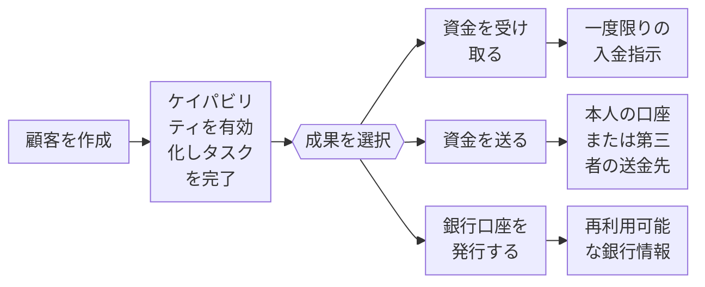

顧客の成果から始めます。各フローは同じオンボーディングモデルを使用し、その後さまざまな口座と資金移動へ分岐します。

```mermaid
%%{init: {"flowchart": {"rankSpacing": 20, "nodeSpacing": 16, "wrappingWidth": 80, "padding": 8}}}%%
flowchart LR
  A["顧客を作成"] --> B["ケイパビリティを有効化しタスクを完了"]
  B --> C{{"成果を選択"}}
  C --> D["資金を受け取る"]
  C --> E["資金を送る"]
  C --> F["銀行口座を発行する"]
  D --> G["一度限りの入金指示"]
  E --> H["本人の口座または第三者の送金先"]
  F --> I["再利用可能な銀行情報"]
```

## フローを比較する

| 成果 | 事前準備 | 得られるもの |
| --- | --- | --- |
| 入金 | ready 状態の入金ケイパビリティと発行済みの入金先ウォレット | 送金固有の指示とステーブルコインの決済 |
| 支払い | ready 状態の支払いケイパビリティ、入金済みの発行ウォレット、ready 状態の口座または送金先 | 選択した受取エンドポイントへの送金 |
| 発行済み銀行口座 | ready 状態の銀行ケイパビリティと発行済みの決済ウォレット | プロビジョニング後の再利用可能な銀行情報 |

見積もり付きの入金は、1 つの送金のための指示を作成します。発行済み銀行口座は、後の入金のための再利用可能な情報を作成します。支払いは、発行ウォレットに既に利用可能な資金から開始します。

## オンランプとオフランプ

Swipelux では、オンランプとオフランプの代わりに入金と支払いという用語を使用します。入金は、ステーブルコインを発行済みウォレットに決済します。支払いは、発行済みウォレットから資金を送ります。

| 構築するもの | 使用するフロー | 見積もりと送金の `direction` |
| --- | --- | --- |
| オンランプ(法定通貨からステーブルコイン) | [資金を受け取る](/jp/integration/receive-funds) | `fiat_to_stablecoin` |
| オフランプ(ステーブルコインから法定通貨) | 銀行口座または銀行の送金先への[資金を送る](/jp/integration/send-funds) | `stablecoin_to_fiat` |
| ウォレット間のステーブルコイン送金 | ウォレットへの[資金を送る](/jp/integration/send-funds) | `stablecoin_move` |

リクエストで `direction` を送信する必要はありません。Swipelux は見積もりの `in` と `out` の通貨からこの値を導き出します。[見積もりと送金](/jp/integration/quotes-and-transfers)を参照してください。

## フローを選択する

<CardGroup cols={3}>
  <Card title="資金を受け取る" icon="arrow-down-to-line" href="/jp/integration/receive-funds">
    フィアットからステーブルコインへの入金を作成し追跡します。
  </Card>
  <Card title="資金を送る" icon="arrow-up-from-line" href="/jp/integration/send-funds">
    ファーストパーティまたはサードパーティの支払いを構築します。
  </Card>
  <Card title="銀行口座を発行する" icon="building-columns" href="/jp/integration/issue-bank-account">
    ウォレットにリンクされた再利用可能な銀行情報をプロビジョニングします。
  </Card>
</CardGroup>
