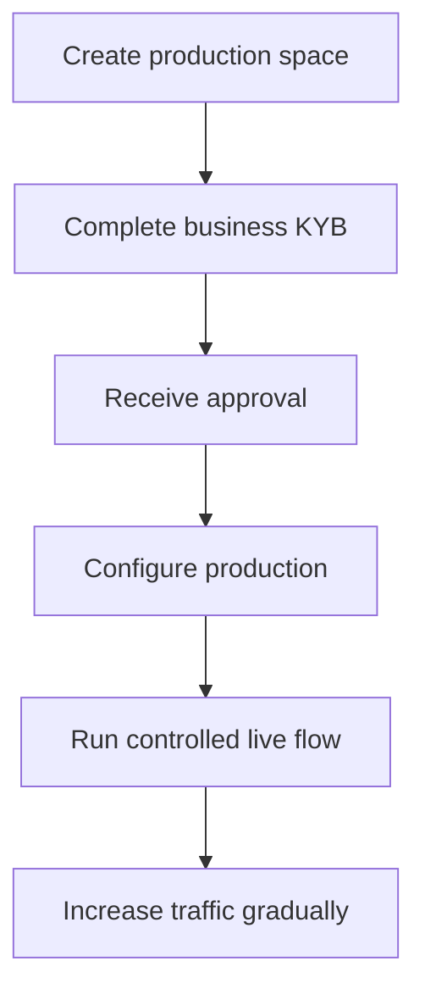

本番の有効化では、インテグレーションを行う事業者が検証されます。これは、製品のために作成する API 顧客とは別のものです。

## 本番スペースを有効化する

1. Swipelux ダッシュボードにサインインし、**Create a production space** を選択します。
2. KYB タブを開くか、[Business verification](https://www.swipelux.app/kyb) にアクセスします。
3. 要求されたすべての項目を入力し、必要なドキュメントをアップロードします。
4. インテグレーションを行う事業者を検証に提出し、承認を待ちます。

インテグレーション事業者と本番スペースが承認された場合にのみ、本番の API 顧客とトランザクションを作成できます。

## 本番を独立に保つ

本番リソースは明示的に作成してください。API キーを変更してもサンドボックスの状態は移行されません。

- 本番の認証情報は、別のシークレットマネージャーエントリーに保管してください。
- 本番専用のデプロイ構成とリソース ID を使用してください。
- 別の本番 Webhook エンドポイントと署名シークレットを登録してください。
- 本番で、必要な顧客、ケイパビリティ、口座、受取人、送金先を再作成してください。
- 本番へのアクセスは、それを必要とするサービスとオペレーターに制限してください。

サンドボックスと本番は `https://platform.swipelux.com` を使用します。API キーが環境を選択します。

## ローンチチェックリストを完了する

- [ ] サンドボックスで、ハッピーパスと想定される失敗パスをテストする。
- [ ] 必要な各書き込みで `Idempotency-Key` を送信し、安全な再試行のために保持する。
- [ ] Webhook 署名をパース前に検証し、イベント ID を耐久的に永続化し、再生をテストする。
- [ ] 利用不可のケイパビリティ、オープンタスク、変更されたタスクのリビジョンを処理する。
- [ ] 元のキーによる冪等な再試行を含め、ドキュメント化された [API のエラーと再試行](/jp/integration/errors) を処理する。
- [ ] 送金の失敗と実行可能な指示を、オペレーターに表示する。
- [ ] ログが `X-Request-Id` または `correlationId` を保持しつつ、シークレットや機密性の高い財務情報を露出しないことを確認する。

## 1 つの制御されたライブフローを実行する

既知の顧客と 1 件の低額なトランザクションから開始します。次を記録してください。

| 制御 | テスト前に定義するもの |
| --- | --- |
| スコープ | 顧客、ケイパビリティ、口座または送金先、金額、方法。 |
| 期待される結果 | API の状態、残高または指示、および観測が期待される Webhook イベント。 |
| オーナー | フロー全体を監視する責任者。 |
| 停止条件 | 予期しない状態、欠落した Webhook、誤った金額、未解決のタスク。 |

現在の API リソースと認証済み Webhook の配信の両方を確認してください。いずれかが期待される結果と異なる場合は、停止して調査してから、より多くのトラフィックを送信してください。

完全なフローが成功したら、ケイパビリティ、口座、送金先、送金の状態を監視しながら、徐々にボリュームを増やしてください。

製品ジャーニーには [共通フロー](/jp/integration/common-flows) に戻り、失敗の処理には [エラーと再試行](/jp/integration/errors) を確認し、正確な契約には [API リファレンス](/jp/api-reference/introduction) をご利用ください。
