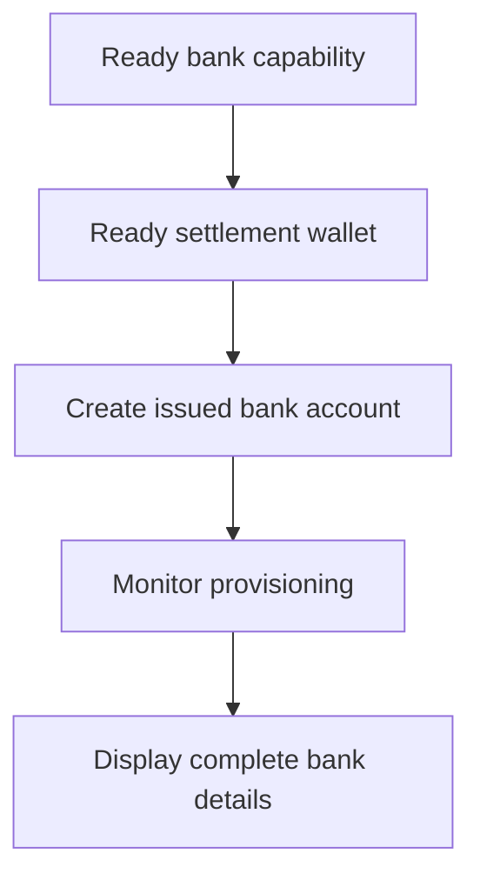

顧客が再利用可能な銀行情報を必要とする場合には、発行済み銀行口座を使用してください。特定の金額に紐づく一度限りの入金指示には、代わりに [資金を受け取る](/jp/integration/receive-funds) をご利用ください。



## 開始前に必要なもの

顧客 ID、対象の方法と通貨に対する ready 状態の銀行ケイパビリティ、および同じ顧客が所有する ready 状態の発行ウォレットが必要です。オープン中の作業は [ケイパビリティとタスク](/jp/integration/onboarding/capabilities-and-requirements) を通じて完了してください。

## 1. 決済ウォレットを作成または選択する

[口座とウォレット](/jp/integration/accounts#create-the-account) を通じて発行ウォレットを作成し、その後再度読み取ります。現在のステータスが決済を許可する場合にのみ続行してください。

レスポンスから得られる `data.id` を `SETTLEMENT_WALLET_ID` として保存します。外部ウォレットを `settlement.accountId` として使用しないでください。

## 2. 発行済み銀行口座を作成する

次のヘッダーとともに [`POST /v3/customers/{customerId}/accounts`](/api-reference/accounts/post-v3-customers-by-customer-id-accounts) を使用します。

```http
X-API-Key: ${SWIPELUX_API_KEY}
Idempotency-Key: issued-bank-account-001
Content-Type: application/json
```

次のリクエストボディを送信します。

```json
{
  "origin": "issued",
  "type": "bank",
  "method": "ach",
  "country": "US",
  "currency": "USD",
  "settlement": {
    "accountId": "${SETTLEMENT_WALLET_ID}"
  },
  "label": "USD account"
}
```

返された `data.id` を `BANK_ACCOUNT_ID` として保存します。`data.status`、`data.openTaskIds`、`data.details`、および決済関係も保持してください。

銀行口座 ID とウォレット ID には異なる役割があります。プロビジョニングと銀行情報の読み取りには銀行口座 ID を使用します。入金の入金先を識別するには決済ウォレット ID を使用します。

## 3. プロビジョニングを監視する

作成後、および関連する各 Webhook の後で、[`GET /v3/customers/{customerId}/accounts/{accountId}`](/api-reference/accounts/get-v3-customers-by-customer-id-accounts-by-account-id) を読み取ります。

`details` が存在しない間は、顧客インターフェースを保留状態のままにしてください。`openTaskIds` が空でない場合は、最新のタスクを完了し口座を再取得してください。経過時間から準備完了を推測しないでください。

最新の `statusReason.code` が `awaiting_assignment` の場合は、[資金を受け取る](/jp/integration/receive-funds) を通じて、同じ顧客、ケイパビリティ、決済ウォレットに対する最初の入金を作成し、その後銀行口座を再度読み取ってください。このブランチは、現在の口座が要求している場合にのみ実行してください。

## 4. 銀行情報を安全に提示する

最新の口座読み取りで返された完全な詳細情報のみを表示してください。`details.referenceRequired` が true の場合は、`details.reference` を正確に表示し、コピー可能にしてください。false の場合、参照情報を勝手に作らないでください。

これらの銀行情報は再利用可能です。見積もり付き入金の資金移動座標(その送金にのみ属する)で置き換えないでください。

次に、[Webhooks](/jp/integration/webhooks) を追加して、ポーリング画面に顧客を留めることなく、プロビジョニングの更新をアプリケーションに届けてください。
