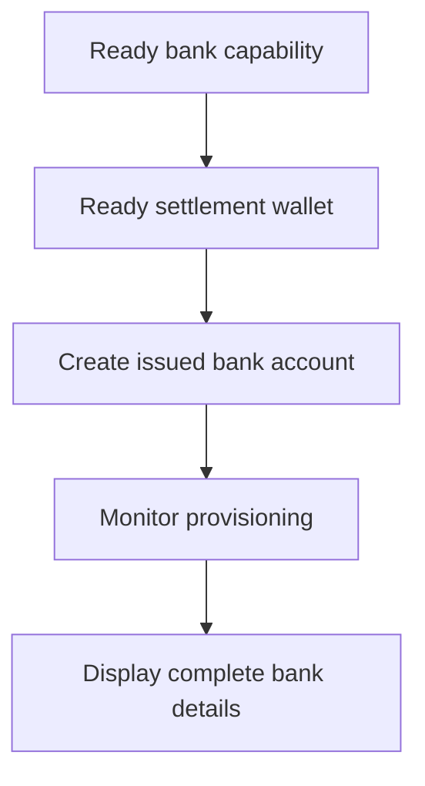

顧客が再利用可能な銀行情報を必要とする場合には、発行済み銀行口座を使用してください。特定の金額に紐づく一度限りの入金指示には、代わりに [資金を受け取る](/jp/integration/receive-funds) をご利用ください。


```mermaid
flowchart TD
  A["Ready bank capability"] --> B["Ready settlement wallet"]
  B --> C["Create issued bank account"]
  C --> D["Monitor provisioning"]
  D --> E["Display complete bank details"]
```

## 開始前に必要なもの

顧客 ID、対象の方法と通貨に対する ready 状態の銀行ケイパビリティ、および同じ顧客が所有する ready 状態の発行ウォレットが必要です。`allowPending` を使用すると、選択した銀行がまだ顧客を審査している間もリクエストを保存できます。オープン中の作業は [ケイパビリティとタスク](/jp/integration/onboarding/capabilities-and-requirements) を通じて完了してください。

## 1. 決済ウォレットを作成または選択する

[口座とウォレット](/jp/integration/accounts#create-the-account) を通じて発行ウォレットを作成し、その後再度読み取ります。現在のステータスが決済を許可する場合にのみ続行してください。

レスポンスから得られる `data.id` を `SETTLEMENT_WALLET_ID` として保存します。外部ウォレットを `settlement.accountId` として使用しないでください。

## 2. 発行済み銀行口座を作成する

次のヘッダーとともに [`POST /v3/customers/{customerId}/accounts`](/api-reference/accounts/post-v3-customers-by-customer-id-accounts) を使用します。

```http
X-API-Key: ${SWIPELUX_API_KEY}
Idempotency-Key: issued-bank-account-001
Content-Type: application/json
```

次のリクエストボディを送信します。

```json
{
  "origin": "issued",
  "type": "bank",
  "method": "ach",
  "country": "US",
  "currency": "USD",
  "settlement": {
    "accountId": "${SETTLEMENT_WALLET_ID}"
  },
  "label": "USD account"
}
```

返された `data.id` を `BANK_ACCOUNT_ID` として保存します。`data.status`、`data.openTaskIds`、`data.details`、および決済関係も保持してください。

任意のリクエストフィールド:

| フィールド | 適用対象 | 動作 |
| --- | --- | --- |
| `institution` | 発行済みの `ach`、`wire`、`swift` | 指定した銀行を厳密に選択します。Swipelux は別の銀行にフォールバックしません。サポート対象ケイパビリティのレスポンスで返された institution ID を使用してください。 |
| `allowPending` | 発行済みの `ach`、`wire`、`swift` | `true` に設定すると、選択した銀行での申請が承認待ちの間もリクエストを保存します。`institution` が必要です。 |
| `settlement.currency` | 発行済みの銀行口座 | `USDC` または `USDT`。決済ウォレットに届けるステーブルコインを設定します。 |

### 銀行を選択する {#choose-the-bank}

顧客が特定の銀行の銀行情報を必要とする場合は、`institution` を送信してください。Swipelux は、顧客、方法、通貨、institution の組み合わせごとに 1 つの発行済み口座を確保します。`institution` を指定しないリクエストは、顧客がいずれかの銀行でその方法と通貨の発行済み口座をすでに持っている場合、`409 conflict` を返します。`institution` を指定したリクエストは、その銀行の口座がすでに存在する場合にのみ `409 conflict` を返します。

口座の読み取りでは、選択した銀行が `id`、`name`、`bic` を持つ `institution` として返されます。`bic` は `null` になる場合があります。

冪等性は選択した銀行に適用されます。同じリクエストを再送すると、元の口座が返されます。同じ `Idempotency-Key` で `institution` を変更すると、`409 idempotency_conflict` が返されます。

### 銀行の承認前にリクエストを保存する {#save-the-request-before-bank-approval}

デフォルトでは、Swipelux は銀行ケイパビリティの準備が整った後にのみ、発行済み銀行口座のリクエストを受け付けます。顧客の口座設定を早めに収集するには、`institution` とともに `allowPending: true` を送信してください。

```json
{
  "origin": "issued",
  "type": "bank",
  "method": "wire",
  "country": "US",
  "currency": "USD",
  "institution": "${INSTITUTION_ID}",
  "allowPending": true,
  "settlement": {
    "accountId": "${SETTLEMENT_WALLET_ID}"
  },
  "label": "USD wire account"
}
```

銀行での申請が審査中の間、口座は `status: "in_review"` を返し、`statusReason.code` は `waiting_for_approval` に設定されます。レスポンスには `applicationId` と申請の `openTaskIds` も含まれます。これらのタスクは [ケイパビリティとタスク](/jp/integration/onboarding/capabilities-and-requirements) を通じて完了してください。

保存されたリクエストは、口座 ID、決済ウォレット、口座枠を保持します。申請とケイパビリティの準備が整うと、Swipelux は同じ `BANK_ACCOUNT_ID` で銀行情報をプロビジョニングします。その ID を読み取り続けてください。別のリクエストを作成しないでください。

申請が先に却下、キャンセル、またはアーカイブされた場合、口座は `rejected` になります。口座枠は解放されます。

### 決済通貨を選択する {#choose-the-settlement-currency}

デフォルトでは、入金は決済ウォレットの通貨で決済されます。`settlement.currency` を `USDC` または `USDT` に設定すると、ウォレットの通貨とは独立して届ける資産を選択できます。

```json
{
  "settlement": {
    "accountId": "${SETTLEMENT_WALLET_ID}",
    "currency": "USDT"
  }
}
```

`USDT` には、`USD` 口座と、USDT の送付に対応したネットワーク上の決済ウォレットが必要です。それ以外の場合、リクエストは `400 invalid_settlement_target` を返します。口座の読み取りでは、プロビジョニング中も含めて、保存された選択内容が返されます。

銀行口座 ID とウォレット ID には異なる役割があります。プロビジョニングと銀行情報の読み取りには銀行口座 ID を使用します。入金の入金先を識別するには決済ウォレット ID を使用します。

## 3. プロビジョニングを監視する

作成後、および関連する各 Webhook の後で、[`GET /v3/customers/{customerId}/accounts/{accountId}`](/api-reference/accounts/get-v3-customers-by-customer-id-accounts-by-account-id) を読み取ります。

`details` が存在しない間は、顧客インターフェースを保留状態のままにしてください。`openTaskIds` が空でない場合は、最新のタスクを完了し口座を再取得してください。経過時間から準備完了を推測しないでください。

口座が `allowPending: true` で保存された場合、銀行が申請を承認するまで、口座は `in_review` のままで、`statusReason.code` は `waiting_for_approval` に設定されます。

最新の `statusReason.code` が `awaiting_assignment` の場合は、[資金を受け取る](/jp/integration/receive-funds) を通じて、同じ顧客、ケイパビリティ、決済ウォレットに対する最初の入金を作成し、その後銀行口座を再度読み取ってください。このブランチは、現在の口座が要求している場合にのみ実行してください。

## 4. 銀行情報を安全に提示する

最新の口座読み取りで返された完全な詳細情報のみを表示してください。`details.referenceRequired` が true の場合は、`details.reference` を正確に表示し、コピー可能にしてください。false の場合、参照情報を勝手に作らないでください。

発行済みの `swift` 口座では、返された場合に `details.bankName`、`details.swiftCode`(受取銀行の BIC)、`details.accountNumber`、`details.accountHolderName`、`details.accountHolderAddress` を表示してください。送金者は、受取人の住所を国際電信送金に正確にコピーする必要があります。`details.bankAddress` と、口座が返す中継銀行のフィールドもあわせて表示してください。

これらの銀行情報は再利用可能です。見積もり付き入金の資金移動座標(その送金にのみ属する)で置き換えないでください。

次に、[Webhooks](/jp/integration/webhooks) を追加して、ポーリング画面に顧客を留めることなく、プロビジョニングの更新をアプリケーションに届けてください。
