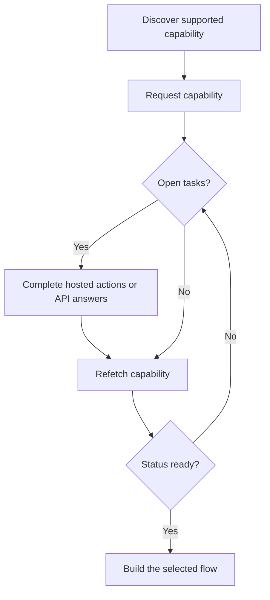

ケイパビリティは、顧客が特定の成果、支払い方法、方向を利用できるかを示します。オープンタスクは、そのケイパビリティや関連リソースが進む前に何を完了する必要があるかを示します。



```bash
export API_BASE='https://platform.swipelux.com'
export SWIPELUX_API_KEY='replace-with-your-api-key'
```

## サポートされているケイパビリティを発見する

[`GET /v3/customers/{customerId}/capabilities/supported`](/api-reference/capabilities/get-v3-customers-by-customer-id-capabilities-supported) で、顧客の現在の選択肢を読み取ります。

```bash
curl --request GET \
  "${API_BASE}/v3/customers/${CUSTOMER_ID}/capabilities/supported" \
  --header "X-API-Key: ${SWIPELUX_API_KEY}"
```

意図する `directions`、`method`、`accountType` に一致するレスポンスエントリを選択してください。`availability` が `available` または `beta` かつ `eligibility.eligible` が `true` の場合にのみ続行します。`institutions` が返された場合は、そのレスポンスに含まれる ID のみを選択してください。

選択した `data[].id` を `CAPABILITY_ID` として保存します。他の顧客や環境からケイパビリティ ID をコピーしてはいけません。

### プール型と名義型の口座タイプ

銀行ケイパビリティには 2 つのバリエーションがあり、`accountType` フィールドとケイパビリティ ID の接尾辞(例: `ach_pooled`、`wire_named`)にエンコードされています。

- **`pooled`**: 共有の Swipelux 銀行口座。各入金は、資金をルーティングするための固有の参照を使用します。一度限りの送金に選択してください。
- **`named`**: 顧客専用の銀行情報(仮想 IBAN、専用 ACH 口座)。再利用可能で、任意の送金者と共有可能です。[発行済み銀行口座](/jp/integration/issue-bank-account) には必須です。

デフォルトは `pooled` です。顧客が再利用可能な銀行情報を必要とする場合にのみ `named` を使用してください。どのバリエーションが利用可能かは `supported` レスポンスで確認してください。

## ケイパビリティをリクエストする

[`POST /v3/customers/{customerId}/capabilities/{capabilityId}`](/api-reference/capabilities/post-v3-customers-by-customer-id-capabilities-by-capability-id) で選択したオプションをリクエストします。

```bash
curl --request POST \
  "${API_BASE}/v3/customers/${CUSTOMER_ID}/capabilities/${CAPABILITY_ID}" \
  --header "X-API-Key: ${SWIPELUX_API_KEY}" \
  --header "Idempotency-Key: capability-request-001" \
  --header "Content-Type: application/json" \
  --data '{}'
```

明示的な `institutions` 配列は、サポート対象ケイパビリティのレスポンスから返された ID を選択する必要がある場合にのみ使用してください。

`data.status` を `CAPABILITY_STATUS`、`data.openTaskIds` を `OPEN_TASK_IDS` として保存し、各 `data.applications[].id` を `APPLICATION_IDS` に保存します。

## 現在のタスクを完了する

[`GET /v3/customers/{customerId}/tasks`](/api-reference/tasks/list-customer-tasks) でタスクを一覧表示し、`OPEN_TASK_IDS` から ID を選択して、[`GET /v3/customers/{customerId}/tasks/{taskId}`](/api-reference/tasks/get-customer-task) で各現在のタスクを読み取ります。

```bash
curl --request GET \
  "${API_BASE}/v3/customers/${CUSTOMER_ID}/tasks/${TASK_ID}" \
  --header "X-API-Key: ${SWIPELUX_API_KEY}"
```

最新の `data.revision` と `data.requirements` を使用してください。いずれかが変更された可能性がある場合は、送信直前にタスクを再取得してください。

### ホスト型アクション

タスクが `verificationSessions` または `tosSessions` を返す場合は、各セッションの `id` と現在の `url` を保存してください。返された URL に顧客を誘導し、その後タスクを再度読み取ります。これらはタスクスコープのアクションであり、別個の顧客検証ライフサイクルではありません。

### ドキュメントをアップロードする

要件がドキュメントを要求する場合は、[`POST /v3/customers/{customerId}/documents`](/api-reference/documents/post-v3-customers-by-customer-id-documents) でアップロードします。

```bash
export DOCUMENT_PATH='/absolute/path/to/requested-document.pdf'

curl --request POST \
  "${API_BASE}/v3/customers/${CUSTOMER_ID}/documents" \
  --header "X-API-Key: ${SWIPELUX_API_KEY}" \
  --header "Idempotency-Key: customer-document-001" \
  --form "file=@${DOCUMENT_PATH}"
```

そのドキュメントを参照する回答を送信する前に、返された `data.id` を `DOCUMENT_ID` として保存してください。

### API 回答

現在のリビジョンに対する完全な回答セットを [`POST /v3/customers/{customerId}/tasks/{taskId}/submissions`](/api-reference/task-submissions/create-customer-task-submission) で 1 回送信します。

```bash
curl --request POST \
  "${API_BASE}/v3/customers/${CUSTOMER_ID}/tasks/${TASK_ID}/submissions" \
  --header "X-API-Key: ${SWIPELUX_API_KEY}" \
  --header "Idempotency-Key: task-submission-001" \
  --header "Content-Type: application/json" \
  --data @- <<'JSON'
{
  "taskRevision": 3,
  "answers": [
    {
      "requirementId": "req_from_current_task",
      "answer": {
        "type": "text",
        "value": "Current answer"
      }
    }
  ]
}
JSON
```

すべての要件 ID と回答タイプは、最新のタスクから取得してください。API がタスクの変更を報告した場合は、タスクを再取得し、新しいリビジョンから送信を再構築してください。

## ケイパビリティが ready になったら続行する

[`GET /v3/customers/{customerId}/capabilities/{capabilityId}`](/api-reference/capabilities/get-v3-customers-by-customer-id-capabilities-by-capability-id) で再度ケイパビリティを読み取ります。

```bash
curl --request GET \
  "${API_BASE}/v3/customers/${CUSTOMER_ID}/capabilities/${CAPABILITY_ID}" \
  --header "X-API-Key: ${SWIPELUX_API_KEY}"
```

保存されているステータスとタスク ID を、最新のレスポンスで置き換えてください。作成しようとしている口座、見積もり、送金を、現在のケイパビリティステータスが許可している場合にのみ続行します。

次に、[共通フロー](/jp/integration/common-flows) で該当するジャーニーを選択してください。
