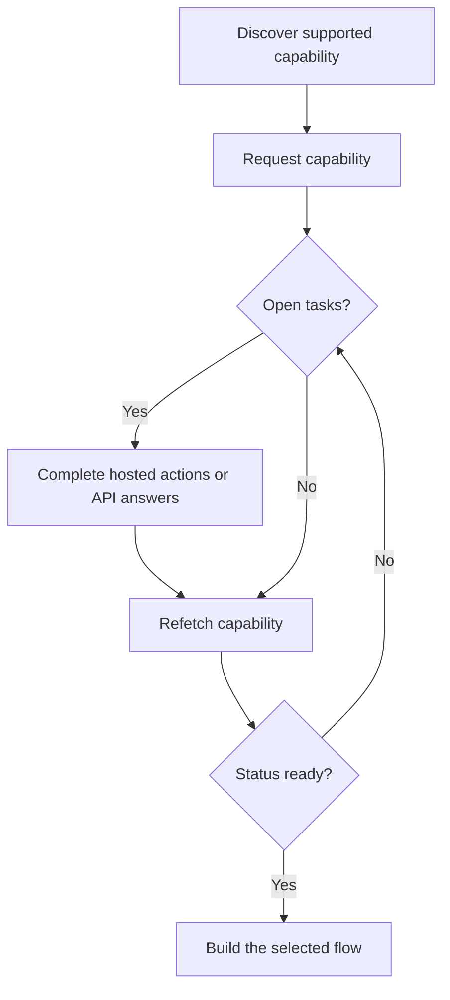

ケイパビリティは、顧客が特定の成果、支払い方法、方向を利用できるかを示します。オープンタスクは、そのケイパビリティや関連リソースが進む前に何を完了する必要があるかを示します。


```mermaid
flowchart TD
  A["Discover supported capability"] --> B["Request capability"]
  B --> C{"Open tasks?"}
  C -->|"Yes"| D["Complete hosted actions or API answers"]
  D --> E["Refetch capability"]
  C -->|"No"| E
  E --> F{"Status ready?"}
  F -->|"No"| C
  F -->|"Yes"| G["Build the selected flow"]
```

```bash
export API_BASE='https://platform.swipelux.com'
export SWIPELUX_API_KEY='replace-with-your-api-key'
```

## サポートされているケイパビリティを発見する

[`GET /v3/customers/{customerId}/capabilities/supported`](/api-reference/capabilities/get-v3-customers-by-customer-id-capabilities-supported) で、顧客の現在の選択肢を読み取ります。

```bash
curl --request GET \
  "${API_BASE}/v3/customers/${CUSTOMER_ID}/capabilities/supported" \
  --header "X-API-Key: ${SWIPELUX_API_KEY}"
```

意図する `directions`、`method`、`accountType` に一致するレスポンスエントリを選択してください。`availability` が `available` または `beta` かつ `eligibility.eligible` が `true` の場合にのみ続行します。`institutions` が返された場合は、そのレスポンスに含まれる ID のみを選択してください。

各金融機関エントリには `logoUrl` と `isDefault` フラグが含まれます。`logoUrl` は銀行選択 UI で銀行のロゴを表示するために使用し、`null` の場合は独自の汎用的な銀行アイコンを表示してください。`isDefault` はこの顧客とケイパビリティにのみ適用され、金融機関全体に適用されるものではありません。[`GET /v3/institutions`](/api-reference/institutions/get-v3-institutions) も同じく null 許容の `logoUrl` を返します。金融機関 ID は不透明な値であるため、新しい ID にはコードを変更せずに対応できるようにしてください。

```json
{
  "institutions": [
    {
      "id": "jpmorgan",
      "name": "JPMorgan Chase",
      "bic": "CHASUS33",
      "logoUrl": "https://wallet.swipelux.com/bank-logos/jpmorgan.png",
      "countries": ["US"],
      "isDefault": true
    }
  ]
}
```

選択した `data[].id` を `CAPABILITY_ID` として保存します。他の顧客や環境からケイパビリティ ID をコピーしてはいけません。

### プール型と名義型の口座タイプ

銀行ケイパビリティには 2 つのバリエーションがあり、`accountType` フィールドとケイパビリティ ID の接尾辞(例: `ach_pooled`、`wire_named`)にエンコードされています。

- **`pooled`**: 共有の Swipelux 銀行口座。各入金は、資金をルーティングするための固有の参照を使用します。一度限りの送金に選択してください。
- **`named`**: 顧客専用の銀行情報(仮想 IBAN、専用 ACH 口座)。再利用可能で、任意の送金者と共有可能です。[発行済み銀行口座](/jp/integration/issue-bank-account) には必須です。

デフォルトは `pooled` です。顧客が再利用可能な銀行情報を必要とする場合にのみ `named` を使用してください。どのバリエーションが利用可能かは `supported` レスポンスで確認してください。

SWIFT の入金を受け取るか、SWIFT の銀行情報を発行するには、`swift_named` を使用してください。`swift_pooled` は支払いのみに対応しているため、サポート対象ケイパビリティのレスポンスで各オプションの `directions` を確認してください。名義型の SWIFT 口座は、銀行の BIC、必要な場合は参照、および銀行が提供する場合は受取人の住所を含む、再利用可能な受取情報を返します。

発行済みの ACH、Wire、SWIFT 口座では、`institution` で特定の銀行を選択し、銀行が顧客を承認する前に口座リクエストを保存できます。[銀行口座を発行する](/jp/integration/issue-bank-account#choose-the-bank) を参照してください。

## ケイパビリティをリクエストする

[`POST /v3/customers/{customerId}/capabilities/{capabilityId}`](/api-reference/capabilities/post-v3-customers-by-customer-id-capabilities-by-capability-id) で選択したオプションをリクエストします。

```bash
curl --request POST \
  "${API_BASE}/v3/customers/${CUSTOMER_ID}/capabilities/${CAPABILITY_ID}" \
  --header "X-API-Key: ${SWIPELUX_API_KEY}" \
  --header "Idempotency-Key: capability-request-001" \
  --header "Content-Type: application/json" \
  --data '{}'
```

明示的な `institutions` 配列は、サポート対象ケイパビリティのレスポンスから返された ID を選択する必要がある場合にのみ使用してください。

`data.status` を `CAPABILITY_STATUS`、`data.accountProvisioning` を `ACCOUNT_PROVISIONING_STATUS`、`data.openTaskIds` を `OPEN_TASK_IDS` として保存し、各 `data.applications[].id` を `APPLICATION_IDS` に保存します。

### 銀行ごとの共有申請 {#shared-applications-per-bank}

名義型の銀行ケイパビリティでは、各顧客は銀行ごとに 1 つの申請ケースを持ちます。プール型およびプラットフォームのケイパビリティは、銀行に紐づかないケースを使用します。Swipelux は、リクエストされた互換性のあるすべてのケイパビリティ間でケースを共有します。

- 1 回の承認で複数のケイパビリティをカバーできます。たとえば、ある銀行で承認されたケースによって、ACH と Wire の両方のケイパビリティが `ready` になる場合があります。
- 既存のケースに一致する後続のリクエストは、そのケースを再利用します。Swipelux は 2 つ目の申請を作成せず、重複するタスクも追加しません。
- 異なる銀行のケースは互いに独立しています。ある銀行での却下は、別の銀行のケースに影響しません。

リクエストのレスポンスから、Swipelux がどのケースを使用したかがわかります。

- `201` は、リクエストによって新しい申請ケースが作成されたことを意味します。
- `200` は、リクエストが顧客の既存の申請ケースに解決されたことを意味します。たとえば、顧客がすでに保有している銀行ケイパビリティへの繰り返しのリクエストや、キャンセルされたケイパビリティへのリクエストが該当します。`card` または `stablecoin_transfers` への繰り返しのリクエストは、引き続き [`409 capability_already_exists`](/integration/errors#capability-already-exists) を返します。
- `selectedApplicationId` は `data` と同階層のトップレベルフィールドで、リクエストが選択または作成したケースの ID を含みます。リクエストがケースを選択しなかった場合、Swipelux はこのフィールドを省略します。冪等なリプレイでは同じ値が返されます。

省略したレスポンス:

```json
{
  "data": {
    "id": "ach_named",
    "status": "pending",
    "openTaskIds": ["tsk_000000000000000002"],
    "applications": [{ "id": "apl_000000000000000005", "status": "in_review" }]
  },
  "selectedApplicationId": "apl_000000000000000005"
}
```

名義型ケイパビリティでは、同じケースを選択するには同じ `institutions` リストを再度送信し、特定の銀行を対象にするにはその金融機関 ID を 1 つ送信します。顧客を最終的に却下した銀行はスキップされます。その銀行のみを指定した場合、または適格なすべての銀行が顧客を却下した場合、リクエストは [`409 capability_terminally_rejected`](/integration/errors#capability-terminally-rejected) を返します。却下後に別の銀行を試すには、その銀行の金融機関 ID を指定してケイパビリティを再度リクエストしてください。

ケイパビリティのステータスは、顧客の関連するすべてのケースを反映します。名義型ケイパビリティでは、そのケイパビリティをカバーする承認を持つ `ready` のケースが 1 つあれば、他の銀行の報告内容にかかわらず `ready` になります。プール型ケイパビリティは、さらにメソッドチェックも待機します。このチェックは、顧客の申請一覧の `probes` で報告されます。

#### 顧客の申請を一覧表示する {#list-the-customers-applications}

[`GET /v3/customers/{customerId}/applications`](/api-reference/capabilities/get-v3-customers-by-customer-id-applications) で、顧客のすべての申請ケースを一覧表示します。結果は `nextCursor` と `hasMore` でページ分割され、`updatedAfter` を指定できます。

```bash
curl --request GET \
  "${API_BASE}/v3/customers/${CUSTOMER_ID}/applications" \
  --header "X-API-Key: ${SWIPELUX_API_KEY}"
```

各エントリには、ケイパビリティの `applications[]` で返される申請フィールドに加えて、次の項目が含まれます。

- `scope`: 1 つの銀行のケースは `named`、銀行に紐づかないケースは `provider_pooled` または `platform`、未分類の過去のケースは `null` です。`provider_pooled` および `platform` のケースには `institution` が含まれません。
- `requestedScope[]`: ケースに対してリクエストされたケイパビリティキーで、それぞれ最初の `requestedAt` を含みます。エントリが削除されることはありません。
- `coverage[]`: ケースの承認がカバーするケイパビリティキーで、それぞれ `grantedAt` と `source` を含みます。カバレッジはスコープを記録するものであり、認可を示すものではありません。現在のステータスはケイパビリティを読み取って確認してください。
- `probes[]`: ケースがカバーするプール型ケイパビリティキーのメソッドチェックで、それぞれ `capabilityKey`、`status`、`reason` を含みます。名義型キーにプローブが必要になることはありません。
- `generation`、`predecessorApplicationId`、`supersededByApplicationId`: 継承関係のリンクです。`supersededByApplicationId` が設定されている場合、そのケースは置き換えられています。その ID をたどって現在のケースを参照してください。

省略したレスポンス:

```json
{
  "data": [
    {
      "id": "apl_000000000000000005",
      "status": "ready",
      "scope": "named",
      "institution": { "id": "jpmorgan", "name": "JPMorgan Chase", "bic": "CHASUS33" },
      "requestedScope": [
        { "capabilityKey": "ach_named", "requestedAt": "2026-09-20T10:00:00.000Z" }
      ],
      "coverage": [
        { "capabilityKey": "ach_named", "grantedAt": "2026-09-22T12:00:00.000Z", "source": "approval" },
        { "capabilityKey": "wire_named", "grantedAt": "2026-09-22T12:00:00.000Z", "source": "approval" }
      ],
      "probes": [],
      "generation": 1,
      "predecessorApplicationId": null,
      "supersededByApplicationId": null
    }
  ],
  "nextCursor": null,
  "hasMore": false
}
```

## 現在のタスクを完了する {#complete-current-tasks}

[`GET /v3/customers/{customerId}/tasks`](/api-reference/tasks/list-customer-tasks) でタスクを一覧表示し、`OPEN_TASK_IDS` から ID を選択して、[`GET /v3/customers/{customerId}/tasks/{taskId}`](/api-reference/tasks/get-customer-task) で各現在のタスクを読み取ります。

```bash
curl --request GET \
  "${API_BASE}/v3/customers/${CUSTOMER_ID}/tasks/${TASK_ID}" \
  --header "X-API-Key: ${SWIPELUX_API_KEY}"
```

最新の `data.revision` と `data.requirements` を使用してください。いずれかが変更された可能性がある場合は、送信直前にタスクを再取得してください。

### 再利用されるプロファイルの証拠 {#reused-profile-evidence}

直接の API 送信を受け付ける申請受付タスクでは、Swipelux は顧客がすでに提供した情報を再利用します。そのようなタスクが作成または調整されると、Swipelux は顧客プロファイルと、顧客自身がアップロードしたドキュメントを確認します。使用可能なプロファイル値またはドキュメントによってすでに裏付けられている適格な要件は、実行可能な状態のままではなく `in_review` に移行します。プロファイルの更新や新しいドキュメントのアップロードも、既存のタスクに対して同じ確認をトリガーします。

欠落している値または互換性のない値のみが実行可能な状態のまま残ります。再利用によって証拠が承認されるわけではなく、Swipelux は引き続きそれを審査します。明示的な修正依頼と、以前に回答済みの要件は、実行可能な状態のまま残ります。所有者および関連当事者のドキュメントは再利用されず、ホスト型セッションでのみ収集される要件は通常のフローに従います。

### 要件をレンダリングする {#render-requirements}

フォームは、要件キーではなく、各要件が返すメタデータから構築してください。要件には任意の短い `title` を含めることができ、すべての `request` には見出しの下に表示する `prompt` が含まれます。

`request.type: "profile"` の要件は、`profilePointer` でプロファイルフィールドを識別し、入力メタデータを追加します。

- `allowedValues`: スカラーフィールド、または配列フィールドの各項目で許可される値です。翻訳された表示ラベルではなく、これらの値を送信してください。
- `valueSchema`: 入力の形状、ネストされたプロパティ、必須フィールド、構造上の制約を記述する、自己完結型の JSON Schema Draft 7 ドキュメントです。オブジェクトの列挙値は該当するプロパティに表示されます。たとえば、税識別子の場合は `valueSchema.items.properties.type.enum` です。Swipelux は送信後もフィールド間の検証と審査による検証を適用するため、スキーマに適合した値でも却下される場合があります。
- `valueType: "country"`、または配列の場合は `itemValueType: "country"`: このフィールドは大文字の ISO 3166-1 alpha-2 コードを受け付けます。`valueSchema` 内のネストされた国プロパティは `format: "iso-3166-1-alpha-2"` を使用します。ローカライズされたラベルには標準の国リストを使用してください。

```json
{
  "id": "req_000000000000000010",
  "key": "account_purposes",
  "title": "Account purpose",
  "status": "action_required",
  "request": {
    "type": "profile",
    "prompt": "Select every purpose that applies.",
    "required": true,
    "profilePointer": "/financialProfile/accountPurposes",
    "valueType": "array",
    "itemValueType": "string",
    "allowedValues": ["business_expenses", "ecommerce", "payroll"],
    "valueSchema": {
      "$schema": "http://json-schema.org/draft-07/schema#",
      "type": "array",
      "items": { "enum": ["business_expenses", "ecommerce", "payroll"] }
    }
  }
}
```

この例では値の一覧を短縮していますが、API は許可されるすべての値を返します。一部のプロファイル要件には公開されたスキーマがなく、`valueSchema` と `allowedValues` が省略されます。その場合は `prompt` と `valueType` からレンダリングしてください。

すべてのオープンなタスクには `dueAt` タイムスタンプが含まれます。Swipelux が明示的な期日なしでタスクを作成した場合、`dueAt` はタスクの `createdAt` からちょうど 31 日後がデフォルトになります。`dueAt` は情報提供のみを目的としたものとして扱ってください。API 経由で設定することはできず、自動的なライフサイクル遷移も発生しません。自動遷移を引き起こすのは、別途設定される `deadline` フィールドのみです。

### ホスト型アクション

タスク詳細レスポンスでは、`verificationSessions` および `tosSessions` の各エントリに `action` オブジェクトが含まれます。タスク一覧レスポンスには、これらのアクションリンクは含まれません。各セッションの `id` を保存し、顧客を誘導する前に `action.kind` を確認してください。セッションの `status` からリンクの利用可否を推測してはいけません。

- `action.kind: "available"` の場合は `action.url` と `action.expiresAt`（現時点では常に `null`）が含まれます。`action.url` を保存し、顧客をその URL に誘導してからタスクを再度取得してください。セッションレベルの `url` と `expiresAt` には同じ値が含まれます。
- `action.kind: "unavailable"` は、リンクを提示すべきではないことを意味します。セッションレベルの `url` と `expiresAt` は存在しません。セッションの `status` だけでは、返されるアクションの種類は決まりません。

```json
{
  "data": {
    "verificationSessions": [
      {
        "id": "vfy_000000000000000003",
        "key": "identity_verification",
        "type": "identity_verification",
        "status": "action_required",
        "action": {
          "kind": "available",
          "url": "https://platform.swipelux.com/kyc/redirect/cus_000000000000000001/tsk_000000000000000002/vfy_000000000000000003",
          "expiresAt": null
        },
        "url": "https://platform.swipelux.com/kyc/redirect/cus_000000000000000001/tsk_000000000000000002/vfy_000000000000000003",
        "expiresAt": null
      }
    ],
    "tosSessions": [
      {
        "id": "vfy_000000000000000004",
        "key": "terms_of_service",
        "type": "terms_of_service",
        "status": "completed",
        "action": { "kind": "unavailable" }
      }
    ]
  }
}
```

これらはタスクスコープのアクションであり、別個の顧客検証ライフサイクルではありません。

### ドキュメントをアップロードする {#upload-documents}

要件がドキュメントを要求する場合は、[`POST /v3/customers/{customerId}/documents`](/api-reference/documents/post-v3-customers-by-customer-id-documents) でアップロードします。

```bash
export DOCUMENT_PATH='/absolute/path/to/requested-document.pdf'

curl --request POST \
  "${API_BASE}/v3/customers/${CUSTOMER_ID}/documents" \
  --header "X-API-Key: ${SWIPELUX_API_KEY}" \
  --header "Idempotency-Key: customer-document-001" \
  --form "file=@${DOCUMENT_PATH}"
```

そのドキュメントを参照する回答を送信する前に、返された `data.id` を `DOCUMENT_ID` として保存してください。

保存済みのファイルを後で取得するには、[`GET /v3/customers/{customerId}/documents/{documentId}/download`](/api-reference/documents/get-v3-customers-by-customer-id-documents-by-document-id-download) を呼び出します。Swipelux は、ファイルを添付ファイルとしてダウンロードする `url` を返します。この URL は 1 時間後に期限切れになります。アーカイブ済みのドキュメントは `404` を返します。

### API 回答

現在のリビジョンに対する完全な回答セットを [`POST /v3/customers/{customerId}/tasks/{taskId}/submissions`](/api-reference/task-submissions/create-customer-task-submission) で 1 回送信します。

```bash
curl --request POST \
  "${API_BASE}/v3/customers/${CUSTOMER_ID}/tasks/${TASK_ID}/submissions" \
  --header "X-API-Key: ${SWIPELUX_API_KEY}" \
  --header "Idempotency-Key: task-submission-001" \
  --header "Content-Type: application/json" \
  --data @- <<'JSON'
{
  "taskRevision": 3,
  "answers": [
    {
      "requirementId": "req_from_current_task",
      "answer": {
        "type": "text",
        "value": "Current answer"
      }
    }
  ]
}
JSON
```

すべての要件 ID と回答タイプは、最新のタスクから取得してください。API がタスクの変更を報告した場合は、タスクを再取得し、新しいリビジョンから送信を再構築してください。

### ビジネスにおける実質的支配者の前提条件 {#beneficial-owner-prerequisite-for-businesses}

実質的支配者(beneficial owner)の証拠を必要とするビジネスケイパビリティのリクエストは、顧客に適格な所有者がまだ存在しない場合でも成功します。ケイパビリティは `statusReason.code: tasks_due` を伴う `restricted` として作成され、ビジネスインテークタスクが、所有構造を含む不足している所有の事実を要求します。

同じタスクには、リクエストに `qualification: "beneficial_owner"` を含む `resource_reference` 要件が含まれます。

```json
{
  "type": "resource_reference",
  "prompt": "Add or select a qualifying beneficial owner.",
  "required": true,
  "resourceType": "related_party",
  "qualification": "beneficial_owner"
}
```

関連当事者は、同じ顧客のアクティブな `person` 当事者であり、`ownership.declared: true` であるか、25 以上の所有割合が提供されている場合に適格となります。

この要件は現在の関連当事者の一覧から導出されるため、通常は直接回答しません。

- 適格な関連当事者を作成または更新すると、同じ再評価内で要件が満たされ、その所有者自身のプロファイルおよびドキュメント作業が開始されます。[ビジネスの関連当事者を追加する](/jp/integration/onboarding/customers#add-business-related-parties) をご覧ください。
- `relatedPartyId` を含む `resource_reference` 回答で、適格な当事者を明示的に参照することもできます。
- 要件は、満たされた後も現在のタスクに一覧表示されたままになります。他に未完了の義務が残っていない場合、タスクは `satisfied` になります。
- 最後の適格な当事者をアーカイブしたり、適格とした事実を削除したりすると、タスクが `satisfied` になった後であっても、要件が再度オープンされます。

## ケイパビリティが ready になったら続行する

[`GET /v3/customers/{customerId}/capabilities/{capabilityId}`](/api-reference/capabilities/get-v3-customers-by-customer-id-capabilities-by-capability-id) で再度ケイパビリティを読み取ります。

```bash
curl --request GET \
  "${API_BASE}/v3/customers/${CUSTOMER_ID}/capabilities/${CAPABILITY_ID}" \
  --header "X-API-Key: ${SWIPELUX_API_KEY}"
```

保存されているステータス、口座発行ステータス、タスク ID を、最新のレスポンスで置き換えてください。ケイパビリティの `status` は、利用権限が承認されているかどうかを示します。口座を発行するケイパビリティでは、その口座が `not_started`、`in_progress`、`issued`、`failed` のいずれであるかを `accountProvisioning` が個別に報告します。口座を発行しないケイパビリティは `not_applicable` を返します。

作成しようとしている口座、見積もり、送金を、現在のケイパビリティステータスが許可している場合にのみ続行します。フローに発行済みの口座が必要な場合は、`accountProvisioning` が `issued` になるまで待機してください。

次に、[共通フロー](/jp/integration/common-flows) で該当するジャーニーを選択してください。
