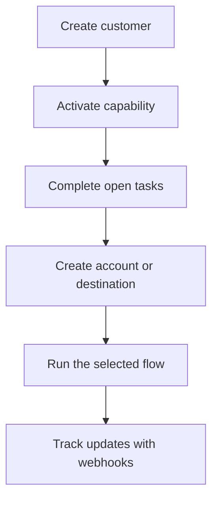

Swipelux は、顧客をオンボーディングして資金を移動させるためのビルディングブロックを、決済インフラを製品に露出させることなく、お客様のバックエンドに提供します。

## 構築できるもの

<CardGroup cols={3}>
  <Card title="資金を受け取る" icon="arrow-down-to-line" href="/jp/integration/receive-funds">
    一度限りのフィアット入金指示を作成し、ステーブルコインをウォレットに決済します。
  </Card>
  <Card title="資金を送る" icon="arrow-up-from-line" href="/jp/integration/send-funds">
    顧客ウォレットから、ファーストパーティ口座またはサードパーティの送金先へ送金します。
  </Card>
  <Card title="銀行口座を発行する" icon="building-columns" href="/jp/integration/issue-bank-account">
    決済ウォレットに紐づく再利用可能な銀行口座情報をプロビジョニングします。
  </Card>
</CardGroup>

## インテグレーションの仕組み

顧客とは、フローを所有する個人または事業者です。ケイパビリティは、その顧客が利用できる成果を表します。オープンタスクは、そのケイパビリティやリソースを進めるために完了すべき事項を示します。

## 実際の動作を確認する

[demo.swipelux.com](https://demo.swipelux.com) で、シミュレートされたネオバンクの体験を試すことができます。[スターターをクローン](https://github.com/swipelux/neobank-starter) して製品インターフェースをカスタマイズすることも可能です。

デモとスターターは製品および UI のリファレンスです。これらのガイドや現在の API 契約を置き換えるものではありません。

## 構築を開始する

<CardGroup cols={3}>
  <Card title="クイックスタート" icon="rocket" href="/jp/integration/quickstart">
    顧客を作成し、1 つのサンドボックスフローを実行します。
  </Card>
  <Card title="共通フロー" icon="route" href="/jp/integration/common-flows">
    各成果に必要なセットアップを比較します。
  </Card>
  <Card title="API リファレンス" icon="code" href="/jp/api-reference/introduction">
    リクエストの規約を確認し、すべての API 操作を参照します。
  </Card>
</CardGroup>
