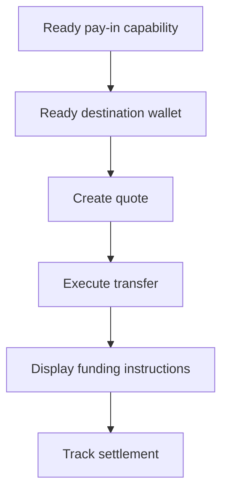

顧客が特定の金額の資金を用意する必要がある場合には、見積もり付き入金を使用します。送金では、ステーブルコインを発行ウォレットに決済します。



## 開始前に必要なもの

同じ顧客に対する ready 状態の入金ケイパビリティと ready 状態の発行済み入金先ウォレットが必要です。オープン中の作業は [ケイパビリティとタスク](/jp/integration/onboarding/capabilities-and-requirements) を通じて完了し、両方のリソースを再取得してください。

## 1. 見積もりを作成する

[`POST /v3/quotes`](/api-reference/money-movement/post-v3-quotes) で価格を作成します。次のヘッダーを送信します。

```http
X-API-Key: ${SWIPELUX_API_KEY}
Idempotency-Key: payin-quote-001
Content-Type: application/json
```

```json
{
  "customerId": "${CUSTOMER_ID}",
  "capabilityId": "${CAPABILITY_ID}",
  "externalId": "payin-order-123",
  "in": {
    "amount": "150.00",
    "currency": "USD"
  },
  "destinationId": "${SETTLEMENT_WALLET_ID}",
  "out": {
    "currency": "USDC"
  }
}
```

`data.id` を `QUOTE_ID` として保存します。レートから再計算するのではなく、返された金額と手数料を提示してください。

## 2. 見積もりを実行する

有効期限前に [`POST /v3/transfers`](/api-reference/money-movement/post-v3-transfers) で現在の見積もりを実行します。この意図した送金には新しいキーを使用してください。

```http
X-API-Key: ${SWIPELUX_API_KEY}
Idempotency-Key: payin-transfer-001
Content-Type: application/json
```

```json
{
  "quoteId": "${QUOTE_ID}"
}
```

送金の `data.id` を `TRANSFER_ID` として保存し、その現在の状態を保持してください。

## 3. 資金移動指示を取得する

[`GET /v3/transfers/{transferId}/instructions`](/api-reference/money-movement/get-v3-transfers-by-transfer-id-instructions) を読み取ります。返された `data.instructions` のバリアントを、そのタイプを推測せずにレンダリングしてください。

これらの詳細情報は送金固有です。1 つの送金の銀行座標、コード、ホスト型 URL、金額、参照情報、有効期限を、別の入金に再利用しないでください。

銀行指示の場合、`reference.required` が true であれば、`reference.value` を銀行座標の隣に正確に表示し、コピー可能にしてください。同じ指示セットから返された金額と通貨を表示してください。

銀行指示には、`ach`、`wire`、`rtp`、`swift` の各メソッドで任意項目の `bankName`、`bankAddress`、`accountHolderName`、`accountHolderAddress` フィールドが含まれる場合があります。返されたフィールドはそれぞれ他の銀行座標の隣に表示してください。送金側の銀行は `swift` などの国際送金で受取銀行の住所を求めることが多いため、`bankAddress` が返された場合は必ず表示してください。

```json
{
  "type": "bank",
  "method": "swift",
  "amount": { "amount": "150.00", "currency": "USD" },
  "accountHolderName": "Swipelux FBO Customer",
  "accountHolderAddress": "8 The Green, Dover, DE",
  "bankName": "JPMorgan Chase",
  "bankAddress": "383 Madison Avenue, New York, NY",
  "details": {
    "swiftCode": "CHASUS33",
    "accountNumber": "123456789"
  },
  "reference": { "value": "SWIFTMEMO1", "required": true }
}
```

発行済み銀行口座はこれとは異なり、後の入金のための再利用可能な情報を提供します。その体験を意図している場合は、[銀行口座を発行する](/jp/integration/issue-bank-account) をご覧ください。

## 4. 決済を追跡する

実行後および各イベントの後に、[`GET /v3/transfers/{transferId}`](/api-reference/money-movement/get-v3-transfers-by-transfer-id) を読み取ります。顧客向けのステータスは、最新の `data.state` から駆動してください。

送金に別のアクションが必要な場合は、`data.stateDetail` と `data.openTaskIds` を使用してください。予想されるスケジュールから完了とマークしないでください。

次に、[Webhooks](/jp/integration/webhooks) を追加し、送金ステータスが製品が処理する結果に達するまで同期を維持してください。
