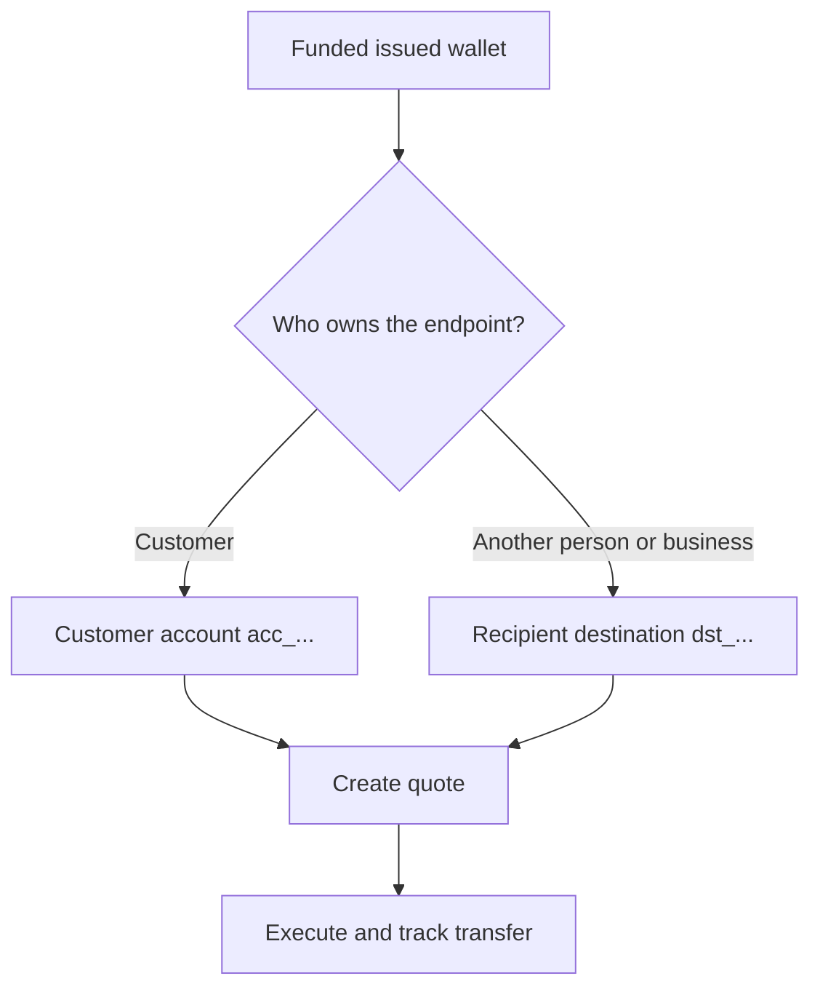

すべての支払いは、ready 状態で入金済みの発行ウォレットから開始します。送金先モデルは、エンドポイントの所有者に応じて異なります。



## 開始前に必要なもの

送金元ウォレットを再取得します。現在のステータスが支払いを許可し、利用可能な残高が意図する送金元金額をカバーすることを確認してください。レスポンスから得られる ID を `SOURCE_WALLET_ID` として保存します。

現在の顧客と選択した送金先に対する ready 状態の支払いケイパビリティも必要です。

## 1. 送金先を準備する

<Tabs>
  <Tab title="ファーストパーティ">

顧客がエンドポイントを所有する場合は、顧客所有の外部銀行口座を使用します。次のヘッダーとともに [`POST /v3/customers/{customerId}/accounts`](/api-reference/accounts/post-v3-customers-by-customer-id-accounts) で作成します。

```http
X-API-Key: ${SWIPELUX_API_KEY}
Idempotency-Key: payout-account-001
Content-Type: application/json
```

```json
{
  "origin": "external",
  "type": "bank",
  "methods": ["ach", "wire"],
  "country": "US",
  "currency": "USD",
  "details": {
    "routingNumber": "021000021",
    "accountNumber": "123456789",
    "accountType": "checking",
    "bankName": "Example Bank",
    "accountHolderName": "Acme Payments SAS"
  },
  "label": "Customer operating account"
}
```

[`GET /v3/customers/{customerId}/accounts/{accountId}`](/api-reference/accounts/get-v3-customers-by-customer-id-accounts-by-account-id) で読み取ります。現在のステータスが支払いを許可する場合にのみ続行してください。その `acc_` ID を `PAYOUT_DESTINATION_ID` として保存します。

  </Tab>
  <Tab title="サードパーティ">

[受取人と送金先](/jp/integration/recipients) を通じて、個人または事業者、およびその銀行またはウォレットのエンドポイントを作成します。送金先が ready になったときのみ続行してください。

返された `dst_` ID を `PAYOUT_DESTINATION_ID` として保存します。受取人の `rcp_` ID を見積もりの送金先として使用しないでください。

  </Tab>
</Tabs>

## 2. 支払い見積もりを作成する

次のヘッダーとともに [`POST /v3/quotes`](/api-reference/money-movement/post-v3-quotes) を使用します。

```http
X-API-Key: ${SWIPELUX_API_KEY}
Idempotency-Key: payout-quote-001
Content-Type: application/json
```

```json
{
  "customerId": "${CUSTOMER_ID}",
  "capabilityId": "${CAPABILITY_ID}",
  "in": {
    "amount": "150.00",
    "currency": "USDC",
    "accountId": "${SOURCE_WALLET_ID}"
  },
  "destinationId": "${PAYOUT_DESTINATION_ID}",
  "out": {
    "currency": "USD"
  }
}
```

`data.id` を `QUOTE_ID` として保存し、返された価格と手数料を提示してください。

## 3. 支払いを実行する

[`POST /v3/transfers`](/api-reference/money-movement/post-v3-transfers) で送金を作成します。この意図した実行には新しいキーを 1 つ使用してください。

```http
X-API-Key: ${SWIPELUX_API_KEY}
Idempotency-Key: payout-transfer-001
Content-Type: application/json
```

```json
{
  "quoteId": "${QUOTE_ID}"
}
```

送金の `data.id` を `TRANSFER_ID` として保存します。作成成功は支払いを開始しますが、配信を証明するものではありません。

## 4. 配信を追跡する

作成後および各イベントの後に、[`GET /v3/transfers/{transferId}`](/api-reference/money-movement/get-v3-transfers-by-transfer-id) を読み取ります。最新の `data.state`、`data.stateDetail`、`data.openTaskIds` を使用して、待機するか、アクションを実行するか、終端の結果を表示するかを判断してください。

次に、正確な金額、安全な実行のリカバリー、送金タスクについて [見積もりと送金](/jp/integration/quotes-and-transfers) を確認してください。
