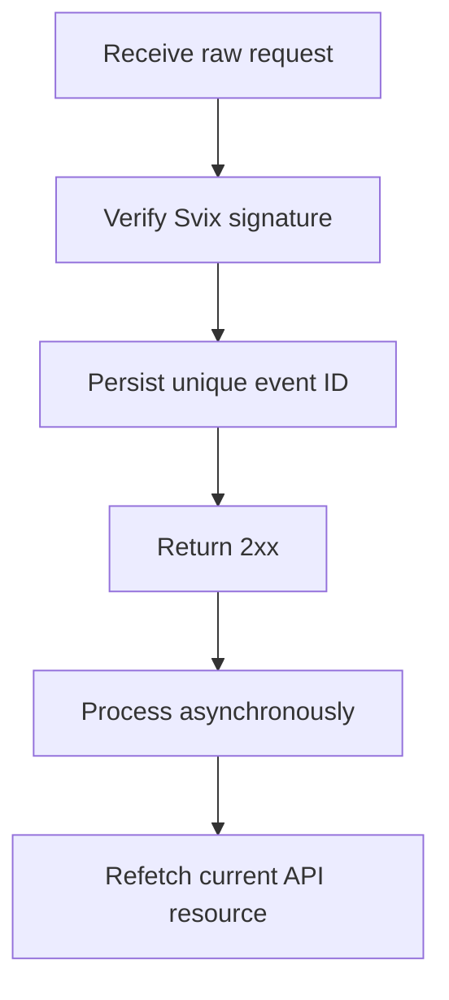

Webhook を使用して非同期の変更に対応します。配信は少なくとも 1 回であり、重複、遅延、順序の不同のイベントは通常発生します。



## 必要なイベントのみを登録する

[`POST /v3/webhooks`](/api-reference/webhooks/post-v3-webhooks) でエンドポイントを作成します。インテグレーションを駆動する、文書化されたイベントのみを購読してください。この例では [`transfer.state_changed`](/api-reference/webhooks/transfer-state-changed) を使用します。

```bash
export API_BASE='https://platform.swipelux.com'
export SWIPELUX_API_KEY='replace-with-your-api-key'

curl --request POST \
  "${API_BASE}/v3/webhooks" \
  --header "X-API-Key: ${SWIPELUX_API_KEY}" \
  --header "Idempotency-Key: webhook-endpoint-001" \
  --header "Content-Type: application/json" \
  --data @- <<'JSON'
{
  "url": "https://example.com/webhooks/swipelux",
  "events": ["transfer.state_changed"]
}
JSON
```

レスポンスの `data.id` を `WEBHOOK_ID` として保存します。[`GET /v3/webhooks/portal`](/api-reference/webhooks/get-v3-webhooks-portal) が返すポータルを開き、このエンドポイントの署名シークレットを取得して、API キーとは別のシークレットマネージャーに保管してください。

## パース前に検証する

Swipelux は、新しい Webhook インテグレーションを Svix 経由で配信します。エンドポイントの署名シークレットと次のヘッダーを使用して、生のリクエストボディを検証してください。

- `svix-id`
- `svix-timestamp`
- `svix-signature`

検証が成功する前に JSON をパースしたり副作用を発生させたりしないでください。

```javascript
import { Webhook } from "svix";

const verifier = new Webhook(process.env.SWIPELUX_WEBHOOK_SECRET);

export async function handleSwipeluxWebhook(request) {
  const rawBody = await request.text();
  const event = verifier.verify(rawBody, {
    "svix-id": request.headers.get("svix-id"),
    "svix-timestamp": request.headers.get("svix-timestamp"),
    "svix-signature": request.headers.get("svix-signature"),
  });

  await webhookInbox.insertIfAbsent({
    id: event.id,
    payload: event,
    status: "pending",
  });

  return new Response(null, { status: 204 });
}
```

署名がないか無効なリクエストは拒否してください。検証が完了するまで、生のボディを利用可能な状態に保ってください。

## 永続化し、確認応答し、その後に処理する

エンベロープの `id` に一意制約を設定します。検証済みのエンベロープを永続化し、`2xx` を速やかに返し、その後で非同期に処理してください。

イベント ID が既に存在する場合は、完了した副作用を繰り返さずに配信を確認応答してください。保留中または失敗したローカル作業は、独自の再試行キューを通じて再開します。エンベロープの `attempt` フィールドを重複排除キーやトランスポートの再試行カウンターとして使用しないでください。

## 現在の状態を再取得する

Webhook の順序は、権威のあるリソース履歴ではありません。`resource.type` と `resource.id` を使ってオブジェクトを特定し、システムを更新する前に現在の状態を取得してください。

送金イベントの場合は、[`GET /v3/transfers/{transferId}`](/api-reference/money-movement/get-v3-transfers-by-transfer-id) を呼び出します。

```bash
curl --request GET \
  "${API_BASE}/v3/transfers/${TRANSFER_ID}" \
  --header "X-API-Key: ${SWIPELUX_API_KEY}"
```

顧客に表示するステータスと下流のアクションは、現在の API レスポンスから駆動してください。2 つのワーカーが関連イベントを異なる順序で処理しても安全なように副作用を設計してください。

## 配信をリカバリーする

[`GET /v3/webhooks/portal`](/api-reference/webhooks/get-v3-webhooks-portal) を使って、配信ログを開き、失敗した配信を再試行するか、手動再生を開始してください。

すべての再生は、同じ署名検証と耐久性のあるインボックスを通過する必要があります。ダウンタイム後にリカバリーするには、影響を受けた期間を再生し、参照される各リソースを再取得してください。完了したイベント ID はノーオペレーションとなり、未完了のレコードは非同期に再開します。

次に、サンドボックスで重複や順序不同の配信を確認し、[本番リリース](/jp/integration/go-live) チェックリストを完了してください。
