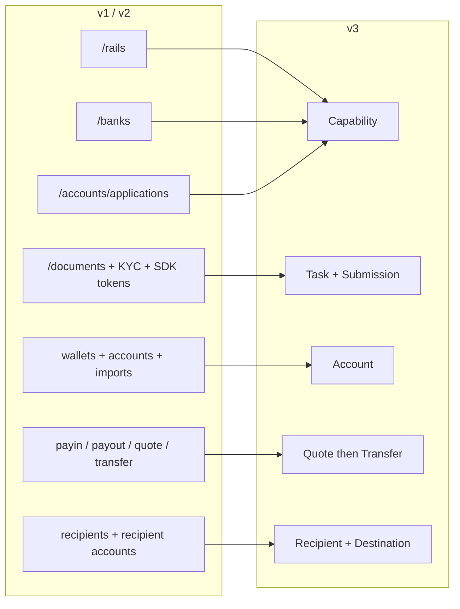
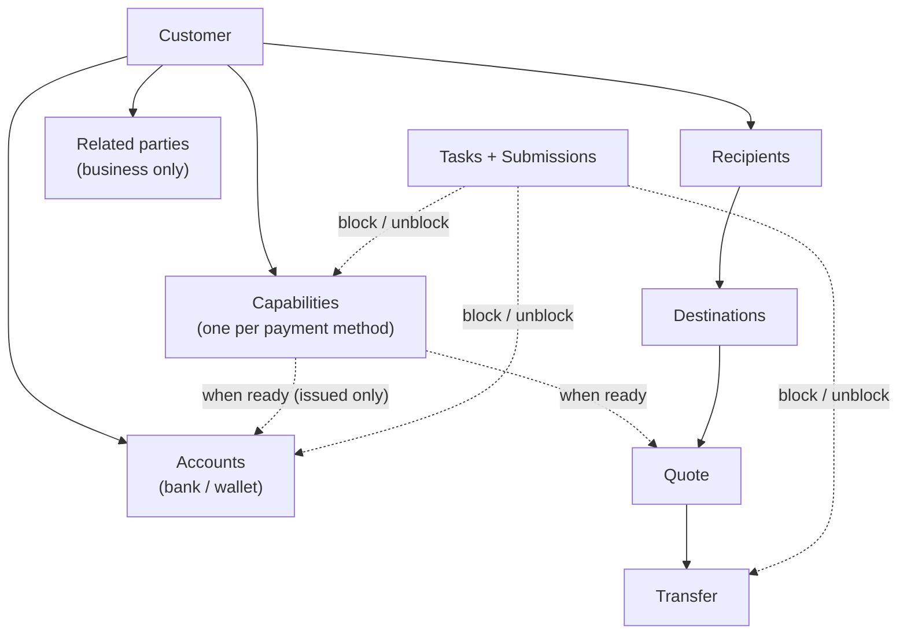
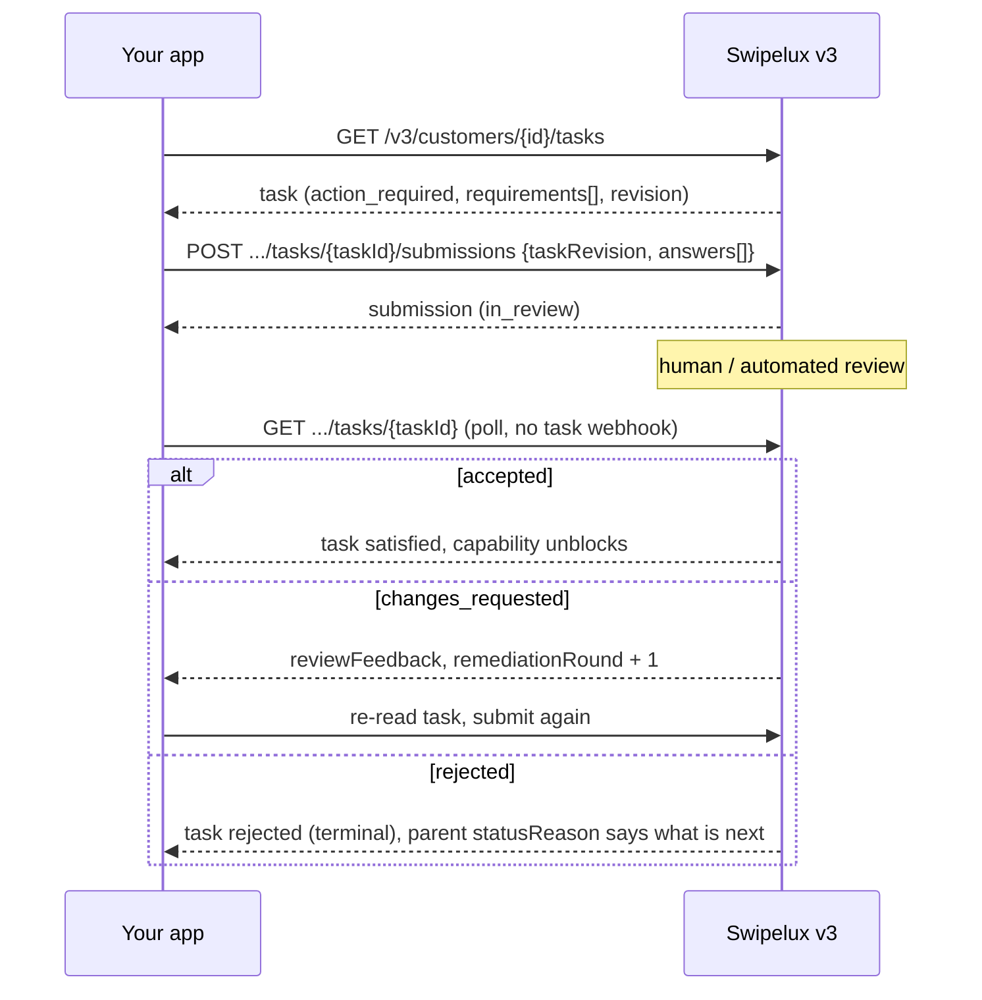
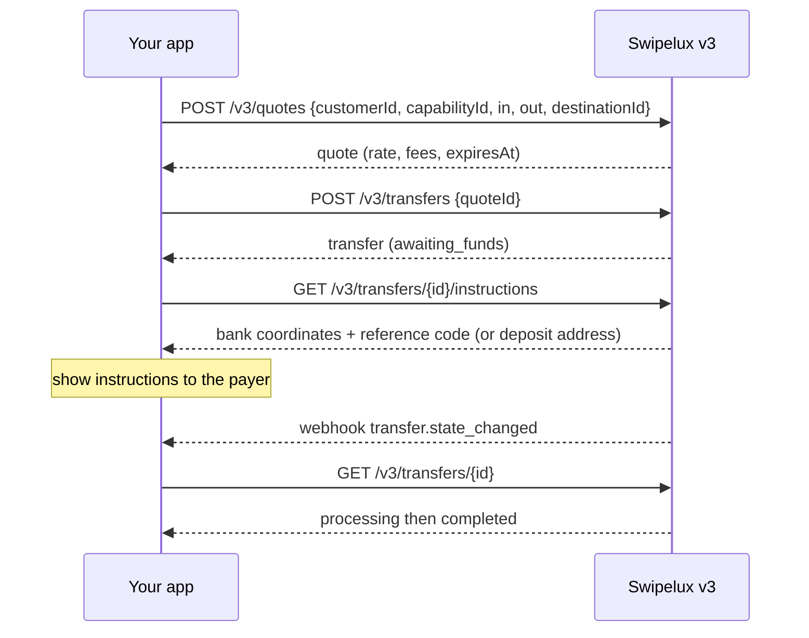
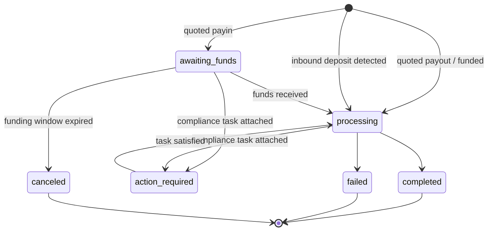
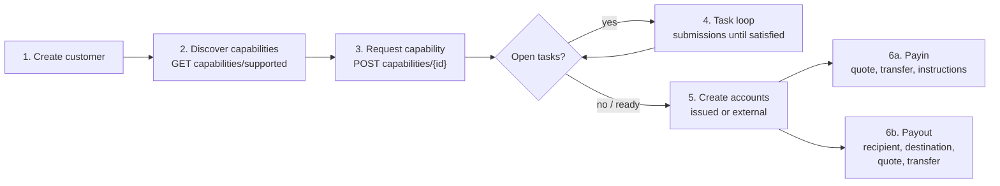

통합을 API v1 및 v2에서 v3로 두 단계에 걸쳐 마이그레이션하십시오.

- **1부, 개념.** 먼저 이 부분을 읽으십시오. v3는 이름 변경이 아니라 리모델링입니다. 이전 엔드포인트를 1대1로 매핑하려고 하면 API와 충돌하게 됩니다. 여기서 10분을 투자하면 나중에 며칠을 절약할 수 있습니다.
- **2부, API.** 엔드포인트별 매핑, 요청 예제, 상태 머신, 그리고 마이그레이션 체크리스트입니다.

운영 환경의 OpenAPI 사양 ([platform.swipelux.com/openapi.json](https://platform.swipelux.com/openapi.json))에 기반합니다. v1과 v2는 여전히 운영 중이며 아직 지원 중단되지 않았습니다. 그러나 모든 새로운 capability, recipient, task, 및 견적 관련 기능은 v3에서만 제공됩니다. 지원 종료 공지를 받으려면 `api.deprecation` webhook 이벤트를 구독하십시오.

<Info>
  **목차.** 1부: 1.1 v3가 존재하는 이유, 1.2 객체 모델, 1.3 capability별 준비 상태, 1.4 task 루프, 1.5 자금 이동, 1.6 상태 머신, 1.7 규약, 1.8 골든 패스. 2부: 2.1 customer, 2.2 capability, 2.3 task와 submission, 2.4 account, 2.5 recipient와 destination, 2.6 quote와 transfer, 2.7 webhook, 2.8 샌드박스, 2.9 레거시 엔드포인트, 2.10 마이그레이션 순서, 2.11 유의 사항 체크리스트.
</Info>

---

## 1부, 개념

### 1.1 v3가 존재하는 이유

v1과 v2에서는 고객을 결제 가능한 상태로 만드는 중복되는 방법이 네 가지로 자라났습니다. `/rails`, `/banks`, `/accounts/applications`, 그리고 비즈니스용 `rail-applications` 표면으로, 각각 고유한 상태 어휘를 가지고 있었습니다. 문서 수집 (`/documents`, KYC 임포트, 검증 SDK 토큰)은 실제로 차단을 해제하는 대상과 분리되어 있었습니다. v3는 이 모든 것을 여섯 개의 리소스로 통합합니다. 고객과 고객이 소유한 다섯 가지 것들입니다.



| 리소스 | 한 줄 정의 |
| --- | --- |
| **Customer** | 개인 또는 법인. **공개 상태 필드가 없으며**, 준비 상태는 capability에 있습니다. |
| **Capability** | 고객이 사용할 수 있는 하나의 결제 수단 (`sepa`, `ach`, `swift`, `stablecoin_transfers` 등)으로, 고유한 상태를 가집니다. `/rails`, `/banks`, 그리고 account-application 진입점을 대체합니다. |
| **Task** | Swipelux가 필요로 하는 작업 단위 (데이터, 문서, 검증)로, **Submission**으로 응답합니다. 문서 및 KYC 표면을 대체합니다. |
| **Account** | 고객이 소유한 자금 이동 엔드포인트: `bank` 또는 `wallet`, Swipelux가 `issued`하거나 `external`입니다. |
| **Recipient / Destination** | 지급 수령인 (누구)과 그의 은행 또는 지갑 엔드포인트 (어디)입니다. |
| **Quote / Transfer** | 모든 자금 이동. transfer는 지속된 quote를 실행합니다. 견적 없는 transfer는 사라졌습니다. |

### 1.2 객체 모델



내재화해야 할 두 가지 구조적 규칙:

1. **Capability가 모든 것을 통제합니다.** account는 `ready` 상태의 capability 아래에서 프로비저닝되며, quote는 capability에 대해 가격이 책정됩니다. 온보딩이란 필요한 capability를 `ready`로 만드는 것과 같습니다.
2. **Task는 어디에나 붙습니다.** capability, account, 진행 중인 transfer 모두 `openTaskIds`를 가질 수 있습니다. 어디에서 보든 루프는 동일합니다. task를 읽고, 답변을 제출하고, 검토를 기다리고, 상위 항목을 다시 읽습니다.

### 1.3 준비 상태는 고객 단위가 아니라 capability 단위

v1에서는 `/rails`의 준비 상태가 고객 전체의 KYC 게이트와 얽혀 있었습니다. v3에는 고객 상태가 없습니다. `sepa` capability에 여전히 열린 task가 남아 있는 상태에서도 고객은 `stablecoin_transfers`에서 완전히 사용 가능한 상태일 수 있습니다. 풀형 account의 capability는 일반적으로 명명형보다 더 빠르게 `ready`가 되므로, 모든 것을 기다리기보다는 `ready`가 된 것부터 거래를 시작하십시오.

v1 또는 v2 코드가 고객 검증 상태에 따라 UI 배지를 표시한다면 다음과 같이 다시 작성하십시오.

- "X에서 거래할 수 있는가?"는 capability X의 `status == "ready"`가 됩니다.
- "고객 측에서 무언가 해야 하는가?"는 상태가 `action_required`인 task가 있는지 여부가 됩니다 (일반적으로 capability는 `restricted`로 표시되며 `statusReason.resolution: "complete_tasks"`를 가집니다).
- "Swipelux를 기다리는 중인가?"는 task가 `in_review`이고 capability가 `pending`인 상태가 됩니다.

### 1.4 Task 루프

기존 문서 및 KYC 표면이 하던 모든 일은 이제 이 하나의 루프가 됩니다.



주요 특성:

- task는 개별 요청인 `requirements[]`를 가지고 있습니다. 각 요구사항에는 task 내에서의 `requirementId`, 요청 내용을 나타내는 안정적인 `key` (예: 주소 증명. UI에서 이것으로 중복을 제거하십시오), 그리고 어떤 입력이 필요한지 정확히 설명하는 타입이 있는 `request` (텍스트, 날짜, 선택, 문서, 서약 등)가 있습니다.
- 제출은 **검토를 통해 제어됩니다**. 제출 자체는 capability나 account 상태를 직접 변경하지 않으며, 승인 시에만 변경합니다. 한 가지 예외로, `profile` 답변은 제출 시 고객 프로필로 기록됩니다 (2.3). 제출 후에는 task 또는 상위 리소스를 폴링하십시오.
- `taskRevision` (task의 `revision`의 에코)은 동시성 가드입니다. 읽은 후 task가 변경되었다면 다시 읽고 답변을 재구성하십시오.
- `absence`는 1급 답변입니다 ("나는 …라는 이유로 이것을 가지고 있지 않습니다"). 요구사항을 미결로 남겨두는 대신 이를 사용하십시오.

### 1.5 자금 이동

payin, payout, 그리고 스테이블코인 이동을 위한 흐름은 하나입니다. **방향을 지정하는 입력이 없으며**, payin인지 payout인지 선언하지 않습니다. 입출력 통화의 형태에서 quote와 transfer에 읽기 전용 `direction`이 파생됩니다: `fiat_to_stablecoin` (payin), `stablecoin_to_fiat` (payout), 또는 `stablecoin_move`.



### 1.6 리소스마다 하나의 상태 머신

상태를 가진 모든 리소스는 고유한 열거형을 가지며, 정상이 아닌 모든 상태에는 구조화된 사유가 붙어 있습니다. Account, application, 그리고 transfer는 `{ code, message, actor, retryable }` 형태를 공유합니다. account와 application은 이것을 `statusReason`으로, transfer는 `stateDetail`로 노출합니다. `actor`는 누가 조치해야 하는지를 나타냅니다 (`customer`, `developer`, `provider`, `network`, `swipelux`). `retryable`은 재시도가 도움이 될 수 있는지를 나타냅니다. Capability는 `{ code, resolution, message }`를 사용하며, `resolution` (`complete_tasks`, `wait`, `contact_support`, `none`)은 capability를 앞으로 나아가게 하는 것을 나타냅니다. `code` 값은 열려 있고 추가 전용인 카탈로그입니다. `resolution` (또는 `actor`와 `retryable`)로 분기하고, 처음 보는 코드에도 견딜 수 있게 하십시오.

| 리소스 | 상태 |
| --- | --- |
| Capability | `pending`, `restricted`, `ready`, `rejected`, `canceled` |
| Application (capability 아래의 요청별 시도, 2.2) | `requested`, `in_review`, `action_required`, `ready`, `rejected`, `disabled`, `canceled` |
| Task | `action_required`, `in_review`, `satisfied`, `rejected`, `canceled` |
| Submission | `in_review`, `accepted`, `changes_requested`, `rejected` |
| Account | `provisioning`, `in_review`, `ready`, `action_required`, `suspended`, `rejected`, `archived` |
| Quote | `active`, `executed`, `expired`, `failed` |
| Transfer | `awaiting_funds`, `processing`, `action_required`, `completed`, `failed`, `canceled` |
| Recipient | `active`, `rejected`, `archived` |
| Destination | `in_review`, `ready`, `action_required`, `archived` |

이 가이드에서 다루지 않는 상태 (`rejected`, `suspended`, `disabled`, `failed`, `canceled`)는 종단 상태이거나 지원 팀이 주도하는 상태입니다. 리소스별 정의는 사양에 있습니다.

Transfer를 상세히 도식화하면:



### 1.7 규약

| 영역 | v1 / v2 | v3 |
| --- | --- | --- |
| 인증 | `X-API-Key` 헤더 | 동일. 환경 (운영 vs 샌드박스)은 키로 선택됩니다. 베이스 URL은 하나입니다. |
| 멱등성 | 강제되지 않음 | `Idempotency-Key` 헤더는 **모든 부작용이 있는 요청 (POST, PATCH, PUT, DELETE)에 필수**이며, 샌드박스 엔드포인트는 예외입니다. 동일한 키와 동일한 본문이면 원래 응답이 재생됩니다. |
| 금액 | 숫자와 문자열이 혼재 | 문자열만 (`"amount": "150.00"`). 부동 소수점 금지. |
| 페이지네이션 | offset/limit 변형 | 커서. 목록은 `{ data, nextCursor, hasMore }`를 반환합니다. |
| 업데이트 | PUT 중심 | `PATCH` 부분 업데이트. |
| Webhook | 단일 엔드포인트 설정 | 여러 엔드포인트, 이벤트별 구독. 이벤트는 **힌트**이며, 읽기가 진실입니다 (2.7). |

코드를 작성하기 전에 내재화해야 할 멱등성 규칙:

- **다른** 본문으로 키를 재사용하면 키가 보관되는 동안 (최소 7일) `409 idempotency_conflict`가 발생하므로 키 재사용을 계획하지 마십시오. 논리적 작업마다 새 UUID를 생성하고 작업과 함께 지속하십시오.
- 재생은 오류도 포함합니다. 원래 요청이 종단 4xx로 끝났다면 동일한 키와 본문은 동일한 문제 응답을 다시 반환합니다.
- 동일한 키로 동시에 두 요청: 한쪽이 승리하고 다른 한쪽은 `409`를 받습니다. 승자가 확정된 후 패자를 재시도하십시오. 재생은 원래 응답을 반환합니다.

### 1.8 골든 패스



---

## 2부, API

### 2.1 Customer

| v1 / v2 | v3 |
| --- | --- |
| `POST /v1/customers`, `POST /v1/customers/business`, `POST /v2/customers` | `POST /v3/customers` (단일 엔드포인트, `type: individual \| business`) |
| `GET/PUT/DELETE /v1/customers/{id}`, `/v1/customers/business/{id}`, `/v2/customers/{customerId}` | `GET/PATCH/DELETE /v3/customers/{customerId}` |
| `GET /v1/customers` (목록) | `GET /v3/customers` (커서 페이징, capability 요약 임베드) |
| `GET /v1/customers/balances` (배치), `GET /v1/customers/{id}/balances` | 잔액 엔드포인트 없음. 잔액은 account에 있습니다. `GET /v3/customers/{customerId}/accounts`의 `balances`를 읽으십시오. |
| `POST/GET .../shareholders` (v1 비즈니스) | `POST/GET /v3/customers/{customerId}/related-parties` (그리고 `GET/PATCH/DELETE .../related-parties/{relatedPartyId}`) |
| `POST /v1/customers/business/{id}/kyb` (제출), `GET .../kyb` (상태) | KYB 제출 호출 없음. capability를 요청하고 (2.2) 해당 task에 답변하십시오 (2.3). 판정은 capability와 task 상태로 표면화됩니다. |
| `POST /v1/customers/{id}/kyc`, `.../kyc/import`, SDK 토큰 엔드포인트 | Task 시스템 (2.3). 호스팅된 검증은 task 내 `verificationSessions`로 나타납니다. |

생성, `type`으로 판별 (필드 이름은 사양에 따르며 값은 예시):

```jsonc
// POST /v3/customers        Idempotency-Key: <fresh uuid>
{
  "type": "individual",
  "externalId": "user-1042",
  "individual": {
    "firstName": "Maria",
    "lastName": "Silva",
    "birthDate": "1990-04-12",
    "nationalities": ["BR"],
    "residenceCountry": "BR",
    "email": "maria@example.com",
    "residentialAddress": {
      "streetLine1": "Av. Paulista 1000",
      "city": "Sao Paulo",
      "postalCode": "01310-100",
      "country": "BR"
    }
  },
  "financialProfile": {
    "accountPurposes": ["cross_border_remittance"],
    "sourcesOfFunds": ["salary"]
  }
}
```

- **생성은 점진적입니다**: `{ "type": "individual" }`만으로도 유효한 생성입니다. 누락된 사실이 customer를 무효화하지는 않으며, 나중에 필요한 capability의 intake task로 표면화됩니다.
- 비즈니스는 `business`와 등록 데이터를 포함합니다. v1의 주주 CRUD는 **related parties**에 매핑되며, 이사, 임원, 소유자까지 포괄하도록 확장되었습니다. customer 생성 시 인라인으로 생성 (각각 안정적인 `rp_` id를 얻음)하거나 전용 related-parties 엔드포인트로 관리할 수 있습니다.
- **customer `status` 필드는 없습니다** (1.3 참조).
- **기존 customer는 이어집니다**: v1 또는 v2에서 생성된 customer는 v3 엔드포인트에서 동일한 id로 접근할 수 있습니다. v3 읽기는 _소독된 뷰_이며, v3 유효성 검사를 통과하지 못하는 레거시 값은 반환되지 않습니다. **첫 v3 쓰기 이후에는 그 뷰가 영구화됩니다**. 누락된 값은 스스로 돌아오지 않습니다. 따라서 조기에 데이터를 강화하십시오. v3 읽기에 의존하기 전에 자체 기록에서 전체 프로필을 `PATCH`하는 일회성 패스를 계획하십시오. v1 `metadata`는 별도의 네임스페이스이며 **이어지지 않습니다**. v3에서 다시 설정하십시오.
- `externalId`는 일급 시민이며 v3에서는 환경별로 **customer 간에 고유**합니다 (`409 duplicate_external_id`). customer를 아카이브해도 `externalId`는 해제되지 않습니다. 재사용하려면 DELETE 전에 PATCH로 지우십시오.
- `DELETE`는 **아카이브 캐스케이드**입니다 (복원 불가, id는 절대 재사용되지 않음). 아카이브되지 않은 account나 진행 중인 transfer가 있는 동안 `409 customer_has_active_resources`와 `blockingResources[]`로 차단됩니다.
- PATCH 병합 규칙: 명시적 `null`은 nullable 필드를 지우고, 배열은 전체 교체 (id로 upsert되는 인라인 related parties 제외), `metadata` 키는 병합됩니다. 전체 스키마와 목록 필터는 OpenAPI 사양에 있습니다.

### 2.2 `/rails`, `/banks`, application이 Capability가 됨

| v1 / v2 | v3 |
| --- | --- |
| `GET /v1/.../rails/capabilities` | `GET /v3/customers/{customerId}/capabilities/supported` |
| `GET /v2/.../banks` (그리고 `/banks/{bank}`), `GET /v2/meta/banks` | `GET /v3/customers/{customerId}/capabilities/supported` |
| `GET /v1/customers/{customerId}/rails` (목록) | `GET /v3/customers/{customerId}/capabilities` |
| `GET /v2/customers/{customerId}/rails` (개요) | `GET /v3/customers/{customerId}/capabilities` |
| `POST /v1/.../rails`, `POST /v2/.../banks` | `POST /v3/customers/{customerId}/capabilities/{capabilityId}` |
| `POST /v2/.../accounts/applications` | `POST /v3/customers/{customerId}/capabilities/{capabilityId}` |
| `GET /v1/.../rails/{rail}` | `GET /v3/.../capabilities/{capabilityId}` |
| `GET /v2/.../accounts/applications` (그리고 `/{applicationId}`, `/{applicationId}/history`) | `GET /v3/.../capabilities/{capabilityId}` (그리고 `/applications`, `/applications/{id}/history`) |
| 비즈니스 rail 표면: `GET/POST /v2/customers/business/{customerId}/rail-applications` (그리고 `/{rail}`) | 동일한 v3 capability 엔드포인트, 별도의 비즈니스 표면 없음 |
| 비즈니스 rail 표면: `GET .../business/{customerId}/rails` (그리고 `/{rail}`) | 동일한 v3 capability 엔드포인트, 별도의 비즈니스 표면 없음 |
| `GET /v1/meta/rails` (정적 카탈로그) | `GET /v3/customers/{customerId}/capabilities/supported`. 가용성은 customer별입니다. 정적 카탈로그는 없습니다. |
| `GET /v1/meta/accounts/banks` | `GET /v3/institutions` (은행 디렉토리: id, name, BIC, countries) |
| 이용 불가 | `GET /v3/capabilities`, 여러 customer에 걸쳐 부여된 capability의 가맹점 전체 목록 (`status`, `method`, `customerId`로 필터링) |
| 이용 불가 | `GET /v3/.../capabilities/{capabilityId}/tasks-preview` (요청 전에 요청 사항 확인) |
| 이용 불가 | `POST /v3/.../capabilities/{capabilityId}/cancel` |

- capability는 `method` (`ach`, `wire`, `rtp`, `pix`, `sepa`, `swift`, `spei`, `pse`, `transfers_3_0`, `faster_payments`, `sepa_instant`, `uaefts`, `card`, `stablecoin_transfers` 등)과 `accountType` (`pooled` 또는 `named`, 비은행 메소드의 경우 `null`) 및 `directions` (`payin` 또는 `payout`)의 조합입니다. 공개 `capabilityId`는 자격을 갖춘 쌍 (`sepa_pooled`, `ach_named`) 또는 `card`와 `stablecoin_transfers`의 경우 순수 method입니다.
- 각 capability 요청은 **application**을 생성합니다. 이것은 `.../capabilities/{capabilityId}/applications` (그리고 `/{applicationId}/history`) 아래의 시도별 레코드로, 고유한 상태 (1.6)와 `statusReason`을 가집니다. 이것은 요청의 감사 추적입니다. 일상적으로는 capability 자체를 폴링하십시오.
- `capabilities/supported`는 가용성 (`available`, `beta`, 또는 `disabled`), 자격, 그리고 제공되는 institution을 반환합니다. 은행 선택은 요청 시 선택적 `institutions` 배열을 통해 이루어지며, 별도의 `/banks` 리소스는 없습니다. 생략하거나 (또는 `[]`을 보내면) 모든 기본 institution이 선택됩니다. `isDefault: true`는 customer와 capability에 특정한 플래그이며, 전역이 아닙니다. 비어 있지 않은 목록은 기본값을 재정의하며, 적용 가능한 기본값이 없는 은행 기반 capability는 `422 capability_institutions_required`를 반환합니다. Institution id는 불투명하므로 새로운 것에도 견딜 수 있게 하십시오.
- `stablecoin_transfers`는 **customer 생성 시 자동으로 부여**되며 `ready` 상태로 태어납니다 (따라서 요청되지 않고 취소도 불가능합니다). `card`는 개인 전용입니다.
- capability의 `openTaskIds`는 "다음에 무엇을 해야 하는지"를 알려주는 포인터입니다. 열린 상태란 `action_required` **또는** `in_review`를 의미하며, 롤업에는 활성 종속성을 통해 도달하는 공유 customer 수준 task도 포함됩니다.
- `cancel`은 `pending` 또는 `restricted`에서만 **그리고** 차단 리소스가 없을 때만 작동합니다. 그렇지 않으면 `409 capability_not_cancelable`이 반환되며, 그 문제 본문에는 `blockingResources`가 나열됩니다. 취소 후 재요청은 새로운 멱등성 키를 사용한 새로운 생성입니다.
- **GET을 폴링하십시오.** capability 상태는 읽을 때 새로 고쳐집니다. `GET .../capabilities/{capabilityId}`를 폴링하거나 `capability.status_changed`를 구독하십시오. 캐시하지 마십시오.
- 하나의 method를 요청하면 관련 method가 한꺼번에 사용 가능해질 수 있습니다. capability를 추적하는 단일 행이 아니라 다시 읽는 집합으로 취급하십시오.
- 요청에 커밋하기 **전에** `tasks-preview`를 사용하여 온보딩 요청 사항을 표시하십시오.
- 검증은 일회성이 아닙니다. 이미 `ready` 상태인 capability에도 새 task가 나타날 수 있습니다 (주기적 또는 이벤트 기반 재검증). 온보딩뿐만 아니라 customer의 전체 수명 주기 동안 task 루프를 연결해 두십시오.

### 2.3 Documents와 KYC가 Task와 Submission이 됨

<Note>
  **명명 관련 안내.** 이 엔드포인트들은 잠시 `requirements`와 `fulfillments`로 출시되었습니다. 2026-08-02부터 공식 이름은 **tasks**와 **submissions**입니다. 이름 변경은 리소스와 엔드포인트 경로에만 적용되며, task 내부의 `requirements[]` 배열과 그 `requirementId`는 그 이름을 유지합니다.
</Note>

모든 레거시 문서 표면은 동일한 대체 항목에 매핑됩니다: `GET /v3/customers/{customerId}/tasks`로 읽고, `POST .../tasks/{taskId}/submissions`로 응답합니다.

| v1 / v2 | v3 |
| --- | --- |
| `POST/GET/DELETE /v1/documents` | `GET /v3/.../tasks` 및 `POST .../tasks/{taskId}/submissions` |
| `POST /v1/customers/{id}/documents` | `GET /v3/.../tasks` 및 `POST .../tasks/{taskId}/submissions` |
| `GET/POST /v1/customers/business/{id}/documents` (그리고 `PUT/DELETE .../{docId}`) | `GET /v3/.../tasks` 및 `POST .../tasks/{taskId}/submissions` |
| `GET/POST .../shareholders/{shareholderId}/documents` (그리고 `GET/PUT/DELETE .../{docId}`) | `GET /v3/.../tasks` 및 `POST .../tasks/{taskId}/submissions` |
| `GET/POST/DELETE /v2/.../documents` (그리고 `/{documentId}`) | `GET /v3/.../tasks` 및 `POST .../tasks/{taskId}/submissions` |
| `POST /v2/.../documents/upload-token` 및 `POST /v2/documents/direct-upload` | 폐기. API 키로 직접 업로드 (아래 참조) |
| `POST /v1/customers/documents/upload`, `POST /v1/document` (레거시 인입) | 폐기. API 키로 직접 업로드 (아래 참조) |
| `POST /v1/customers/{id}/kyc` 및 SDK 토큰 | Task `verificationSessions` (호스팅된 검증). 직접적인 "KYC 시작" 호출은 없습니다. |

그 루프 주변:

- **원시 파일 저장소**: `POST/GET/DELETE /v3/customers/{customerId}/documents` (그리고 `/{documentId}`). API 키로 한 번 업로드하고 submission 답변에서 document id를 참조하십시오. 이것은 모든 upload-token과 direct-upload 인입을 대체합니다.
- **신규 읽기**: `GET /v3/tasks` (가맹점 전체 인박스), `GET /v3/transfers/{transferId}/tasks`, `GET .../tasks/{taskId}/history`, `GET .../tasks/{taskId}/submissions` (그리고 `/{submissionId}`).

Submission (예시):

```jsonc
// POST /v3/customers/{cus}/tasks/{task}/submissions   Idempotency-Key: <fresh uuid>
{
  "taskRevision": 3,
  "answers": [
    { "requirementId": "req_a1", "answer": { "type": "document", "documentIds": ["doc_passport1"] } },
    { "requirementId": "req_b2", "answer": { "type": "text", "value": "Import/export business" } },
    { "requirementId": "req_c3", "answer": { "type": "absence", "reason": "not_applicable" } }
  ]
}
```

- 답변 타입: `profile`, `text`, `date`, `single_select`, `multi_select`, `boolean`, `attestation`, `document`, `resource_reference`, `absence`. 각 요구사항의 `request` 객체가 예상되는 타입을 알려줍니다.
- submission은 현재 라운드의 **실행 가능한 모든 요구사항**에, 읽은 그대로의 `taskRevision`으로 답변해야 합니다. 부분 submission은 거부됩니다.
- `profile` 답변은 **쓰기를 통과합니다**: 일반적인 유효성 검사 경로를 통해 customer 프로필을 업데이트하고 동일한 intake 작업을 참조하는 모든 capability를 즉시 재평가합니다. 요구사항이 모두 충족된 형제 intake task는 자동으로 닫힙니다.
- 요구사항은 대체 그룹 (`alternativeKey`)을 형성할 수 있습니다: 그룹 중 정확히 하나만 제출하십시오.
- `changes_requested`는 `remediationRound`를 증가시키고 `reviewFeedback`을 포함합니다. task를 다시 읽고 **새로운 멱등성 키**로 다시 제출하십시오.
- 호스팅된 검증 URL은 **오직** customer 범위의 task 상세 (`GET /v3/customers/{customerId}/tasks/{taskId}`)에만, 그리고 세션이 실행 가능한 동안에만 나타납니다. 목록과 `GET /v3/tasks/{taskId}`는 의도적으로 URL이 없습니다.
- 이용 약관도 task입니다: `openTaskIds`에는 `category: "terms_of_service"` task가 포함될 수 있으며, 그 호스팅된 동의 페이지는 동일한 방식으로 연결됩니다 (customer 범위 상세에서만). 일반 submission으로는 약관에 동의할 수 없으며, KYC 승인은 결코 약관 동의를 의미하지 않습니다.
- task는 capability별로 범위가 지정되므로, "같은" 요청 (예: 주소 증명)이 capability마다 한 번씩 나타날 수 있습니다. UI에서 요구사항 `key`로 중복을 제거하십시오.
- **번역 계층은 없습니다**: `/v1/documents`에 게시해도 v3 capability의 차단은 해제되지 않습니다. customer가 v3에 있게 되면 모든 요청을 task를 통해 처리하십시오.

### 2.4 Account와 지갑

| v1 / v2 | v3 |
| --- | --- |
| `POST/GET /v1/.../accounts` (그리고 `/import`), `/v2/.../accounts` (그리고 `/import`) | `POST/GET /v3/customers/{customerId}/accounts` |
| `POST/GET /v1/.../wallets` (그리고 `/import`) | 동일한 엔드포인트, `type: wallet` |
| `GET/DELETE /v1/customers/{customerId}/accounts/{accountId}` (그리고 wallets 변형), `GET /v2/.../accounts/{accountId}` | `GET/PATCH/DELETE /v3/.../accounts/{accountId}` |
| `PATCH /v2/.../accounts/{accountId}/fees` | `GET/PUT /v3/.../accounts/{accountId}/fees` |

생성, `origin`과 `type`으로 판별. 발행된 은행 계좌는 단일 `method`를 취하고, 외부 은행 계좌는 대신 `methods` 배열을 취합니다 (거기에 `method`를 보내면 거부됩니다):

```jsonc
// issued bank account (capability must be ready)
{ "origin": "issued", "type": "bank", "method": "sepa",
  "currency": "EUR", "settlement": { "accountId": "acc_wallet1" } }

// external wallet the customer already owns (replaces /import)
{ "origin": "external", "type": "wallet", "currency": "USDC",
  "network": "polygon", "details": { "address": "0x71C7656EC7ab88b098defB751B7401B5f6d8976F" } }
```

- 발행된 은행 계좌에서 `country`는 선택 사항입니다 (method별로 기본값 지정). 외부 **은행** 계좌에서는 명시적으로 제공하십시오. 지갑 계좌에는 country가 전혀 없습니다.
- 발행된 은행 계좌에서 `settlement.accountId`는 필수입니다: 은행 계좌로의 입금에서 결제된 자금을 받는 발행 지갑 계좌를 지정합니다.
- 발행된 계좌는 `details` (IBAN 또는 routing 및 account 또는 address), 버전 관리된 `routing` (입금 좌표는 회전할 수 있으므로 항상 최신 읽기를 렌더링하십시오), `fees`, `balances`를 노출합니다.
- 네트워크: `polygon`, `ethereum`, `base`, `arbitrum`, `optimism`, `bsc`, `avalanche`.
- capability 게이트는 **발행된** 계좌에만 적용됩니다: ready가 아닌 capability에 대해 생성하려 하면 capability 코드가 있는 오류로 실패합니다. 먼저 capability를 요청하십시오 (2.2). 외부 계좌는 capability가 필요하지 않으며 (customer 승인도 필요하지 않음), 요청 스키마와 은행 세부 정보 유효성 검사만 받습니다.
- 발행된 은행 계좌는 `provisioning`, `details: null`로 태어납니다. `ready`가 될 때까지 계좌를 폴링하거나 `account.status_changed`를 감시하십시오.
- `DELETE`는 아카이브하며 하드 삭제하지 않습니다. 진행 중인 transfer에서 참조되는 계좌는 `409 account_has_active_transfers`를 반환합니다. 해당 transfer가 종단 상태에 도달한 후 재시도하십시오.
- v3의 신규 기능: **Rules**, 발행 지갑 계좌의 상시 지시사항 (`POST/GET /v3/customers/{customerId}/rules`, `GET/PATCH/DELETE .../rules/{ruleId}`)으로, 들어오는 자금을 다른 계좌 또는 지갑 destination으로 자동 스위프합니다. v1 또는 v2에 상응하는 것이 없습니다.

### 2.5 Recipient와 destination

| v1 | v3 |
| --- | --- |
| `POST/GET /v1/.../recipients` | `POST/GET /v3/customers/{customerId}/recipients` |
| 이용 불가 (v1 recipient는 생성 및 목록만) | `GET/PATCH/DELETE /v3/.../recipients/{recipientId}`, 신규 상세, 업데이트, 아카이브 |
| `POST/GET .../recipients/{recipientId}/accounts` | `POST/GET /v3/.../recipients/{recipientId}/destinations` |
| `GET/DELETE .../recipients/{recipientId}/accounts/{recipientAccountId}` | `GET/DELETE /v3/.../recipients/{recipientId}/destinations/{destinationId}` (destination PATCH 없음, 아카이브 후 재생성) |

v2에는 recipient 개념이 없었습니다. v2를 사용하고 있고 제3자에게 지급한다면, 이는 이름 변경이 아니라 새로운 표면입니다.

- **Recipient**는 누구입니다: `individual` (성과 이름) 또는 `business` (회사명)이며, 필수 `relationship` (`employee`, `contractor`, `vendor`, `subsidiary`, `merchant`, `customer`, `landlord`, `family`, `other`)을 가집니다. recipient와 destination은 제3자 전용입니다. 제1자 payout에는 recipient가 전혀 사용되지 않습니다. customer 자신의 `acc_` 계좌 중 하나를 quote의 `destinationId`로 지정하십시오 (2.6).
- **Destination**은 어디입니다: method별로 타입이 지정됩니다. `sepa` (iban, bic 선택), `ach` 또는 `wire` (routing 및 account), `swift` (전체 좌표 및 선택적 중개), `spei` (clabe), `pse`, `transfers_3_0` (cbu) 등과 지갑 destination입니다. 각 destination은 고유한 상태를 가집니다. `destination.status_changed`를 감시하십시오.
- 법정 화폐 destination은 생성 **전에** recipient의 완전한 `address` (거리, 도시, 우편 번호, 국가)가 필요합니다. 누락된 부분이 있으면 `422 recipient_address_required`로 실패합니다. 지갑 destination은 address를 건너뛰지만 최상위 `ownership` (`self_custodied`, 또는 `custodial`인 경우 커스터디언 이름)이 필요합니다.
- 수취인 이름의 정확성은 중요합니다: 수취 은행은 계좌의 **법적** 이름을 대조합니다. 표시용 별명이 아닌 정확한 법적 성명 또는 회사명을 보내십시오.
- method별 destination 필드 스키마는 OpenAPI 사양에 있습니다.

### 2.6 Quote와 transfer

| v1 / v2 | v3 |
| --- | --- |
| `POST /v1/payin/quote`, `/v1/payout/quote`, `/v2/quote` | `POST /v3/quotes` |
| `POST /v1/payin`, `/v1/payout`, `POST /v1/transfers`, `/v2/transfer` | `POST /v3/transfers` (quote를 실행, 견적 없는 생성은 폐기) |
| `GET /v1/transfers` (목록), `GET /v1/transfers/{id}` | `GET /v3/transfers`, `/v3/transfers/{transferId}` |
| 이용 불가 (v1과 v2 quote에는 읽기가 없었음) | `GET /v3/quotes/{quoteId}` |
| `GET /v1/rate/{base}/{quote}` | `GET /v3/rates` |
| (payin 응답에 암묵적) | `GET /v3/transfers/{transferId}/instructions` |
| 이용 불가 | `POST /v3/transfers/{transferId}/cancel`, `GET /v3/transfers/{transferId}/tasks` |

```jsonc
// 1. Quote: amount on exactly one side picks mode (exact_in / exact_out).
// POST /v3/quotes            Idempotency-Key: <fresh uuid>
{
  "customerId": "cus_123",
  "capabilityId": "sepa_named",
  "in":  { "currency": "EUR", "amount": "150.00" },
  "out": { "currency": "USDC" },
  "destinationId": "acc_wallet1",   // fiat-funded: must be a customer-owned acc_ account
  "fees": { "breakdown": { "developer": { "fixed": "1.00", "bips": 50 } } }
}
// -> { mode: "exact_in", direction: "fiat_to_stablecoin", rate, fees[], expiresAt, ... }

// 2. Execute before expiresAt.
// POST /v3/transfers         Idempotency-Key: <fresh uuid>
{ "quoteId": "quo_789", "externalId": "order-991", "memo": "invoice 44" }
```

- `destinationId`는 `acc_` (customer 소유 계좌) 또는 `dst_` (recipient destination) id를 취합니다. **법정 화폐로 자금이 조달된 quote (payin)는 반드시 `acc_` 계좌를 대상으로 해야 합니다**. `dst_` 대상은 항상 payout을 의미합니다 (그렇지 않으면 `422 quote_direction_invalid`).
- quote와 transfer의 `externalId`는 고유하지 않은 상관 참조입니다 (읽기 시 에코됨, 목록에서 필터 가능). 환경별 고유성 규칙 (2.1)은 customer `externalId`에만 적용됩니다.
- quote는 정확히 한 번, `expiresAt` 전에 실행하십시오. 만료된 quote는 `409 quote_expired`로 실패하고, 두 번째 실행은 `409 quote_already_executed`로 실패합니다 (문제 본문에는 기존 `transferId`가 포함됩니다).
- transfer 취소는 아직 지원되지 않습니다: `POST .../cancel`은 모든 상태에서 `409 transfer_not_cancelable`을 반환합니다. 오늘날 `canceled` transfer는 자금 조달되지 않은 payin에서 자금 조달 기간이 만료된 결과이며, 이 엔드포인트에서 나온 것이 아닙니다.
- payin은 `awaiting_funds`로 시작합니다: 지불자에게 `GET .../instructions`를 렌더링하십시오. 법정 화폐의 경우 은행 좌표와 **참조 또는 메모 코드**, 암호화폐의 경우 입금 주소입니다. 참조 코드는 입금이 일치되는 방법입니다. 항상 표시하십시오.
- 기계 판독 가능한 하위 상태에는 `state`와 `stateDetail`이 있습니다. `action_required`는 컴플라이언스 task가 첨부되어 있음을 의미합니다 (`openTaskIds`, `GET .../tasks`). submission으로 답변하십시오.
- 발행 계좌에서 감지된 입금은 `origin: "inbound_deposit"` (vs `"quoted"`)인 transfer로 나타납니다.
- 지불 네트워크 참조는 `references` 아래에 통합되어 있습니다: `transactionHash`, `traceNumber`, `imad`, `uetr`, `explorerUrl`, `returnedTransferId`.

v1 상태 변환:

| v1 개념 | v3 |
| --- | --- |
| 별도의 payin 및 payout 객체 | `direction`을 가진 하나의 transfer |
| 반환 또는 제공자 측 취소 (`failed`에 통합) | 여전히 `failed`, 이제는 기계 판독 가능한 `stateDetail`과 반환이 역방향 transfer를 생성한 경우 `references.returnedTransferId`를 동반 |

두 가지 마이그레이션 경고:

- **transfer는 버전을 넘나들지 않습니다.** v1 또는 v2에서 생성된 transfer는 v3에서 읽을 수 없습니다. 목록은 이를 생략하고 `GET /v3/transfers/{transferId}`는 404를 반환합니다. _생성_을 먼저 전환하고, 해당 transfer가 종단 상태에 도달할 때까지 v1 읽기 경로를 유지한 다음 폐기하십시오.
- **토큰 스왑은 없습니다.** `stablecoin_move`는 입출력 통화가 동일해야 합니다: USDC에서 USDT로는 `422 recipient_destination_invalid`로 실패하며 `currency_mismatch` 필드 오류를 동반합니다. 양쪽에 동일한 네트워크, 브리징 없음, 지갑 간 이동은 현재 수수료 0 배송만 지원합니다: 플랫폼 또는 개발자 수수료가 0이 아닌 quote는 `422 amount_not_deliverable`로 실패합니다.

### 2.7 Webhook

| v1 | v3 |
| --- | --- |
| `GET/PATCH /v1/webhooks` (단일 엔드포인트 설정) | `POST/GET /v3/webhooks`, `PATCH/DELETE /v3/webhooks/{webhookId}`, `GET /v3/webhooks/portal` |

이벤트 카탈로그: `customer.created`, `customer.updated`, `customer.archived`, `capability.created`, `capability.status_changed`, `application.status_changed`, `recipient.status_changed`, `destination.status_changed`, `account.created`, `account.status_changed`, `account.details_changed`, `transfer.created`, `transfer.state_changed`, `api.deprecation`.

- `GET /v3/webhooks/portal`은 배송 로그, 재시도, 수동 재생을 위한 호스팅된 관리 포털 URL을 반환합니다.
- `transfer.created`는 현재 레거시 v1 페이로드 형태로 전달됩니다 (v1 webhook이 종료되면 v3 봉투가 활성화됩니다). 순수하게 힌트로 취급하고 transfer를 GET하십시오. 그 본문을 기반으로 구축하지 마십시오.
- 이벤트는 힌트입니다: 수신 시 리소스를 GET하고 읽기에 따라 조치하십시오. 이벤트 페이로드나 순서에 기반해 상태를 구축하지 마십시오. 배송은 적어도 한 번이며 지연되거나 재정렬될 수 있습니다. 이벤트 id로 중복을 제거하고, 각 목록의 inclusive한 `updatedAfter` 필터로 놓친 이벤트를 복구하십시오.
- 버전 종료를 위한 머신 채널인 `api.deprecation`을 구독하십시오.
- 오늘날 `task.*` 이벤트는 없습니다: 제출 후에는 task 또는 그 상위를 폴링하십시오.

### 2.8 샌드박스

동일한 베이스 URL. 환경은 샌드박스 API 키로 선택됩니다.

| v1 | v3 |
| --- | --- |
| `POST /v1/sandbox/topup` | `POST /v3/sandbox/accounts/{accountId}/topup` |
| `POST /v1/sandbox/payins/simulate`, `.../payouts/simulate`, `POST /v1/customers/{id}/simulate-transactions` | `POST /v3/sandbox/transfers/{transferId}/state` (실제 transfer를 상태 사이로 구동) |
| 이용 불가 | `POST /v3/sandbox/customers/{customerId}/verification` (검증 완료) |
| 이용 불가 | `POST /v3/sandbox/customers/{customerId}/capabilities/{capabilityId}/status` (capability 상태 강제) |
| 이용 불가 | `POST /v3/sandbox/tasks`, `POST /v3/sandbox/tasks/{taskId}/review` (task 생성 후 판정 시뮬레이션) |

v3 샌드박스는 검토 루프를 종단 간 시뮬레이션합니다: task를 생성하고, 그것에 대해 제출하고, `accepted` 또는 `rejected`로 `review`하고, capability가 차단 해제되는 것을 지켜보십시오. 운영에 앞서 재조치 UX를 리허설하십시오. 샌드박스에서 생성된 task와 요청된 capability에 나타나는 일반 intake task 모두 이 방법으로 검토할 수 있습니다. 운영과 마찬가지로 task webhook은 발생하지 않습니다. 폴링하십시오 (2.7).

### 2.9 v3 대체 항목이 없는 레거시 엔드포인트

이들은 v3 대체가 없습니다. 대부분은 v1에서 변경 없이 유지됩니다 (기존 호출을 유지하십시오). 두 개는 완전히 폐기됩니다 (처리 방식 참조):

| 엔드포인트 | 처리 방식 |
| --- | --- |
| `GET /v1/merchant-kyb/creation-gate`, `POST /v1/merchant-kyb/{customerId}/submit`, `POST /v1/merchant-kyb/parked-url`, `POST /v1/merchant-kyb/upload-token` | 귀하 자신의 가맹점 KYB 온보딩 (customer KYB가 아님), v1에서 변경 없음 |
| `POST /v1/merchant-wallets/get-or-create` | 가맹점 트레저리 지갑 도우미, v1에서 변경 없음 |
| `GET /v1/meta/accounts/relationships` | 폐기, recipient `relationship` 열거형은 고정되어 있으며 인라인으로 문서화됨 (2.5) |
| `GET /v1/meta/kyb/documents` | 폐기, v3 task는 케이스별로 `requirements[]`를 통해 필요한 문서를 선언함 (2.3). 정적 카탈로그는 없음. |
| `GET /statecharts` (그리고 `/{machineId}`, `/{machineId}/svg`, `/explorer`, `/validate`) | 버전 중립적인 공개 상태 머신 참조 페이지, 변경 없음 |

다른 모든 공개 v1 또는 v2 엔드포인트는 위의 매핑 표에 나와 있습니다.

### 2.10 권장 마이그레이션 순서

각 단계는 독립적으로 배포됩니다. v1 또는 v2와 v3는 동일한 customer 기반에 대해 나란히 실행됩니다. 운영에서 반복하기 전에 샌드박스 키 (2.8)로 모든 단계를 리허설하십시오.

<Steps>
  <Step title="배관 작업">
    모든 부작용 요청 (POST, PATCH, PUT, DELETE. 샌드박스 엔드포인트 면제)에 `Idempotency-Key`, 금액은 문자열로, 커서 페이지네이션 헬퍼.
  </Step>
  <Step title="Webhook">
    이벤트별로 v3 엔드포인트를 등록하고 `api.deprecation`을 포함하십시오. v1 단일 엔드포인트 설정은 별도의 표면이며 그대로 두십시오. 두 개는 9단계의 소진까지 나란히 실행됩니다.
  </Step>
  <Step title="프로필 강화">
    보유한 전체 프로필로 `PATCH /v3/customers/{id}` (v1은 v3가 노출하는 것보다 적게 수집했습니다)를 실행하고 `metadata`를 다시 설정하십시오. 이것을 customer별로 **첫 v3 쓰기**로 의도적으로 만드십시오: 소독된 뷰가 영구화되기 전에 이를 채웁니다 (2.1).
  </Step>
  <Step title="읽기">
    customer, capability, account 읽기를 v3로 향하게 하십시오. customer 상태 로직은 1.3에 따라 다시 작성하십시오. 3단계 이후에만, 강화되지 않은 읽기는 legacy-invalid 필드가 누락된 상태로 반환됩니다.
  </Step>
  <Step title="온보딩 쓰기">
    `POST /v3/customers`로 생성하고, `/rails`, `/banks`, 또는 application 대신 capability를 요청하고, task 루프를 구축하십시오 (가장 큰 신규 UI 작업. `tasks-preview`가 요청 사항을 사전에 표시하는 데 도움이 됩니다). 이 시점부터 v3 주도 customer에 대해 `/v1/documents` 게시를 중단하십시오. 그것은 capability의 차단을 해제하지 않습니다 (2.3).
  </Step>
  <Step title="Account">
    v3를 통해 발행하고 임포트를 `origin: external`로 이동하십시오.
  </Step>
  <Step title="Payout">
    Recipient와 destination, 그다음 quote와 transfer.
  </Step>
  <Step title="Payin">
    Quote, transfer, instructions. 참조 코드는 계속 렌더링하십시오.
  </Step>
  <Step title="소진">
    transfer는 버전을 넘나들지 않습니다 (2.6). 거기서 생성된 transfer에 대해 v1 또는 v2 읽기 경로와 v1 webhook 엔드포인트를 유지하고, 그것들이 종단 상태에 도달할 때까지 이중 읽기하십시오. 그런 다음 이전 클라이언트와 v1 webhook 설정을 폐기하십시오.
  </Step>
</Steps>

### 2.11 유의 사항 체크리스트

- [ ] **논리적 작업**당 새로운 UUID를 생성하고 작업과 함께 지속하여 재시도 시 재사용하십시오. 본문이 변경된 키는 절대 재사용하지 마십시오 (`409 idempotency_conflict`). 샌드박스 엔드포인트는 헤더가 면제됩니다.
- [ ] **다른 v3 쓰기 이전에** 기존 customer를 강화하십시오 (전체 프로필을 `PATCH`하고 `metadata`를 다시 설정하십시오. 이어지지 않습니다). 첫 v3 쓰기는 소독된 뷰를 영구화합니다.
- [ ] `externalId`는 환경별로 고유하며 **아카이브로 해제되지 않습니다**. 재사용할 계획이라면 `DELETE` 전에 `PATCH`로 지우십시오.
- [ ] customer `status` 필드는 존재하지 않습니다. 준비 상태는 capability별로 도출하십시오.
- [ ] `action_required` **와** `in_review`는 모두 열린 task를 의미합니다.
- [ ] submission은 검토를 통해 제어되며 (제출이 차단 해제와 같지 않음), 정확한 `taskRevision`으로 **모든** 실행 가능한 요구사항에 답변해야 합니다. 불일치 시 다시 읽고 재구성하십시오.
- [ ] `task.*` webhook은 없습니다. 모든 제출 후 task (또는 그 상위)를 폴링하십시오.
- [ ] `changes_requested` 재시도는 task를 다시 읽고, 새로운 답변으로, **새로운 멱등성 키**로 하는 것을 의미합니다.
- [ ] `/v1/documents`에 게시해도 v3 capability의 차단은 절대 해제되지 않습니다. customer가 task를 사용하게 되면 모든 요청을 task를 통해 처리하십시오.
- [ ] 이미 `ready` 상태인 capability에도 새 task가 나타날 수 있습니다. 온보딩 중에만이 아니라 온보딩 후에도 task 루프를 연결해 두십시오.
- [ ] capability `cancel`은 `pending` 또는 `restricted`에서 차단 리소스가 없을 때만 작동합니다 (`409 capability_not_cancelable`). 취소 후 재요청은 새로운 멱등성 키를 사용한 새로운 생성입니다.
- [ ] account를 그 아래에서 발행하거나 그에 대해 견적을 내기 전에 capability는 `ready`여야 합니다.
- [ ] quote는 한쪽에만 금액이 있습니다. direction 필드는 없습니다. `expiresAt` 전에 정확히 한 번 실행하십시오 (`409 quote_expired` 또는 `409 quote_already_executed`).
- [ ] 스테이블코인 이동은 동일 통화, 동일 네트워크만 가능합니다 (USDC에서 USDT로는 `422` 실패). 지갑 간은 수수료 0 배송만 지원합니다.
- [ ] `DELETE`는 아카이브하며 하드 삭제하지 않습니다. account 삭제는 진행 중인 transfer에 의해 차단됩니다 (`409 account_has_active_transfers`). customer 삭제는 추가로 아카이브되지 않은 account에 의해 차단됩니다 (`409 customer_has_active_resources`, `blockingResources[]`가 그것들의 이름을 지정).
- [ ] v1 또는 v2 transfer는 v3 읽기에서 보이지 않습니다 (목록에서 생략, GET은 404). 소진될 때까지 이중 읽기한 다음 이전 경로를 폐기하십시오.
- [ ] 입금 `routing`과 instructions는 회전할 수 있습니다. 항상 최신 GET을 렌더링하고 항상 참조 코드를 표시하십시오.
- [ ] webhook은 힌트입니다. GET이 진실이며, 이벤트 id로 중복을 제거하고 `updatedAfter`로 놓친 이벤트를 복구하십시오.

## 다음 단계

마이그레이션 순서의 1단계 (2.10)에서 시작하십시오. 멱등성 키, 문자열로서의 금액, 커서 페이지네이션을 구현하고, 운영에서 반복하기 전에 샌드박스 키 (2.8)로 각 단계를 리허설하십시오.
