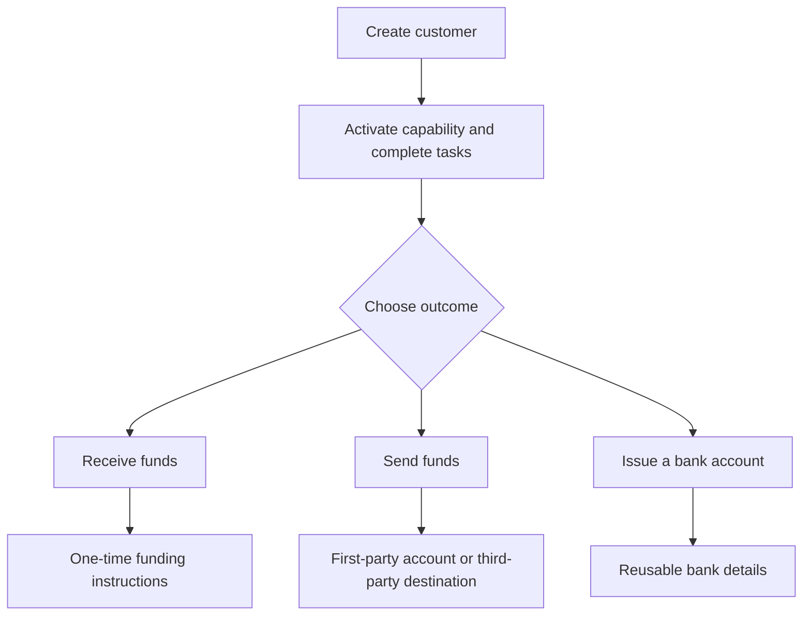

고객 결과에서 출발하세요. 각 흐름은 동일한 온보딩 모델을 사용하고, 이후 서로 다른 계좌와 자금 이동으로 분기돼요.

## 흐름 비교

| 결과 | 먼저 준비할 것 | 무엇을 받게 되나요 |
| --- | --- | --- |
| 페이인 | 준비된 페이인 케이퍼빌리티와 발급된 목적지 지갑 | 전송별 지침과 스테이블코인 정산 |
| 페이아웃 | 준비된 페이아웃 케이퍼빌리티, 충전된 발급 지갑, 준비된 계좌 또는 목적지 | 선택한 수취인 엔드포인트로의 전송 |
| 발급 은행 계좌 | 준비된 은행 케이퍼빌리티와 발급된 정산 지갑 | 프로비저닝 후 재사용 가능한 은행 정보 |

견적된 페이인은 하나의 전송에 대한 지침을 생성해요. 발급 은행 계좌는 이후 입금을 위한 재사용 가능한 정보를 생성해요. 페이아웃은 발급 지갑에 이미 있는 자금에서 시작해요.

## 흐름 선택

<CardGroup cols={3}>
  <Card title="자금 수취" icon="arrow-down-to-line" href="/ko/integration/receive-funds">
    법정화폐-스테이블코인 페이인을 생성하고 추적하세요.
  </Card>
  <Card title="자금 지급" icon="arrow-up-from-line" href="/ko/integration/send-funds">
    자사 또는 제3자 페이아웃을 구축하세요.
  </Card>
  <Card title="은행 계좌 발급" icon="building-columns" href="/ko/integration/issue-bank-account">
    지갑에 연결된 재사용 가능한 은행 정보를 프로비저닝하세요.
  </Card>
</CardGroup>
