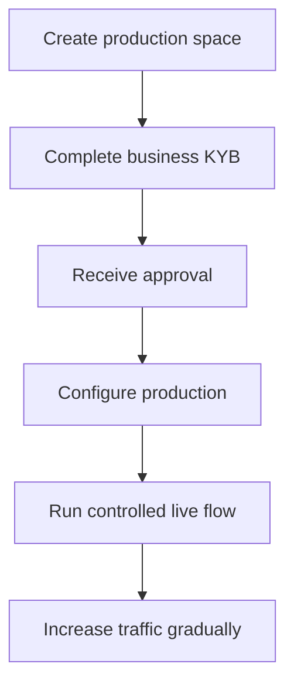

프로덕션 활성화는 통합하는 기업을 검증해요. 제품을 위해 만드는 API 고객과는 별개예요.

## 프로덕션 스페이스 활성화

1. Swipelux 대시보드에 로그인하고 **프로덕션 스페이스 생성**을 선택하세요.
2. KYB 탭을 열거나 [기업 검증](https://www.swipelux.app/kyb)으로 이동하세요.
3. 요청된 모든 필드를 작성하고 필수 문서를 업로드하세요.
4. 검증을 위해 통합하는 기업을 제출하고 승인을 기다리세요.

통합하는 기업과 프로덕션 스페이스가 승인된 뒤에만 프로덕션 API 고객과 거래를 생성할 수 있어요.

## 프로덕션을 독립적으로 유지

프로덕션 리소스를 명시적으로 생성하세요. API 키를 변경한다고 샌드박스 상태가 마이그레이션되지는 않아요.

- 프로덕션 자격 증명을 별도의 시크릿 매니저 항목에 저장하세요.
- 프로덕션 전용 배포 구성과 리소스 ID를 사용하세요.
- 별도의 프로덕션 웹훅 엔드포인트와 서명 시크릿을 등록하세요.
- 필수 고객, 케이퍼빌리티, 계좌, 수취인, 목적지를 프로덕션에서 다시 생성하세요.
- 프로덕션 접근을 필요한 서비스와 운영자에게 제한하세요.

샌드박스와 프로덕션은 `https://platform.swipelux.com`을 사용해요. API 키가 환경을 선택해요.

## 출시 체크리스트 완료

- [ ] 샌드박스에서 정상 경로와 예상 실패 경로를 테스트했어요.
- [ ] 필수인 모든 쓰기에 `Idempotency-Key`를 보내고, 안전한 재시도를 위해 유지했어요.
- [ ] 파싱 전에 웹훅 서명을 검증하고, 이벤트 ID를 안정적으로 저장하며, 재생을 테스트했어요.
- [ ] 사용 불가능한 케이퍼빌리티, 열린 태스크, 변경된 태스크 리비전을 처리했어요.
- [ ] 원래 키를 사용한 멱등 재시도를 포함해, 문서화된 [API 오류 및 재시도](/ko/integration/errors)를 처리했어요.
- [ ] 전송 실패와 실행 가능한 지침을 운영자에게 노출했어요.
- [ ] 로그가 `X-Request-Id` 또는 `correlationId`를 시크릿이나 민감한 금융 데이터 노출 없이 유지하는지 확인했어요.

## 통제된 라이브 흐름 하나 실행

알려진 고객과 저가치 거래 하나로 시작하세요. 다음을 기록하세요:

| 통제 | 테스트 전에 정의 |
| --- | --- |
| 범위 | 고객, 케이퍼빌리티, 계좌 또는 목적지, 금액, 방법. |
| 예상 결과 | 관찰될 것으로 예상되는 API 상태, 잔액 또는 지침, 웹훅 이벤트. |
| 담당자 | 전체 흐름을 지켜볼 책임자. |
| 중지 조건 | 예상치 못한 상태, 누락된 웹훅, 잘못된 금액, 미해결 태스크. |

현재 API 리소스와 인증된 웹훅 전달 모두를 검증하세요. 어느 하나라도 예상 결과와 다르면 더 많은 트래픽을 보내기 전에 멈추고 조사하세요.

전체 흐름이 성공한 후에는 케이퍼빌리티, 계좌, 목적지, 전송 상태를 모니터링하면서 볼륨을 점진적으로 늘리세요.

제품 여정은 [일반적인 흐름](/ko/integration/common-flows)으로 돌아가고, 실패 처리는 [오류 및 재시도](/ko/integration/errors)를 검토하거나, 정확한 계약을 위해 [API 레퍼런스](/ko/api-reference/introduction)를 사용하세요.
