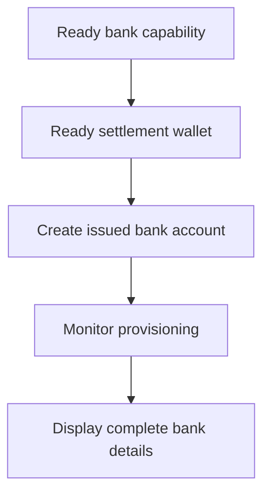

고객이 재사용 가능한 은행 정보를 필요로 할 때 발급 은행 계좌를 사용하세요. 특정 금액에 연결된 일회성 자금 조달 지침에는 [자금 수취](/ko/integration/receive-funds)를 대신 사용하세요.



## 시작 전에

고객 ID, 의도한 방법과 통화에 대한 준비된 은행 케이퍼빌리티, 그리고 같은 고객이 소유한 준비된 발급 지갑이 필요해요. 열린 작업은 [케이퍼빌리티와 태스크](/ko/integration/onboarding/capabilities-and-requirements)를 통해 완료하세요.

## 1. 정산 지갑 생성 또는 선택

[계좌와 지갑](/ko/integration/accounts#create-the-account)을 통해 발급 지갑을 생성한 뒤 다시 조회하세요. 현재 상태가 정산을 허용할 때만 계속 진행하세요.

응답에서 파생된 `data.id`를 `SETTLEMENT_WALLET_ID`로 저장하세요. `settlement.accountId`에는 외부 지갑을 사용하지 마세요.

## 2. 발급 은행 계좌 생성

다음 헤더로 [`POST /v3/customers/{customerId}/accounts`](/api-reference/accounts/post-v3-customers-by-customer-id-accounts)를 사용하세요:

```http
X-API-Key: ${SWIPELUX_API_KEY}
Idempotency-Key: issued-bank-account-001
Content-Type: application/json
```

이 요청 본문을 보내세요:

```json
{
  "origin": "issued",
  "type": "bank",
  "method": "ach",
  "country": "US",
  "currency": "USD",
  "settlement": {
    "accountId": "${SETTLEMENT_WALLET_ID}"
  },
  "label": "USD account"
}
```

반환된 `data.id`를 `BANK_ACCOUNT_ID`로 저장하세요. `data.status`, `data.openTaskIds`, `data.details`, 그리고 정산 관계도 유지하세요.

은행 계좌 ID와 지갑 ID는 서로 다른 역할이에요. 은행 계좌 ID를 통해 프로비저닝과 은행 정보를 조회하세요. 정산 지갑 ID는 입금이 어디에 크레딧되는지 식별하는 데 사용하세요.

## 3. 프로비저닝 모니터링

생성 후 그리고 관련 웹훅 이후마다 [`GET /v3/customers/{customerId}/accounts/{accountId}`](/api-reference/accounts/get-v3-customers-by-customer-id-accounts-by-account-id)를 조회하세요.

`details`가 없는 동안 고객 인터페이스는 대기 상태로 유지하세요. `openTaskIds`가 비어있지 않으면 최신 태스크를 완료하고 계좌를 다시 조회하세요. 경과 시간으로 준비 상태를 추정하지 마세요.

최신 `statusReason.code`가 `awaiting_assignment`이면 [자금 수취](/ko/integration/receive-funds)를 통해 동일한 고객, 케이퍼빌리티, 정산 지갑에 대한 첫 페이인을 생성한 뒤 은행 계좌를 다시 조회하세요. 현재 계좌가 요청할 때만 이 분기를 따르세요.

## 4. 은행 정보 안전하게 표시

최신 계좌 조회가 반환한 완전한 정보만 표시하세요. `details.referenceRequired`가 true이면 정확한 `details.reference`를 표시하고 복사 가능하게 만드세요. false이면 참조를 임의로 만들지 마세요.

이 은행 정보는 재사용 가능해요. 견적된 페이인의 자금 조달 좌표로 교체하지 마세요. 그 좌표는 그 전송에만 속해요.

다음으로 [웹훅](/ko/integration/webhooks)을 추가해 고객을 폴링 화면에 붙잡아 두지 않고도 프로비저닝 업데이트가 애플리케이션에 도달하도록 하세요.
