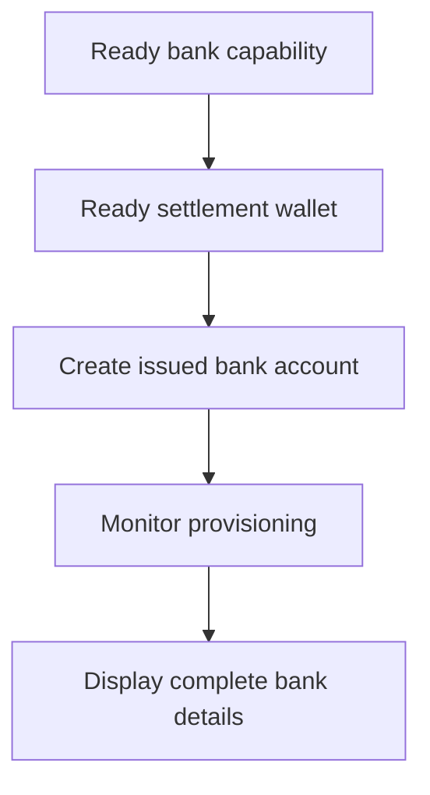

고객이 재사용 가능한 은행 정보를 필요로 할 때 발급 은행 계좌를 사용하세요. 특정 금액에 연결된 일회성 자금 조달 지침에는 [자금 수취](/ko/integration/receive-funds)를 대신 사용하세요.


```mermaid
flowchart TD
  A["Ready bank capability"] --> B["Ready settlement wallet"]
  B --> C["Create issued bank account"]
  C --> D["Monitor provisioning"]
  D --> E["Display complete bank details"]
```

## 시작 전에

고객 ID, 의도한 방법과 통화에 대한 준비된 은행 케이퍼빌리티, 그리고 같은 고객이 소유한 준비된 발급 지갑이 필요해요. `allowPending`을 사용하면 선택한 은행이 아직 고객을 검토하는 동안에도 요청을 저장할 수 있어요. 열린 작업은 [케이퍼빌리티와 태스크](/ko/integration/onboarding/capabilities-and-requirements)를 통해 완료하세요.

## 1. 정산 지갑 생성 또는 선택

[계좌와 지갑](/ko/integration/accounts#create-the-account)을 통해 발급 지갑을 생성한 뒤 다시 조회하세요. 현재 상태가 정산을 허용할 때만 계속 진행하세요.

응답에서 파생된 `data.id`를 `SETTLEMENT_WALLET_ID`로 저장하세요. `settlement.accountId`에는 외부 지갑을 사용하지 마세요.

## 2. 발급 은행 계좌 생성

다음 헤더로 [`POST /v3/customers/{customerId}/accounts`](/api-reference/accounts/post-v3-customers-by-customer-id-accounts)를 사용하세요:

```http
X-API-Key: ${SWIPELUX_API_KEY}
Idempotency-Key: issued-bank-account-001
Content-Type: application/json
```

이 요청 본문을 보내세요:

```json
{
  "origin": "issued",
  "type": "bank",
  "method": "ach",
  "country": "US",
  "currency": "USD",
  "settlement": {
    "accountId": "${SETTLEMENT_WALLET_ID}"
  },
  "label": "USD account"
}
```

반환된 `data.id`를 `BANK_ACCOUNT_ID`로 저장하세요. `data.status`, `data.openTaskIds`, `data.details`, 그리고 정산 관계도 유지하세요.

선택적 요청 필드:

| 필드 | 적용 대상 | 동작 |
| --- | --- | --- |
| `institution` | 발급 `ach`, `wire`, `swift` | 정확히 이 은행을 선택해요. Swipelux는 다른 은행으로 대체하지 않아요. 지원 케이퍼빌리티 응답에서 반환된 institution ID를 사용하세요. |
| `allowPending` | 발급 `ach`, `wire`, `swift` | `true`로 설정하면 선택한 은행의 신청이 승인을 기다리는 동안에도 요청을 저장해요. `institution`이 필요해요. |
| `settlement.currency` | 발급 은행 계좌 | `USDC` 또는 `USDT`. 정산 지갑으로 전달되는 스테이블코인을 설정해요. |

### 은행 선택 {#choose-the-bank}

고객에게 특정 은행의 은행 정보가 필요하면 `institution`을 보내세요. Swipelux는 고객, 방법, 통화, institution 조합마다 발급 계좌 하나를 예약해요. `institution`이 없는 요청은 고객이 어느 은행에서든 해당 방법과 통화의 발급 계좌를 이미 가지고 있으면 `409 conflict`를 반환해요. `institution`이 있는 요청은 해당 은행의 계좌가 이미 존재할 때만 `409 conflict`를 반환해요.

계좌 조회는 선택한 은행을 `id`, `name`, `bic`를 포함한 `institution`으로 반환해요. `bic`는 `null`일 수 있어요.

멱등성은 선택한 은행에 적용돼요. 같은 요청을 재전송하면 원래 계좌가 반환돼요. 같은 `Idempotency-Key`로 `institution`을 변경하면 `409 idempotency_conflict`가 반환돼요.

### 은행 승인 전에 요청 저장 {#save-the-request-before-bank-approval}

기본적으로 Swipelux는 은행 케이퍼빌리티가 준비된 후에만 발급 은행 계좌 요청을 수락해요. 고객의 계좌 설정을 더 일찍 수집하려면 `institution`과 함께 `allowPending: true`를 보내세요:

```json
{
  "origin": "issued",
  "type": "bank",
  "method": "wire",
  "country": "US",
  "currency": "USD",
  "institution": "${INSTITUTION_ID}",
  "allowPending": true,
  "settlement": {
    "accountId": "${SETTLEMENT_WALLET_ID}"
  },
  "label": "USD wire account"
}
```

은행의 신청이 검토 중인 동안 계좌는 `status: "in_review"`를 반환하고 `statusReason.code`는 `waiting_for_approval`로 설정돼요. 응답에는 `applicationId`와 신청의 `openTaskIds`도 포함돼요. 이 태스크는 [케이퍼빌리티와 태스크](/ko/integration/onboarding/capabilities-and-requirements)를 통해 완료하세요.

저장된 요청은 계좌 ID, 정산 지갑, 계좌 슬롯을 유지해요. 신청과 케이퍼빌리티가 준비되면 Swipelux는 같은 `BANK_ACCOUNT_ID`로 은행 정보를 프로비저닝해요. 그 ID를 계속 조회하세요. 다른 요청을 생성하지 마세요.

신청이 먼저 거절, 취소 또는 보관되면 계좌는 `rejected`가 돼요. 더 이상 계좌 슬롯을 차지하지 않아요.

### 정산 통화 선택 {#choose-the-settlement-currency}

기본적으로 입금은 정산 지갑의 통화로 정산돼요. `settlement.currency`를 `USDC` 또는 `USDT`로 설정하면 지갑 통화와 관계없이 전달될 자산을 선택할 수 있어요:

```json
{
  "settlement": {
    "accountId": "${SETTLEMENT_WALLET_ID}",
    "currency": "USDT"
  }
}
```

`USDT`에는 `USD` 계좌와 USDT 전달을 지원하는 네트워크의 정산 지갑이 필요해요. 그렇지 않으면 요청은 `400 invalid_settlement_target`을 반환해요. 계좌 조회는 프로비저닝 중일 때를 포함해 저장된 선택을 반환해요.

은행 계좌 ID와 지갑 ID는 서로 다른 역할이에요. 은행 계좌 ID를 통해 프로비저닝과 은행 정보를 조회하세요. 정산 지갑 ID는 입금이 어디에 크레딧되는지 식별하는 데 사용하세요.

## 3. 프로비저닝 모니터링

생성 후 그리고 관련 웹훅 이후마다 [`GET /v3/customers/{customerId}/accounts/{accountId}`](/api-reference/accounts/get-v3-customers-by-customer-id-accounts-by-account-id)를 조회하세요.

`details`가 없는 동안 고객 인터페이스는 대기 상태로 유지하세요. `openTaskIds`가 비어있지 않으면 최신 태스크를 완료하고 계좌를 다시 조회하세요. 경과 시간으로 준비 상태를 추정하지 마세요.

계좌를 `allowPending: true`로 저장했다면 은행이 신청을 승인할 때까지 계좌는 `in_review` 상태로 유지되고 `statusReason.code`는 `waiting_for_approval`로 설정돼요.

최신 `statusReason.code`가 `awaiting_assignment`이면 [자금 수취](/ko/integration/receive-funds)를 통해 동일한 고객, 케이퍼빌리티, 정산 지갑에 대한 첫 페이인을 생성한 뒤 은행 계좌를 다시 조회하세요. 현재 계좌가 요청할 때만 이 분기를 따르세요.

## 4. 은행 정보 안전하게 표시

최신 계좌 조회가 반환한 완전한 정보만 표시하세요. `details.referenceRequired`가 true이면 정확한 `details.reference`를 표시하고 복사 가능하게 만드세요. false이면 참조를 임의로 만들지 마세요.

발급 `swift` 계좌의 경우 반환되면 `details.bankName`, `details.swiftCode`(수취 은행의 BIC), `details.accountNumber`, `details.accountHolderName`, `details.accountHolderAddress`를 표시하세요. 송금인은 수취인 주소를 국제 전신 송금에 정확히 복사해야 해요. `details.bankAddress`와 계좌가 반환하는 중개 은행 필드도 함께 표시하세요.

이 은행 정보는 재사용 가능해요. 견적된 페이인의 자금 조달 좌표로 교체하지 마세요. 그 좌표는 그 전송에만 속해요.

다음으로 [웹훅](/ko/integration/webhooks)을 추가해 고객을 폴링 화면에 붙잡아 두지 않고도 프로비저닝 업데이트가 애플리케이션에 도달하도록 하세요.
