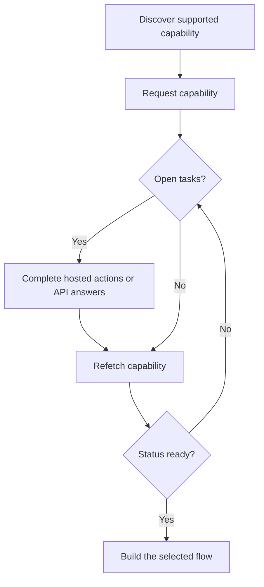

케이퍼빌리티는 고객이 특정 결과, 결제 방법, 방향을 사용할 수 있는지 알려줘요. 열린 태스크는 그 케이퍼빌리티나 관련 리소스가 진행되기 전에 무엇이 이뤄져야 하는지 알려줘요.



```bash
export API_BASE='https://platform.swipelux.com'
export SWIPELUX_API_KEY='replace-with-your-api-key'
```

## 지원되는 케이퍼빌리티 발견

[`GET /v3/customers/{customerId}/capabilities/supported`](/api-reference/capabilities/get-v3-customers-by-customer-id-capabilities-supported)로 고객의 현재 옵션을 조회하세요:

```bash
curl --request GET \
  "${API_BASE}/v3/customers/${CUSTOMER_ID}/capabilities/supported" \
  --header "X-API-Key: ${SWIPELUX_API_KEY}"
```

의도한 `directions`, `method`, `accountType`과 일치하는 응답 항목을 선택하세요. `availability`가 `available` 또는 `beta`이고 `eligibility.eligible`이 `true`일 때만 진행하세요. `institutions`가 반환되면 그 응답의 ID만 선택하세요.

선택한 `data[].id`를 `CAPABILITY_ID`로 저장하세요. 다른 고객이나 환경의 케이퍼빌리티 ID를 절대 복사하지 마세요.

### 풀 계좌 대 명명 계좌 유형

은행 케이퍼빌리티는 두 가지 변형으로 제공되며, `accountType` 필드와 케이퍼빌리티 ID 접미사로 인코딩돼요 (예: `ach_pooled`, `wire_named`):

- **`pooled`**: 공유 Swipelux 은행 계좌예요. 각 페이인은 자금을 라우팅하기 위해 고유 참조를 사용해요. 일회성 전송에는 이것을 선택하세요.
- **`named`**: 고객 전용 은행 정보예요(가상 IBAN, 전용 ACH 계좌). 재사용 가능하며 어떤 지불자와도 공유할 수 있어요. [발급 은행 계좌](/ko/integration/issue-bank-account)에 필수예요.

기본값은 `pooled`이에요. 고객이 재사용 가능한 은행 정보가 필요할 때만 `named`를 사용하세요. 사용 가능한 변형은 `supported` 응답을 확인하세요.

## 케이퍼빌리티 요청

[`POST /v3/customers/{customerId}/capabilities/{capabilityId}`](/api-reference/capabilities/post-v3-customers-by-customer-id-capabilities-by-capability-id)로 선택한 옵션을 요청하세요:

```bash
curl --request POST \
  "${API_BASE}/v3/customers/${CUSTOMER_ID}/capabilities/${CAPABILITY_ID}" \
  --header "X-API-Key: ${SWIPELUX_API_KEY}" \
  --header "Idempotency-Key: capability-request-001" \
  --header "Content-Type: application/json" \
  --data '{}'
```

명시적인 `institutions` 배열은 지원되는 케이퍼빌리티 응답이 반환한 ID 중에서 선택해야 할 때만 사용하세요.

`data.status`를 `CAPABILITY_STATUS`, `data.openTaskIds`를 `OPEN_TASK_IDS`, 각 `data.applications[].id`를 `APPLICATION_IDS`에 저장하세요.

## 현재 태스크 완료

[`GET /v3/customers/{customerId}/tasks`](/api-reference/tasks/list-customer-tasks)로 태스크를 나열하고, `OPEN_TASK_IDS`에서 ID를 선택한 뒤, [`GET /v3/customers/{customerId}/tasks/{taskId}`](/api-reference/tasks/get-customer-task)로 각 현재 태스크를 조회하세요:

```bash
curl --request GET \
  "${API_BASE}/v3/customers/${CUSTOMER_ID}/tasks/${TASK_ID}" \
  --header "X-API-Key: ${SWIPELUX_API_KEY}"
```

최신 `data.revision`과 `data.requirements`를 사용하세요. 둘 중 하나가 변경되었을 수 있다면 제출 직전에 태스크를 다시 조회하세요.

### 호스팅된 작업

태스크가 `verificationSessions` 또는 `tosSessions`를 반환하면 각 세션 `id`와 현재 `url`을 저장하세요. 반환된 URL로 고객을 안내한 뒤 태스크를 다시 조회하세요. 이것들은 태스크 범위 작업이며, 별도의 고객 검증 라이프사이클이 아니에요.

### 문서 업로드

요건이 문서를 요청하면 [`POST /v3/customers/{customerId}/documents`](/api-reference/documents/post-v3-customers-by-customer-id-documents)로 업로드하세요:

```bash
export DOCUMENT_PATH='/absolute/path/to/requested-document.pdf'

curl --request POST \
  "${API_BASE}/v3/customers/${CUSTOMER_ID}/documents" \
  --header "X-API-Key: ${SWIPELUX_API_KEY}" \
  --header "Idempotency-Key: customer-document-001" \
  --form "file=@${DOCUMENT_PATH}"
```

이를 참조하는 답변을 제출하기 전에 반환된 `data.id`를 `DOCUMENT_ID`로 저장하세요.

### API 답변

현재 리비전에 대한 완전한 답변 세트 하나를 [`POST /v3/customers/{customerId}/tasks/{taskId}/submissions`](/api-reference/task-submissions/create-customer-task-submission)로 제출하세요:

```bash
curl --request POST \
  "${API_BASE}/v3/customers/${CUSTOMER_ID}/tasks/${TASK_ID}/submissions" \
  --header "X-API-Key: ${SWIPELUX_API_KEY}" \
  --header "Idempotency-Key: task-submission-001" \
  --header "Content-Type: application/json" \
  --data @- <<'JSON'
{
  "taskRevision": 3,
  "answers": [
    {
      "requirementId": "req_from_current_task",
      "answer": {
        "type": "text",
        "value": "Current answer"
      }
    }
  ]
}
JSON
```

모든 요건 ID와 답변 유형은 최신 태스크에서 가져오세요. API가 태스크가 변경되었다고 알리면 다시 조회하고 새 리비전에서 제출을 재구성하세요.

## 케이퍼빌리티가 준비되면 계속 진행

[`GET /v3/customers/{customerId}/capabilities/{capabilityId}`](/api-reference/capabilities/get-v3-customers-by-customer-id-capabilities-by-capability-id)로 케이퍼빌리티를 다시 조회하세요:

```bash
curl --request GET \
  "${API_BASE}/v3/customers/${CUSTOMER_ID}/capabilities/${CAPABILITY_ID}" \
  --header "X-API-Key: ${SWIPELUX_API_KEY}"
```

저장된 상태와 태스크 ID를 최신 응답으로 교체하세요. 현재 케이퍼빌리티 상태가 생성하려는 계좌, 견적, 전송을 허용할 때만 계속 진행하세요.

다음으로 [일반적인 흐름](/ko/integration/common-flows)에서 일치하는 여정을 선택하세요.
