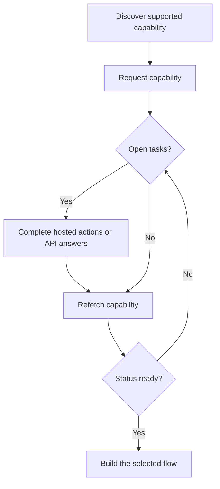

케이퍼빌리티는 고객이 특정 결과, 결제 방법, 방향을 사용할 수 있는지 알려줘요. 열린 태스크는 그 케이퍼빌리티나 관련 리소스가 진행되기 전에 무엇이 이뤄져야 하는지 알려줘요.


```mermaid
flowchart TD
  A["Discover supported capability"] --> B["Request capability"]
  B --> C{"Open tasks?"}
  C -->|"Yes"| D["Complete hosted actions or API answers"]
  D --> E["Refetch capability"]
  C -->|"No"| E
  E --> F{"Status ready?"}
  F -->|"No"| C
  F -->|"Yes"| G["Build the selected flow"]
```

```bash
export API_BASE='https://platform.swipelux.com'
export SWIPELUX_API_KEY='replace-with-your-api-key'
```

## 지원되는 케이퍼빌리티 발견

[`GET /v3/customers/{customerId}/capabilities/supported`](/api-reference/capabilities/get-v3-customers-by-customer-id-capabilities-supported)로 고객의 현재 옵션을 조회하세요:

```bash
curl --request GET \
  "${API_BASE}/v3/customers/${CUSTOMER_ID}/capabilities/supported" \
  --header "X-API-Key: ${SWIPELUX_API_KEY}"
```

의도한 `directions`, `method`, `accountType`과 일치하는 응답 항목을 선택하세요. `availability`가 `available` 또는 `beta`이고 `eligibility.eligible`이 `true`일 때만 진행하세요. `institutions`가 반환되면 그 응답의 ID만 선택하세요.

각 기관 항목에는 `logoUrl`과 `isDefault` 플래그가 포함돼요. 은행 선택 UI에서 은행 로고를 보여줄 때 `logoUrl`을 사용하고, 값이 `null`이면 자체 일반 은행 아이콘을 렌더링하세요. `isDefault`는 기관 전체가 아니라 이 고객과 케이퍼빌리티에만 적용돼요. [`GET /v3/institutions`](/api-reference/institutions/get-v3-institutions)도 같은 nullable `logoUrl`을 반환해요. 기관 ID는 불투명한 값이므로 코드 변경 없이 새 ID를 처리할 수 있게 하세요.

```json
{
  "institutions": [
    {
      "id": "jpmorgan",
      "name": "JPMorgan Chase",
      "bic": "CHASUS33",
      "logoUrl": "https://wallet.swipelux.com/bank-logos/jpmorgan.png",
      "countries": ["US"],
      "isDefault": true
    }
  ]
}
```

선택한 `data[].id`를 `CAPABILITY_ID`로 저장하세요. 다른 고객이나 환경의 케이퍼빌리티 ID를 절대 복사하지 마세요.

### 풀 계좌 대 명명 계좌 유형

은행 케이퍼빌리티는 두 가지 변형으로 제공되며, `accountType` 필드와 케이퍼빌리티 ID 접미사로 인코딩돼요 (예: `ach_pooled`, `wire_named`):

- **`pooled`**: 공유 Swipelux 은행 계좌예요. 각 페이인은 자금을 라우팅하기 위해 고유 참조를 사용해요. 일회성 전송에는 이것을 선택하세요.
- **`named`**: 고객 전용 은행 정보예요(가상 IBAN, 전용 ACH 계좌). 재사용 가능하며 어떤 지불자와도 공유할 수 있어요. [발급 은행 계좌](/ko/integration/issue-bank-account)에 필수예요.

기본값은 `pooled`이에요. 고객이 재사용 가능한 은행 정보가 필요할 때만 `named`를 사용하세요. 사용 가능한 변형은 `supported` 응답을 확인하세요.

SWIFT 입금을 받거나 SWIFT 은행 정보를 발급하려면 `swift_named`를 사용하세요. `swift_pooled`는 페이아웃만 지원하므로, 지원되는 케이퍼빌리티 응답에서 각 옵션의 `directions`를 확인하세요. 명명 SWIFT 계좌는 은행의 BIC, 필요한 경우 참조, 그리고 은행이 제공하는 경우 수취인 주소를 포함한 재사용 가능한 수취 정보를 반환해요.

발급 ACH, Wire, SWIFT 계좌의 경우 `institution`으로 특정 은행을 선택하고, 은행이 고객을 승인하기 전에 계좌 요청을 저장할 수 있어요. [은행 계좌 발급](/ko/integration/issue-bank-account#choose-the-bank)을 참고하세요.

## 케이퍼빌리티 요청

[`POST /v3/customers/{customerId}/capabilities/{capabilityId}`](/api-reference/capabilities/post-v3-customers-by-customer-id-capabilities-by-capability-id)로 선택한 옵션을 요청하세요:

```bash
curl --request POST \
  "${API_BASE}/v3/customers/${CUSTOMER_ID}/capabilities/${CAPABILITY_ID}" \
  --header "X-API-Key: ${SWIPELUX_API_KEY}" \
  --header "Idempotency-Key: capability-request-001" \
  --header "Content-Type: application/json" \
  --data '{}'
```

명시적인 `institutions` 배열은 지원되는 케이퍼빌리티 응답이 반환한 ID 중에서 선택해야 할 때만 사용하세요.

`data.status`를 `CAPABILITY_STATUS`, `data.accountProvisioning`을 `ACCOUNT_PROVISIONING_STATUS`, `data.openTaskIds`를 `OPEN_TASK_IDS`, 각 `data.applications[].id`를 `APPLICATION_IDS`에 저장하세요.

### 은행별 공유 신청 {#shared-applications-per-bank}

명명 은행 케이퍼빌리티의 경우 각 고객은 은행마다 하나의 신청 건을 가져요. 풀 및 플랫폼 케이퍼빌리티는 은행이 없는 신청 건을 사용해요. Swipelux는 요청한 모든 호환 케이퍼빌리티에서 신청 건을 공유해요:

- 한 번의 승인으로 여러 케이퍼빌리티를 커버할 수 있어요. 예를 들어 한 은행에서 승인된 신청 건으로 ACH와 wire 케이퍼빌리티가 모두 `ready`가 될 수 있어요.
- 기존 신청 건과 일치하는 이후 요청은 그 신청 건을 재사용해요. Swipelux는 두 번째 신청을 열지 않고 중복 태스크도 추가하지 않아요.
- 서로 다른 은행의 신청 건은 독립적이에요. 한 은행의 거절은 다른 은행의 신청 건에 영향을 주지 않아요.

요청 응답을 보면 Swipelux가 어떤 신청 건을 사용했는지 알 수 있어요:

- `201`은 요청이 새 신청 건을 열었다는 뜻이에요.
- `200`은 요청이 고객이 이미 가진 신청 건으로 확인되었다는 뜻이에요. 예를 들어 고객이 이미 보유한 은행 케이퍼빌리티를 반복 요청하거나, 취소된 케이퍼빌리티를 요청한 경우예요. `card` 또는 `stablecoin_transfers`를 반복 요청하면 여전히 [`409 capability_already_exists`](/integration/errors#capability-already-exists)를 반환해요.
- `selectedApplicationId`는 `data` 옆에 있는 최상위 필드로, 요청이 선택하거나 연 신청 건의 ID를 담고 있어요. 요청이 신청 건을 선택하지 않았다면 Swipelux는 이 필드를 생략해요. 멱등 재실행은 같은 값을 반환해요.

축약된 응답:

```json
{
  "data": {
    "id": "ach_named",
    "status": "pending",
    "openTaskIds": ["tsk_000000000000000002"],
    "applications": [{ "id": "apl_000000000000000005", "status": "in_review" }]
  },
  "selectedApplicationId": "apl_000000000000000005"
}
```

명명 케이퍼빌리티의 경우 같은 신청 건을 선택하려면 같은 `institutions` 목록을 다시 보내고, 특정 은행을 대상으로 하려면 기관 ID 하나를 보내세요. 고객을 최종 거절한 은행은 건너뛰어요. 그 은행만 지정했거나 모든 적격 은행이 고객을 거절했다면 요청은 [`409 capability_terminally_rejected`](/integration/errors#capability-terminally-rejected)를 반환해요. 거절 후 다른 은행을 시도하려면 그 은행의 기관 ID로 케이퍼빌리티를 다시 요청하세요.

케이퍼빌리티의 상태는 고객의 관련된 모든 신청 건을 반영해요. 명명 케이퍼빌리티의 경우, 승인이 해당 케이퍼빌리티를 커버하는 `ready` 신청 건이 하나만 있으면 다른 은행이 무엇을 보고하든 `ready`가 돼요. 풀 케이퍼빌리티는 방법 확인도 기다리며, 이는 고객 신청 목록의 `probes`에 보고돼요.

#### 고객의 신청 나열 {#list-the-customers-applications}

[`GET /v3/customers/{customerId}/applications`](/api-reference/capabilities/get-v3-customers-by-customer-id-applications)로 고객의 모든 신청 건을 나열하세요. 결과는 `nextCursor`와 `hasMore`로 페이지가 나뉘며 `updatedAfter`를 받아요:

```bash
curl --request GET \
  "${API_BASE}/v3/customers/${CUSTOMER_ID}/applications" \
  --header "X-API-Key: ${SWIPELUX_API_KEY}"
```

각 항목에는 케이퍼빌리티의 `applications[]`에서 반환되는 신청 필드와 함께 다음이 포함돼요:

- `scope`: 한 은행의 신청 건은 `named`, 은행이 없는 신청 건은 `provider_pooled` 또는 `platform`, 분류되지 않은 과거 신청 건은 `null`이에요. `provider_pooled`와 `platform` 신청 건에는 `institution`이 없어요.
- `requestedScope[]`: 신청 건에 대해 요청된 케이퍼빌리티 키로, 각각 최초 `requestedAt`을 포함해요. 항목은 절대 제거되지 않아요.
- `coverage[]`: 신청 건의 승인이 커버하는 케이퍼빌리티 키로, 각각 `grantedAt`과 `source`를 포함해요. 커버리지는 범위를 기록할 뿐 권한 부여를 뜻하지 않아요. 현재 상태는 케이퍼빌리티를 조회해 확인하세요.
- `probes[]`: 신청 건이 커버하는 풀 케이퍼빌리티 키에 대한 방법 확인으로, 각각 `capabilityKey`, `status`, `reason`을 포함해요. 명명 키는 프로브가 필요하지 않아요.
- `generation`, `predecessorApplicationId`, `supersededByApplicationId`: 승계 링크예요. `supersededByApplicationId`가 설정되어 있으면 해당 신청 건은 대체된 거예요. 그 ID를 따라 현재 신청 건으로 이동하세요.

축약된 응답:

```json
{
  "data": [
    {
      "id": "apl_000000000000000005",
      "status": "ready",
      "scope": "named",
      "institution": { "id": "jpmorgan", "name": "JPMorgan Chase", "bic": "CHASUS33" },
      "requestedScope": [
        { "capabilityKey": "ach_named", "requestedAt": "2026-09-20T10:00:00.000Z" }
      ],
      "coverage": [
        { "capabilityKey": "ach_named", "grantedAt": "2026-09-22T12:00:00.000Z", "source": "approval" },
        { "capabilityKey": "wire_named", "grantedAt": "2026-09-22T12:00:00.000Z", "source": "approval" }
      ],
      "probes": [],
      "generation": 1,
      "predecessorApplicationId": null,
      "supersededByApplicationId": null
    }
  ],
  "nextCursor": null,
  "hasMore": false
}
```

## 현재 태스크 완료 {#complete-current-tasks}

[`GET /v3/customers/{customerId}/tasks`](/api-reference/tasks/list-customer-tasks)로 태스크를 나열하고, `OPEN_TASK_IDS`에서 ID를 선택한 뒤, [`GET /v3/customers/{customerId}/tasks/{taskId}`](/api-reference/tasks/get-customer-task)로 각 현재 태스크를 조회하세요:

```bash
curl --request GET \
  "${API_BASE}/v3/customers/${CUSTOMER_ID}/tasks/${TASK_ID}" \
  --header "X-API-Key: ${SWIPELUX_API_KEY}"
```

최신 `data.revision`과 `data.requirements`를 사용하세요. 둘 중 하나가 변경되었을 수 있다면 제출 직전에 태스크를 다시 조회하세요.

### 재사용되는 프로필 증거 {#reused-profile-evidence}

직접 API 제출을 받는 신청 접수 태스크에서 Swipelux는 고객이 이미 제공한 정보를 재사용해요. 이런 태스크가 생성되거나 조정될 때 Swipelux는 고객 프로필과 고객이 직접 업로드한 문서를 확인해요. 사용 가능한 프로필 값이나 문서로 이미 뒷받침되는 적격 요건은 실행 가능 상태로 남지 않고 `in_review`로 이동해요. 프로필 업데이트와 새 문서 업로드도 기존 태스크에 대해 같은 확인을 트리거해요.

누락되었거나 호환되지 않는 값만 실행 가능 상태로 남아요. 재사용이 증거를 승인하는 것은 아니며, Swipelux는 여전히 이를 검토해요. 명시적인 수정 요청과 이전에 답변한 요건은 실행 가능 상태로 남아요. 소유자와 관계자 문서는 재사용되지 않으며, 호스팅된 세션을 통해서만 수집되는 요건은 일반 흐름을 따라요.

### 요건 렌더링 {#render-requirements}

요건 키가 아니라 각 요건이 반환하는 메타데이터로 양식을 구성하세요. 요건에는 선택적인 짧은 `title`이 포함될 수 있으며, 모든 `request`에는 제목 아래에 표시할 `prompt`가 포함돼요.

`request.type: "profile"`인 요건은 `profilePointer`로 프로필 필드를 식별하고 입력 메타데이터를 추가해요:

- `allowedValues`: 스칼라 필드 또는 배열 필드의 각 항목에 허용되는 값이에요. 번역된 표시 레이블이 아니라 이 값을 제출하세요.
- `valueSchema`: 입력 형태, 중첩 속성, 필수 필드, 구조적 제약을 설명하는 독립적인 JSON Schema Draft 7 문서예요. 객체의 열거형은 관련 속성에 나타나요. 예를 들어 세금 식별자의 경우 `valueSchema.items.properties.type.enum`이에요. Swipelux는 제출 후에도 필드 간 검증과 검토 검증을 적용하므로, 스키마를 통과한 값도 거절될 수 있어요.
- `valueType: "country"`, 또는 배열의 경우 `itemValueType: "country"`: 이 필드는 대문자 ISO 3166-1 alpha-2 코드를 받아요. `valueSchema`의 중첩 국가 속성은 `format: "iso-3166-1-alpha-2"`를 사용해요. 현지화된 레이블에는 표준 국가 목록을 사용하세요.

```json
{
  "id": "req_000000000000000010",
  "key": "account_purposes",
  "title": "Account purpose",
  "status": "action_required",
  "request": {
    "type": "profile",
    "prompt": "Select every purpose that applies.",
    "required": true,
    "profilePointer": "/financialProfile/accountPurposes",
    "valueType": "array",
    "itemValueType": "string",
    "allowedValues": ["business_expenses", "ecommerce", "payroll"],
    "valueSchema": {
      "$schema": "http://json-schema.org/draft-07/schema#",
      "type": "array",
      "items": { "enum": ["business_expenses", "ecommerce", "payroll"] }
    }
  }
}
```

이 예시는 값 목록을 줄여서 보여주며, API는 허용되는 모든 값을 반환해요. 일부 프로필 요건은 공개된 스키마가 없어 `valueSchema`와 `allowedValues`를 생략해요. 이런 요건은 `prompt`와 `valueType`으로 렌더링하세요.

모든 열린 작업에는 `dueAt` 타임스탬프가 포함됩니다. Swipelux가 명시적인 기한 없이 작업을 생성하면 `dueAt`은 기본적으로 작업의 `createdAt`으로부터 정확히 31일 후로 설정됩니다. `dueAt`은 참고용으로만 취급하세요. API를 통해 설정할 수 없으며 자동 수명 주기 전환을 트리거하지 않습니다. 자동 전환은 별도로 설정된 `deadline` 필드가 있는 경우에만 발생합니다.

### 호스팅된 작업

태스크 상세 응답에서 `verificationSessions`와 `tosSessions`의 각 항목은 `action` 객체를 포함해요. 태스크 목록 응답에는 이러한 작업 링크가 포함되지 않아요. 각 세션의 `id`를 저장하고 고객을 안내하기 전에 `action.kind`를 확인하세요. 세션의 `status`만으로 링크 사용 가능 여부를 추론하지 마세요.

- `action.kind: "available"`은 `action.url`과 `action.expiresAt`을 포함해요(현재는 항상 `null`이에요). `action.url`을 저장하고 고객을 해당 URL로 안내한 다음 태스크를 다시 조회하세요. 세션 수준의 `url`과 `expiresAt` 필드는 같은 값을 포함해요.
- `action.kind: "unavailable"`은 링크를 제시하지 않아야 한다는 뜻이에요. 세션 수준의 `url`과 `expiresAt` 필드는 없어요. 세션의 `status`만으로 어떤 작업 종류가 반환될지는 결정되지 않아요.

```json
{
  "data": {
    "verificationSessions": [
      {
        "id": "vfy_000000000000000003",
        "key": "identity_verification",
        "type": "identity_verification",
        "status": "action_required",
        "action": {
          "kind": "available",
          "url": "https://platform.swipelux.com/kyc/redirect/cus_000000000000000001/tsk_000000000000000002/vfy_000000000000000003",
          "expiresAt": null
        },
        "url": "https://platform.swipelux.com/kyc/redirect/cus_000000000000000001/tsk_000000000000000002/vfy_000000000000000003",
        "expiresAt": null
      }
    ],
    "tosSessions": [
      {
        "id": "vfy_000000000000000004",
        "key": "terms_of_service",
        "type": "terms_of_service",
        "status": "completed",
        "action": { "kind": "unavailable" }
      }
    ]
  }
}
```

이것들은 태스크 범위 작업이며, 별도의 고객 검증 라이프사이클이 아니에요.

### 문서 업로드 {#upload-documents}

요건이 문서를 요청하면 [`POST /v3/customers/{customerId}/documents`](/api-reference/documents/post-v3-customers-by-customer-id-documents)로 업로드하세요:

```bash
export DOCUMENT_PATH='/absolute/path/to/requested-document.pdf'

curl --request POST \
  "${API_BASE}/v3/customers/${CUSTOMER_ID}/documents" \
  --header "X-API-Key: ${SWIPELUX_API_KEY}" \
  --header "Idempotency-Key: customer-document-001" \
  --form "file=@${DOCUMENT_PATH}"
```

이를 참조하는 답변을 제출하기 전에 반환된 `data.id`를 `DOCUMENT_ID`로 저장하세요.

저장된 파일을 나중에 가져오려면 [`GET /v3/customers/{customerId}/documents/{documentId}/download`](/api-reference/documents/get-v3-customers-by-customer-id-documents-by-document-id-download)를 호출하세요. Swipelux는 파일을 첨부 파일로 다운로드하는 `url`을 반환하며, 이 URL은 1시간 후에 만료돼요. 아카이브된 문서는 `404`를 반환해요.

### API 답변

현재 리비전에 대한 완전한 답변 세트 하나를 [`POST /v3/customers/{customerId}/tasks/{taskId}/submissions`](/api-reference/task-submissions/create-customer-task-submission)로 제출하세요:

```bash
curl --request POST \
  "${API_BASE}/v3/customers/${CUSTOMER_ID}/tasks/${TASK_ID}/submissions" \
  --header "X-API-Key: ${SWIPELUX_API_KEY}" \
  --header "Idempotency-Key: task-submission-001" \
  --header "Content-Type: application/json" \
  --data @- <<'JSON'
{
  "taskRevision": 3,
  "answers": [
    {
      "requirementId": "req_from_current_task",
      "answer": {
        "type": "text",
        "value": "Current answer"
      }
    }
  ]
}
JSON
```

모든 요건 ID와 답변 유형은 최신 태스크에서 가져오세요. API가 태스크가 변경되었다고 알리면 다시 조회하고 새 리비전에서 제출을 재구성하세요.

### 기업의 실질적 소유자 전제 조건 {#beneficial-owner-prerequisite-for-businesses}

실질적 소유자 증거가 필요한 기업 케이퍼빌리티 요청은 고객에게 아직 자격을 갖춘 소유자가 없어도 성공해요. 케이퍼빌리티는 `statusReason.code: tasks_due`와 함께 `restricted`로 생성되고, 기업 인테이크 태스크가 소유권 구조를 포함해 누락된 소유권 사실을 요청해요.

같은 태스크는 요청에 `qualification: "beneficial_owner"`가 포함된 `resource_reference` 요건을 담고 있어요:

```json
{
  "type": "resource_reference",
  "prompt": "Add or select a qualifying beneficial owner.",
  "required": true,
  "resourceType": "related_party",
  "qualification": "beneficial_owner"
}
```

관계자는 같은 고객의 활성 `person` 당사자이면서 `ownership.declared: true`이거나 제공된 소유권 비율이 25 이상일 때 자격을 갖춰요.

이 요건은 현재 관계자 명단에서 도출되므로 일반적으로 직접 답변하지 않아요:

- 자격을 갖춘 관계자를 생성하거나 업데이트하면 같은 재평가에서 요건이 충족되고, 그 소유자 자신의 프로필과 문서 작업이 열려요. [기업 관계자 추가](/ko/integration/onboarding/customers#add-business-related-parties)를 참고하세요.
- `relatedPartyId`를 담은 `resource_reference` 답변으로 자격을 갖춘 당사자를 명시적으로 참조할 수도 있어요.
- 요건은 충족된 후에도 현재 태스크에 계속 나열돼요. 다른 열린 의무가 남아 있지 않으면 태스크는 `satisfied`가 돼요.
- 마지막 자격을 갖춘 당사자를 보관 처리하거나 자격을 갖추게 한 사실을 제거하면, 태스크가 `satisfied`가 된 후라도 요건이 다시 열려요.

## 케이퍼빌리티가 준비되면 계속 진행

[`GET /v3/customers/{customerId}/capabilities/{capabilityId}`](/api-reference/capabilities/get-v3-customers-by-customer-id-capabilities-by-capability-id)로 케이퍼빌리티를 다시 조회하세요:

```bash
curl --request GET \
  "${API_BASE}/v3/customers/${CUSTOMER_ID}/capabilities/${CAPABILITY_ID}" \
  --header "X-API-Key: ${SWIPELUX_API_KEY}"
```

저장된 상태, 계좌 발급 상태, 태스크 ID를 최신 응답으로 교체하세요. 케이퍼빌리티 `status`는 권한이 승인되었는지를 나타내요. 계좌를 발급하는 케이퍼빌리티의 경우 `accountProvisioning`이 그 계좌가 `not_started`, `in_progress`, `issued`, `failed` 중 어느 상태인지 별도로 보고해요. 계좌를 발급하지 않는 케이퍼빌리티는 `not_applicable`을 반환해요.

현재 케이퍼빌리티 상태가 생성하려는 계좌, 견적, 전송을 허용할 때만 계속 진행하세요. 흐름에 발급된 계좌가 필요하면 `accountProvisioning`이 `issued`가 될 때까지도 기다리세요.

다음으로 [일반적인 흐름](/ko/integration/common-flows)에서 일치하는 여정을 선택하세요.
