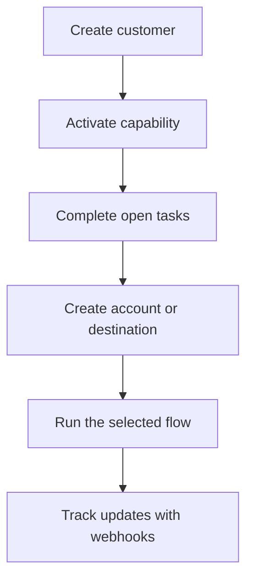

Swipelux는 제품 내에 결제 인프라를 노출하지 않고도 고객을 온보딩하고 자금을 이동시킬 수 있는 구성 요소를 백엔드에 제공해요.

## 무엇을 만들 수 있나요

<CardGroup cols={3}>
  <Card title="자금 수취" icon="arrow-down-to-line" href="/ko/integration/receive-funds">
    일회성 법정화폐 자금 조달 지침을 생성하고 스테이블코인으로 지갑에 정산하세요.
  </Card>
  <Card title="자금 지급" icon="arrow-up-from-line" href="/ko/integration/send-funds">
    고객 지갑에서 자사 계좌 또는 제3자 목적지로 전송하세요.
  </Card>
  <Card title="은행 계좌 발급" icon="building-columns" href="/ko/integration/issue-bank-account">
    정산 지갑에 연결된 재사용 가능한 은행 정보를 프로비저닝하세요.
  </Card>
</CardGroup>

## 통합은 어떻게 작동하나요

고객은 흐름을 소유하는 개인 또는 기업이에요. 케이퍼빌리티는 그 고객이 사용할 수 있는 결과를 설명해요. 열린 태스크는 케이퍼빌리티나 리소스가 진행되기 전에 완료해야 할 항목을 알려줘요.

## 실제로 체험하기

시뮬레이션된 네오뱅크 경험을 사용해 보려면 [demo.swipelux.com](https://demo.swipelux.com)을 살펴보세요. [스타터를 복제](https://github.com/swipelux/neobank-starter)하여 제품 인터페이스를 커스터마이징할 수도 있어요.

데모와 스타터는 제품 및 UI 참고 자료예요. 이 가이드나 현재 API 계약을 대체하지는 않아요.

## 구축 시작하기

<CardGroup cols={3}>
  <Card title="퀵스타트" icon="rocket" href="/ko/integration/quickstart">
    고객을 생성하고 하나의 샌드박스 흐름을 실행하세요.
  </Card>
  <Card title="일반적인 흐름" icon="route" href="/ko/integration/common-flows">
    각 결과에 필요한 설정을 비교하세요.
  </Card>
  <Card title="API 레퍼런스" icon="code" href="/ko/api-reference/introduction">
    요청 규칙을 읽고 모든 API 동작을 확인하세요.
  </Card>
</CardGroup>
