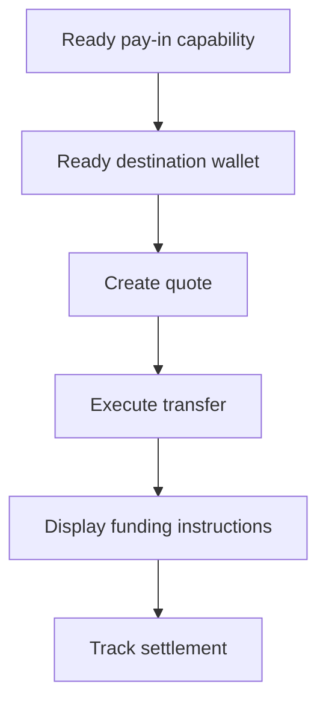

고객이 특정 금액을 조달해야 할 때 견적된 페이인을 사용하세요. 전송은 스테이블코인을 발급 지갑에 정산해요.



## 시작 전에

동일한 고객에 대해 준비된 페이인 케이퍼빌리티와 준비된 발급 목적지 지갑이 필요해요. 열린 작업은 [케이퍼빌리티와 태스크](/ko/integration/onboarding/capabilities-and-requirements)를 통해 완료한 뒤 두 리소스를 모두 다시 조회하세요.

## 1. 견적 생성

[`POST /v3/quotes`](/api-reference/money-movement/post-v3-quotes)로 가격을 생성하세요. 다음 헤더를 보내세요:

```http
X-API-Key: ${SWIPELUX_API_KEY}
Idempotency-Key: payin-quote-001
Content-Type: application/json
```

```json
{
  "customerId": "${CUSTOMER_ID}",
  "capabilityId": "${CAPABILITY_ID}",
  "externalId": "payin-order-123",
  "in": {
    "amount": "150.00",
    "currency": "USD"
  },
  "destinationId": "${SETTLEMENT_WALLET_ID}",
  "out": {
    "currency": "USDC"
  }
}
```

`data.id`를 `QUOTE_ID`로 저장하세요. 환율에서 재계산하지 말고 반환된 금액과 수수료를 표시하세요.

## 2. 견적 실행

만료 전에 [`POST /v3/transfers`](/api-reference/money-movement/post-v3-transfers)로 현재 견적을 실행하세요. 의도한 이 전송에 새 키를 사용하세요:

```http
X-API-Key: ${SWIPELUX_API_KEY}
Idempotency-Key: payin-transfer-001
Content-Type: application/json
```

```json
{
  "quoteId": "${QUOTE_ID}"
}
```

전송의 `data.id`를 `TRANSFER_ID`로 저장하고 현재 상태를 유지하세요.

## 3. 자금 조달 지침 조회

[`GET /v3/transfers/{transferId}/instructions`](/api-reference/money-movement/get-v3-transfers-by-transfer-id-instructions)를 조회하세요. 반환된 `data.instructions` 변형을 유형을 가정하지 않고 렌더링하세요.

이 정보는 전송별 정보예요. 한 전송의 은행 좌표, 코드, 호스팅된 URL, 금액, 참조 또는 만료를 다른 페이인에 재사용하지 마세요.

은행 지침의 경우 `reference.required`가 true이면 은행 좌표 옆에 정확한 `reference.value`를 표시하고 복사 가능하게 만드세요. 동일한 지침 세트에서 반환된 금액과 통화를 표시하세요.

은행 지침에는 `ach`, `wire`, `rtp`, `swift` 방식에서 선택적 `bankName`, `bankAddress`, `accountHolderName`, `accountHolderAddress` 필드가 포함될 수 있습니다. 반환된 각 필드를 다른 은행 좌표 옆에 표시하세요. 송금 은행은 `swift` 및 기타 국제 송금에서 수취 은행 주소를 요구하는 경우가 많으므로 `bankAddress`가 반환되면 항상 표시하세요.

```json
{
  "type": "bank",
  "method": "swift",
  "amount": { "amount": "150.00", "currency": "USD" },
  "accountHolderName": "Swipelux FBO Customer",
  "accountHolderAddress": "8 The Green, Dover, DE",
  "bankName": "JPMorgan Chase",
  "bankAddress": "383 Madison Avenue, New York, NY",
  "details": {
    "swiftCode": "CHASUS33",
    "accountNumber": "123456789"
  },
  "reference": { "value": "SWIFTMEMO1", "required": true }
}
```

발급 은행 계좌는 달라요. 이후 입금을 위한 재사용 가능한 정보를 제공해요. 그것이 의도한 경험이라면 [은행 계좌 발급](/ko/integration/issue-bank-account)을 참고하세요.

## 4. 정산 추적

실행 후 그리고 각 이벤트 이후에 [`GET /v3/transfers/{transferId}`](/api-reference/money-movement/get-v3-transfers-by-transfer-id)를 조회하세요. 최신 `data.state`에서 고객에게 표시되는 상태를 이끌어내세요.

전송에 다른 작업이 필요하면 `data.stateDetail`과 `data.openTaskIds`를 사용하세요. 예상 스케줄로 완료로 표시하지 마세요.

다음으로 [웹훅](/ko/integration/webhooks)을 추가하고, 제품이 처리하는 결과에 도달할 때까지 전송 상태를 동기화된 상태로 유지하세요.
