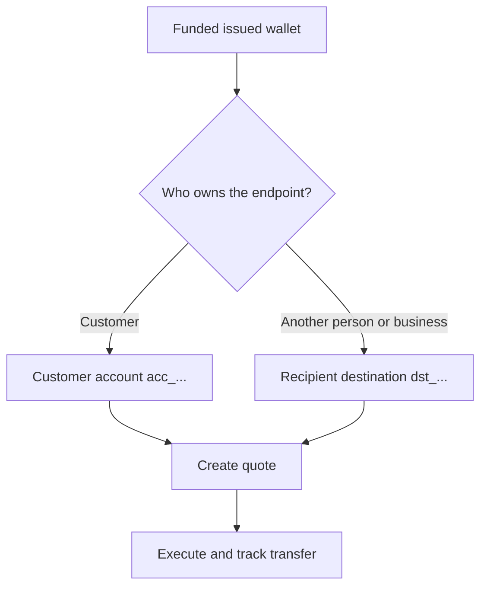

모든 페이아웃은 준비되고 충전된 발급 지갑에서 시작해요. 목적지 모델은 엔드포인트를 누가 소유하는지에 따라 달라져요.



## 시작 전에

출처 지갑을 다시 조회하세요. 현재 상태가 페이아웃을 허용하고 가용 잔액이 의도한 출처 금액을 감당하는지 확인하세요. 응답에서 파생된 ID를 `SOURCE_WALLET_ID`로 저장하세요.

또한 현재 고객과 선택한 목적지에 대해 준비된 페이아웃 케이퍼빌리티가 필요해요.

## 1. 목적지 준비

<Tabs>
  <Tab title="자사">

고객이 엔드포인트를 소유할 때 고객 소유 외부 은행 계좌를 사용하세요. [`POST /v3/customers/{customerId}/accounts`](/api-reference/accounts/post-v3-customers-by-customer-id-accounts)와 다음 헤더로 생성하세요:

```http
X-API-Key: ${SWIPELUX_API_KEY}
Idempotency-Key: payout-account-001
Content-Type: application/json
```

```json
{
  "origin": "external",
  "type": "bank",
  "methods": ["ach", "wire"],
  "country": "US",
  "currency": "USD",
  "details": {
    "routingNumber": "021000021",
    "accountNumber": "123456789",
    "accountType": "checking",
    "bankName": "Example Bank",
    "accountHolderName": "Acme Payments SAS"
  },
  "label": "Customer operating account"
}
```

[`GET /v3/customers/{customerId}/accounts/{accountId}`](/api-reference/accounts/get-v3-customers-by-customer-id-accounts-by-account-id)로 조회하세요. 현재 상태가 페이아웃을 허용할 때만 계속 진행하세요. `acc_` ID를 `PAYOUT_DESTINATION_ID`로 저장하세요.

  </Tab>
  <Tab title="제3자">

[수취인과 목적지](/ko/integration/recipients)를 통해 개인 또는 기업과 그들의 은행 또는 지갑 엔드포인트를 생성하세요. 목적지가 준비되었을 때만 계속 진행하세요.

반환된 `dst_` ID를 `PAYOUT_DESTINATION_ID`로 저장하세요. 수취인의 `rcp_` ID를 견적 목적지로 사용하지 마세요.

  </Tab>
</Tabs>

## 2. 페이아웃 견적 생성

다음 헤더로 [`POST /v3/quotes`](/api-reference/money-movement/post-v3-quotes)를 사용하세요:

```http
X-API-Key: ${SWIPELUX_API_KEY}
Idempotency-Key: payout-quote-001
Content-Type: application/json
```

```json
{
  "customerId": "${CUSTOMER_ID}",
  "capabilityId": "${CAPABILITY_ID}",
  "in": {
    "amount": "150.00",
    "currency": "USDC",
    "accountId": "${SOURCE_WALLET_ID}"
  },
  "destinationId": "${PAYOUT_DESTINATION_ID}",
  "out": {
    "currency": "USD"
  }
}
```

`data.id`를 `QUOTE_ID`로 저장하고 반환된 가격과 수수료를 표시하세요.

## 3. 페이아웃 실행

[`POST /v3/transfers`](/api-reference/money-movement/post-v3-transfers)로 전송을 생성하세요. 의도한 이 실행에 새 키 하나를 사용하세요:

```http
X-API-Key: ${SWIPELUX_API_KEY}
Idempotency-Key: payout-transfer-001
Content-Type: application/json
```

```json
{
  "quoteId": "${QUOTE_ID}"
}
```

전송의 `data.id`를 `TRANSFER_ID`로 저장하세요. 성공적인 생성은 페이아웃을 시작해요. 전달을 증명하지는 않아요.

## 4. 전달 추적

생성 후 그리고 각 이벤트 이후에 [`GET /v3/transfers/{transferId}`](/api-reference/money-movement/get-v3-transfers-by-transfer-id)를 조회하세요. 최신 `data.state`, `data.stateDetail`, `data.openTaskIds`를 사용해 대기할지, 조치할지, 종료 결과를 표시할지 결정하세요.

다음으로 정확한 금액, 안전한 실행 복구, 전송 태스크에 대해 [견적과 전송](/ko/integration/quotes-and-transfers)을 검토하세요.
