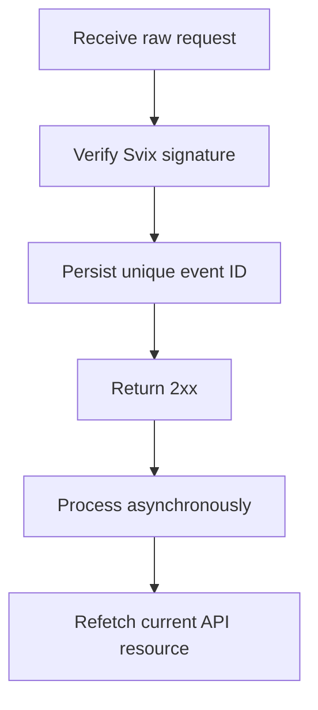

비동기 변경에 대응하려면 웹훅을 사용하세요. 전달은 최소 한 번 이뤄지므로 중복, 지연, 순서가 뒤바뀐 이벤트는 정상이에요.



## 필요한 이벤트만 등록

[`POST /v3/webhooks`](/api-reference/webhooks/post-v3-webhooks)로 엔드포인트를 생성하세요. 통합을 이끄는 문서화된 이벤트만 구독하세요. 이 예시는 [`transfer.state_changed`](/api-reference/webhooks/transfer-state-changed)를 사용해요.

```bash
export API_BASE='https://platform.swipelux.com'
export SWIPELUX_API_KEY='replace-with-your-api-key'

curl --request POST \
  "${API_BASE}/v3/webhooks" \
  --header "X-API-Key: ${SWIPELUX_API_KEY}" \
  --header "Idempotency-Key: webhook-endpoint-001" \
  --header "Content-Type: application/json" \
  --data @- <<'JSON'
{
  "url": "https://example.com/webhooks/swipelux",
  "events": ["transfer.state_changed"]
}
JSON
```

응답 `data.id`를 `WEBHOOK_ID`로 저장하세요. [`GET /v3/webhooks/portal`](/api-reference/webhooks/get-v3-webhooks-portal)이 반환한 포털을 열고 이 엔드포인트의 서명 시크릿을 가져와 API 키와 별도로 시크릿 매니저에 저장하세요.

## 파싱 전에 검증

Swipelux는 새 웹훅 통합을 Svix를 통해 전달해요. 원시 요청 본문을 엔드포인트 서명 시크릿과 다음 헤더로 검증하세요:

- `svix-id`
- `svix-timestamp`
- `svix-signature`

검증이 성공하기 전에 JSON을 파싱하거나 부작용을 일으키지 마세요.

```javascript
import { Webhook } from "svix";

const verifier = new Webhook(process.env.SWIPELUX_WEBHOOK_SECRET);

export async function handleSwipeluxWebhook(request) {
  const rawBody = await request.text();
  const event = verifier.verify(rawBody, {
    "svix-id": request.headers.get("svix-id"),
    "svix-timestamp": request.headers.get("svix-timestamp"),
    "svix-signature": request.headers.get("svix-signature"),
  });

  await webhookInbox.insertIfAbsent({
    id: event.id,
    payload: event,
    status: "pending",
  });

  return new Response(null, { status: 204 });
}
```

서명이 없거나 유효하지 않은 요청은 거부하세요. 검증이 완료될 때까지 원시 본문을 사용 가능하게 유지하세요.

## 저장하고, 확인한 뒤, 처리하세요

봉투 `id`에 고유성 제약을 두세요. 검증된 봉투를 저장하고, 즉시 `2xx`를 반환한 뒤, 비동기로 처리하세요.

이벤트 ID가 이미 존재하면 완료된 부작용을 반복하지 않고 전달을 확인하세요. 대기 중이거나 실패한 로컬 작업은 자체 재시도 큐를 통해 재개하세요. 봉투 `attempt` 필드를 중복 제거 키나 전송 재시도 카운터로 사용하지 마세요.

## 현재 상태 다시 조회

웹훅 순서는 권위 있는 리소스 히스토리가 아니에요. `resource.type`과 `resource.id`를 사용해 객체를 찾고, 시스템을 업데이트하기 전에 현재 상태를 가져오세요.

전송 이벤트의 경우 [`GET /v3/transfers/{transferId}`](/api-reference/money-movement/get-v3-transfers-by-transfer-id)를 호출하세요:

```bash
curl --request GET \
  "${API_BASE}/v3/transfers/${TRANSFER_ID}" \
  --header "X-API-Key: ${SWIPELUX_API_KEY}"
```

고객에게 표시되는 상태와 후속 조치는 현재 API 응답에서 이끌어내세요. 두 워커가 관련 이벤트를 다른 순서로 처리해도 안전하도록 부작용을 설계하세요.

## 전달 복구

[`GET /v3/webhooks/portal`](/api-reference/webhooks/get-v3-webhooks-portal)을 사용해 전달 로그를 열고, 실패한 전달을 재시도하거나 수동 재생을 시작하세요.

모든 재생은 동일한 서명 검증과 지속 가능한 인박스를 거쳐야 해요. 다운타임 후 복구하려면 영향받은 창을 재생하고 참조된 각 리소스를 다시 조회하세요. 완료된 이벤트 ID는 no-op으로 남고, 미완료 레코드는 비동기로 재개돼요.

다음으로, 샌드박스에서 중복 및 순서가 뒤바뀐 전달을 검증한 뒤 [프로덕션 전환](/ko/integration/go-live) 체크리스트를 완료하세요.
