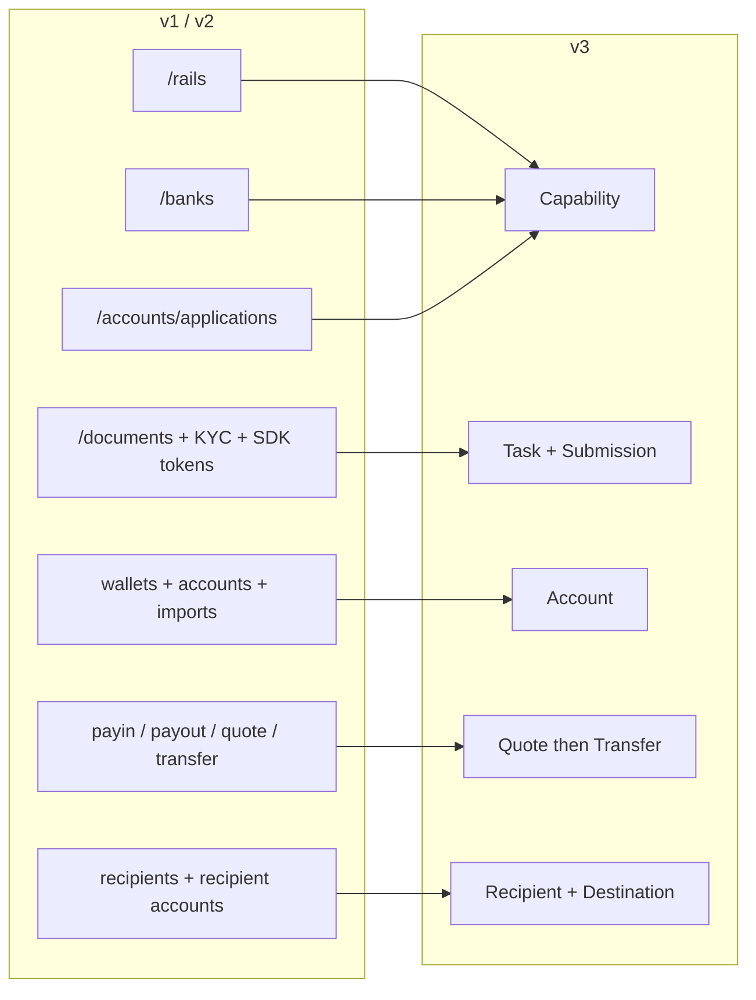
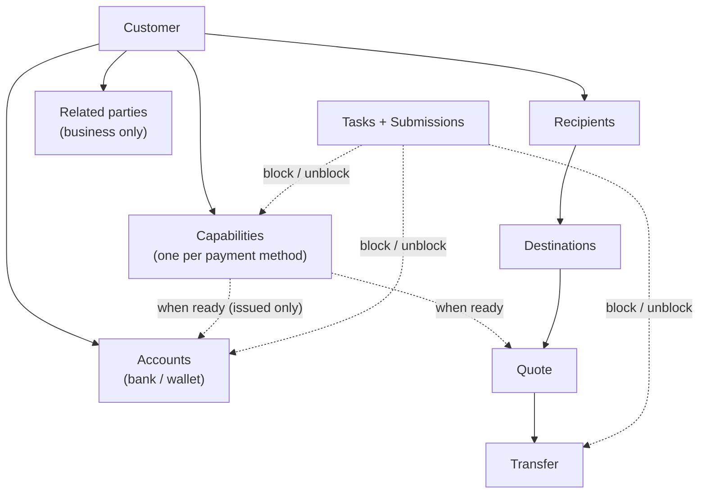
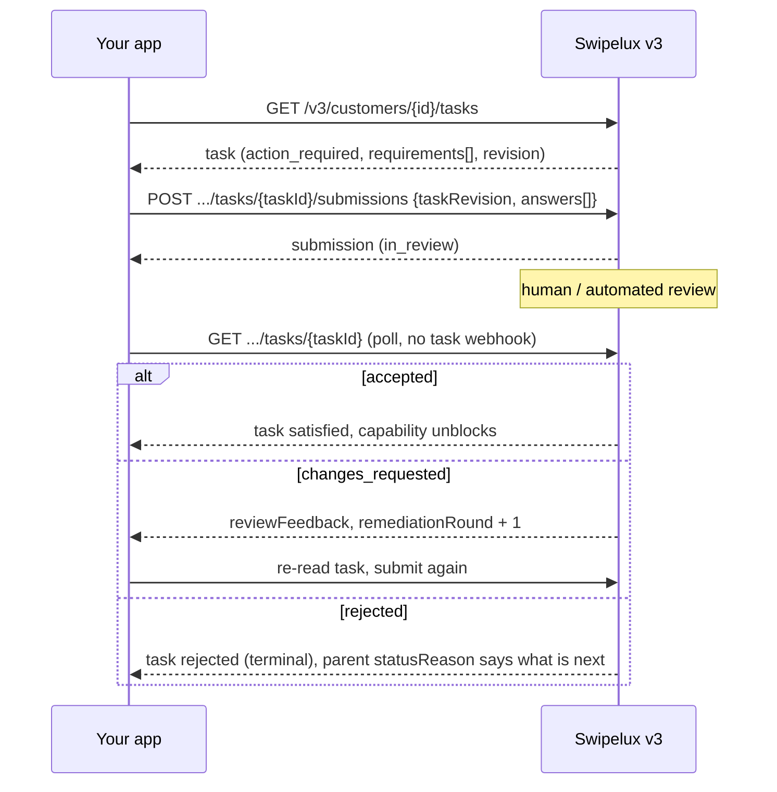
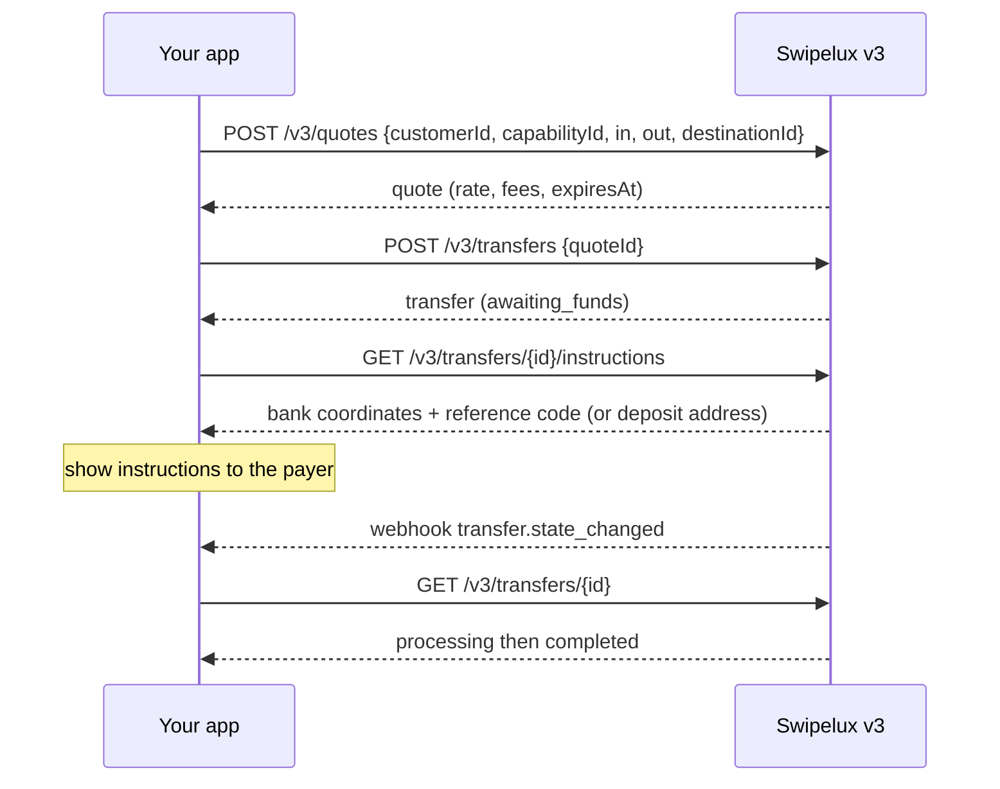
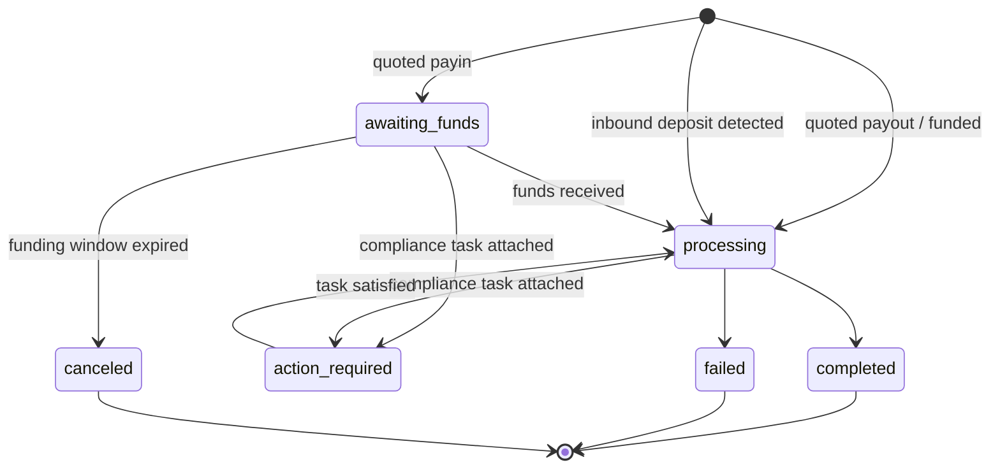
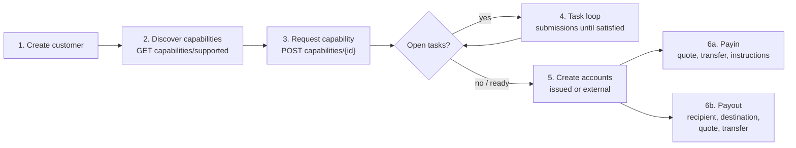

Migrē savu integrāciju no API v1 un v2 uz v3 divos piegājienos:

- **1. daļa, koncepcija.** Izlasi to vispirms. v3 ir pārveidojums, nevis pārdēvēšana: ja tu vienu pret vienu attēlosi vecos galapunktus, tu cīnīsies ar API. Desmit minūtes šeit ietaupīs dienas vēlāk.
- **2. daļa, API.** Galapunktu attēlojumi, pieprasījumu piemēri, stāvokļu mašīnas un migrācijas kontrolsaraksts.

Balstīts uz produkcijas OpenAPI specifikāciju ([platform.swipelux.com/openapi.json](https://platform.swipelux.com/openapi.json)). v1 un v2 joprojām ir aktīvi un vēl nav atzīti par novecojušiem; visas jaunās capability, recipient, task un quote funkcijas tiek izlaistas tikai v3. Abonē `api.deprecation` webhook notikumu, lai saņemtu paziņojumus par izbeigšanu.

<Info>
  **Saturs.** 1. daļa: 1.1 kāpēc pastāv v3, 1.2 objektu modelis, 1.3 gatavība katrai spējai, 1.4 uzdevumu cilpa, 1.5 naudas kustība, 1.6 stāvokļu mašīnas, 1.7 konvencijas, 1.8 zelta ceļš. 2. daļa: 2.1 klienti, 2.2 spējas, 2.3 uzdevumi un iesniegumi, 2.4 konti, 2.5 saņēmēji un galamērķi, 2.6 cenu piedāvājumi un pārskaitījumi, 2.7 webhooki, 2.8 sandbox, 2.9 mantotie galapunkti, 2.10 migrācijas secība, 2.11 kļūmju kontrolsaraksts.
</Info>

---

## 1. daļa, koncepcija

### 1.1 Kāpēc pastāv v3

v1 un v2 izauga četros pārklājošos veidos, kā klientu padarīt gatavu maksājumiem: `/rails`, `/banks`, `/accounts/applications` un uzņēmumu `rail-applications` virsma, katrs ar savu statusu vārdnīcu. Dokumentu ievākšana (`/documents`, KYC importi, verifikācijas SDK tokeni) bija atrauta no tā, ko tā patiesībā atbloķēja. v3 sakļauj to visu sešos resursos, klientu plus piecas lietas, kas tam pieder:



| Resurss | Vienrindas definīcija |
| --- | --- |
| **Customer** | Persona vai uzņēmums. **Nav publiska statusa lauka**, gatavība dzīvo uz spējām. |
| **Capability** | Viena maksājuma metode, ko klients var izmantot (`sepa`, `ach`, `swift`, `stablecoin_transfers` un tā tālāk), ar savu statusu. Aizstāj `/rails`, `/banks` un konta pieteikumu ieejas punktus. |
| **Task** | Darba vienība, ko Swipelux pieprasa (dati, dokumenti, verifikācija), uz kuru atbild ar **Submission**. Aizstāj dokumentu un KYC virsmu. |
| **Account** | Finansēšanas galapunkts, kas pieder klientam: `bank` vai `wallet`, Swipelux `issued` vai `external`. |
| **Recipient / Destination** | Izmaksas saņēmējs (kas) un viņa bankas vai maka galapunkts (kur). |
| **Quote / Transfer** | Visa naudas kustība. Pārskaitījums izpilda saglabātu cenu piedāvājumu; pārskaitījumi bez piedāvājuma vairs nepastāv. |

### 1.2 Objektu modelis



Divi strukturāli noteikumi, ko internalizēt:

1. **Spējas visu vārti.** Konti tiek nodrošināti zem `ready` spējas; cenu piedāvājumi tiek cenoti pret spēju. Iekļaušana nozīmē vajadzīgo spēju novešanu līdz `ready`.
2. **Uzdevumi piesaistās jebkur.** Spēja, konts vai izpildē esošs pārskaitījums var nest `openTaskIds`. Kur vien tos redzi, cilpa ir viena un tā pati: lasi uzdevumu, iesniedz atbildes, gaidi pārskatīšanu, atkārtoti lasi vecāku.

### 1.3 Gatavība ir katrai spējai, ne katram klientam

v1 sapina `/rails` gatavību ar klienta mēroga KYC vārtiem. v3 klienta statusa nav: klients var būt pilnībā izmantojams `stablecoin_transfers`, kamēr viņa `sepa` spējai vēl ir atvērti uzdevumi. Kopīgā konta spējas parasti nokļūst `ready` ātrāk nekā vārda spējas, tāpēc sāc darījumus ar to, kas ir `ready`, nevis gaidi visu.

Ja tavs v1 vai v2 kods vada UI zīmes no klienta verifikācijas statusa, pārraksti to:

- „Vai viņi var veikt darījumus X?” kļūst par spēju X `status == "ready"`.
- „Vai viņiem kaut kas jādara?” kļūst par jebkuru uzdevumu ar statusu `action_required` (spēja parasti rāda `restricted` ar `statusReason.resolution: "complete_tasks"`).
- „Vai gaidām uz Swipelux?” kļūst par uzdevumiem `in_review`, spēju `pending`.

### 1.4 Uzdevumu cilpa

Viss, ko darīja vecā dokumentu un KYC virsma, tagad ir šī viena cilpa:



Galvenās īpašības:

- Uzdevums nes `requirements[]`, atsevišķus lūgumus. Katram ir katrā uzdevumā `requirementId`, stabils `key`, kas nosauc lūgumu (piemēram, adreses pierādījums, izmanto to UI dedublēšanai) un tipizēts `request`, kas precīzi apraksta vēlamo ievadi (teksts, datums, izvēle, dokuments, apliecinājums un tā tālāk).
- Iesniegšana ir **pārskatīšanas vārtoti**: tā nekad tieši nemaina spējas vai konta stāvokli, tikai pieņemšana to dara. Viens izņēmums: `profile` atbildes iesniegšanas brīdī tiek rakstītas klienta profilā (2.3). Pēc iesniegšanas apjautā uzdevumu vai vecāka resursu.
- `taskRevision` (uzdevuma `revision` atbalss) ir konkurentuma sargs: ja uzdevums ir mainījies kopš tā, kad tu to nolasīji, nolasi vēlreiz un pārbūvē atbildes.
- `absence` ir pirmās klases atbilde („man tā nav, jo...”), izmanto to tā vietā, lai prasības paliktu nepabeigtas.

### 1.5 Naudas kustība

Viena plūsma iemaksām, izmaksām un stablecoin kustībām. **Nav virziena ievades**, tu nekad nedeklarē payin vai payout. Ienākošā un izejošā valūtas forma atvasina tikai lasāmu `direction` uz cenu piedāvājuma un pārskaitījuma: `fiat_to_stablecoin` (payin), `stablecoin_to_fiat` (payout) vai `stablecoin_move`.



### 1.6 Viena stāvokļu mašīna vienam resursam

Katram statusu nesošam resursam ir savs enum, un katrs nelaimīgais statuss nes strukturētu iemeslu. Konti, pieteikumi un pārskaitījumi dala formu `{ code, message, actor, retryable }`: konti un pieteikumi to izliek kā `statusReason`, pārskaitījumi kā `stateDetail`. `actor` norāda, kam jārīkojas (`customer`, `developer`, `provider`, `network`, `swipelux`), `retryable` norāda, vai atkārtota mēģināšana var palīdzēt. Spējas izmanto `{ code, resolution, message }`, kur `resolution` (`complete_tasks`, `wait`, `contact_support`, `none`) norāda, kas virza spēju uz priekšu. `code` vērtības ir atvērts, tikai papildināms katalogs: sazarojies pēc `resolution` (vai `actor` plus `retryable`) un pieņem vēl neredzētus kodus.

| Resurss | Stāvokļi |
| --- | --- |
| Capability | `pending`, `restricted`, `ready`, `rejected`, `canceled` |
| Application (mēģinājums vienam pieprasījumam zem spējas, 2.2) | `requested`, `in_review`, `action_required`, `ready`, `rejected`, `disabled`, `canceled` |
| Task | `action_required`, `in_review`, `satisfied`, `rejected`, `canceled` |
| Submission | `in_review`, `accepted`, `changes_requested`, `rejected` |
| Account | `provisioning`, `in_review`, `ready`, `action_required`, `suspended`, `rejected`, `archived` |
| Quote | `active`, `executed`, `expired`, `failed` |
| Transfer | `awaiting_funds`, `processing`, `action_required`, `completed`, `failed`, `canceled` |
| Recipient | `active`, `rejected`, `archived` |
| Destination | `in_review`, `ready`, `action_required`, `archived` |

Stāvokļus, ko šis ceļvedis neizspēlē (`rejected`, `suspended`, `disabled`, `failed`, `canceled`), ir termināli vai atbalsta virzīti; katra resursa definīcijas ir specifikācijā.

Transfer, izvērsts:



### 1.7 Konvencijas

| Joma | v1 / v2 | v3 |
| --- | --- | --- |
| Autentifikācija | `X-API-Key` galvene | Tā pati. Vidi (produkcija vai sandbox) izvēlas atslēga; viens bāzes URL. |
| Idempotence | Nav uzspiesta | `Idempotency-Key` galvene **obligāta katram efektu radošam pieprasījumam** (POST, PATCH, PUT, DELETE), izņemot sandbox galapunktus. Tā pati atslēga plus tas pats saturs atkārto sākotnējo atbildi. |
| Nauda | Jaukti skaitļi un virknes | Tikai virknes (`"amount": "150.00"`). Nekad ne peldošie. |
| Lappošana | Offset/limit varianti | Kursors: saraksti atgriež `{ data, nextCursor, hasMore }`. |
| Atjauninājumi | PUT-smagi | `PATCH` daļēji atjauninājumi. |
| Webhooki | Viena galapunkta konfigurācija | Vairāki galapunkti, abonēšana pa notikumu. Notikumi ir **norādes**, lasīšana ir patiesība (2.7). |

Idempotences noteikumi, ko iemācīties, pirms rakstīt kodu:

- Atslēgas atkārtota izmantošana ar **atšķirīgu** saturu ir `409 idempotency_conflict` tik ilgi, kamēr atslēga tiek saglabāta (vismaz 7 dienas), tāpēc nekad neplāno atslēgu atkārtoti izmantot. Ģenerē svaigu UUID katrai loģiskai operācijai un saglabā to kopā ar savu darbu.
- Atkārtojums aptver arī kļūdas: ja sākotnējais pieprasījums beidzās ar termināli 4xx, tā pati atslēga plus saturs atgriež to pašu problēmas atbildi vēlreiz.
- Divi vienlaicīgi pieprasījumi ar to pašu atslēgu: viens uzvar, otrs saņem `409`. Atkārto zaudētāju pēc tam, kad uzvarētājs ir noslēdzies; atkārtojums atgriež sākotnējo atbildi.

### 1.8 Zelta ceļš



---

## 2. daļa, API

### 2.1 Klienti

| v1 / v2 | v3 |
| --- | --- |
| `POST /v1/customers`, `POST /v1/customers/business`, `POST /v2/customers` | `POST /v3/customers` (viens galapunkts, `type: individual \| business`) |
| `GET/PUT/DELETE /v1/customers/{id}`, `/v1/customers/business/{id}`, `/v2/customers/{customerId}` | `GET/PATCH/DELETE /v3/customers/{customerId}` |
| `GET /v1/customers` (saraksts) | `GET /v3/customers` (kursora lappots, iekļauj spēju kopsavilkumus) |
| `GET /v1/customers/balances` (kopa), `GET /v1/customers/{id}/balances` | Nav bilances galapunkta, bilances dzīvo uz kontiem: lasi `balances` uz `GET /v3/customers/{customerId}/accounts` |
| `POST/GET .../shareholders` (v1 uzņēmumi) | `POST/GET /v3/customers/{customerId}/related-parties` (plus `GET/PATCH/DELETE .../related-parties/{relatedPartyId}`) |
| `POST /v1/customers/business/{id}/kyb` (iesniegšana), `GET .../kyb` (statuss) | Nav KYB iesniegšanas izsaukuma, pieprasi spēju (2.2) un atbildi uz tās uzdevumiem (2.3); spriedums parādās kā spējas un uzdevuma stāvoklis |
| `POST /v1/customers/{id}/kyc`, `.../kyc/import`, SDK tokenu galapunkti | Uzdevumu sistēma (2.3); mitināta verifikācija parādās kā `verificationSessions` uzdevumu iekšienē |

Izveide, diskriminēta pēc `type` (ilustratīvas vērtības, lauku nosaukumi pēc specifikācijas):

```jsonc
// POST /v3/customers        Idempotency-Key: <fresh uuid>
{
  "type": "individual",
  "externalId": "user-1042",
  "individual": {
    "firstName": "Maria",
    "lastName": "Silva",
    "birthDate": "1990-04-12",
    "nationalities": ["BR"],
    "residenceCountry": "BR",
    "email": "maria@example.com",
    "residentialAddress": {
      "streetLine1": "Av. Paulista 1000",
      "city": "Sao Paulo",
      "postalCode": "01310-100",
      "country": "BR"
    }
  },
  "financialProfile": {
    "accountPurposes": ["cross_border_remittance"],
    "sourcesOfFunds": ["salary"]
  }
}
```

- **Izveide ir pakāpeniska**: `{ "type": "individual" }` viens pats ir derīga izveide. Trūkstoši fakti nekad neatceļ klientu, tie vēlāk parādās kā uzņemšanas uzdevumi uz tām spējām, kurām tie nepieciešami.
- Uzņēmumiem ir `business` plus reģistrācijas dati. v1 shareholder CRUD attēlojas uz **related parties**, paplašinātām, lai aptvertu direktorus, amatpersonas un īpašniekus: izveido tos iekļauti klienta izveidē (katrs saņem stabilu `rp_` id) vai pārvaldi tos caur dedicētajiem related-parties galapunktiem.
- **Nav klienta `status` lauka**, skati 1.3.
- **Esošie klienti tiek pārnesti**: v1 vai v2 izveidoti klienti ir adresējami ar to pašu id uz v3 galapunktiem. v3 lasījums ir _attīrīts skats_, mantotās vērtības, kas neiztur v3 validāciju, atgriežas prombūtnē. Pēc tavas **pirmās v3 rakstīšanas šis skats kļūst pastāvīgs**: prombūtnes vērtības pašas neatgriežas. Tāpēc bagātini agri, ieplāno vienreizēju piegājienu, kas `PATCH`o pilnu profilu no taviem paša ierakstiem, pirms paļaujies uz v3 lasījumiem. v1 `metadata` ir atsevišķa vārdu telpa un **netiek** pārnesta, iestati to no jauna uz v3.
- `externalId` ir pirmās klases un **unikāls starp taviem klientiem** uz v3, katrā vidē (`409 duplicate_external_id`). Klienta arhivēšana neatbrīvo tā `externalId`, notīri to ar PATCH pirms DELETE, ja plāno to atkārtoti izmantot.
- `DELETE` ir **arhivēšanas kaskāde** (nav atjaunošanas; id nekad netiek atkārtoti izmantoti). Tas tiek bloķēts ar `409 customer_has_active_resources` plus `blockingResources[]`, kamēr eksistē kāds nearchivēts konts vai izpildē esošs pārskaitījums.
- PATCH sapludināšanas noteikumi: skaidrs `null` notīra nullable lauku, masīvi tiek aizstāti pilnībā (izņemot iekļautas related parties, kas tiek upsertētas pēc id), `metadata` atslēgas tiek sapludinātas. Pilnas shēmas un saraksta filtri ir OpenAPI specifikācijā.

### 2.2 `/rails`, `/banks`, pieteikumi kļūst par Capabilities

| v1 / v2 | v3 |
| --- | --- |
| `GET /v1/.../rails/capabilities` | `GET /v3/customers/{customerId}/capabilities/supported` |
| `GET /v2/.../banks` (plus `/banks/{bank}`), `GET /v2/meta/banks` | `GET /v3/customers/{customerId}/capabilities/supported` |
| `GET /v1/customers/{customerId}/rails` (saraksts) | `GET /v3/customers/{customerId}/capabilities` |
| `GET /v2/customers/{customerId}/rails` (pārskats) | `GET /v3/customers/{customerId}/capabilities` |
| `POST /v1/.../rails`, `POST /v2/.../banks` | `POST /v3/customers/{customerId}/capabilities/{capabilityId}` |
| `POST /v2/.../accounts/applications` | `POST /v3/customers/{customerId}/capabilities/{capabilityId}` |
| `GET /v1/.../rails/{rail}` | `GET /v3/.../capabilities/{capabilityId}` |
| `GET /v2/.../accounts/applications` (plus `/{applicationId}`, `/{applicationId}/history`) | `GET /v3/.../capabilities/{capabilityId}` (plus `/applications`, `/applications/{id}/history`) |
| Uzņēmumu rail virsma: `GET/POST /v2/customers/business/{customerId}/rail-applications` (plus `/{rail}`) | Tie paši v3 capability galapunkti, nav atsevišķas uzņēmumu virsmas |
| Uzņēmumu rail virsma: `GET .../business/{customerId}/rails` (plus `/{rail}`) | Tie paši v3 capability galapunkti, nav atsevišķas uzņēmumu virsmas |
| `GET /v1/meta/rails` (statisks katalogs) | `GET /v3/customers/{customerId}/capabilities/supported`, pieejamība ir katram klientam; nav statiska kataloga |
| `GET /v1/meta/accounts/banks` | `GET /v3/institutions` (banku direktorijs: id, nosaukums, BIC, valstis) |
| Nav pieejams | `GET /v3/capabilities`, tirgotāja mēroga saraksts ar piešķirtajām spējām visiem klientiem (filtrs pēc `status`, `method`, `customerId`) |
| Nav pieejams | `GET /v3/.../capabilities/{capabilityId}/tasks-preview` (redzi lūgumus pirms pieprasīšanas) |
| Nav pieejams | `POST /v3/.../capabilities/{capabilityId}/cancel` |

- Spēja ir `method` (`ach`, `wire`, `rtp`, `pix`, `sepa`, `swift`, `spei`, `pse`, `transfers_3_0`, `faster_payments`, `sepa_instant`, `uaefts`, `card`, `stablecoin_transfers` un tā tālāk) plus `accountType` (`pooled` vai `named`, `null` ne-banku metodēm) plus `directions` (`payin` vai `payout`). Publiskais `capabilityId` ir kvalificēts pāris (`sepa_pooled`, `ach_named`) vai kailā metode `card` un `stablecoin_transfers` gadījumā.
- Katrs spējas pieprasījums rada **application**, ierakstu par katru mēģinājumu zem `.../capabilities/{capabilityId}/applications` (plus `/{applicationId}/history`), ar saviem statusiem (1.6) un `statusReason`. Tas ir pieprasījuma audita pēdas; ikdienā apjautā pašu spēju.
- `capabilities/supported` atgriež pieejamību (`available`, `beta` vai `disabled`), tiesības un piedāvātās iestādes. Bankas izvēle notiek pieprasījuma brīdī caur opcionālo `institutions` masīvu, nav atsevišķa `/banks` resursa. Tā izlaišana (vai `[]` sūtīšana) izvēlas katru noklusējuma iestādi; `isDefault: true` ir klienta-un-spējas specifisks karogs, ne globāls. Tukšs saraksts pārraksta noklusējumus, un banku spēja bez piemērota noklusējuma atgriež `422 capability_institutions_required`. Iestāžu id ir necaurspīdīgi, pieņem jaunus.
- `stablecoin_transfers` tiek **automātiski piešķirts klienta izveidē** un dzimst `ready` (tātad tas nekad netiek pieprasīts un nav atceļams). `card` ir tikai individuālajiem.
- `openTaskIds` uz spējas ir tavs „ko darīt tālāk” rādītājs. Atvērts nozīmē `action_required` **vai** `in_review`, un apkopojums iekļauj koplietotus klientu līmeņa uzdevumus, kas sasniegti caur aktīvām atkarībām.
- `cancel` darbojas tikai no `pending` vai `restricted` **un** bez bloķējošiem resursiem, citādi `409 capability_not_cancelable`, kura problēmas saturs uzskaita `blockingResources`. Atkārtota pieprasīšana pēc atcelšanas ir svaiga izveide ar jaunu idempotences atslēgu.
- **Apjautā GET.** Spējas stāvoklis atjaunojas, kad tu to lasi; apjautā `GET .../capabilities/{capabilityId}` vai abonē `capability.status_changed`, neveido kešu.
- Vienas metodes pieprasīšana var uzreiz padarīt pieejamas saistītas metodes, izturies pret spējām kā pret kopu, ko atkārtoti lasi, ne kā pret vienu rindu, ko izseko.
- Izmanto `tasks-preview`, lai parādītu uzņemšanas lūgumus **pirms** apņemšanās pie pieprasījuma.
- Verifikācija nav vienreizēja: jauni uzdevumi var parādīties uz jau `ready` spējas (periodiska vai notikumu vadīta atkārtota verifikācija). Turi uzdevumu cilpu ievadītu visu klienta dzīves ciklu, ne tikai uzņemšanai.

### 2.3 Dokumenti un KYC kļūst par Tasks un Submissions

<Note>
  **Nosaukuma piezīme.** Šie galapunkti īsu brīdi tika izlaisti kā `requirements` un `fulfillments`. Kopš 2026-08-02 publiskie nosaukumi ir **tasks** un **submissions**. Pārdēvēšana aptvēra tikai resursus un galapunktu ceļus, `requirements[]` masīvs uzdevuma iekšpusē un tā `requirementId` saglabā šos nosaukumus.
</Note>

Katra mantotā dokumentu virsma attēlojas uz to pašu aizstājēju: lasi `GET /v3/customers/{customerId}/tasks`, atbildi ar `POST .../tasks/{taskId}/submissions`.

| v1 / v2 | v3 |
| --- | --- |
| `POST/GET/DELETE /v1/documents` | `GET /v3/.../tasks` plus `POST .../tasks/{taskId}/submissions` |
| `POST /v1/customers/{id}/documents` | `GET /v3/.../tasks` plus `POST .../tasks/{taskId}/submissions` |
| `GET/POST /v1/customers/business/{id}/documents` (plus `PUT/DELETE .../{docId}`) | `GET /v3/.../tasks` plus `POST .../tasks/{taskId}/submissions` |
| `GET/POST .../shareholders/{shareholderId}/documents` (plus `GET/PUT/DELETE .../{docId}`) | `GET /v3/.../tasks` plus `POST .../tasks/{taskId}/submissions` |
| `GET/POST/DELETE /v2/.../documents` (plus `/{documentId}`) | `GET /v3/.../tasks` plus `POST .../tasks/{taskId}/submissions` |
| `POST /v2/.../documents/upload-token` plus `POST /v2/documents/direct-upload` | Augšupielādē tieši ar savu API atslēgu (zemāk) vai piecu minūšu laikā nosūti svaigu direct-upload `storageKey` kā JSON uz `POST /v3/.../documents` |
| `POST /v1/customers/documents/upload`, `POST /v1/document` (mantotās uzņemšanas) | Vairs nav, augšupielādē tieši ar savu API atslēgu (zemāk) |
| `POST /v1/customers/{id}/kyc` plus SDK tokeni | Uzdevuma `verificationSessions` (mitināta verifikācija); nav tieša „sākt KYC” izsaukuma |

Ap šo cilpu:

- **Neapstrādāta failu glabāšana**: `POST/GET/DELETE /v3/customers/{customerId}/documents` (plus `/{documentId}` un `GET .../{documentId}/download`), augšupielādē vienreiz ar savu API atslēgu, tad atsaucies uz dokumenta id iesniegumu atbildēs. Tas aizstāj katru upload-token un direct-upload uzņemšanu. `POST .../documents` pieņem arī JSON ķermeni (`storageKey`, `fileName`, `type`), kas patērē vēl svaigu klienta tvēruma atsauci no `POST /v2/documents/direct-upload`, tāpēc novietotās augšupielādes migrē bez baitu atkārtotas sūtīšanas.
- **Jauni lasījumi**: `GET /v3/tasks` (tirgotāja mēroga iesūtne), `GET /v3/transfers/{transferId}/tasks`, `GET .../tasks/{taskId}/history`, `GET .../tasks/{taskId}/submissions` (plus `/{submissionId}`).

Iesniegums (ilustratīvs):

```jsonc
// POST /v3/customers/{cus}/tasks/{task}/submissions   Idempotency-Key: <fresh uuid>
{
  "taskRevision": 3,
  "answers": [
    { "requirementId": "req_a1", "answer": { "type": "document", "documentIds": ["doc_passport1"] } },
    { "requirementId": "req_b2", "answer": { "type": "text", "value": "Import/export business" } },
    { "requirementId": "req_c3", "answer": { "type": "absence", "reason": "not_applicable" } }
  ]
}
```

- Atbildes tipi: `profile`, `text`, `date`, `single_select`, `multi_select`, `boolean`, `attestation`, `document`, `resource_reference`, `absence`. Katras prasības `request` objekts pasaka, kādu tipu tas sagaida.
- Iesniegumam jāatbild uz **katru rīcības prasīgu prasību pašreizējā kārtā**, ar tieši to `taskRevision`, ko tu nolasīji. Daļēji iesniegumi tiek noraidīti.
- `profile` atbildes **raksta cauri**: tās atjaunina klienta profilu pa normālu validācijas ceļu un uzreiz pārvērtē katru spēju, kas atsaucas uz to pašu uzņemšanas darbu. Brāļu uzņemšanas uzdevumi, kuru prasības visas ir izpildītas, automātiski aizveras.
- Prasības var veidot alternatīvas grupas (`alternativeKey`): iesniedz tieši vienu no grupas.
- `changes_requested` palielina `remediationRound` un nes `reviewFeedback`. Nolasi uzdevumu vēlreiz, iesniedz vēlreiz **ar svaigu idempotences atslēgu**.
- Mitinātās verifikācijas URL parādās **tikai** klientam apjomotā uzdevuma detalizācijā (`GET /v3/customers/{customerId}/tasks/{taskId}`) un tikai kamēr sesija ir rīcības prasīga; saraksti un `GET /v3/tasks/{taskId}` ir apzināti bez URL.
- Lietošanas noteikumi arī ir uzdevums: `openTaskIds` var iekļaut `category: "terms_of_service"` uzdevumu, kura mitinātā pieņemšanas lapa ir saistīta tāpat (tikai klientam apjomota detalizācija). Vispārīgi iesniegumi nevar pieņemt noteikumus, un KYC apstiprinājums nekad nenozīmē noteikumu pieņemšanu.
- Uzdevumi ir apjomoti pa spējām, tāpēc „tas pats” lūgums (piemēram, adreses pierādījums) var parādīties vienreiz katrai spējai. Dedublē UI pēc prasības `key`.
- **Nav tulkošanas slāņa**: postēšana uz `/v1/documents` neatbloķēs v3 spējas. Kad klients ir uz v3, virzi visus lūgumus caur uzdevumiem.

### 2.4 Konti un maki

| v1 / v2 | v3 |
| --- | --- |
| `POST/GET /v1/.../accounts` (plus `/import`), `/v2/.../accounts` (plus `/import`) | `POST/GET /v3/customers/{customerId}/accounts` |
| `POST/GET /v1/.../wallets` (plus `/import`) | Tas pats galapunkts, `type: wallet` |
| `GET/DELETE /v1/customers/{customerId}/accounts/{accountId}` (un maku variants), `GET /v2/.../accounts/{accountId}` | `GET/PATCH/DELETE /v3/.../accounts/{accountId}` |
| `PATCH /v2/.../accounts/{accountId}/fees` | `GET/PUT /v3/.../accounts/{accountId}/fees` |

Izveide, diskriminēta pēc `origin` plus `type`. Izsniegti bankas konti ņem vienu `method`; ārējie bankas konti tā vietā ņem `methods` masīvu (`method` sūtīšana tur tiek noraidīta):

```jsonc
// issued bank account (capability must be ready)
{ "origin": "issued", "type": "bank", "method": "sepa",
  "currency": "EUR", "settlement": { "accountId": "acc_wallet1" } }

// external wallet the customer already owns (replaces /import)
{ "origin": "external", "type": "wallet", "currency": "USDC",
  "network": "polygon", "details": { "address": "0x71C7656EC7ab88b098defB751B7401B5f6d8976F" } }
```

- `country` uz izsniegtiem bankas kontiem ir opcionāls (noklusēts pēc metodes); uz ārējiem **bankas** kontiem norādi to skaidri. Maku kontiem nav valsts vispār.
- `settlement.accountId` ir obligāts uz izsniegtiem bankas kontiem: tas nosauc izsniegto maka kontu, kas saņem norēķinātos līdzekļus no iemaksām bankas kontā.
- Izsniegtie konti izliek `details` (IBAN vai routing plus konts vai adrese), versionētu `routing` (iemaksas koordinātas var mainīties, vienmēr renderē jaunāko lasījumu), `fees`, `balances`.
- Tīkli: `polygon`, `ethereum`, `base`, `arbitrum`, `optimism`, `bsc`, `avalanche`.
- Spējas vārti attiecas tikai uz **issued** kontiem: viena izveidošana pret ne-ready spēju neizdodas ar spējas kodētu kļūdu, pieprasi spēju vispirms (2.2). Ārējiem kontiem nav vajadzīga spēja (un nav vajadzīgs klienta apstiprinājums); tie saņem tikai pieprasījuma-shēmas un bankas-detaļu validāciju.
- Izsniegtie bankas konti piedzimst `provisioning` ar `details: null`. Apjautā kontu vai vēro `account.status_changed`, līdz `ready`.
- `DELETE` arhivē, nekad neveic pilnīgu dzēšanu. Konti, uz kuriem atsaucas izpildē esoši pārskaitījumi, atgriež `409 account_has_active_transfers`. Atkārto pēc tam, kad šie pārskaitījumi sasniedz termināli stāvokli.
- Jauns v3: **Rules**, pastāvīgas instrukcijas uz izsniegta maka konta (`POST/GET /v3/customers/{customerId}/rules`, `GET/PATCH/DELETE .../rules/{ruleId}`), kas automātiski aizskalo ienākošos līdzekļus uz citu kontu vai maka galamērķi. Nav v1 vai v2 ekvivalenta.

### 2.5 Saņēmēji un galamērķi

| v1 | v3 |
| --- | --- |
| `POST/GET /v1/.../recipients` | `POST/GET /v3/customers/{customerId}/recipients` |
| Nav pieejams (v1 saņēmēji bija tikai izveide un saraksts) | `GET/PATCH/DELETE /v3/.../recipients/{recipientId}`, jauna detalizācija, atjaunināšana, arhivēšana |
| `POST/GET .../recipients/{recipientId}/accounts` | `POST/GET /v3/.../recipients/{recipientId}/destinations` |
| `GET/DELETE .../recipients/{recipientId}/accounts/{recipientAccountId}` | `GET/DELETE /v3/.../recipients/{recipientId}/destinations/{destinationId}` (nav destination PATCH, arhivē un izveido no jauna) |

v2 nebija saņēmēja koncepta. Ja tu esi uz v2 un izmaksā trešajām pusēm, tā ir jauna virsma, ne pārdēvēšana.

- **Recipient** ir kas: `individual` (vārds un uzvārds) vai `business` (uzņēmuma nosaukums), ar obligātu `relationship` (`employee`, `contractor`, `vendor`, `subsidiary`, `merchant`, `customer`, `landlord`, `family`, `other`). Saņēmēji un galamērķi ir tikai trešajām pusēm. Pirmās puses izmaksa nemaz neizmanto saņēmēju: mērķē uz vienu no klienta paša `acc_` kontiem kā piedāvājuma `destinationId` (2.6).
- **Destination** ir kur: tipizēts pa metodei, `sepa` (iban, bic opcionāls), `ach` vai `wire` (routing plus konts), `swift` (pilnas koordinātas plus opcionāls starpnieks), `spei` (clabe), `pse`, `transfers_3_0` (cbu) un tā tālāk, plus maku galamērķi. Katram galamērķim ir savs statuss. Vēro `destination.status_changed`.
- Fiat galamērķiem nepieciešama saņēmēja pilnīga `address` (iela, pilsēta, pasta indekss, valsts) **pirms** izveides. Trūkstošas daļas neizdodas ar `422 recipient_address_required`. Maku galamērķi izlaiž adresi, bet prasa augšējā līmeņa `ownership` (`self_custodied` vai `custodial` ar glabātāja nosaukumu).
- Labuma saņēmēja vārda precizitāte ir svarīga: saņemošās bankas saskaņo konta **juridisko** vārdu. Sūti precīzu juridisko vārdu plus uzvārdu vai uzņēmuma nosaukumu, ne attēlojamo iesauku.
- Metodei specifisku galamērķa lauku shēmas ir OpenAPI specifikācijā.

### 2.6 Cenu piedāvājumi un pārskaitījumi

| v1 / v2 | v3 |
| --- | --- |
| `POST /v1/payin/quote`, `/v1/payout/quote`, `/v2/quote` | `POST /v3/quotes` |
| `POST /v1/payin`, `/v1/payout`, `POST /v1/transfers`, `/v2/transfer` | `POST /v3/transfers` (izpilda piedāvājumu, izveides bez piedāvājuma vairs nav) |
| `GET /v1/transfers` (saraksts), `GET /v1/transfers/{id}` | `GET /v3/transfers`, `/v3/transfers/{transferId}` |
| Nav pieejams (v1 un v2 piedāvājumiem nebija lasījuma) | `GET /v3/quotes/{quoteId}` |
| `GET /v1/rate/{base}/{quote}` | `GET /v3/rates` |
| (netieši payin atbildē) | `GET /v3/transfers/{transferId}/instructions` |
| Nav pieejams | `POST /v3/transfers/{transferId}/cancel`, `GET /v3/transfers/{transferId}/tasks` |

```jsonc
// 1. Quote: amount on exactly one side picks mode (exact_in / exact_out).
// POST /v3/quotes            Idempotency-Key: <fresh uuid>
{
  "customerId": "cus_123",
  "capabilityId": "sepa_named",
  "in":  { "currency": "EUR", "amount": "150.00" },
  "out": { "currency": "USDC" },
  "destinationId": "acc_wallet1",   // fiat-funded: must be a customer-owned acc_ account
  "fees": { "breakdown": { "developer": { "fixed": "1.00", "bips": 50 } } }
}
// -> { mode: "exact_in", direction: "fiat_to_stablecoin", rate, fees[], expiresAt, ... }

// 2. Execute before expiresAt.
// POST /v3/transfers         Idempotency-Key: <fresh uuid>
{ "quoteId": "quo_789", "externalId": "order-991", "memo": "invoice 44" }
```

- `destinationId` ņem `acc_` (klienta piederošs konts) vai `dst_` (saņēmēja galamērķis) id. **Fiat-finansētiem piedāvājumiem (iemaksām) jāmērķē uz `acc_` kontu**, `dst_` mērķis vienmēr nozīmē izmaksu (`422 quote_direction_invalid` citādi).
- `externalId` uz piedāvājumiem un pārskaitījumiem ir nu unikāla korelācijas atsauce (atbalsota lasījumos, filtrējama sarakstos). Katra vides unikalitātes noteikums (2.1) attiecas tikai uz klienta `externalId`.
- Izpildi piedāvājumu tieši vienreiz, pirms `expiresAt`. Beidzies piedāvājums neizdodas ar `409 quote_expired`, otrā izpilde ar `409 quote_already_executed` (problēma nes esošo `transferId`).
- Pārskaitījuma atcelšana vēl netiek atbalstīta: `POST .../cancel` atgriež `409 transfer_not_cancelable` katrā stāvoklī. Šodienas `canceled` pārskaitījumi nāk no finansēšanas loga beigām nefinansētai iemaksai, ne no šī galapunkta.
- Iemaksas sākas ar `awaiting_funds`: renderē `GET .../instructions` maksātājam, bankas koordinātas plus **atsauces vai memo kodu** fiat, iemaksas adresi kripto. Atsauces kods ir tas, kā iemaksa tiek saskaņota. Vienmēr to attēlo.
- `state` plus `stateDetail` mašīnlasāmiem apakšstāvokļiem; `action_required` nozīmē, ka ir pievienots atbilstības uzdevums (`openTaskIds`, `GET .../tasks`), atbildi caur iesniegumiem.
- Ienākošās iemaksas, kas atklātas uz izsniegtiem kontiem, parādās kā pārskaitījumi ar `origin: "inbound_deposit"` (pretstatā `"quoted"`).
- Maksājumu tīkla atsauces konsolidētas zem `references`: `transactionHash`, `traceNumber`, `imad`, `uetr`, `explorerUrl`, `returnedTransferId`.

v1 statusu tulkojums:

| v1 koncepts | v3 |
| --- | --- |
| atsevišķi payin un payout objekti | viens pārskaitījums ar `direction` |
| atgriešanas vai piegādātāja puses atcelšanas (salocītas `failed`) | joprojām `failed`, tagad ar mašīnlasāmu `stateDetail` un `references.returnedTransferId`, kad atgriešana radīja apgrieztu pārskaitījumu |

Divi migrācijas brīdinājumi:

- **Pārskaitījumi nešķērso versijas.** Pārskaitījumi, kas izveidoti uz v1 vai v2, nav nolasāmi no v3. Saraksts tos izlaiž un `GET /v3/transfers/{transferId}` atgriež 404. Vispirms pārslēdz _izveidi_, saglabā v1 lasīšanas ceļu, līdz šie pārskaitījumi sasniedz termināli stāvokli, tad noņem to.
- **Nav tokenu maiņas.** `stablecoin_move` prasa vienu un to pašu valūtu iekšā un ārā: USDC uz USDT neizdodas ar `422 recipient_destination_invalid`, kas nes `currency_mismatch` lauka kļūdu. Tas pats tīkls abās pusēs, nav tilta, un maka-uz-maka kustības šobrīd atbalsta tikai bezmaksas piegādi: piedāvājums, kura platformas vai izstrādātāja maksa nav nulle, neizdodas ar `422 amount_not_deliverable`.

### 2.7 Webhooki

| v1 | v3 |
| --- | --- |
| `GET/PATCH /v1/webhooks` (viens galapunkta konfigs) | `POST/GET /v3/webhooks`, `PATCH/DELETE /v3/webhooks/{webhookId}`, `GET /v3/webhooks/portal` |

Notikumu katalogs: `customer.created`, `customer.updated`, `customer.archived`, `capability.created`, `capability.status_changed`, `application.status_changed`, `recipient.status_changed`, `destination.status_changed`, `account.created`, `account.status_changed`, `account.details_changed`, `transfer.created`, `transfer.state_changed`, `api.deprecation`.

- `GET /v3/webhooks/portal` atgriež mitināta pārvaldības portāla URL piegādes žurnāliem, atkārtojumiem un manuālai atkārtošanai.
- `transfer.created` pašlaik tiek piegādāts ar mantoto v1 satura formu (v3 aploksne aktivizēsies, kad v1 webhooki beigsies). Uzskati to tikai kā norādi un GET pārskaitījumu; neveido pret tā saturu.
- Notikumi ir norādes: saņemot, GET resursu un rīkojies pēc lasījuma. Nekad neveido stāvokli no notikumu satura vai secības. Piegāde ir vismaz vienreiz un var būt aizkavēta vai pārkārtota. Dedublē pēc notikuma id un atgūsti izlaistus notikumus ar katra saraksta iekļaujošo `updatedAfter` filtru.
- Abonē `api.deprecation`, mašīnu kanālu versiju izbeigšanai.
- Šodien nav `task.*` notikuma: pēc iesniegšanas apjautā uzdevumu vai tā vecāku.

### 2.8 Sandbox

Tas pats bāzes URL; sandbox API atslēga izvēlas vidi.

| v1 | v3 |
| --- | --- |
| `POST /v1/sandbox/topup` | `POST /v3/sandbox/accounts/{accountId}/topup` |
| `POST /v1/sandbox/payins/simulate`, `.../payouts/simulate`, `POST /v1/customers/{id}/simulate-transactions` | `POST /v3/sandbox/transfers/{transferId}/state` (virza reālu pārskaitījumu cauri stāvokļiem) |
| Nav pieejams | `POST /v3/sandbox/customers/{customerId}/verification` (pabeigt verifikāciju) |
| Nav pieejams | `POST /v3/sandbox/customers/{customerId}/capabilities/{capabilityId}/status` (piespiest spējas statusu) |
| Nav pieejams | `POST /v3/sandbox/tasks`, `POST /v3/sandbox/tasks/{taskId}/review` (izveidot uzdevumu, tad simulēt spriedumu) |

v3 sandbox simulē pārskatīšanas cilpu no gala līdz galam: izveido uzdevumu, iesniedz pret to, `review` to uz `accepted` vai `rejected`, vēro spējas atbloķēšanu. Izmēģini savu remediācijas UX pirms produkcijas. Gan sandbox izveidotie uzdevumi, gan parastie uzņemšanas uzdevumi, kas parādās uz pieprasītām spējām, ir pārskatāmi šādi; tāpat kā produkcijā, uzdevumu webhooki neizdarās, apjautā (2.7).

### 2.9 Mantotie galapunkti bez v3 aizvietojuma

Šiem nav v3 aizvietojuma. Vairums paliek uz v1 nemainīgi (turi savus esošos izsaukumus); divi tiek pilnībā atcelti (skati Rīcību):

| Galapunkts | Rīcība |
| --- | --- |
| `GET /v1/merchant-kyb/creation-gate`, `POST /v1/merchant-kyb/{customerId}/submit`, `POST /v1/merchant-kyb/parked-url`, `POST /v1/merchant-kyb/upload-token` | Tava paša tirgotāja KYB uzņemšana (ne klienta KYB), nemainīga uz v1 |
| `POST /v1/merchant-wallets/get-or-create` | Tirgotāja treasury maka palīgs, nemainīgs uz v1 |
| `GET /v1/meta/accounts/relationships` | Atceļts, saņēmēja `relationship` enum ir fiksēts un dokumentēts iekļauti (2.5) |
| `GET /v1/meta/kyb/documents` | Atceļts, v3 uzdevumi deklarē nepieciešamos dokumentus katram gadījumam caur `requirements[]` (2.3); nav statiska kataloga |
| `GET /statecharts` (plus `/{machineId}`, `/{machineId}/svg`, `/explorer`, `/validate`) | Versijai neitrālas publiskas stāvokļu mašīnu atsauces lapas, nemainīgas |

Katrs cits publiskais v1 vai v2 galapunkts parādās augstāk kādā attēlojuma tabulā.

### 2.10 Ieteicamā migrācijas secība

Katrs solis piegādājams neatkarīgi; v1 vai v2 un v3 darbojas paralēli pret to pašu klientu bāzi. Izmēģini katru soli pret savu sandbox atslēgu (2.8) pirms atkārtot to produkcijā.

<Steps>
  <Step title="Cauruļvads">
    `Idempotency-Key` uz visiem efektu radošiem pieprasījumiem (POST, PATCH, PUT, DELETE; sandbox galapunkti izņemti); nauda kā virknes; kursora lappošanas palīgi.
  </Step>
  <Step title="Webhooki">
    Reģistrē v3 galapunktus katram notikumam, ieskaitot `api.deprecation`. v1 vienotā galapunkta konfigs ir atsevišķa virsma, atstāj to vietā; abi darbojas paralēli līdz iztukšošanai 9. solī.
  </Step>
  <Step title="Profila bagātināšana">
    `PATCH /v3/customers/{id}` ar pilno profilu, kas tev ir (v1 vāca mazāk nekā v3 izliek) un iestati `metadata` no jauna. Padari to apzināti par **pirmo v3 rakstīšanu** katram klientam: tas aizpilda attīrītu skatu pirms tas kļūst pastāvīgs (2.1).
  </Step>
  <Step title="Lasījumi">
    Norādi klienta, spējas un konta lasījumus uz v3; pārraksti klienta-statusa loģiku pēc 1.3. Tikai pēc 3. soļa, ne bagātinātie lasījumi atgriežas ar mantoti-nederīgiem laukiem prombūtnē.
  </Step>
  <Step title="Uzņemšanas rakstījumi">
    Izveido caur `POST /v3/customers`; pieprasi spējas nevis `/rails`, `/banks` vai pieteikumus; veido uzdevumu cilpu (lielākais jaunais UI darbs, `tasks-preview` palīdz parādīt lūgumus iepriekš). No šī punkta pārstāj postēt `/v1/documents` v3-vadītiem klientiem, tie neatbloķē spējas (2.3).
  </Step>
  <Step title="Konti">
    Izsniedz caur v3; pārceļ importus uz `origin: external`.
  </Step>
  <Step title="Izmaksas">
    Saņēmēji plus galamērķi, tad piedāvājums un pārskaitījums.
  </Step>
  <Step title="Iemaksas">
    Piedāvājums, pārskaitījums, instrukcijas; saglabā atsauces koda renderēšanu.
  </Step>
  <Step title="Iztukšošana">
    Pārskaitījumi nešķērso versijas (2.6). Saglabā v1 vai v2 lasīšanas ceļu un v1 webhook galapunktu tur izveidotajiem pārskaitījumiem, lasi dubulti, līdz tie sasniedz termināli stāvokli, tad noņem veco klientu un v1 webhook konfigu.
  </Step>
</Steps>

### 2.11 Kļūmju kontrolsaraksts

- [ ] Svaigs UUID par katru **loģisko operāciju**, saglabāts kopā ar darbu un atkārtoti izmantots atkārtotā mēģinājumā; nekad atkārtoti neizmanto atslēgu ar mainītu saturu (`409 idempotency_conflict`). Sandbox galapunkti ir atbrīvoti no galvenes.
- [ ] Bagātini esošos klientus (`PATCH` pilno profilu, iestati `metadata` no jauna, tā netiek pārnesta) **pirms jebkuras citas v3 rakstīšanas**, pirmā v3 rakstīšana padara attīrīto skatu pastāvīgu.
- [ ] `externalId` ir unikāls katrā vidē un **netiek atbrīvots ar arhivēšanu**, notīri to ar `PATCH` pirms `DELETE`, ja plāno to atkārtoti izmantot.
- [ ] Nav klienta `status` lauka, atvasini gatavību katrai spējai.
- [ ] `action_required` **un** `in_review` abi nozīmē atvērtu uzdevumu.
- [ ] Iesniegumi ir pārskatīšanas vārtoti (iesniegšana nav tas pats, kas atbloķēšana) un jāatbild uz **katru** rīcības prasīgu prasību ar tieši `taskRevision`. Neatbilstības gadījumā nolasi vēlreiz un pārbūvē.
- [ ] Nav `task.*` webhook, apjautā uzdevumu (vai tā vecāku) pēc katra iesnieguma.
- [ ] `changes_requested` atkārtojums ir: nolasi uzdevumu vēlreiz, svaigas atbildes, **svaiga idempotences atslēga**.
- [ ] Postēšana uz `/v1/documents` nekad neatbloķē v3 spēju, kad klients ir uz uzdevumiem, virzi katru lūgumu caur uzdevumiem.
- [ ] Jauni uzdevumi var parādīties uz jau `ready` spējas, turi uzdevumu cilpu ievadītu pēc uzņemšanas, ne tikai tās laikā.
- [ ] Spējas `cancel` darbojas tikai no `pending` vai `restricted` bez bloķējošiem resursiem (`409 capability_not_cancelable`); atkārtota pieprasīšana pēc atcelšanas ir svaiga izveide ar svaigu idempotences atslēgu.
- [ ] Spējai jābūt `ready` pirms zem tās var izsniegt kontus vai pret to piedāvāt.
- [ ] Piedāvājumam ir summa tieši vienā pusē; nav virziena lauka; izpildi tieši vienreiz pirms `expiresAt` (`409 quote_expired` vai `409 quote_already_executed`).
- [ ] Stablecoin kustības ir tikai tās pašas valūtas, tā paša tīkla (USDC uz USDT neizdodas ar `422`); maks-uz-maks atbalsta tikai bezmaksas piegādi.
- [ ] `DELETE` arhivē, nekad neveic pilnīgu dzēšanu. Konta dzēšanu bloķē izpildē esoši pārskaitījumi (`409 account_has_active_transfers`); klienta dzēšanu papildus bloķē jebkurš nearchivēts konts (`409 customer_has_active_resources`, `blockingResources[]` tos nosauc).
- [ ] v1 vai v2 pārskaitījumi nav redzami v3 lasījumiem (saraksts izlaiž, GET 404), lasi dubulti līdz iztukšošanai, tad noņem vecos ceļus.
- [ ] Iemaksas `routing` un instrukcijas var mainīties, vienmēr renderē jaunāko GET un vienmēr rādi atsauces kodu.
- [ ] Webhooki ir norādes; GET ir patiesība, dedublē pēc notikuma id, atgūsti izlaistus notikumus ar `updatedAfter`.

## Nākamais solis

Sāc ar migrācijas secības 1. soli (2.10), idempotences atslēgas, nauda kā virknes, kursora lappošana, un izmēģini katru soli pret savu sandbox atslēgu (2.8) pirms atkārtot to produkcijā.
