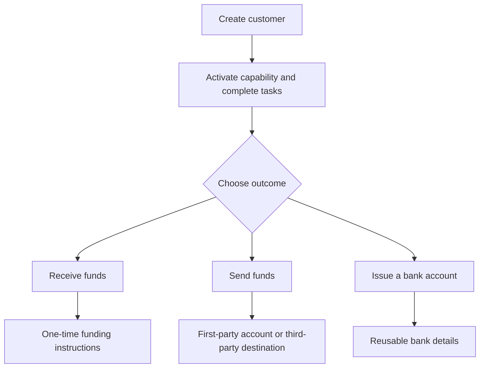

Sāciet no klienta rezultāta. Katra plūsma izmanto vienu un to pašu iesaistes modeli, pēc tam sazarojas dažādos kontos un naudas plūsmās.

## Salīdziniet plūsmas

| Rezultāts | Sagatavot vispirms | Ko jūs saņemsiet |
| --- | --- | --- |
| Iemaksa | Gatava iemaksas iespēja un izsniegts galamērķa maks | Konkrētam pārvedumam paredzētas instrukcijas un stabilas monētas norēķins |
| Izmaksa | Gatava izmaksas iespēja, finansēts izsniegtais maks un gatavs konts vai galamērķis | Pārvedums izvēlētajam saņēmēja galapunktam |
| Izsniegts bankas konts | Gatava bankas iespēja un izsniegts norēķinu maks | Atkārtoti izmantojami bankas rekvizīti pēc nodrošinājuma |

Ar kotāciju veidota iemaksa izveido instrukcijas vienam pārvedumam. Izsniegts bankas konts izveido atkārtoti izmantojamus rekvizītus vēlākām iemaksām. Izmaksa sākas ar līdzekļiem, kas jau ir pieejami izsniegtajā makā.

## Izvēlieties savu plūsmu

<CardGroup cols={3}>
  <Card title="Saņemt līdzekļus" icon="arrow-down-to-line" href="/lv/integration/receive-funds">
    Izveidojiet un uzraugiet fiat uz stabilas monētas iemaksu.
  </Card>
  <Card title="Sūtīt līdzekļus" icon="arrow-up-from-line" href="/lv/integration/send-funds">
    Veidojiet paša konta vai trešās puses izmaksu.
  </Card>
  <Card title="Izsniegt bankas kontu" icon="building-columns" href="/lv/integration/issue-bank-account">
    Nodrošiniet atkārtoti izmantojamus bankas rekvizītus, kas saistīti ar maku.
  </Card>
</CardGroup>
