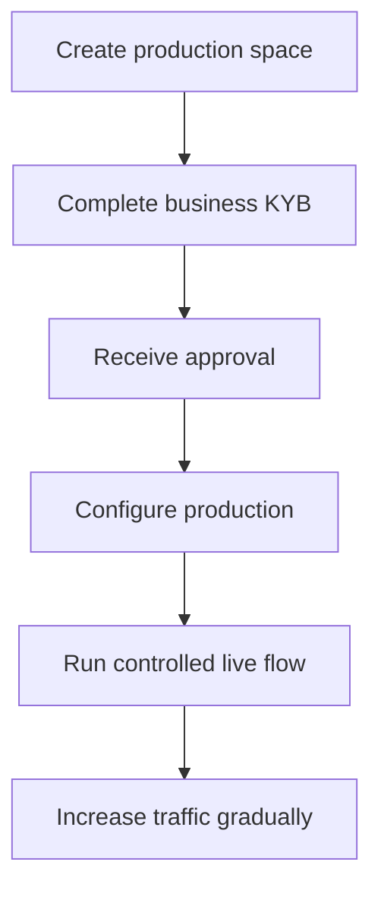

Produkcijas aktivizēšana verificē jūsu integrējošo uzņēmumu. Tā ir atsevišķa no API klientiem, ko izveidojat savam produktam.

## Aktivizējiet savu produkcijas telpu

1. Pierakstieties Swipelux vadības panelī un izvēlieties **Izveidot produkcijas telpu**.
2. Atveriet KYB cilni vai dodieties uz [Uzņēmuma verifikāciju](https://www.swipelux.app/kyb).
3. Aizpildiet katru pieprasīto lauku un augšupielādējiet nepieciešamos dokumentus.
4. Iesniedziet savu integrējošo uzņēmumu verifikācijai un gaidiet apstiprinājumu.

Tikai pēc tam, kad jūsu integrējošais uzņēmums un produkcijas telpa ir apstiprināti, varēsiet izveidot produkcijas API klientus un darījumus.

## Uzturiet produkciju neatkarīgu

Izveidojiet produkcijas resursus skaidri. API atslēgas maiņa nepārmet smilšu kastes stāvokli.

- Glabājiet produkcijas akreditācijas datus atsevišķā noslēpumu pārvaldnieka ierakstā.
- Izmantojiet tikai produkcijai paredzētu izvietošanas konfigurāciju un resursu ID.
- Reģistrējiet atsevišķu produkcijas webhook galapunktu un parakstīšanas noslēpumu.
- No jauna izveidojiet nepieciešamos klientus, iespējas, kontus, saņēmējus un galamērķus produkcijā.
- Ierobežojiet produkcijas piekļuvi tikai tiem pakalpojumiem un operatoriem, kuriem tā nepieciešama.

Smilšu kaste un produkcija izmanto `https://platform.swipelux.com`; vidi izvēlas API atslēga.

## Pabeidziet uzsākšanas kontrolsarakstu

- [ ] Testējiet veiksmīgo ceļu un paredzamos kļūmju ceļus smilšu kastē.
- [ ] Nosūtiet `Idempotency-Key` ar katru ierakstu, kas to prasa, un saglabājiet to drošai atkārtošanai.
- [ ] Pārbaudiet webhook parakstus pirms parsēšanas, saglabājiet notikumu ID noturīgi un testējiet atkārtojumu.
- [ ] Apstrādājiet nepieejamas iespējas, atvērtus uzdevumus un mainītas uzdevumu versijas.
- [ ] Parādiet operatoriem pārvedumu kļūdas un praktiskas instrukcijas.
- [ ] Apstipriniet, ka žurnāli saglabā `X-Request-Id` vai `correlationId`, neatklājot noslēpumus vai sensitīvus finanšu datus.

## Palaidiet vienu kontrolētu dzīvu plūsmu

Sāciet ar zināmu klientu un vienu maza apjoma darījumu. Ierakstiet:

| Kontrole | Definējiet pirms testa |
| --- | --- |
| Apjoms | Klients, iespēja, konts vai galamērķis, summa un metode. |
| Sagaidāmais rezultāts | API stāvoklis, atlikums vai instrukcijas un webhook notikums, ko sagaidāt novērot. |
| Īpašnieks | Persona, kas ir atbildīga par pilnas plūsmas uzraudzību. |
| Apturēšanas nosacījums | Jebkāds negaidīts stāvoklis, trūkstošs webhook, nepareiza summa vai neatrisināts uzdevums. |

Pārbaudiet gan pašreizējo API resursu, gan autentificēto webhook piegādi. Ja kaut kas atšķiras no gaidītā rezultāta, apturiet un izpētiet, pirms sūtāt vairāk trafika.

Pēc tam, kad pilna plūsma ir veiksmīga, pakāpeniski palieliniet apjomu, uzraugot iespējas, konta, galamērķa un pārveduma stāvokļus.

Atgriezieties pie [Biežākās plūsmas](/lv/integration/common-flows), lai iepazītos ar produkta ceļojumu, vai izmantojiet [API atsauci](/lv/api-reference/introduction) precīziem līgumiem.
